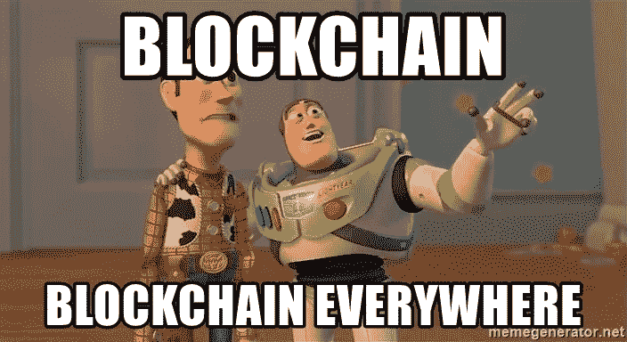
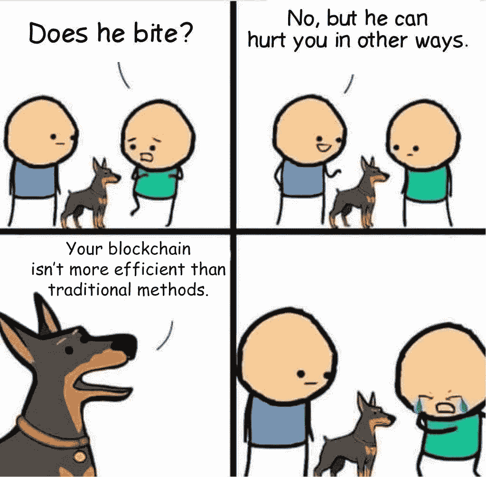
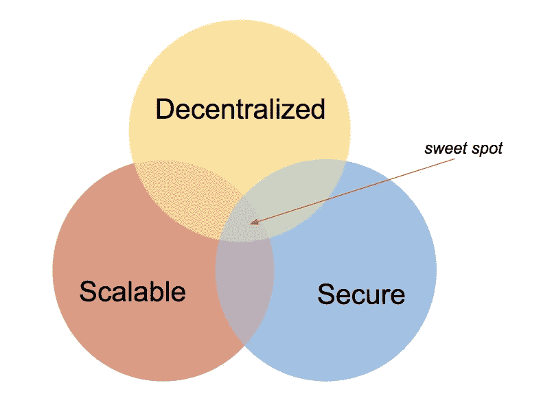

# 升级到 Web 3.0

> 原文：<https://medium.com/coinmonks/upgrading-to-web-3-0-2948f0551828?source=collection_archive---------7----------------------->

## 无权限缩放区块链

在比特币于 2009 年首次推出后，人们的兴奋和动力重新燃起，希望建立一个真正去中心化的互联网，推动一个没有信任的世界经济。今天的互联网是最民主的地方，在许多方面，它是这个星球上最平等的机构。区块链提供了一种创建真正去中心化互联网的方式。人们已经在开放的区块链上使用和构建去中心化的应用程序，比如以太坊。比特币使得通过互联网以完全去中心化的方式转移价值成为可能。有史以来第一次出现了数字化事物所有权的概念。有史以来第一次出现了一种有限而稀缺的数字“东西”,如果你真的仔细想想，这是相当疯狂的。

然而，还有很长的路要走。首先，大多数主流区块链都是不可伸缩的。区块链的第一个直接使用案例是**加密货币。**但是，即使作为支付处理商，它们也远远落后。

举个例子，比特币每秒可以结算 7 笔交易。以太坊每秒可以结算 15 笔交易。相比之下，Visa 实际上每秒可以处理 1800 笔交易，而理论上它声称每秒可以处理高达 56000 笔交易。区块链像以太坊和比特币一样，在这方面远远落后于主流支付处理器。

如此低的性能背后的根本原因是，当前形式的区块链不可伸缩。在区块链的表现取决于两个因素:

1.  **吞吐量**:网络每秒可以确认的最大事务数。
2.  **延迟**:用户进行交易和交易实际得到确认之间的时间延迟。

由于区块链是分散的，我们用节点而不是集中的服务器和数据中心来清算交易。在开放的、无需许可的区块链中，任何人都可以加入网络并运行完整节点，任何人都可以随时离开网络。

## 区块链不会根据节点数量进行横向扩展

交易验证时间随着节点数量的增加而增加。原因很简单。网络中的每个节点都必须**独立地验证它接收到的每个交易的** **和** **。**并且由于每个节点不同时接收新的事务，首先接收它的节点验证该事务，如果该事务有效，它将该事务传递给它的邻居，这些邻居又独立地验证该事务并传递给它们的邻居。这种情况一直持续到每个节点接收到事务并对其进行了验证。因此，交易验证时间随着节点数量的增加而增加。此外，如果节点的数量非常大，则更难达成共识。由于在开放的区块链网络中，无法控制有多少人可以加入网络并运行一个完整的节点，因此找到一种有效的横向扩展技术非常重要。

如果区块链想要成功，可伸缩性是一个非常重要的问题。在这篇文章中，我将写一些重要的可伸缩性解决方案，这些方案通常是区块链社区正在研究的。

# 1.分片

今天，网络中的每个节点都处理每笔交易。分片的意思是— **将节点分成小组/组**。每个团队/小组被称为一个**碎片**。为了解释分片如何提高可伸缩性，让我们假设一个“非共享”网络在给定的时间内只能处理 100 个事务。请注意，事务请求的总数可能远远超过 100，但是网络一次只能处理 100 个事务。如果网络被分成 *n* 个碎片(团队)，那么**每个碎片现在可以同时处理至少 100 个**(甚至更多)**。原因很简单，**随着节点数量的减少，网络可以更快地清算交易**因为，交易验证时间和达成一致所需的时间随着验证交易的节点数量的减少而减少。因此，理论上网络作为一个整体可以处理的交易总数现在变成了 100 倍**

**因此，更简单地说，分片基本上是团队之间的工作分工(这里的工作是处理事务)。由于网络被分成小组，验证一组交易的节点数量减少。因此，在前面的例子中，如果 1000 个节点处理 100 个事务，那么在分片之后，每个分片将同时处理至少 100 个事务。而在一个分片中，这 100 个事务的集合将由 1000/ *n* 个节点( *n* 为分片数)处理。这对性能来说是一件好事，因为它减少了总的事务验证时间，并且在节点数量较少的情况下达成共识也更有效。注意， *n* 的值由网络社区决定，并且基于网络想要在每个分片中保持的去中心化程度。**

**分片并不是一项新技术。很久以来，它一直被用于中央系统。因此，在分散系统中实现分片有其自身的挑战。有各种各样的方法被提议在分散式系统中实现分片，并且每种实现都有它自己的一系列问题。**

**实现分片的一种方法是将网络分成多个分片，它们维护一个单一的公共分类帐。维护一个共同的区块链的问题是——碎片之间一致同意添加下一个块。请注意，碎片是一个开放的节点网络，独立于其他碎片工作。在这种情况下，碎片之间的共识可能很棘手。一个可能的解决方案是，每个分片可以委派一个“分片负责人”，然后分片负责人可以就将哪个块添加到区块链旁边达成共识。**

**另一个分片实现是，每个分片维护自己的区块链。这样就不需要碎片间的共识。但是这种解决方案的问题是跨碎片事务——涉及存储在两个或更多碎片的区块链中的数据的事务。**

**分散系统中的分片问题是一个开放的研究问题，许多不同种类的实现正在被设计和测试。**

# **2.国家频道**

**状态通道是建立在现有技术之上的特定协议，使区块链事务具有可伸缩性。因此，它们是可伸缩性的第 2 层解决方案。让我们首先试着理解国家频道试图解决的问题。**

**如今比特币和以太坊的交易并不十分迅速。就这些网络在特定时间内可以处理的交易数量而言，已经达到了最大容量。因此，与主流支付方式相比，在这些网络上进行正常交易需要相当长的时间。这导致交易费用增加，因为矿商根据他们可以赚取的费用来优先考虑交易。因此，如果一个人准备支付更高的交易费用，他/她的交易将优先于其他人。由于这些区块链网络的低效率，这导致交易变得昂贵和耗时。**

**如果有一种方法可以在不记录在主区块链上的情况下验证大量交易，那会怎么样呢？如果不需要在区块链上记录所有的交易，那么不需要对所有的交易进行挖掘并达成共识。这种支付机制可以使交易更快、更便宜。这种不记录在主链上的交易称为**链外交易**。**

**状态通道指的是一组定义执行这种链外交易的程序的通用规则。国家渠道不过是在双方之间设立的一种特殊的支付方式。只要他们愿意，他们可以通过该信道继续交换值，并且可以通过向网络广播最终状态来关闭该信道，以便可以在区块链上记录该状态。为了更好地理解这一点，让我们举个例子。假设爱丽丝和鲍勃想要建立一个支付渠道。每个支付渠道都有一个限制，即通过它可以转移的最大值是多少。这个最大值等于双方准备作为第三方托管的总额，比如说比特币。更简单地说，双方必须存入他们选择的金额，以启动支付通道。双方的这种存款需要被广播到网络，以便它可以在主区块链上被记录为特殊类型的交易(称为多重签名交易)。一旦该交易被挖掘，支付通道被启动。因此，在我们的例子中，假设鲍勃和爱丽丝各存入 10 BTC。因此，这一特定支付渠道的总价值为 20 BTC。现在，如果爱丽丝想发送 1 BTC 给鲍勃，爱丽丝只需要发送一个加密签名的消息来说明这一点。因此现在爱丽丝的余额是 9 BTC(她存了 10 BTC 减去她寄给鲍勃的 1 BTC)和鲍勃的 11 BTC。现在，假设鲍勃想发送 7 个 BTC。他用和爱丽丝一样的方式做这件事，签署一个特殊的信息来说明这件事。现在爱丽丝的余额变成了 16 BTC，鲍勃的余额变成了 4 BTC。假设他们继续通过支付渠道进行这样的交易，最终爱丽丝有 12 个 BTC，鲍勃仍然有 8 个 BTC。请注意，所有这些交易基本上都是免费和即时的，因为这些交易都不是在区块链上挖掘和记录的。现在，他们中的任何人都可以通过简单地广播通道的最终状态来关闭通道:爱丽丝-12 BTC 和鲍勃-8 BTC。一旦这个广播交易被挖掘，支付通道被关闭。因此，双方只需要在他们启动支付通道和关闭支付通道时支付费用，与双方都为所有中介交易支付费用的正常情况相比，这仍然是便宜的。当双方之间的这些单一渠道成为遍布大量支付渠道的网络时，国家渠道的力量才真正闪耀。给你一个简单的例子，让我们假设现在不是两方，而是三方——爱丽丝、鲍勃和查理。假设爱丽丝和鲍勃之间有支付渠道，鲍勃和查理之间有支付渠道，但爱丽丝和查理之间没有支付渠道。现在，即使爱丽丝和查理没有直接连接他们的支付通道，他们仍然可以通过鲍勃交换价值。**

**请注意，只要相关方愿意，这些通道就可以保持活动状态。如果他们愿意，甚至永远。因此，状态通道为区块链提供了一种新颖的第二层扩展解决方案。**

# **3.侧链**

**到目前为止，侧链是我最喜欢的区块链缩放解决方案。就像状态通道一样，甚至侧链也是第 2 层扩展解决方案。侧链基本上是独立的区块链，与主区块链一起运行。这些侧链是与主链双向挂钩的，这意味着它们允许主链和侧链上的数字资产的互操作性。但是我们为什么需要侧链，它如何解决可扩展性问题？**

****

**许多区块链以分散化为代价实现了高交易速度。这意味着创建和添加新块到区块链的能力/权限被限制到这些网络中的少数节点。通常，这些节点是通过投票选择的，因此这些节点的身份是已知的。虽然少数砌块生产商确实以显著的方式提高了性能，但这并不好，因为现在如果某个人或某个组织追踪这些可公开识别的砌块生产商并试图关闭它们，网络很容易被破坏。还有一个很大的风险是，这些区块生产商可能会串通一气，欺骗系统。因此，如果互联网上的价值转移要保持安全，“真正的去中心化”是非常必要的。**

****

**分散式系统很难同时做到安全和可伸缩。此外，即使区块链能够在不损害去中心化的情况下每秒处理数千个事务，也不足以在那个网络上运行世界上所有的去中心化应用程序。想象一下，一个去中心化的脸书，一个去中心化的推特，一个去中心化的魔兽世界，还有成百上千个不同的去中心化的应用程序同时运行在一个区块链上。无论当前形式的区块链每秒能处理多少事务，它都无法同时运行所有这些分散的应用程序。因此，虽然区块链在协议层面提高可扩展性很重要，但同样非常明显的是，最终对于去中心化的互联网，扩展必须发生在第二层——建立在当前技术之上以提高性能的协议。**

**回到问题上来——在主链旁边运行另一个区块链如何解决可扩展性问题？好吧，如果主链具有高度的去中心化并且非常安全，那么我们可以设计许多侧链来运行各种去中心化的应用。侧链可以以分散化为代价设计成高性能，因为这些侧链无论如何都与具有高度分散化和安全性的主链相连。由于数字资产可以很容易地从主链转移到侧链，并在需要时返回主链，因此互操作性很容易实现。如果侧链碰巧失控，也不会影响您的数字资产，因为您可以轻松地将它们从侧链转移到主链。这带来了大量的机会，因为现在你可以为特定的用例设计侧链，比如运行分散的社交媒体应用程序或运行某些类型的游戏等。如果有人感觉真的很疯狂，那么他们甚至可以在现有的侧链上加上侧链，甚至在那些侧链上加上侧链，等等。以主链为骨干，侧链将能够以高性能运行世界上所有的分散应用程序！**

# **摘要**

**我们看到了区块链社区目前正在积极研究的三种主要扩展解决方案。以太坊和 OmniLedger 正在积极研究分片 作为去中心化系统的一种可能的扩展解决方案。比特币的 [**雷电网**](https://lightning.network/) 和以太坊的 [**雷电网**](https://raiden.network/) 分别是两个区块链网正在进行的 ***【国家频道】*** 项目。 [**根茎**](https://www.rsk.co/) 正在为比特币设计一个可以运行智能合约的 ***侧链*** 。**[**Loom Network**](https://medium.com/u/9f7a25569a7c?source=post_page-----2948f0551828--------------------------------)是一个令人兴奋的社区/公司，它正在构建自己的定制 ***侧链*** 来运行去中心化的游戏。他们很快将推出一款名为区块链僵尸战场的收藏卡牌游戏。****

****总结一下我们讨论的扩展方法:****

1.  ******分片:**它基本上涉及到将网络中的节点分成小组(称为分片)。每个碎片处理对整个网络的全部事务请求的一部分。****
2.  ******国家渠道:**它主要涉及在双方之间建立一个“链外”支付渠道。由于交易发生在链外，它们既便宜又快捷。****
3.  ******侧链:**它基本上包括一个全新的区块链，与主链并行运作，并与主链双向挂钩，以实现数字资产的互操作性。这些侧链可以为特定的使用情况而设计，因为它们不需要具有与主链相同的分散程度。****

****我叫 Miraj，是一名来自印度的学生。非常感谢您阅读帖子。我打算写更多的技术材料，并希望听到你们的任何反馈。我也在 Patreon 上，如果你想做贡献，请随时查看我的 Patreon 页面 [***这里***](https://www.patreon.com/mirajshah) ***。*** [https://www.patreon.com/mirajshah](https://www.patreon.com/mirajshah)
谢谢。****