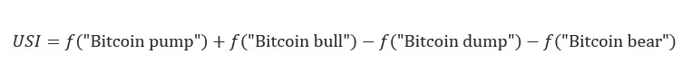
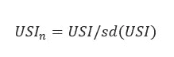
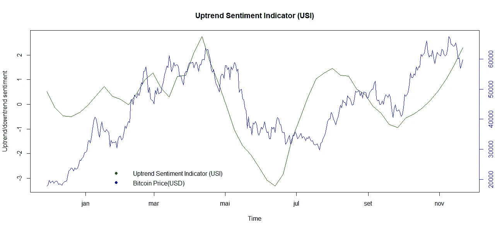
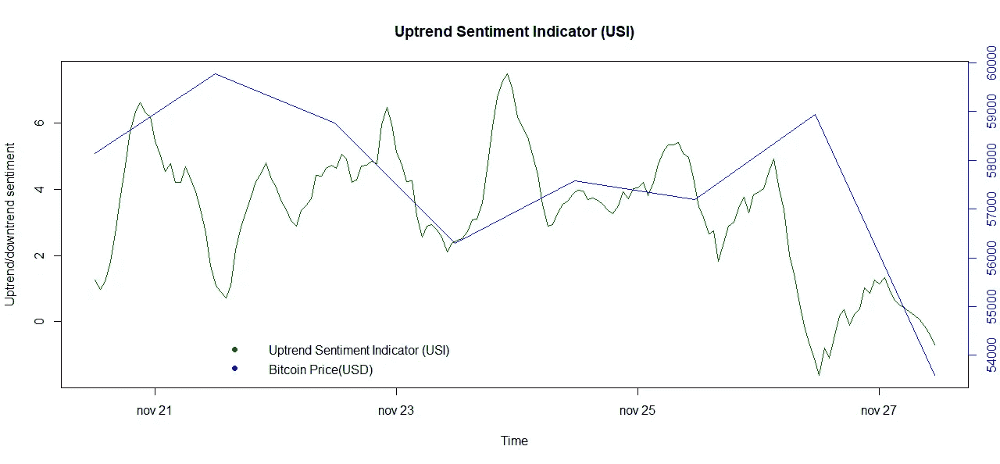

# 上升趋势情绪指标:加密货币价格趋势的新信号

> 原文：<https://medium.com/coinmonks/uptrend-sentiment-indicator-a-new-signal-for-price-tendency-in-the-cryptocurrency-b2148b824831?source=collection_archive---------3----------------------->

**简介**

情绪是加密货币投资者许多方面的核心，因此尽可能了解其价格影响是可取的。改善我们对情绪理解的一个尝试是对投资者意见的计算研究，称为大区域情绪分析(SA) [1]。

因此，在本研究中，将引入上升趋势情绪指标(USI ),并讨论其与价格行为条件的关系。

**上升趋势情绪指标数据处理**

目前的调查包括使用 R statistics platform [2]和 gtrendsR 软件包[3]跟踪和分析谷歌趋势信息。选择上升趋势单词频率(“比特币泵”、“比特币牛”)，并从下降趋势单词频率(“比特币转储”、“比特币熊”)中减去。数据价格招募自 Quandl [4]，2021。脚本存储库存储在 Github [5]上。

情绪模型的上升趋势情绪指标(USI)方程如等式(1)所示:

其中 USI 信号是因变量， *f* 是单词的频率。

接下来，USI 的标准偏差被用于归一化 USI，如可以在等式(2)中观察到的:

最后，应用 Savitzky-Golay 滤波器平滑 USI 数据[6]。数据平滑是通过局部多项式回归实现的，这是最流行的平滑滤波器之一，远远优于加密领域常用的移动平均值。

**上升趋势情绪指标**

USI 的目标是通过近似谷歌趋势查询来表达投资者的情绪。使用等式(2)，绘制了过去 12 个月的 USI(图 1)。

Figure 1\. Uptrend Sentiment Indicator (last year).

图 2 显示了最近七天的 USI。尽管基差中的价格行为受到全球市场、连锁分析和其他因素的影响，但我们可能会注意到，USI 呈现出与价格相关的行为，这为这种行为建模提供了机会。

Figure 2\. Uptrend Sentiment Indicator (last week).

正如可以观察到的，图 1 中的代表性图形给出了长期的上升趋势，但是图 2 显示了短期的下降趋势。

**结论**

这项工作中开发的指标是通用的，快速，简单，低成本。情绪信息使得获得一个优秀的价格行为工具成为可能。应用于今年的比特币价格，一个有趣的关系得到了证实。

如果您喜欢这些内容，请考虑以下建议:

BTC:BC 1 qljlmuwq 9 gyvn 7 uhvwwypsj 4x 8 hcetuzhw 9 quh 0

BNB:bnb 159am 7 huy 53mg 7 sygnklrtxkahkdk 2 qxzmnk 0 GW

**致谢**

作者感谢中本聪、哈尔·芬尼、尼克·萨博、赵昌鹏、萨布丽娜·莫赖斯和安德烈·福斯。

**参考文献**

1.《情感分析算法与应用:一项调查》，艾因·沙姆斯工程杂志，5 (4)，2014，[https://doi.org/10.1016/j.asej.2014.04.011](https://doi.org/10.1016/j.asej.2014.04.011)。

2.r 核心团队(2021)。r:用于统计计算的语言和环境。统计计算基金会，奥地利维也纳，[https://www.R-project.org/](https://www.R-project.org/)

3.菲利普·马西科特和德克·埃德尔布特尔(2021)。gtrendsR:执行和显示 Google 趋势查询。r 包版本 1.5.0。【https://CRAN.R-project.org/package=gtrendsR 

4.雷蒙德·麦克塔格特、杰格利·达罗奇和克莱门特·梁(2021)。quandl:Quandl.com 的 API 包装器。r 包版本 2.11.0。[https://CRAN.R-project.org/package=Quandl](https://CRAN.R-project.org/package=Quandl)

5.[https://github.com/edgarmoraesufrn](https://github.com/edgarmoraesufrn)

6.信号开发者(2013)。信号:信号处理。[http://r-forge.r-project.org/projects/signal/](http://r-forge.r-project.org/projects/signal/)

> 加入 Coinmonks [电报频道](https://t.me/coincodecap)和 [Youtube 频道](https://www.youtube.com/c/coinmonks/videos)了解加密交易和投资

## 另外，阅读

*   [加拿大最好的加密交易机器人](https://blog.coincodecap.com/5-best-crypto-trading-bots-in-canada) | [赌注加密](https://blog.coincodecap.com/staking-crypto)
*   [如何在印度购买比特币？](/coinmonks/buy-bitcoin-in-india-feb50ddfef94) | [瓦济克斯评论](/coinmonks/wazirx-review-5c811b074f5b)
*   [最佳网上赌场](https://blog.coincodecap.com/best-online-casinos) | [硬件钱包](/coinmonks/hardware-wallets-dfa1211730c6)
*   如何在 WazirX 上购买柴犬(SHIB)硬币？
*   [比特币主根](https://blog.coincodecap.com/bitcoin-taproot) | [排名前 6 的比特币信用卡](/coinmonks/bitcoin-credit-card-bc8ab6f377c6)
*   [有哪些交易信号？](https://blog.coincodecap.com/trading-signal) | [Bitstamp vs 比特币基地](https://blog.coincodecap.com/bitstamp-coinbase) | [买索拉纳](https://blog.coincodecap.com/buy-solana)
*   [ProfitFarmers 回顾](https://blog.coincodecap.com/profitfarmers-review) | [如何使用 Cornix 交易机器人](https://blog.coincodecap.com/cornix-trading-bot)
*   [MXC 交易所评论](/coinmonks/mxc-exchange-review-3af0ec1cba8c) | [Pionex vs 币安](https://blog.coincodecap.com/pionex-vs-binance) | [Pionex 套利机器人](https://blog.coincodecap.com/pionex-arbitrage-bot)
*   [我的加密副本交易经历](/coinmonks/my-experience-with-crypto-copy-trading-d6feb2ce3ac5) | [比特币基地评论](/coinmonks/coinbase-review-6ef4e0f56064)
*   [CoinFLEX 评论](https://blog.coincodecap.com/coinflex-review) | [AEX 交易所评论](https://blog.coincodecap.com/aex-exchange-review) | [UPbit 评论](https://blog.coincodecap.com/upbit-review)
*   [AscendEx 保证金交易](https://blog.coincodecap.com/ascendex-margin-trading) | [Bitfinex 赌注](https://blog.coincodecap.com/bitfinex-staking) | [bitFlyer 审核](https://blog.coincodecap.com/bitflyer-review)
*   [麻雀交换评论](https://blog.coincodecap.com/sparrow-exchange-review) | [纳什交换评论](https://blog.coincodecap.com/nash-exchange-review)
*   [支持卡审核](https://blog.coincodecap.com/uphold-card-review) | [信任钱包 vs 元掩码](https://blog.coincodecap.com/trust-wallet-vs-metamask)
*   [Exness 回顾](https://blog.coincodecap.com/exness-review)|[moon xbt Vs bit get Vs Bingbon](https://blog.coincodecap.com/bingbon-vs-bitget-vs-moonxbt)
*   [如何开始用加密贷款赚取被动收入](https://blog.coincodecap.com/passive-income-crypto-lending)
*   [加密货币储蓄账户](/coinmonks/cryptocurrency-savings-accounts-be3bc0feffbf) | [加密交易机器人](https://blog.coincodecap.com/best-crypto-trading-bots)
*   [BigONE 交易所评论](/coinmonks/bigone-exchange-review-64705d85a1d4) | [CEX。IO 审查](https://blog.coincodecap.com/cex-io-review) | [交换区审查](/coinmonks/swapzone-review-crypto-exchange-data-aggregator-e0ad78e55ed7)
*   [最佳比特币保证金交易](/coinmonks/bitcoin-margin-trading-exchange-bcbfcbf7b8e3) | [比特币保证金交易](https://blog.coincodecap.com/bityard-margin-trading)
*   [加密保证金交易交易所](/coinmonks/crypto-margin-trading-exchanges-428b1f7ad108) | [赚取比特币](/coinmonks/earn-bitcoin-6e8bd3c592d9)
*   [WazirX vs CoinDCX vs bit bns](/coinmonks/wazirx-vs-coindcx-vs-bitbns-149f4f19a2f1)|[block fi vs coin loan vs Nexo](/coinmonks/blockfi-vs-coinloan-vs-nexo-cb624635230d)
*   [雷米塔诺评论](https://blog.coincodecap.com/remitano-review)|[1 英寸协议指南](https://blog.coincodecap.com/1inch) | [购买 Floki](https://blog.coincodecap.com/buy-floki-inu-token)
*   [MoonXBT vs Bybit vs 币安](https://blog.coincodecap.com/bybit-binance-moonxbt) | [Arbitrum:第二层解决方案](https://blog.coincodecap.com/arbitrum)
*   [买 PancakeSwap(蛋糕)](https://blog.coincodecap.com/buy-pancakeswap)|[matrix export Review](https://blog.coincodecap.com/matrixport-review)
*   [最佳免费加密信号](https://blog.coincodecap.com/free-crypto-signals) | [YoBit 评论](/coinmonks/yobit-review-175464162c62) | [Bitbns 评论](/coinmonks/bitbns-review-38256a07e161)
*   [OKEx 回顾](/coinmonks/okex-review-6b369304110f) | [Kucoin 交易机器人](/coinmonks/kucoin-trading-bot-automate-your-trades-8cf0ca2138e0) | [期货交易机器人](/coinmonks/futures-trading-bots-5a282ccee3f5)
*   [AscendEx Staking](https://blog.coincodecap.com/ascendex-staking)|[Bot Ocean Review](https://blog.coincodecap.com/bot-ocean-review)|[最佳比特币钱包](https://blog.coincodecap.com/bitcoin-wallets-india)
*   [霍比评论](https://blog.coincodecap.com/huobi-review) | [OKEx 保证金交易](https://blog.coincodecap.com/okex-margin-trading) | [期货交易](https://blog.coincodecap.com/futures-trading)
*   [比特币基地跑马圈地](https://blog.coincodecap.com/coinbase-staking) | [Hotbit 评论](/coinmonks/hotbit-review-cd5bec41dafb) | [KuCoin 评论](https://blog.coincodecap.com/kucoin-review)
*   [最佳加密交易信号电报](/coinmonks/best-crypto-signals-telegram-5785cdbc4b2b) | [MoonXBT 评论](/coinmonks/moonxbt-review-6e4ab26d037)
*   [Coinswitch 俱吠罗评论](/coinmonks/coinswitch-kuber-review-1a8dc5c7a739) | [电网交易机器人](https://blog.coincodecap.com/grid-trading) | [比特币基地收费](/coinmonks/coinbase-fees-831e77d4f2c5)
*   [Bitget 评论](https://blog.coincodecap.com/bitget-review) | [双子星 vs BlockFi](https://blog.coincodecap.com/gemini-vs-blockfi) | [OKEx 期货交易](https://blog.coincodecap.com/okex-futures-trading)
*   [OKEx vs KuCoin](https://blog.coincodecap.com/okex-kucoin) | [摄氏替代度](https://blog.coincodecap.com/celsius-alternatives) | [如何购买 VeChain](https://blog.coincodecap.com/buy-vechain)