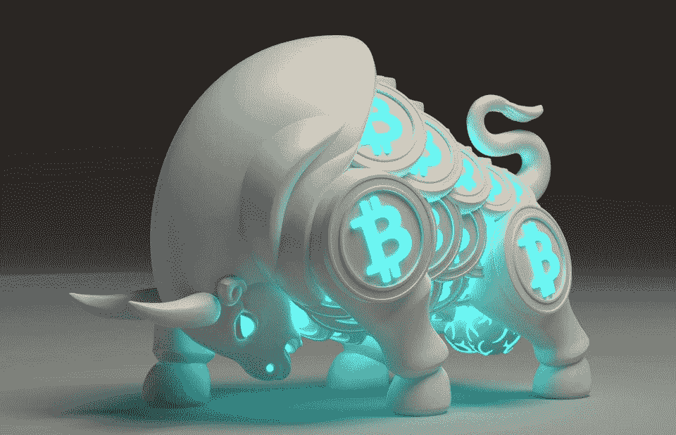
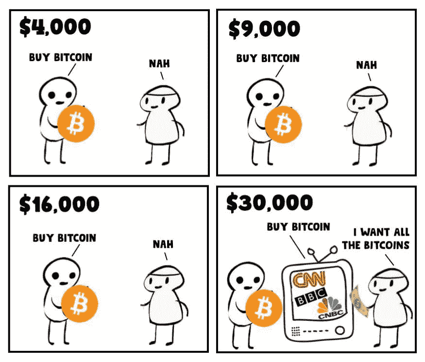
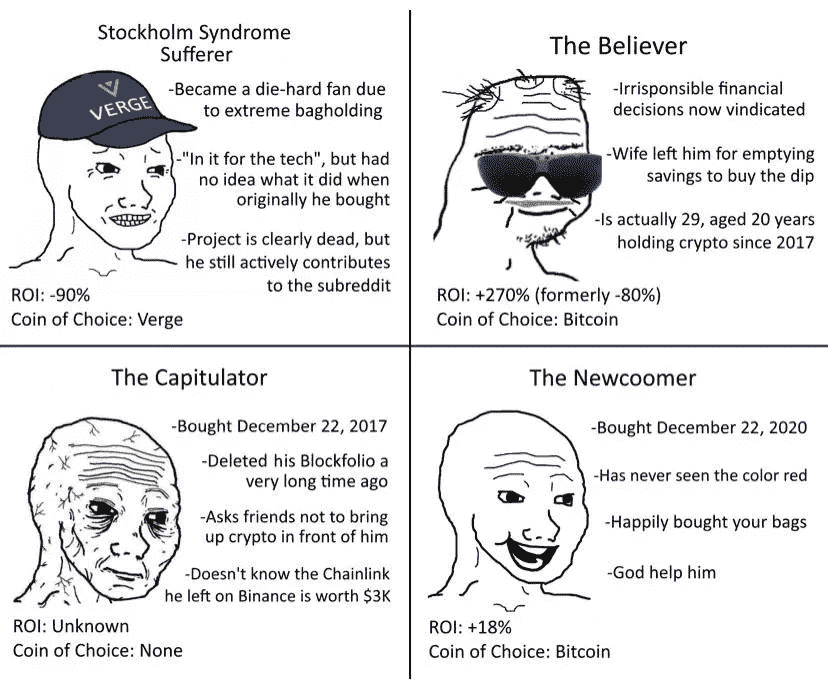
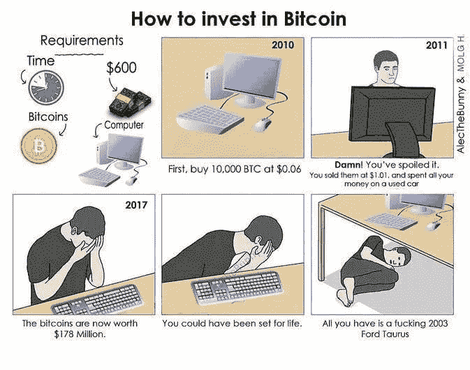

# 美国银行现在可以打印和促进稳定的货币支付

> 原文：<https://medium.com/coinmonks/us-banks-can-now-print-and-facilitate-stablecoin-payments-b33f4b1f61cc?source=collection_archive---------2----------------------->

[Source](https://www.reddit.com/r/Bitcoin/comments/kn5zdv/the_beast_has_awoken_happy_new_year_everyone/)

## Bittrex 将隐私币退市/拜登白宫发布备忘录停止或推迟午夜规定

祝大家新年快乐。市场正在创造更高的高点，要谨慎，获利了结，为家人买些有意义的东西。

*   今天，OCC [允许](https://www.forbes.com/sites/haileylennon/2021/01/04/occ-regulator-implements-groundbreaking-cryptocurrency-guidance-for-banks-and-the-future-of-payments/?sh=5cefb73927e9)银行使用 stablecoins(旨在最小化价格波动的加密货币)来促进客户的支付交易。在这种情况下，银行可以发行稳定币，将稳定币兑换为法定货币，以及通过充当区块链(INVN)上的节点来验证、存储和记录支付交易。
*   据摩根大通(JPMorgan Chase & Co .)称，比特币作为一种资产类别与黄金竞争，长期来看有可能达到 146，000 美元。

## [Bitsgap](https://bitsgap.com/?ref=2cb1231-3) 交易提示

网格机器人在横盘和多头排列中表现完美。

每当加密货币(BTC，瑞士法郎)横盘时，寻找一些爆炸性的替代货币(如 GRT/瑞士法郎，EGLD/BTC 等)并启动你的机器人。

你将跑赢市场，并将有一个绝佳的机会积累更多的 ETH/BTC。(非财务建议)

## 最新消息📰

*   国会[警告财政部](https://www.coincenter.org/congress-warns-treasury-on-unusually-short-cryptocurrency-short-rulemaking/)异常做空加密货币做空规则制定
*   Bittrex 将从 ZEC XMR 隐私币 DASH 的[名单中除名](https://bittrex.zendesk.com/hc/en-us/articles/360054393492-Pending-Market-Removals-01-15-21)
*   随着新基金的推出，SkyBridge 的比特币[缓存升至 3.1 亿美元](https://www.coindesk.com/skybridge-confirms-bitcoin-fund-310-billion)，同时检查新基金的[卡牌](https://www.skybridgebitcoin.com/documents/overview-pdf)
*   乌克兰政府选择恒星发展基金会帮助建立国家数字货币
*   美国联邦监管机构称银行可以使用信用卡进行支付
*   拜登白宫将发布备忘录停止或推迟午夜规定
*   [摩根大通](https://www.bloomberg.com/news/articles/2021-01-05/jpmorgan-sees-146-000-plus-bitcoin-price-as-long-term-target)称比特币长期来看可能飙升至 146，000 美元
*   一座[虚拟城堡](https://www.loop-news.com/p/a-virtual-castle-just-sold-for-800000)刚刚卖了 80 万美元+！
*   多亏了 ETH 和空投，DeFi10 返还了 370%
*   2017 [平价钱包黑客](https://www.theblockcrypto.com/linked/89843/2017-parity-wallet-hacker-begins-moving-eth)开始动 ETH
*   BitGo 与美国财政部就违反制裁达成和解

> *报税季即将到来，使用最好的* [***加密报税软件***](/coinmonks/best-crypto-tax-tool-for-my-money-72d4b430816b) *来申报你的加密报税吧。*

[Source](https://www.reddit.com/r/CryptoCurrency/comments/kozrwd/i_told_them_but_they_said_i_was_crazy/)

> BlockFi 首次推出加密奖励信用卡。在日常购物中获得 1.5%的比特币奖励。[现在加入等候名单](http://blog.coincodecap.com/go/blockfi)。

## 好的读物📑

*   比特币是泰坦尼克号的救生筏
*   [关于 21 世纪 20 年代技术的笔记](https://elidourado.com/blog/notes-on-technology-2020s/)
*   不完整的汇总指南
*   新比特币[四年](https://rektcapital.substack.com/p/fouryearcycle2)周期
*   DeFi [年回顾](https://thedefiant.io/exclusive-report-defi-year-in-review-by-dappradar/)由 DappRadar
*   [比特币](https://www.metzdowd.com/pipermail/cryptography/2020-December/036510.html)是一场灾难
*   [我们的网络](https://ournetwork.substack.com/p/our-network-issue-52):在 DEX 上发布报道
*   以太坊[信任树](https://newsletter.banklesshq.com/p/ethereum-the-tree-of-trust)
*   以太坊[价格模型](/coinmonks/ethereum-price-model-using-total-daily-fees-992b2123f4e)使用每日总费用
*   挖掘难度[解构](/coinmonks/mining-difficulty-deconstructed-396b7009339b)
*   2021 年前 6 大比特币价格预测
*   下一个比特币泡沫是否即将破灭？

> *买一个* [***硬件钱包***](/coinmonks/the-best-cryptocurrency-hardware-wallets-of-2020-e28b1c124069)*[*保护你的加密货币*](/coinmonks/how-to-prevent-cryptocurrency-hacking-and-theft-from-your-wallet-65c8ff767766) *。**

**

*[Source](https://www.reddit.com/r/Bitcoin/comments/kmof53/the_8_laws_of_bitcoin_updated/)*

## *开发商*

*   *ETHGlobal [开发商](/ethglobal/ethglobal-developer-survey-report-2020-f7bf4f7cf821)调查报告— 2020 年*
*   *eth 2[graph QL](https://twitter.com/Bitquery_io/status/1344347446587973632)API*
*   *[eth 2 中的新功能](https://hackmd.io/@benjaminion/eth2_news/https%3A%2F%2Fhackmd.io%2F%40benjaminion%2Fwnie2_201230)*
*   *创建并[部署](/coinmonks/create-and-deploy-a-defi-app-to-ethereum-a02bb680aa78)一个 DeFi 应用到以太坊*
*   *升级价值数十亿美元的 ERC-20 代币*
*   *Dapp [样板文件](https://github.com/adrianmcli/dapp-boilerplate)*
*   *多人游戏[Unity Game+WebRTC](/coinmonks/multiplayer-unity-game-webrtc-in-5-minutes-71971be769d1)5 分钟*
*   *[用白色矩阵学习坚实度](/coinmonks/learn-solidity-with-white-matrix-chapter-1-getting-started-with-solidity-6defa007a010)*
*   *[新弹性](https://blog.simondlr.com/posts/neolastics):液态、链上、生殖艺术*

> *想成为一名以太网和 **Web3 开发者**？[从这里开始](http://blog.coincodecap.com/go/learn)。*

## *多方面的*

*   *[Umbrel](/getumbrel/introducing-the-umbrel-app-store-7a2068c64a10) 应用商店*
*   *块状流[翡翠](https://blockstream.com/2021/01/03/en-secure-your-bitcoin-and-liquid-assets-with-blockstream-jade/)*
*   *[比特币在起作用](https://defipulse.com/btc)*
*   *[美食学](http://gastrology.eth.link/)。以太币*

## *播客和视频💽*

*   *将[以太坊](http://podcast.banklesshq.com/45-taking-ethereum-public-ether-capitals-ceo-brian-mosoff-cfo-stefan-coolican)上市*
*   *一个[EIP 的经济分析](https://www.youtube.com/watch?v=ndNyx-Oj9Wk&feature=youtu.be)1559 年*

## *加密的面孔*

**

*[Source](https://www.reddit.com/r/CryptoCurrency/comments/koog14/the_faces_of_crypto/)*

## *黑客马拉松、活动和峰会*

*   *[Inout 7.0](https://portis.medium.com/inout-7-0-virtual-hackathon-challenge-122591bb55e8) 虚拟黑客马拉松挑战赛*
*   *分散式[网络西雅图](https://www.meetup.com/ProtoSchool-Seattle-Learn-to-Make-the-Decentralized-Web/events/274586198/)于 12 月 17 日召开会议*
*   *ETHGlobal 的[市场制作](https://marketmake.ethglobal.co/)黑客马拉松*

## *加密交易和折扣🔖*

*   *注册参加[**by bit**](/coinmonks/bybit-exchange-review-dbd570019b71)exchange，赢取高达 625 美元的奖金。*
*   *试用 [**Altrady**](http://blog.coincodecap.com/go/altrady) 并使用优惠券代码 **COINMONKS** 获得 40%的折扣(年计划)和 10%的折扣(月计划)*
*   *试用 [**Coinrule**](https://webapp.coinrule.io/coupon/coinmonks-7-25-3-e2bf6c60e795407381edf98d1a174ac2?fp_ref=coincodecap) 使用 [**此链接**](https://webapp.coinrule.io/coupon/coinmonks-7-25-3-e2bf6c60e795407381edf98d1a174ac2?fp_ref=coincodecap) 可获得 7 天免费试用和 3 个月 25%优惠。*

## *产品评论和其他加密软件📙*

*   *[莱杰 vs 特雷佐](/coinmonks/ledger-nano-s-vs-x-battery-hardware-price-storage-59a6663fe3b0)*
*   *[区块链审查](/coinmonks/blockfi-review-53096053c097)*
*   *[AAX 交易所评论](/coinmonks/aax-exchange-review-2021-67c5ea09330c)*
*   *[bits gap vs 3 commas vs quad ency](/coinmonks/bitsgap-vs-3commas-vs-quadency-must-read-2021-cdc1a40cf31d)*
*   *[隐头蝠 vs 哈斯博特](https://blog.coincodecap.com/cryptohopper-vs-haasbot)*
*   *[Pionex 审查](/coinmonks/pionex-review-exchange-with-crypto-trading-bot-1e459d0191ea)*
*   *密码[复制交易](/coinmonks/top-10-crypto-copy-trading-platforms-for-beginners-d0c37c7d698c)机器人*
*   *[Stackedinvest 评论](https://blog.coincodecap.com/stackedinvest-review)*
*   *[Deribit 审查](/coinmonks/deribit-review-options-fees-apis-and-testnet-2ca16c4bbdb2) —选项、费用、API 和测试网*
*   *[总账 vs 平均](https://blog.coincodecap.com/ngrave-vs-ledger)*
*   *[YouHodler Review](/coinmonks/youhodler-4-easy-ways-to-make-money-98969b9689f2) —赚取 12%的加密利息*

## *[Pionex](http://blog.coincodecap.com/go/pionex)*

*试试专业的加密交易所 Pionex，它有免费的加密交易机器人，可以让你的交易自动化。阅读我们的 [Pionex 评论](/coinmonks/pionex-review-exchange-with-crypto-trading-bot-1e459d0191ea)并查看我们的[最佳加密交易机器人列表](/coinmonks/crypto-trading-bot-c2ffce8acb2a)。*

*想让我们展示你的产品吗？请通过 [Twitter @coinmonks](https://twitter.com/coinmonks) 联系我们*

## *如何投资比特币😆*

**

*[Source](https://www.reddit.com/r/CryptoCurrency/comments/kompvi/how_to_invest_in_bitcoin/)*

## *乔布斯👷*

*   *[DevOps 工程师](https://remoteok.io/remote-jobs/100451-remote-devops-engineer-district0x)，0x 区，远程*
*   *[生态系统开发者](https://jobs.lever.co/3box/ec1093c5-ed31-483c-b1b3-49b07bd0bd2e)，3 盒，远程*
*   *[位于 mStable 的 BD](https://angel.co/company/mstable/jobs/1096364-business-development-manager)*
*   *[动作设计师](https://cryptocurrencyjobs.co/design/kraken-digital-asset-exchange-motion-designer/) —北海巨妖*
*   *[全栈工程师](https://cryptocurrencyjobs.co/engineering/zapper-full-stack-engineer/) —扎珀*
*   *[高级前端工程师](https://cryptocurrencyjobs.co/engineering/uma-senior-front-end-engineer/) —乌玛*
*   *SigmaPrime，[区块链安全工程师](https://blog.sigmaprime.io/blockchain-security-engineer.html)*
*   *0x 寻找各种类型的[开发人员](https://0x.org/about/jobs)和一名[抹茶营销经理](https://boards.greenhouse.io/0x/jobs/4923909002)*
*   *Nexus Mutual: [在欧洲时区经历了稳健发展](https://angel.co/company/nexus-mutual-1/jobs/967538-smart-contract-engineer)*

## *在 Coinmonks 上发布*

*如果你喜欢在 crypto/区块链空间上写教育文章，并且想在 Coinmonks 出版物上发表。只需在**邮件我或者 DM 我**[***推特***](https://twitter.com/coinmonks)***