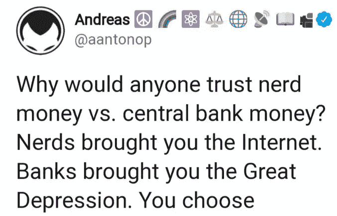
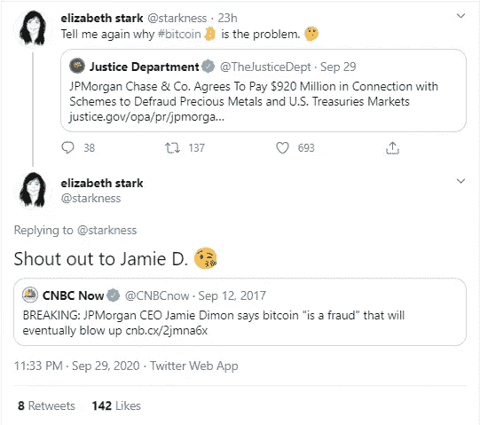
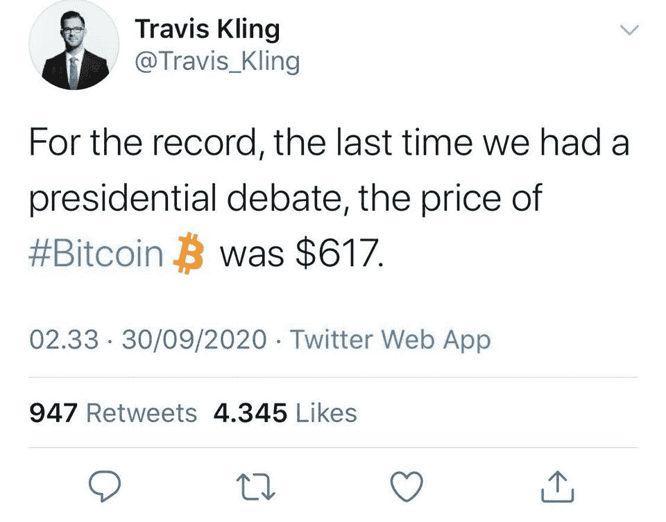
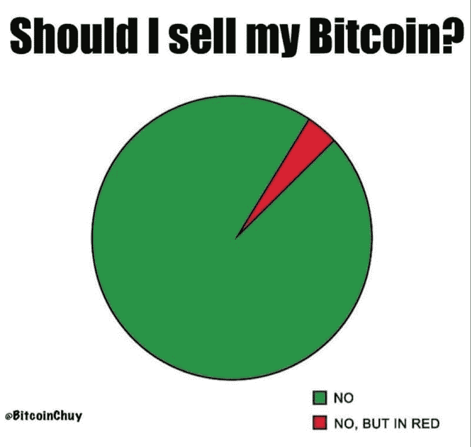

# 美国政府试图破坏网络加密和言论自由

> 原文：<https://medium.com/coinmonks/us-government-trying-to-undermine-encryption-and-free-speech-online-dc148972c70c?source=collection_archive---------3----------------------->

## CFTC 对 Bitmex 的所有者和被 SEC 起诉的 Johne McAfee 穷追不舍

美国国会和参议院都在推进所谓的“赚到它”法案，该法案将破坏加密和网络言论自由。所以[打电话给你的代表](https://act.eff.org/action/stop-the-earn-it-bill-before-it-breaks-encryption-a7904e20-2083-4d5e-88ae-44ee5fef7a5d)帮助阻止这项法案。

其他消息，CFTC [周四](https://www.cftc.gov/PressRoom/PressReleases/8270-20)宣布，BitMEX 首席执行官亚瑟·海斯、公司所有者本·德洛和塞缪尔·里德以及公司实体涉嫌向美国客户提供非法加密衍生品交易服务。

与此同时，纽约州(SDNY) [南区联邦检察官宣布](https://www.justice.gov/usao-sdny/pr/founders-and-executives-shore-cryptocurrency-derivatives-exchange-charged-violation) Hayes、Delo、Reed 和 Gregory Dwyer (BitMEX 的第一名员工)被控违反《银行保密法》和共谋违反该法。里德已经被逮捕了；其他人仍然逍遥法外，SDNY 的新闻稿说。

另一方面，美国证券交易委员会(u . s . Securities and Exchange Commission)周一起诉了反病毒计算机软件的创始人约翰·迈克菲(John McAfee)，指控他通过在 Twitter 上推荐七种严重虚假和误导的首次发行硬币，获得了超过 2310 万美元的未披露报酬。

## 试试 [Quadency](https://blog.coincodecap.com/go/quadency)

寻找易于使用的一体化加密交易解决方案？

试试 [Quadency](https://blog.coincodecap.com/go/quadency) ，这是一个为交易者构建的交易终端，用于自动化他们的加密交易。阅读我们的[季度回顾](https://blog.coincodecap.com/quadency-review-a-crypto-trading-automation-platform)。

## 最新消息📰

*   在[破解加密之前阻止](https://act.eff.org/action/stop-the-earn-it-bill-before-it-breaks-encryption-a7904e20-2083-4d5e-88ae-44ee5fef7a5d)赚到它
*   加密交易平台 bit MEX[‘试图逃避’](https://www.coindesk.com/bitmex-cftc-enforcement)美国法规，CFTC，DOJ 的指控
*   SEC 命令 Salt Lending 向其 4700 万美元 ICO 的投资者提供退款
*   元掩码[超过 100 万](/metamask/metamask-exceeds-1-million-monthly-active-users-9da72a1e915d)活跃用户
*   证券交易委员会主席克莱顿说，所有的股票都可能成为 T2 的象征
*   证券交易委员会起诉[约翰·迈克菲](https://www.cnbc.com/2020/10/05/sec-sues-john-mcafee-over-promoting-cryptocurrency-offerings-on-twitter.html)在推特上推荐首次发行硬币
*   Kucoin [抓住了](https://twitter.com/lyu_johnny/status/1312359618081779713)它的黑客
*   Tezos 上的第一只 DEX 刚刚推出:DEXter

> *买一个* [***硬件钱包***](/coinmonks/the-best-cryptocurrency-hardware-wallets-of-2020-e28b1c124069) *保护你的加密货币。*

## 好的读物📑

*   公共[区块链费用周期性](/@nic__carter/public-blockchain-fee-cyclicality-and-negative-feedback-loops-1620141a8a87)和负反馈循环
*   加密市场结构 3.0
*   [比特币](/coinmonks/bitcoin-the-currency-of-digital-westphalia-e29357f5320a?source=friends_link&sk=7454872f850681b5c57be6650c4ceeaa)，数字威斯特伐利亚的货币
*   我在交易中得到的教训
*   关于[去中心化](https://www.placeholder.vc/blog/2020/9/30/ten-theses-on-decentralized-network-governance)网络治理的十篇论文
*   比特币宏观[分形暗示](/coinmonks/bitcoin-macro-fractal-suggests-all-time-high-by-q1-2021-a3bd0417a66f)创历史新高由 Q1 2021？
*   在 IOTA 数据市场上出售[敏感数据](/coinmonks/selling-sensitive-data-on-iota-data-marketplace-d57e6780d159)
*   DEX 流动性集合指数表现的综合分析
*   以太坊的 [DeFi 进化](https://coinmetrics.io/ethereums-defi-evolution-how-defi-is-fueling-ethereums-growth/):DeFi 是如何推动以太坊的发展的
*   没有分散式交易所这种东西
*   [流动性挖掘](/bollinger-investment-group/liquidity-mining-a-user-centric-token-distribution-strategy-1d05c5174641):以用户为中心的令牌分发策略
*   MEV 即将[到来](https://twitter.com/FrankResearcher/status/1311350156219101185)
*   NFT 生态系统的快速概述
*   [CEX vs 德克斯](/coinmonks/cex-vs-dex-how-does-uniswap-work-8ff2ef89e558):unis WAP 如何运作？

[Source](https://www.reddit.com/r/CryptoCurrency/comments/j2ju0p/funny_but_also_very_arbitrarily_put/)

## 开发商

*   智能[合同](https://soliditydeveloper.com/waffle)用华夫饼 3 测试
*   嘿机器人！把你所有的钱都给我
*   参与复合协议的[演练](/compound-finance/a-walkthrough-of-contributing-to-the-compound-protocol-9450cbe2133a)
*   展开[汇总](https://www.lakshmansankar.com/#/fast-pipes-smart-vms):快速管道和智能虚拟机
*   理解[侧链](https://ethresear.ch/t/understanding-sidechains/8045)
*   用下午茶时间打破[以太坊节点](https://diligence.consensys.net/blog/2020/09/breaking-ethereum-nodes-with-teatime/)
*   了解 [Uniswap](https://cryptotesters.com/tutorial/understanding-uniswap)
*   Eth2 [通过时间服务器攻击](https://ethresear.ch/t/eth2-attack-via-time-servers/8049)
*   [创建并部署](/coinmonks/create-and-deploy-an-ethereum-leaderboard-1ba60dba1495)以太坊排行榜
*   eth2 是一种[汇总](https://lightclient.io/blog/eth2-is-a-rollup/)格式
*   [多客户端](/coinmonks/multi-client-ethereum-networks-dcebb34d41f7)以太网
*   在 DeFi 中使用[选项](/opyn/buidling-with-options-otokens-in-defi-pt-2-f561eb67f4af) (oTokens)建造
*   [工程师 ZKPs](https://blog.zkga.me/df-init-circuit):黑暗森林 ZKPs 一瞥
*   Eth2 中有什么新的并在这里阅读快速更新
*   [beacon-fuzz](https://github.com/sigp/beacon-fuzz) 更新，针对 Eth2 客户的差异化模糊解决方案
*   试用一个[全雷电节点](/raiden-network/the-easiest-way-to-try-out-a-full-raiden-node-16e54d32d6ca)的最简单方法
*   如何发现并修复智能[契约](https://we.incognito.org/t/how-a-smart-contract-vulnerability-was-discovered-and-fixed/6416)漏洞
*   以太坊 2.0 验证器的硬件[是什么？](/coinmonks/what-hardware-for-an-ethereum-2-0-validator-e8f5f89de43e?source=friends_link&sk=773268b819973ee62ee91d9ea3eccd40)
*   从 Infura 的 IPFS 服务开始

[Source](https://www.reddit.com/r/CryptoCurrency/comments/j5mg6o/crypto_is_not_going_away/)

## 多方面的

*   [eth95.dev](https://eth95.dev/)
*   [不屈服](https://defiyield.info/)
*   Medalla testnet 的验证器[统计数据](https://github.com/bluepintail/medalla_analysis/blob/master/medalla_analysis.ipynb)
*   [生产就绪模板](https://jolly-roger.eth.link/)用于构建分散式应用
*   从给定的 ABI JSON 生成 Solidity [接口](https://github.com/gnidan/abi-to-sol)源代码！

## 播客💽

*   杀死火神
*   [公民比特币](https://letstalkbitcoin.com/blog/post/citizen-bitcoin-max-hillebrand-the-bitcoin-nomad)——马克斯·希莱布兰德:比特币流浪者

## 加密交易和折扣🔖

*   BlockFi 为注册和存款提供 250 美元的 USDC 奖金
*   全新 [Trezor 钱夹套](https://shop.trezor.io/?offer_id=10&aff_id=5199)有多种颜色可选
*   *试用*[*Hypertrader*](https://hypertrader.app/?utm_soruce=coinmonks)*并使用优惠券****COINCODECAP****获得****15%****折扣*
*   使用[此链接](https://webapp.coinrule.io/coupon/coinmonks-7-25-3-e2bf6c60e795407381edf98d1a174ac2?fp_ref=coincodecap)在 [Coinrule](https://webapp.coinrule.io/coupon/coinmonks-7-25-3-e2bf6c60e795407381edf98d1a174ac2?fp_ref=coincodecap) 享受 7 天免费试用和前 3 个月 25%的折扣
*   *尝试*[*HaasOnline*](https://www.haasonline.com/?ref=11087)*并使用优惠券****COINCODECAP****获得***10%的折扣👏**

## *产品评论和其他加密软件📙*

*   *[哈森在线评论](https://blog.coincodecap.com/haasonline-review)—2020 年最佳交易机器人(10%折扣券)*
*   *you hodler——4 种简单的赚钱方法*
*   *[Hodlnaut 评论](https://blog.coincodecap.com/hodlnaut-review)——Hodl 的最佳方式是赚取你的比特币的利息*
*   *[Botsfolio 评论](https://blog.coincodecap.com/botsfolio-review-automate-crypto-investment) —让您的加密投资自动化的简单方法*
*   *你需要知道的 2020 年 5 大[加密贷款平台](https://blog.coincodecap.com/top-5-crypto-lending-platforms)*
*   *[神童评论](https://blog.coincodecap.com/wunderbit-review)——赚大钱的社交密码交易*
*   *2020 年最佳加密交易机器人*
*   *[2020 年最佳加密交易平台](/coinmonks/the-best-crypto-trading-platforms-in-2020-the-definitive-guide-updated-c72f8b874555)*
*   *最好的[加密税务软件](/coinmonks/best-crypto-tax-tool-for-my-money-72d4b430816b)*
*   *[最佳加密交易平台](/coinmonks/the-best-crypto-trading-platforms-in-2020-the-definitive-guide-updated-c72f8b874555)*
*   *Bitmex 保证金交易的白痴指南*
*   *[加密摇摆交易的权威指南](/coinmonks/the-definitive-guide-to-crypto-swing-trading-7e4af6496d4d?source=friends_link&sk=70448050bd9323b42f63bfc0bb1e60d1)*
*   *[Bitmex 高级保证金交易指南](/coinmonks/bitmex-advanced-margin-trading-guide-2270c195ce25?source=friends_link&sk=1d986cca731f5084b9a2db4a4bc4a7ad)*
*   *开发人员的最佳加密 API*

*想让我们展示你的产品吗？请通过 [Twitter @coinmonks](https://twitter.com/coinmonks) 联系我们*

## *照片说明了一切📷*

**

## *乔布斯👷*

*   *Bitquery 正在招聘 [Ruby 开发者](https://angel.co/company/bitquery/jobs)*
*   *Livepeer 正在招聘一名[区块链社区营销+运营主管](https://angel.co/company/livepeer/jobs/874811-blockchain-public-network-community-marketing-associate)*
*   *作为营销总监[与 Chainlink 令人难以置信的生态系统合作](https://chainlinklabs.com/careers#job-492239)*
*   *小道消息招聘精英[区块链安全工程师](https://jobs.lever.co/trailofbits/4f459855-3299-462f-9e73-299a840d5baf) & [app 安全](https://jobs.lever.co/trailofbits/8b7f7fc1-efb0-4e89-b406-784c3a2d77e4)*
*   *DeFi devs！Yield 正在招聘可靠的前端人员—联系@yield.is*
*   *0x 正在招聘开发人员！[全堆栈、后端、前端或可靠性](https://0x.org/about/jobs)*
*   *Nexus Mutual: [经历了 Solidity dev](https://angel.co/company/nexus-mutual-1/jobs/967538-smart-contract-engineer)；首选欧洲时区*

## *在 Coinmonks 上发布*

*如果你喜欢在 crypto/区块链空间上写教育文章，并且想在 Coinmonks 出版物上发表。只需在**发邮件给我或者 DM 我**[***推特***](https://twitter.com/coinmonks)***

> ***“如果你喜欢读* [*造反派*](https://medium.com/coinmonks)*[*你也可以捐我们*](/coinmonks/monks-need-your-help-7440418d67ec) *。****