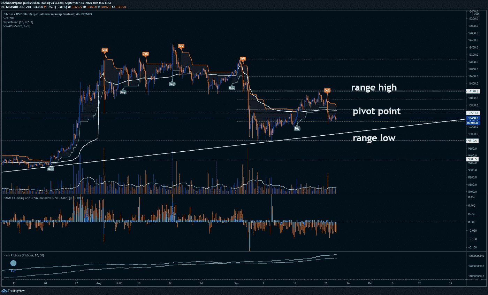
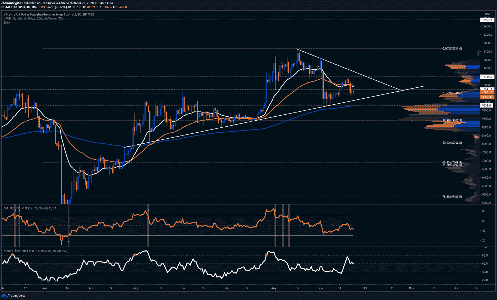
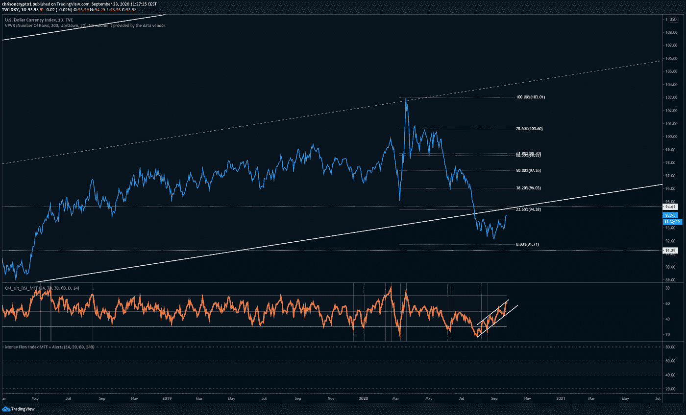
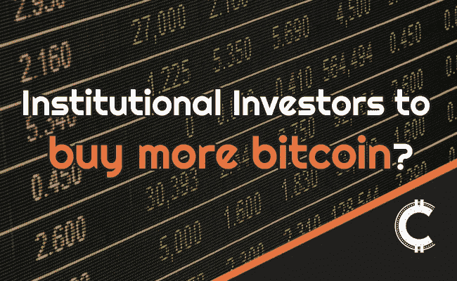

# 美国监管机构批准国家银行使用数字美元稳定账户

> 原文：<https://medium.com/coinmonks/us-regulators-approve-national-banks-to-use-digital-dollar-stablecoins-ccda6907ee5d?source=collection_archive---------4----------------------->

大家好，

美国联邦监管机构已经批准美国国家银行支持数字美元稳定账户，这是一项重大的加密突破。与此同时，彭博分析师迈克·麦格隆表示，比特币可能会受益于股市上涨。

最后，但绝非最不重要的是，比特币的技术和美元的强势表明，比特币可能会在未来几天出现爆炸性的变化。

让我们开始吃吧。

## **公开信呼吁结束严厉的封锁措施**

请原谅我暂时偏离了主题。最近，关于 covid 19 的事实有太多的错误信息和充满政治意味的争论。希望这将有助于了解回音室之外的现实情况和主流媒体所宣扬的歇斯底里。

本月早些时候出现的一封来自比利时医生和卫生专业人员的公开信再次流传开来，呼吁将新型冠状病毒病毒去政治化。这封信可以在[这里](https://docs4opendebate.be/en/open-letter/)找到，其中一部分写道**“任何紧急政策都不再有医学依据。目前的危机管理已经变得完全不相称，造成的损害大于任何好处。”**

## 美国联邦监管机构批准国家银行支持数字美元稳定账户

与此同时，货币监理署(OCC)发布了第二封信，允许美国金融机构在代理监理署署长 Brian Brooks 的领导下合法支持数字美元稳定货币。在这一突破性的发展中，这使得美国金融机构可以将存款作为稳定货币的储备，稳定货币代表像美元这样的法定货币。

OCC 监管大型国有银行，如富国银行和摩根大通，这两家银行在过去几年里都彻底改变了对比特币和加密的立场。这一消息与美国证券交易委员会(SEC)的一份声明相一致，该机构或多或少地主导了美国密码监管领域。

简而言之，OCC 将稳定货币狭义地定义为适用于代表美元的 1:1 支持的稳定货币。“稳定货币是指由法定货币等资产支持的加密货币，包括美元或其他外币，”OCC 的新闻稿说。

这封信概述了 OCC 对决定持有稳定存款准备金的银行的期望。此外，这封信还指出，选择持有稳定存款准备金的银行必须执行标准的尽职调查程序，包括《银行保密法》( BSA)和《了解你的客户》( KYC)要求。

总而言之，随着美元稳定硬币的合法纳入，美国数字美元正在快速发展。

## [*加入免费电报频道*](https://t.me/chrisoncryptochannel) *获取更新、新闻、图表和即时评论！*

## **彭博情报称比特币为杰出资产**

迈克·麦格隆彭博的高级商品策略师表示，比特币将受益于股票和债券价格的上涨。在 Twitter 上分析潜在的优势时，他将比特币描述为一种杰出的固定供应资产，将成为股票和债券价格升值的主要受益者。虽然这并不是一个新颖的论点，但麦克格隆对比特币和股市的相关性直言不讳。

他说，加密货币通常不会对股价产生太大影响，但比特币确实会受益于股市交易超出其通常时间线所带来的任何刺激。

> 我们认为，[*#比特币*](https://twitter.com/hashtag/Bitcoin?src=hash&ref_src=twsrc%5Etfw) *是一种杰出的固定供应资产，在股票和债券价格进一步上涨的潜力有限的时期，它应该是主要受益者。* [*#QE* ..](https://twitter.com/hashtag/QE?src=hash&ref_src=twsrc%5Etfw)[【pic.twitter.com/NLHXlaZuuM】T21](https://t.co/NLHXlaZuuM)
> 
> *—迈克·麦格隆(@ mikemcglone 11)*[*2020 年 9 月 22 日*](https://twitter.com/mikemcglone11/status/1308370589476966400?ref_src=twsrc%5Etfw)

顺便提一下，就在本周，一项新的[调查](https://chrisoncrypto.com/blog/f/survey-us-uk-institutional-players-to-increase-crypto-holdings)进一步证实了比特币与股票和贵金属一起长期上涨的前景。由 Evertas 进行的这项调查发现，90%的受访养老基金和保险公司预计在未来五年内增加比特币和加密持有量。

此外，76%的人表示，他们预计主流金融服务将继续向加密过渡，理由是负利率和债券收益率将成为进一步加密资产多元化的驱动因素。

缓慢但肯定的是，似乎许多故事正在汇集在一起，比特币将从所有这些故事中受益。

# **从技术上讲**

## **比特币 4 小时 LTF 接近“反弹”区域**

自[周一的简讯](https://mailchi.mp/fa0b6c59f3e3/doubling-down-microstrategy-pours-another-175-million-into-bitcoin-9559638?e=[UNIQID])以来，比特币在 11，000 美元的水平遭到拒绝，因为抛售压力压倒了看涨势头，将价格推至更高的 10，300 美元区域，低于 237 fib 水平的支点。

虽然看起来熊市势头正在再次形成，但作为交易者和长期投资者，这可能是成为反向投资者并在这些水平寻找买入机会的正确时机。

在撰写本文时，比特币已跌破 10，581 美元的支点，目前交易价格为 10，454 美元。9 月 21 日的下跌似乎是 9 月 2 日最初抛售的延续，但这一次看跌力量减弱。

事实上，销量一直不佳，比特币的交易价格仍高于 20 周均线，远高于 10，000 美元。在这种情况发生改变之前，没有什么理由对过度看跌的情绪和芝加哥商品交易所缺口上方 9000 美元以下价格的需求抱有兴趣。与此同时，BitMEX 的融资在多个时间段内仍处于负值区域，这表明可能的资金短缺尚未结束。

从看涨的角度来看，比特币有可能朝着上面描绘的向上趋势支撑再次尝试下跌，形成我们一直关注的“双底”结构。该结构也将与新的区间低点一致，为可能的“反弹区”提供汇合点。

要观察的级别:

*   10583 美元支撑转阻力
*   10，000 美元反弹区(范围低)
*   11190 美元阻力
*   收回区间高点后，目标为 11，600 美元

比特币一如既往地存在直接走向冥府的可能性。如果我们戴上熊市眼镜，预测一个厄运和黑暗的场景，那么人们可以预期反弹到 0.382 纤维水平(9150 美元)——从 3 月黑色星期四的倾销中测得。

不过，从技术上来说，当比特币持续在 20 周均线上方收盘时，没有理由过度看跌。

## **美元指数趋势向上，但接近阻力**

在美元继续走强的同时，大宗商品和比特币可能会进一步走软。然而，美元的势头可能会很快结束。

技术上，美元 DXY 指数突破多年通道，目前正在回测下方结构。自 3 月 19 日的走势以来，几个汇合的指标表明，94 区域可能会为另一次持续下跌提供相当大的阻力。

从. 236 fib 水平反弹并脱离相对强弱指数(RSI)通道将证实这一点。和所有的 RSI 通道一样，它们总是向相反的方向突破，趋势越长，向相反方向移动越难(通常是这样)。

总而言之，DXY 与比特币和黄金呈负相关，也就是说，观察其表现以寻找疲软(或强劲)的迹象，可以为这两种资产的表现提供信息。

愿你的收益高，损失低。

下次再见。

**一如既往，感谢阅读！别忘了分享这些内容，支持平台。这些报道需要时间和大量的研究。非常感谢推荐、商业机会和反馈。**

**不要让你的迷因成为梦想——关注我的** [推特](https://twitter.com/ChrisOnCrypto1)**&**[insta gram](https://www.instagram.com/chrisoncrypto/)**获取更多轻松的内容。**

**加入** [电报频道](https://t.me/chrisoncryptochannel) **进行实时加密更新！**

**阅读更多信息:调查:美国&英国机构投资者增加密码持有量**

[https://chrisoncrypto.com/blog/f/survey-us-uk-institutional-players-to-increase-crypto-holdings](https://chrisoncrypto.com/blog/f/survey-us-uk-institutional-players-to-increase-crypto-holdings)

[https://chrisoncrypto.com/](https://chrisoncrypto.com/)

如果你想支持这份免费的时事通讯，请发送一些 **BTC 智士**到这个地址:**3 eydseypjhn 68 axkncuqbb 7 ebqcxrejamr**

最诚挚的问候，
**克里斯托弗·阿塔尔德**
克里斯对加密的创始人
贡献者[www.cityam.com](https://www.cityam.com/)
直接接通:[电报](https://t.me/chrisoncrypto)

## 另外，阅读

*   最好的[密码交易机器人](/coinmonks/crypto-trading-bot-c2ffce8acb2a)
*   [密码本交易平台](/coinmonks/top-10-crypto-copy-trading-platforms-for-beginners-d0c37c7d698c)
*   最好的[加密税务软件](/coinmonks/best-crypto-tax-tool-for-my-money-72d4b430816b)
*   [最佳加密交易平台](/coinmonks/the-best-crypto-trading-platforms-in-2020-the-definitive-guide-updated-c72f8b874555)
*   最佳[加密贷款平台](/coinmonks/top-5-crypto-lending-platforms-in-2020-that-you-need-to-know-a1b675cec3fa)
*   [最佳区块链分析工具](https://bitquery.io/blog/best-blockchain-analysis-tools-and-software)
*   [加密套利](/coinmonks/crypto-arbitrage-guide-how-to-make-money-as-a-beginner-62bfe5c868f6)指南:新手如何赚钱
*   最佳[加密制图工具](/coinmonks/what-are-the-best-charting-platforms-for-cryptocurrency-trading-85aade584d80)
*   [莱杰 vs 特雷佐](/coinmonks/ledger-vs-trezor-best-hardware-wallet-to-secure-cryptocurrency-22c7a3fd391e)
*   了解比特币最好的[书籍有哪些？](/coinmonks/what-are-the-best-books-to-learn-bitcoin-409aeb9aff4b)
*   [3 商业评论](/coinmonks/3commas-review-an-excellent-crypto-trading-bot-2020-1313a58bec92)
*   [AAX 交易所评论](/coinmonks/aax-exchange-review-2021-67c5ea09330c) |推荐代码、交易费用、利弊
*   [Deribit 审查](/coinmonks/deribit-review-options-fees-apis-and-testnet-2ca16c4bbdb2) |选项、费用、API 和 Testnet
*   [FTX 密码交易所评论](/coinmonks/ftx-crypto-exchange-review-53664ac1198f)
*   [零审核](/coinmonks/ngrave-zero-review-c465cf8307fc)
*   [Bybit 交换审查](/coinmonks/bybit-exchange-review-dbd570019b71)
*   [3Commas vs Cryptohopper](/coinmonks/cryptohopper-vs-3commas-vs-shrimpy-a2c16095b8fe)
*   最好的比特币[硬件钱包](/coinmonks/the-best-cryptocurrency-hardware-wallets-of-2020-e28b1c124069?source=friends_link&sk=324dd9ff8556ab578d71e7ad7658ad7c)
*   最佳 [monero 钱包](https://blog.coincodecap.com/best-monero-wallets)
*   [莱杰 nano s vs x](https://blog.coincodecap.com/ledger-nano-s-vs-x)
*   [bits gap vs 3 commas vs quad ency](https://blog.coincodecap.com/bitsgap-3commas-quadency)
*   [莱杰 Nano S vs 特雷佐 one vs 特雷佐 T vs 莱杰 Nano X](https://blog.coincodecap.com/ledger-nano-s-vs-trezor-one-ledger-nano-x-trezor-t)
*   [block fi vs Celsius](/coinmonks/blockfi-vs-celsius-vs-hodlnaut-8a1cc8c26630)vs Hodlnaut
*   Bitsgap 评论——一个轻松赚钱的加密交易机器人
*   [Quadency Review](/coinmonks/quadency-review-a-crypto-trading-automation-platform-3068eaa374e1) -为专业人士打造的加密交易机器人
*   [PrimeXBT 评论](/coinmonks/primexbt-review-88e0815be858) |杠杆交易、费用和交易
*   [埃利帕尔泰坦评论](/coinmonks/ellipal-titan-review-85e9071dd029)
*   [SecuX Stone 评论](https://blog.coincodecap.com/secux-stone-hardware-wallet-review)
*   [BlockFi 评论](/coinmonks/blockfi-review-53096053c097) |从您的密码中赚取高达 8.6%的利息