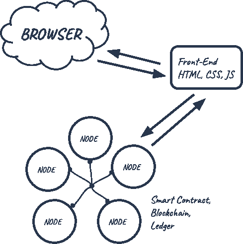
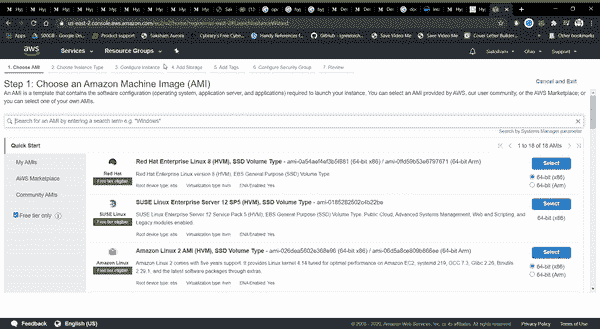
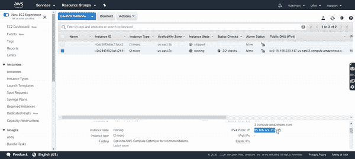
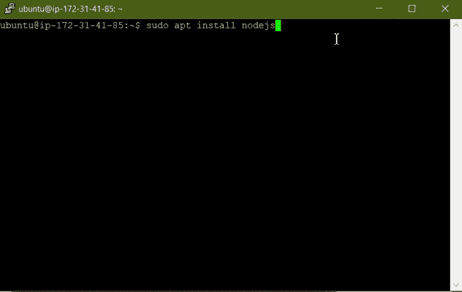
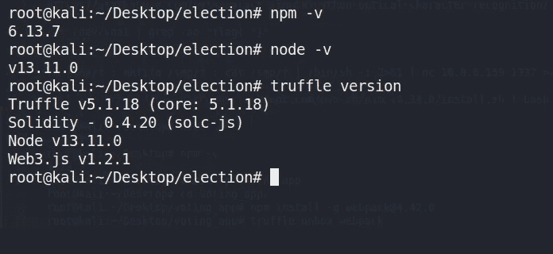
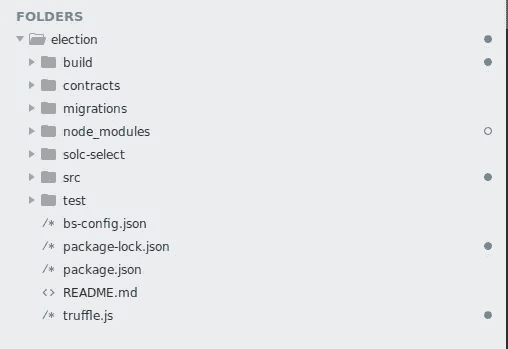
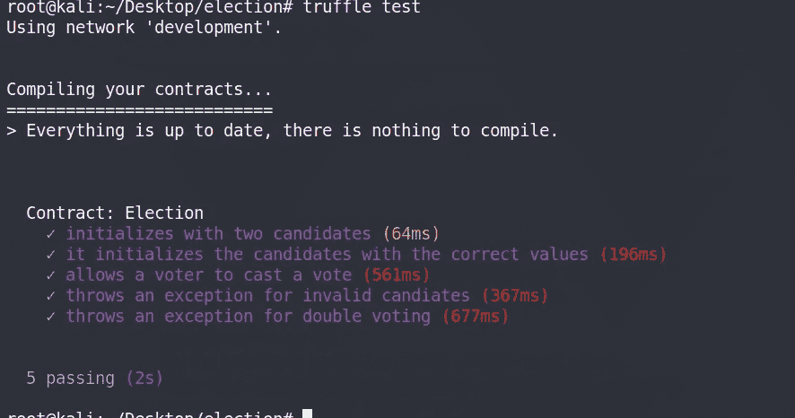
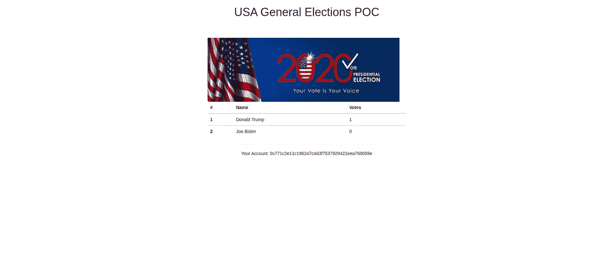
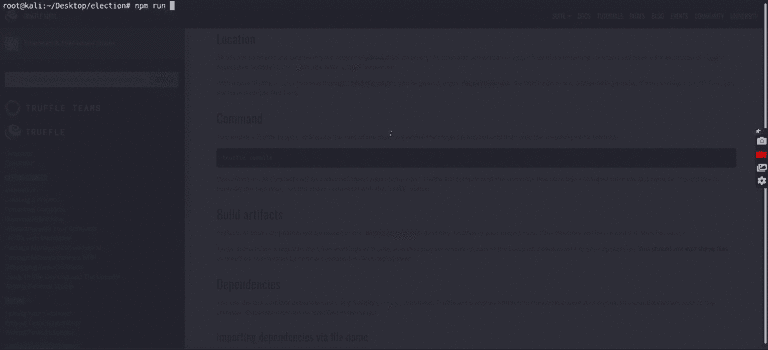

# 美国选举 POC —以太坊 DAPP

> 原文：<https://medium.com/coinmonks/usa-election-poc-ethereum-dapp-8cf02b6e20a?source=collection_archive---------2----------------------->

嘿，各位，在这篇博客中，我们将经历编译、部署和交互一个极其简单的应用程序的过程，它所做的只是初始化一组候选人，在我们的例子中是***【唐纳德·川普***&***【乔·拜登】*** ***(如果埃隆·马斯克真的推动我们很快将“凯恩·韦斯特”加入名单…)*** ，这个应用程序将让任何人给候选人投票，并显示每个候选人获得的总票数

用专业术语来说，我们将在两位候选人之间举行选举。我们将针对智能合约编写测试，将其部署到**以太坊区块链**，并开发一个允许帐户投票的客户端应用程序。我们还将考察一些关键概念，如*[***什么是区块链***](https://blog.coincodecap.com/what-is-blockchain-a-simple-guide-for-dummies/) ***？”*** 、 ***“什么是智能合约？”*** ，还有*[***一个 dApp 怎么工作***](https://blog.coincodecap.com/what-are-dapps-an-ultimate-guide) ***？”。*****

# **什么是区块链？**

**通常当你与网络应用程序交互时，你使用网络浏览器通过网络连接到 ***中央服务器*** 。这个 web 应用程序的所有代码都保存在这个中央服务器上，所有数据都保存在一个中央数据库中。每当您处理应用程序时，都必须与 web 上的这个中央服务器进行通信。**

**如果我们要在 web 上构建投票应用程序，我们会遇到一些问题:**

1.  **数据库中的数据可能会被更改:它可能会被多次计数，或者被完全删除。**
2.  **web 服务器上的源代码也可以随时更改。**

**我们不想在网络上构建我们的应用程序。我们希望将它建立在区块链上，任何连接到网络的人都可以参加选举。我们希望确保他们的选票被计算在内，而且只被计算一次。让我们来看看它是如何工作的。**

**区块链不是有网络、中央服务器和数据库， ***而是集网络和数据库于一身的*** 。区块链是一个由计算机组成的*对等网络，称为节点，共享网络中的所有数据和代码。不再有中央服务器了。只是一堆在同一个网络上互相交流的计算机。与集中式数据库不同，区块链中跨节点共享的所有交易数据都包含在称为块、 的 ***记录包中，这些记录被链接在一起以创建**公共分类账**。该公共分类账代表区块链中的所有数据。公共分类账中的所有数据都通过加密哈希进行保护，并通过一致算法进行验证。网络上的节点参与进来，以确保分布在网络上的所有数据副本都是相同的。这是我们在区块链上构建投票应用程序的一个非常重要的原因，因为我们希望确保我们的投票被计算在内，并且不会改变。******

# **什么是智能合同？**

**这就是投票过程的工作方式，但是我们实际上如何编写我们的应用程序呢？嗯，以太坊区块链允许我们用区块链上的以太坊虚拟机(EVM)通过一种叫做智能合约的东西来执行代码。**

**智能合约是我们应用程序的所有业务逻辑所在。这是我们实际编写应用程序分散部分的地方。智能合约负责向区块链读写数据，以及执行业务逻辑。智能联系人是用一种叫做 [Solidity](https://solidity.readthedocs.io/en/v0.4.21/) 的编程语言编写的。**

****

**[https://www.dappuniversity.com/dapp_diagram.png](https://www.dappuniversity.com/dapp_diagram.png)**

****什么是 DAPP？****

**DApp 是分散应用的缩写形式。DApp 的后端代码运行在一个分散的对等网络上。与后端代码运行在集中式服务器上的应用程序形成对比。**

**一个 DApp 可以有用任何语言编写的前端代码和用户界面(就像一个应用程序一样)，可以调用它的后端。此外，它的前端可以托管在分散存储上，如 [Swarm](https://ethereum.stackexchange.com/q/375/42) 或 [IPFS](https://ipfs.io/) 。**

**如果 app=frontend+server，由于以太坊契约是在全球以太坊去中心化对等网络上运行的代码，那么:**

****DApp =前端+合约****

**来源:[https://ether eum . stack exchange . com/questions/383/what-is-a-dapp](https://ethereum.stackexchange.com/questions/383/what-is-a-dapp)**

# **DAPP 的类型**

> ***Johnston 指出有三种 dapps。***
> 
> *****I 型*** *分散式应用有自己的区块链，比如比特币。***
> 
> *****类型 II*** *分散式应用程序使用类型 I 分散式应用程序的区块链，但像 Omni 协议一样是“协议并具有其功能所必需的令牌”。***
> 
> *****第三类*** *分散式应用程序使用第二类分散式应用程序的协议，并且“是协议并且具有其功能所必需的令牌”，例如* [*安全网络*](https://safenetwork.org/) *使用 Omni 协议来发行‘安全币’。”***
> 
> ***把 Dapps 想象成和 Windows、Mac OS X、Linux、Android、iOS 一样的操作系统，作为 I 类分类。这些系统上的程序，如文字处理器或 Dropbox，属于第二类。第三种类型的例子是集成了 Dropbox 的博客平台。***

**来源:[https://due . com/blog/why-build-decentralized-applications-understanding-dapp/](https://due.com/blog/why-build-decentralized-applications-understanding-dapp/)**

**本博客的目标是:**

1.  **设置开发环境**
2.  **学习编写契约、编译它并在您的开发环境中部署它的过程。**
3.  **安装名为 [Truffle](http://truffleframework.com/) 的以太坊 dapp 框架，它将用于编译和部署我们的合同**
4.  **安装 Ganache**
5.  **通过网页与合同互动**

**首先也是最重要的是你的操作系统，你可以在 Linux VM 上工作，但是我推荐使用基于云的 AWS EC2。我们可以很容易地免费设置它，跟随这个伟大的博客来设置您的 AWS 帐户和 EC2 实例很容易。**

**[*https://medium . com/@ James Hamann/setting-up-an-Ubuntu-ec2-instance-from-scratch-78a 166167 a22*](/@jameshamann/setting-up-an-ubuntu-ec2-instance-from-scratch-78a166167a22)**

**下面是两张 gif 图，分别展示了创建实例和启动实例的过程。**

****

**GIF 1 : Launching an AWS EC2 Instance**

****

**GIF 2: Launching an AWS EC2 Instance**

****Node.js & npm —****

*   **Node.js 是一个开源服务器环境**
*   **Node.js 是免费的**
*   **Node.js 运行在各种平台上(Windows、Linux、Unix、Mac OS X 等。)**
*   **Node.js 在服务器上使用 JavaScript**

****为什么是 Node.js？****

**Node.js 使用异步编程，它消除了等待，只需继续处理下一个请求。Node.js 运行单线程、非阻塞、异步编程，非常节省内存。**

**NPM 是 Node.js 包或模块的包管理器。**

**有关安装或更新 **Node.js** 和 **npm 的详细信息，请访问[https://nodejs.org/en/download/](https://nodejs.org/en/download/)。****

**以下是相同的 GIF:**

****

****故障排除提示#1 :** 您可以先安装 **nvm** 即节点版本管理器，然后使用它来安装 node，这样您就可以选择 nodejs 的版本号并使用多个 nodejs 发行版来安装&。对于我的 dapp，我使用了 13.1.0。**

> **$ nvm 安装 13.1.0**

# ****块菌框架****

**下一个依赖项是[松露框架](http://truffleframework.com/)，它允许我们在以太坊区块链上构建去中心化的应用程序。它提供了一套工具，允许我们用 Solidity 编程语言编写智能合同。它还使我们能够测试我们的智能合同，并将其部署到区块链。它还为我们提供了一个开发客户端应用程序的地方。**

**您可以在命令行中安装带有 NPM 的松露，如下所示:**

> **$ npm install -g truffle@5.1.18**

****

****故障排除提示#2:** 默认情况下，与 truffle 一起安装的 solo 版本将与我们在其中编写合同的版本不同，为了解决这个问题，我们需要在 ***truffle.js*** 文件中添加额外的一行来指定 ***编译器版本*** ，因此当我们编译 truffle 时，它将自动下载我们需要的版本并使用相同的版本。遵循下面的步骤，当您准备好 truffle.js 文件时，再回到这里。**

# **加纳切**

**下一个依赖项是 [Ganache](http://truffleframework.com/ganache) ，一个本地内存区块链。它会给我们 10 个外部帐户的地址在我们当地的以太坊区块链。每个账户都预装了 100 个假乙醚。在我们的例子中，由于我们使用 AWS，我们将安装 ganache-cli。使用以下命令也可以做到这一点:**

> **$ npm install -g ganache-cli**

# **元掩码**

**下一个依赖项是 Google Chrome 的[元掩码扩展。为了使用区块链，我们必须连接到它(记住，我说过区块链是一个网络)。为了使用以太坊区块链，我们必须安装一个特殊的浏览器扩展。这就是 metamask 的用武之地。我们将能够使用我们的个人账户连接到我们当地的以太坊区块链，并与我们的智能合约进行交互。](https://chrome.google.com/webstore/detail/metamask/nkbihfbeogaeaoehlefnkodbefgpgknn?hl=en)**

**现在我们已经安装了依赖项，让我们开始构建 dApp 吧！**

**我们将从使用以下命令在后台运行 ganache-cli 开始:**

> **$ ganache-cli &**

**接下来，我们将为我们的 dapp 制作一个目录，接下来，我们需要一个[松露盒](http://truffleframework.com/boxes/)。在本教程中，我们将使用[宠物店盒子](http://truffleframework.com/boxes/pet-shop)。在我们的项目目录中，我们将从命令行安装宠物店盒子**

> **$ mkdir 选举**
> 
> **$ cd 选举**
> 
> **松露拆箱宠物店**

**成功拆箱后，我们将得到如下所示的目录结构:**

****

*   *****合同目录:*** 这是所有智能联系人居住的地方。我们已经有了一份移民合同，处理我们到区块链的移民事宜。**
*   *****迁移目录:*** 这是所有迁移文件所在的位置。这些迁移类似于其他需要迁移来改变数据库状态的 web 开发框架。每当我们在区块链部署智能合约时，我们都在更新区块链的状态，因此需要迁移。**
*   *****node_modules 目录:*** 这是我们所有节点依赖项的主目录。**
*   *****src 目录:*** 这是我们开发客户端应用程序的地方。**
*   **测试目录: 这是我们为智能合约编写测试的地方。**
*   *****truffle.js 文件:*** 这是我们的 truffle 项目的主配置文件**

***现在您可以回到故障排除提示#2，通过在****truffle . js****文件中添加编译器版本来解决 solc 版本错误。***

# **设置投票合同**

**我们将使用 solidity 编程语言来编写我们的合同。**

**将上述代码复制到 contracts 目录中名为 Voting.sol 的文件中。现在让我们编译代码，并将其部署到加纳切区块链。**

# ****编译****

**要使用 truffle 进行编译，请输入以下命令:**

> **$ truffle 编译**

# ****迁移****

**接下来，用以下内容替换迁移目录中 2_deploy_contracts.js 的内容:**

**首先，我们需要我们已经创建的契约，并将其分配给一个名为“Election”的变量。接下来，我们将它添加到已部署契约的清单中，以确保它在我们运行迁移时得到部署。现在，让我们像这样从命令行运行我们的迁移:**

> **块菌迁移**

# **试验**

**现在让我们写一些测试。确保首先运行 Ganache。然后，在命令行中从项目的根目录创建一个新的测试文件，如下所示:**

> **$ touch test/election.js**

**我们将在这个文件中用 Javascript 编写所有的测试，用[Mocha 测试框架](https://mochajs.org/)和[Chai 断言库](http://www.chaijs.com/)。这些都与 Truffle 框架捆绑在一起。我们将使用 Javascript 编写所有这些测试来模拟客户端与智能合约的交互，就像我们在控制台中所做的一样。以下是测试的所有代码:**

**首先，我们需要契约并将其赋给一个变量，就像我们在迁移文件中所做的那样。接下来，我们调用“契约”函数，并在回调函数中编写所有测试。这个回调函数提供了一个“accounts”变量，代表我们的区块链上的所有帐户，由 Ganache 提供。**

**第一个测试通过检查候选人计数是否等于 2 来检查合同是否用正确的候选人数量进行了初始化。**

**下一个测试检查选举中每个候选人的值，确保每个候选人都有正确的 id、姓名和票数。**

**现在让我们从命令行运行测试，如下所示:**

> **块菌测试**

**您的输出应该类似于:**

****

# **前端应用程序**

**现在，让我们开始构建将与我们的智能合约对话的客户端应用程序。我们将通过修改上一节中安装的 Truffle Pet Shop box 附带的 HTML 和 Javascript 文件来实现这一点。我们将使用现有的代码开始。让我们也注意一下松露宠物店盒子附带的一些其他东西，比如[引导框架](https://getbootstrap.com/)，这将使我们在本教程中不必编写任何 CSS。我们还得到了 [lite-server](https://www.npmjs.com/package/light-server) ，它将为我们的资产提供开发服务。**

**继续用以下代码替换“index.html”文件的所有内容:**

**接下来，用以下代码替换“app.js”文件的所有内容:**

**让我们注意一下这段代码做的一些事情:**

1.  **设置 web3: [web3.js](https://web3js.readthedocs.io/en/1.0/) 是一个 javascript 库，它允许我们的客户端应用程序与区块链对话。我们在“initWeb3”函数中配置 web3。**
2.  **初始化契约:我们在这个函数中获取智能契约的已部署实例，并分配一些允许我们与之交互的值。**
3.  **Render 函数:render 函数使用智能合约中的数据来布局页面上的所有内容。现在，我们列出我们在智能合同中创建的候选人。我们通过遍历映射中的每个候选项，并将其呈现到表中来实现这一点。我们还在这个函数中获取连接到区块链的当前帐户，并将其显示在页面上。**

**现在让我们在浏览器中查看客户端应用程序。首先，确保您已经像这样迁移了合同:**

> **块菌迁移**

**注意—这样做时，请确保 ganache 正在后台运行。**

# **部署**

**接下来，从命令行启动开发服务器，如下所示:**

> **$ npm 运行开发**

**这应该会自动打开一个包含您的客户端应用程序的新浏览器窗口。如果你使用的是 VM，那么它应该会在本地主机上的浏览器中自动打开，但是如果你使用的是 AWS EC2，你必须手动打开，使用你机器的外部 IP，后跟应用程序运行的端口号。**

****

**Loading Frontend**

**它的**仍然在加载**，因为它没有连接到本地的区块链，这里出现了**元掩码**。为了连接到区块链，我们需要将其中一个帐户从 Ganache 导入 Metamask。只需从 ganache 复制任意一个私钥，然后在 metamask 扩展窗口中，选择 import account - >在此粘贴私钥，您就成功了！**

**现在只需重新加载，一旦你与元掩码连接，你应该看到所有的合同和帐户数据加载。**

****

**以下是最终概念验证的 GIF 形式的演示:**

****

**GIF : App Demo**

**因此我们的教程到此结束。**

****

**以下是该项目的 github 资源库:**

** [## 萨克什姆-奥罗拉/美国-选举-Dapp-POC

### 在 GitHub 上创建一个帐户，为 sakshm-aurora/USA-Election-Dapp-POC 的发展做出贡献。

github.com](https://github.com/sakshm-aurora/USA-Election-Dapp-POC) 

**参考文献:**

许多插图和内容取自以下博客，所有的荣誉都属于它们:

 [## 以太坊 Dapp 终极教程(如何构建全栈去中心化应用…

### 今天我将向您展示如何在以太坊区块链上构建您的第一个去中心化应用程序，或 dApp

www.dappuniversity.com](https://www.dappuniversity.com/articles/the-ultimate-ethereum-dapp-tutorial)  [## 全栈 Hello World 投票以太坊 Dapp 教程—第 2 部分

### 【教程最后更新于 2020 年 3 月】

medium.com](/@mvmurthy/full-stack-hello-world-voting-ethereum-dapp-tutorial-part-2-30b3d335aa1f)  [## 构建 Dapp 的逐步指南

### dapp——分散应用。这篇文章将帮助你从头开始建造一个以太坊 Dapp！

medium.com](/heptagon/step-by-step-guide-to-build-a-dapp-a-homo-sapiens-2-day-love-affair-with-ethereum-dapp-de2b0dea12f1) 

> [在您的收件箱中直接获得最佳软件交易](https://coincodecap.com/?utm_source=coinmonks)

**