# 使用 dapp.tools 进行以太坊合约开发

> 原文：<https://medium.com/coinmonks/use-dapp-tools-for-ethereum-contract-development-2775d8b2ba0?source=collection_archive---------3----------------------->

# 介绍

在开发和测试 Solidity contract 的时候，我相信大部分人都在用 Remix，一个大家都可以通过浏览器使用的在线 IDE(集成开发环境)。Remix 带有编辑器、终端、编译器和运行时环境，可以在内置的以太坊模拟器或外部以太坊网络上运行。

因为一个新项目，我有机会使用来自 **dapp.tools** 的工具集，并且找到了一个几乎等同于在我的本地主机上运行的 Remix 的命令行。我觉得很直观。此外，dapp.tools 附带了一些包，我可以很容易地将它们合并到我的合同中。

在本文中，我首先展示了 dapp.tools 的一些基本功能和操作，我将使用一个简单的契约代码，看看如何在契约本身上创建单元测试，确保契约中定义的逻辑正是测试用例中所期望的。之后，我部署契约并与以太坊模拟 testnet 交互，testnet 也来自 dapp.tools。在下一篇文章中，我将创建另一个契约，并了解如何将预构建的令牌包合并到我的项目中。

# dapp.tools 概述和安装

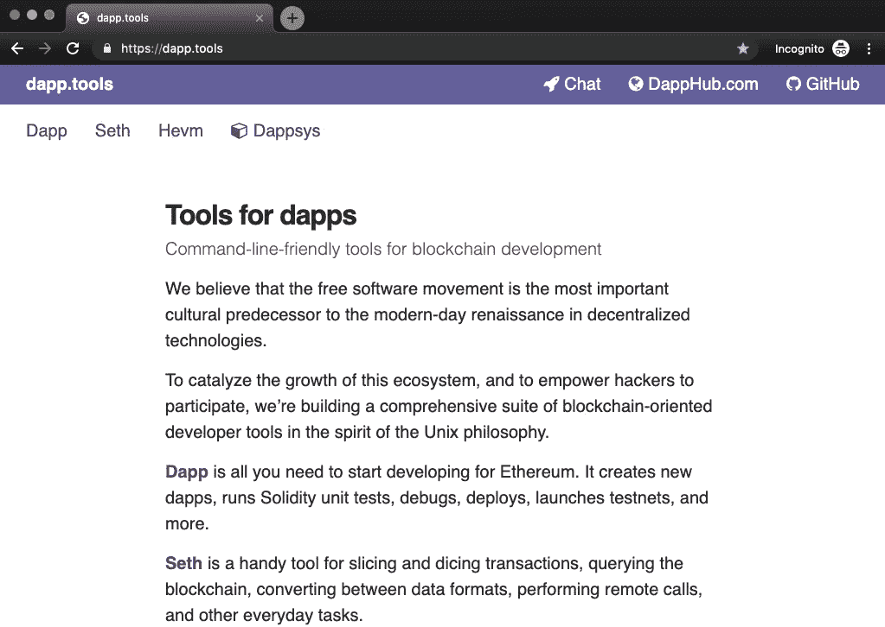

dapp.tools 最好的介绍在他们的[页面](https://dapp.tools/)。

正如他们的网站所描述的，dapp.tools 是一套“用于区块链开发的命令行友好工具”。作为一个快速概述，dapp.tools 附带了几个用于以太坊契约开发的便利工具。同样，您可以在这些工具及其网站上看到最佳描述。

在我的演示中，我将使用 **dapp** 来执行我的契约代码的单元测试，并将其部署在 dapp.tools 提供的 testnet 中。

安装非常简单。因为我用的是 Mac，所以我只是简单地按照他们的指示去做。

```
curl https://dapp.tools/install | sh
```

# 初始化工作区

我们演示的第一件事是使用`dapp init`为 dapp 初始化一个工作区。

```
mkdir simplestorage
cd simplestoragedapp init
```

从输出中我们了解到，在`dapp init`之后，我们有

*   创建一个目录结构，目录 **src** 保存我们的合同代码和测试代码，目录 **lib** 保存包。
*   在 **src** 里面创建了两个文件: **Simplestorage.sol** 是我们的合同代码， **Simplestorage.t.sol** 是测试代码。它们都预先填充了基本合同结构。
*   在 **lib** 里面，安装了一个包`ds-test`。这是测试我们合同的包装。
*   执行健全性测试。
*   为这个工作区创建了一个 git 存储库。

下面是`dapp init`之后的目录结构。

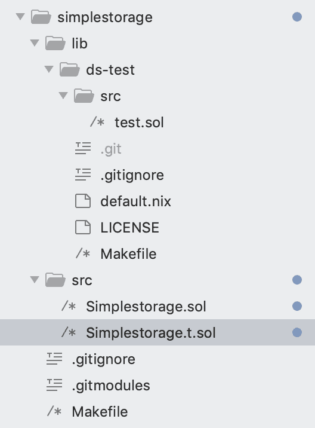

Directory structure created by `dapp init`

# 合同代码和测试代码

现在让我们准备合同代码和测试代码。

这里我使用了著名的简单存储契约代码。此契约在首次部署时保留一个存储值。并且我们可以使用两个函数与契约进行交互: *get()* 用于存储值，而 *set(x)* 用于更新值。

工作区初始化使用工作区目录名 **src/Simplestorage.sol** 创建一个空契约。我们只是将合同代码复制到这个文件中。

```
pragma solidity ^0.5.6;contract Simplestorage {
 uint storedData;function set(uint x) public {
  storedData = x;
 }function get() view public returns (uint retVal) {
  return storedData;
 }}
```

工作区初始化还会创建一个名为 t . sol:**src/simple storage . t . sol**的测试契约。我们简单地复制这个文件中的测试代码。虽然它有两个样本测试。

```
pragma solidity ^0.5.6;import "ds-test/test.sol";import "./Simplestorage.sol";contract SimplestorageTest is DSTest {
    Simplestorage simplestorage;function setUp() public {
        simplestorage = new Simplestorage();
    }function testGetInitialValue() public {
        assertTrue(simplestorage.get() == 0);
    }function testSetValue() public {
        uint x = 300;
        simplestorage.set(x);
        assertTrue(simplestorage.get() == 300);
    }}
```

让我们看看这份测试合同。 **Simplestorage.t.sol** 也是一个 Solidity 契约。它首先导入`ds-test`包中的 **test.sol** (在工作区初始化时安装)和 **Simplestorage.sol** 契约。

我们将测试用例定义为函数。在此之前，我们需要一个 *setUp()* 函数来部署这个契约。

测试用例的函数以前缀 **test** 命名。这些功能都将作为测试项目来执行。只有当 assertTrue(条件)中的条件为真时，测试才通过**。函数 *testGetInitialValue()* 是在合同部署后用 *get()* 函数获取存储值。函数 *testSetValue()* 用于检查 *set(x)* 是否可用于新值，并用 *get()* 函数检查该值。**

你可能会问测试在哪里进行。Dapp 测试使用了 Hevm，他们自己的 evm 实现很好的测试和调试。因此，我们不需要为合同测试运行任何 testnet。

# 测试合同代码

如前所述，我们不需要 testnet 来进行契约测试。这里我们使用命令`dapp test`进行单元测试。

```
dapp test
```

Dapp 将搜索那些带有 t.sol 扩展名的契约，并执行 *setUp()* 和所有带有前缀 test 的函数:在我们的测试代码中有两个函数: *testGetInitialValue()* 和 *testSetValue()* 。

这是结果。

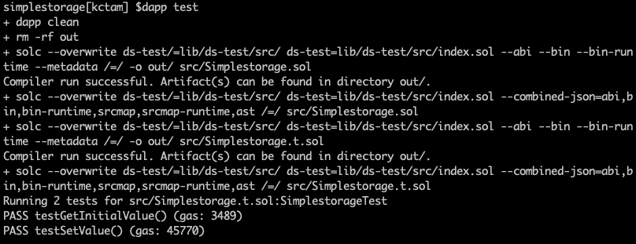

从结果中我们看到 dapp 测试首先编译这两个契约。之后，运行 **Simplestorage.t.sol** 中的两个测试用例并成功通过。

同时编译结果存储在 **out** 目录中。我们可以在这个目录中找到所有编译后的工件。

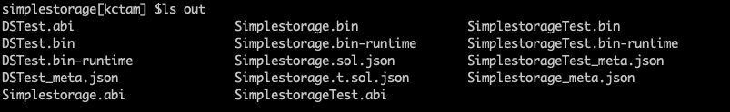

# 运行 Testnet

现在我们的合同已经准备好部署了。我们将首先运行由 dapp 提供的以太网 testnet。

使用不同的终端运行 testnet

```
dapp testnet
```

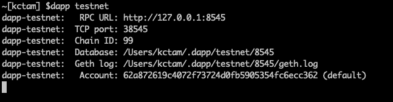

Use another terminal to run testnet

运行 dapp 测试网的几点观察

*   所有的 testnet 设置都在我的主目录中，在~/下。dapp/testnet/8545。
*   如果我们看一下这个目录，我们会看到 geth 组件和其他设置。
*   在 keystore 目录中，我们将设置 coinbase 帐户。testnet 屏幕上也显示了地址(这里是 0x62a8…c362，我们每次运行`dapp testnet`的时候这个地址都不一样。)
*   testnet 实际上是一个运行中的 geth，在这个目录中保存了 genesis 块和 coinbase 键。

这是测试网的目录结构。

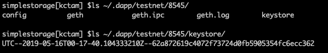

# 部署合同

有了运行 dapp testnet 的终端，我们就可以部署契约了。

我们首先指定用于契约部署的 coinbase 地址，并告诉从哪里获取私钥。这是通过设置环境变量 ETH_FROM 和 ETH_KEYSTORE 来实现的。

```
export ETH_FROM=0x62a872619c4072f73724d0fb5905354fc6ecc362
export ETH_KEYSTORE=~/.dapp/testnet/8545/keystore
```

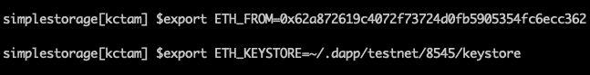

我们使用`dapp create`来部署合同。当提示输入密码时，testnet 的密码为空。

```
dapp create Simplestorage
```

正如我们所看到的，一个事务被执行。这是合同部署。

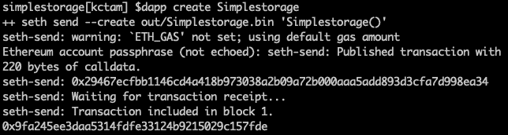

注意，我们将得到一个地址(0x9fa2…7fde)。它是部署后的合同 ID(或合同地址)。为了便于访问，我们将定义另一个环境变量 SIMSTO 来保持这个值。

```
export SIMSTO=0x9fa245ee3daa5314fdfe33124b9215029c157fde
```

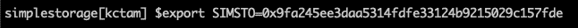

现在契约已经部署好了，我们已经准备好与它进行交互了。

# 与合同交互

为了与合同进行交互，我们使用了`seth`。Seth 是命令行制作的以太坊客户端。我们可以用`seth`执行很多任务。这里我们只是用它来执行已部署契约中的功能。

首先，我们将对函数 *get()* 使用`seth call`，而不更新区块链。我们需要的是部署的契约 ID(我们在上一步中设置的环境变量)。

```
seth call $SIMSTO “get()”
```

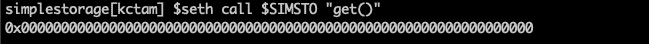

正如所料，该值最初为零。

我们将设置一个新的值。对于需要参数的函数，我们将参数列表放在函数之后。另外`seth`需要十六进制输入，我们将使用`seth --to-uint256`将数字转换成十六进制并适合 256 位。

我们将使用`seth send`函数更新区块链。

```
seth send $SIMSTO “set(uint)” $(seth --to-uint256 100)
```

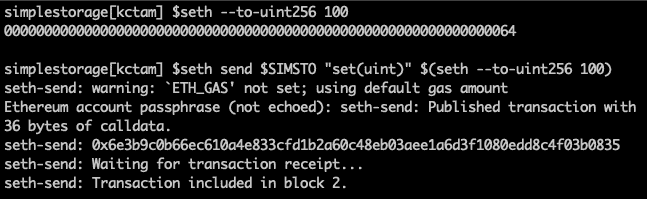

The first command is just to show a conversion of number to uint256

我们看到创建了一个新事务，该事务包含在一个新块中。

最后，我们用 *get()* 再次检查存储的值。

```
seth call $SIMSTO “get()”
```

结果是 0x64 (100)，和预期的一样。

# 清理

在我们完成我们的演示或测试之后，我们可以通过 control-c . testnet 的目录，即~ ~/来停止 dapp testnet 终端。dapp/testnet/8545 将被清空。testnet 中的所有信息，包括测试期间创建的帐户和块，都消失了。这很有帮助，因为我们不需要删除不同目录中的文件。

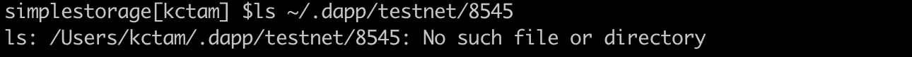

After testnet is stopped, all files in this directory are gone.

# 端节点:在公共以太坊部署合同

`seth`的默认设置是到本地 RPC，也就是本地 testnet。

如果我们希望在公共以太网中部署我们的合同，我们需要的是通过环境变量让`seth`知道目标网络。

我们需要的变量是

```
export SETH_CHAIN=<the chain you are deploying, e.g. mainnet, rinkeby, etc>export ETH_KEYSTORE=<your keystore in the Ethereum network>export ETH_FROM=<your coinbase address in this Ethereum network>
```

然后所有来自`seth`的命令都会传到你指定的以太网。确保你的帐户里有乙醚。

# 关闭

我们只是展示了如何使用 dapp 工具为以太坊契约执行单元测试。我们还部署了一个 testnet，并使用 seth 来执行已部署合同的功能。

这只显示了 dapp 工具非常基本的功能。在[的下一篇文章](/@kctheservant/developing-a-marketplace-contract-with-token-payment-d865323ea88c)中，我将创建一个更大的合同，并看看如何在我的合同中加入`ds-token`包以使 token 可用。

> [直接在您的收件箱中获得最佳软件交易](https://coincodecap.com/?utm_source=coinmonks)

[](https://coincodecap.com/?utm_source=coinmonks)