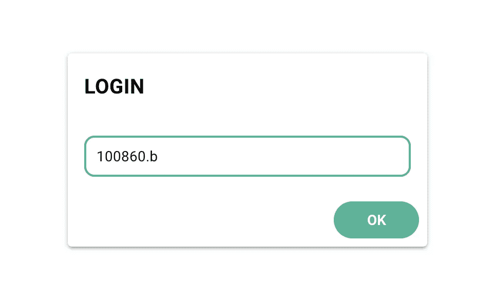
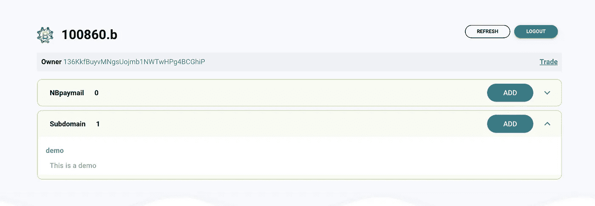
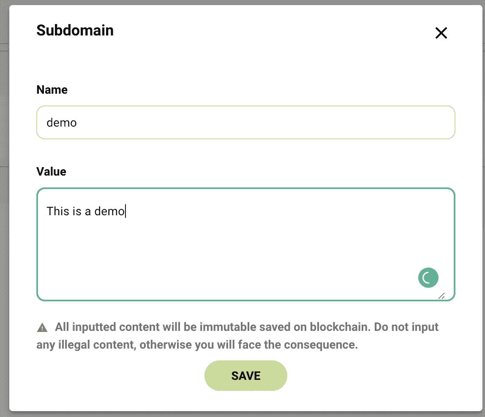
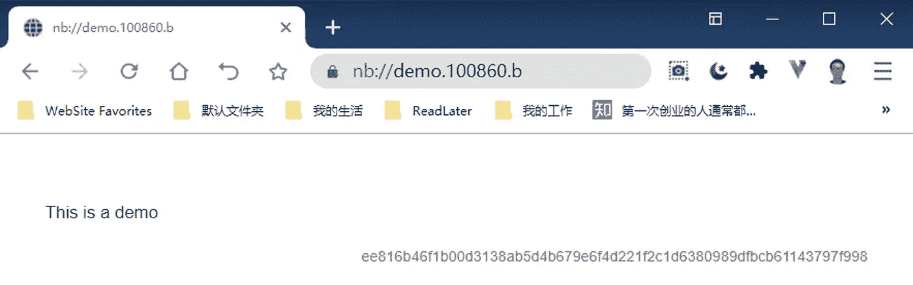

# 使用 NBdomain 轻松管理区块链上的内容

> 原文：<https://medium.com/coinmonks/use-nbdomain-to-manage-contents-on-blockchain-with-ease-561eb3b04095?source=collection_archive---------2----------------------->

区块链带给公众的承诺之一是保存不可变的内容，从而鼓励一个诚实的世界。但是有各种各样的挑战阻止普通人利用这个特性。

NBdomain 旨在使区块链易于使用。让我们看看如何使用 NBdomain 来管理区块链上的内容。

让我们假设你已经注册了一个[免费域名](https://app.nbdomain.com/#/free)或者一个[个性化域名](https://app.nbdomain.com/#/search)。

有了 NBdomain 在手，你就可以登录“[我的域名](https://app.nbdomain.com/#/my)

在授权来自钱包的签名请求后，您将能够登录并查看与该域相关联的区块链内容。

点击“添加”添加一个新的子域，例如“演示”,并输入与该子域相关的内容。

授权从钱包付款后，此内容将保存在区块链上。

注 1:用户可以创建无限数量的子域，所以你可以有无限的区块链内容。

注 2:内容可以是任何形式的文本。不同的应用程序可以解释不同种类的内容。你可以尝试纯文本或“降价文本”。

# 访问内容

傲游浏览器 6 版(桌面版和移动版)内置了解析器，解析并显示 NBdomain 内容。对于上面的例子，用户可以在傲游浏览器中输入 **nb://demo.100860.b** 来访问保存的内容。

[傲游 6 下载](https://www.maxthon.com/mx6/beta/)

提示:你可以访问 **nb://md.1010.test** 查看一些演示降价文本。

**总结:**

借助 NBdomain，人们可以轻松保存区块链内容，并在一个地方管理所有内容。所有的内容都可以通过一个容易记忆的网址来访问。

## 另外，阅读

*   最好的[密码交易机器人](/coinmonks/crypto-trading-bot-c2ffce8acb2a)
*   [Deribit 审查](/coinmonks/deribit-review-options-fees-apis-and-testnet-2ca16c4bbdb2) |选项、费用、API 和 Testnet
*   [FTX 密码交易所评论](/coinmonks/ftx-crypto-exchange-review-53664ac1198f)
*   最好的比特币[硬件钱包](/coinmonks/the-best-cryptocurrency-hardware-wallets-of-2020-e28b1c124069?source=friends_link&sk=324dd9ff8556ab578d71e7ad7658ad7c)
*   [密码本交易平台](/coinmonks/top-10-crypto-copy-trading-platforms-for-beginners-d0c37c7d698c)
*   最好的[加密税务软件](/coinmonks/best-crypto-tax-tool-for-my-money-72d4b430816b)
*   [最佳加密交易平台](/coinmonks/the-best-crypto-trading-platforms-in-2020-the-definitive-guide-updated-c72f8b874555)
*   最佳[密码借贷平台](/coinmonks/top-5-crypto-lending-platforms-in-2020-that-you-need-to-know-a1b675cec3fa)
*   [block fi vs Celsius](/coinmonks/blockfi-vs-celsius-vs-hodlnaut-8a1cc8c26630)vs Hodlnaut
*   [莱杰 vs 特雷佐](/coinmonks/ledger-vs-trezor-best-hardware-wallet-to-secure-cryptocurrency-22c7a3fd391e)
*   [bits gap review](/coinmonks/bitsgap-review-a-crypto-trading-bot-that-makes-easy-money-a5d88a336df2)——一个轻松赚钱的加密交易机器人
*   为专业人士设计的加密交易机器人
*   [3commas Review](https://blog.coincodecap.com/3commas-review-an-excellent-crypto-trading-bot) |一款优秀的密码交易机器人
*   [PrimeXBT 审查](/coinmonks/primexbt-review-88e0815be858) |杠杆交易、费用和交易
*   Bitmex 上的[保证金交易的白痴指南](/coinmonks/the-idiots-guide-to-margin-trading-on-bitmex-dbbd7742c6fc?source=friends_link&sk=7bfa99d2a181142510c8442c8ddb0786)
*   加密摇摆交易的权威指南
*   [Bitmex 高级保证金交易指南](/coinmonks/bitmex-advanced-margin-trading-guide-2270c195ce25?source=friends_link&sk=1d986cca731f5084b9a2db4a4bc4a7ad)
*   开发人员的最佳加密 API
*   [加密套利](/coinmonks/crypto-arbitrage-guide-how-to-make-money-as-a-beginner-62bfe5c868f6)指南:新手如何赚钱
*   顶级[比特币节点](https://blog.coincodecap.com/bitcoin-node-solutions)提供商
*   最佳[加密制图工具](/coinmonks/what-are-the-best-charting-platforms-for-cryptocurrency-trading-85aade584d80)
*   了解比特币最好的[书籍有哪些？](/coinmonks/what-are-the-best-books-to-learn-bitcoin-409aeb9aff4b)

> [直接在您的收件箱中获得最佳软件交易](https://coincodecap.com?utm_source=coinmonks)

