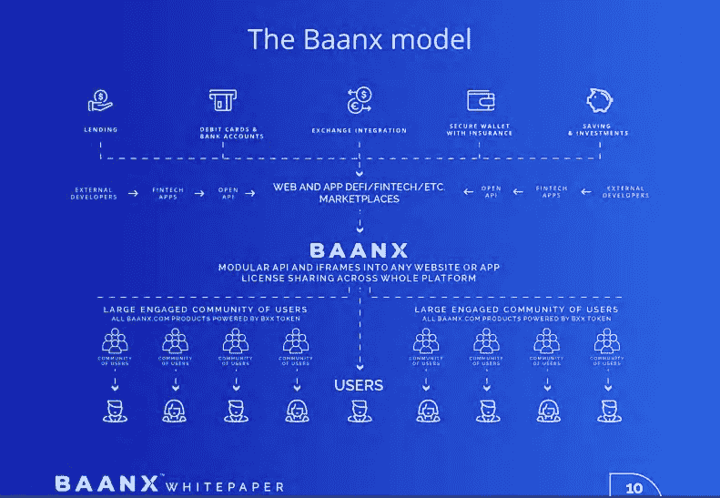

# 使用这张新的加密卡来支付元掩码和分类帐钱包中的加密

> 原文：<https://medium.com/coinmonks/use-this-new-crypto-card-to-spend-against-the-crypto-in-your-metamask-ledger-wallet-fc1b697f29d2?source=collection_archive---------9----------------------->

## Baanx 是一家金融科技公司，与 Ledger 合作提供加密即服务，将加密融入日常生活。

随着加密货币越来越融入我们的生活，我们需要一种方法来提高这种技术和资产类型的易用性。在与 Baanx 的合作中，Ledger 推出了一种新的加密生命卡，允许用户访问他们硬件钱包中的加密，以便在现实世界中消费。

你可以在这里加入[加密生命卡候补名单。](https://cl-cards.com/waiting-list/register?ref=XfcDd7J3N)

# 它是如何工作的

你可以用你选择的密码作为抵押来开立信用额度。密码必须存储在分类帐生态系统中。用户可以将他们的元掩码种子短语导入到他们的分类帐设备中，以将他们的网络钱包暴露给产品和福利的分类帐生态系统。这里有一个关于如何做到这一点的视频:

YouTube Video by Axion

加密生命卡最初支持的数字资产包括:BTC、瑞士联邦理工学院、USDT、欧洲铁路公司、USDC、XRP、BXX、BCH 和 LTC。

利率因地区而异，但起始利率为 0%(这在分散融资中很典型)。该卡将可用于接受 Visa 的零售商和在线商店网络。

不同地区的最终利率尚未确定。它将首先面向欧洲国家，然后面向美国客户群。之后，该计划将继续在世界各地开放。

# 为什么要这么做？

本质上，用户一直想做的不仅仅是买卖密码。莱杰最初只是为了让加密货币用户能够通过一个冰冷的钱包以安全的方式“HODL”(珍惜生命)。

许多密码持有者要么不想出售他们在分类帐/冷钱包中持有的密码，要么不想处理税务问题。

加密生命卡通过在主要支持地区提供 0%利息的加密抵押信用额度解决了这两个问题。

根据 Ledger 的首席体验官 Ian Rogers 的说法，这是朝着取代传统银行账户迈出的一步。

# Baanx 合作伙伴愿景和效果

Baanx 对他们的愿景陈述如下:

> “想象一下这样一个世界，你可以免费交换密码，在全球范围内免费汇款，并从日常消费中获得密码奖励。这是 Baanx 平台的世界，一个加密即服务的金融科技，连接了加密和菲亚特的世界；因此，全球的金融科技公司可以为他们的用户提供最新的技术。”

如果我们要建立一个新的去中心化的金融系统，那么像 Ledger x Baanx 这样的合作伙伴关系为加密银行世界的想法提供了合法性。最终，这一举措是加密经济的正常化。

在 Baanx 白皮书中，该团队指出，

> “我们正在为我们的数字资产客户提供最高质量、安全、低成本的 B2B 数字产品，这些产品可以快速、轻松地集成到下一代创新金融服务公司中。这包括:数字交易所、DeFis、钱包提供商、电信公司、金融机构、社交网络、消费品牌和许多其他机构。”

本质上，Baanx 旨在通过为 crypto 提供一整套创新的数字产品来改善金融服务基础设施。看到与 Ledger 的合作关系如何发展，以改善消费者和企业的真实世界的加密效用，将是一件有趣的事情。

[Baanx Whitepaper](https://global-uploads.webflow.com/5f7ac868eff61848f2194913/619d681fa75d786fd0751247_BaanxWhitePaperFinal%20(1).pdf)

# 结论

莱杰和 Baanx 正在大举投资数字资产。他们为用户提供了他们一直在寻求的东西——一种无需出售资产或处理税收就能获得加密资产流动性的方法。

加密经济正致力于建立一个闭环系统，在这个系统中，传统的金融服务变得过时和没有意义。这符合所有人的利益，因为 DeFi 是自助银行，以安全、非侵入性的方式扮演银行的角色，剔除不必要的中间人。这意味着您支付的费用更少，并且能够在一个和谐的全球金融生态系统中更好地利用您的资金，该生态系统旨在保护小企业并使收益最大化。

Crypto Life 卡只是现实世界中无缝加密集成未来的一小部分，我希望在 Ledger x Baanx 合作伙伴关系成熟后会看到更多的采用和创新。

感谢阅读这篇文章！如果你认为我应该调查任何与密码相关的事情，那么通过 Twitter DM([**@ kyled Collins**](https://twitter.com/kyledcollins)**)告诉我。我总是在寻找好机会。另外，如果您有任何问题，请随时联系我们**。****

*请注意，我写的都不是金融建议——只是我对投资机会的看法。*

电子邮件:kyledanielcollins@gmail.com

> 加入 Coinmonks [电报频道](https://t.me/coincodecap)和 [Youtube 频道](https://www.youtube.com/c/coinmonks/videos)了解加密交易和投资

## 也阅读

 [## 2021 年最佳加密交换平台| CoinCodeCap

### 编辑描述

blog.coincodecap.com](https://blog.coincodecap.com/best-swap-platforms)  [## 获取信号、交易机器人和套利

### 在本文中，我们将讨论 bits gap——一个满足您所有交易需求的一站式加密交易平台…

blog.coincodecap.com](https://blog.coincodecap.com/bitsgap-review)  [## 40 个最佳电报频道，用于加密、电影、表演和演讲| CoinCodeCap

### 编辑描述

blog.coincodecap.com](https://blog.coincodecap.com/best-telegram-channels)  [## 5 个最佳社交交易平台[2021] | CoinCodeCap

### 编辑描述

blog.coincodecap.com](https://blog.coincodecap.com/best-social-trading-platforms)  [## BlockFi 评论 2021:利弊和利率| CoinCodeCap

### 编辑描述

blog.coincodecap.com](https://blog.coincodecap.com/blockfi-review)  [## 如何在印度购买比特币？2021 年购买比特币的 7 款最佳应用[手机版]

### 如何使用移动应用程序购买比特币印度

medium.com](/coinmonks/buy-bitcoin-in-india-feb50ddfef94)  [## 加密税务软件——五大最佳比特币税务计算器[2021]

### 不管你是刚接触加密还是已经在这个领域呆了一段时间，你都需要交税。

medium.com](/coinmonks/best-crypto-tax-tool-for-my-money-72d4b430816b)  [## 存储比特币的最佳加密硬件钱包[2021] | CoinCodeCap

### 编辑描述

blog.coincodecap.com](https://blog.coincodecap.com/best-hardware-wallet-bitcoin)  [## Pionex 评论 2021 |免费加密交易机器人和交换

### Pionex 是为交易自动化提供工具的后起之秀。Pionex 上提供了 9 个加密交易机器人…

medium.com](/coinmonks/pionex-review-exchange-with-crypto-trading-bot-1e459d0191ea)