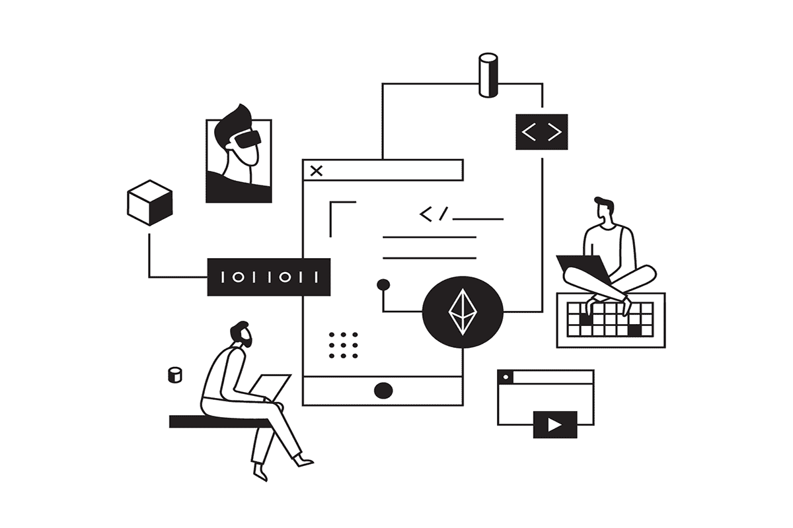
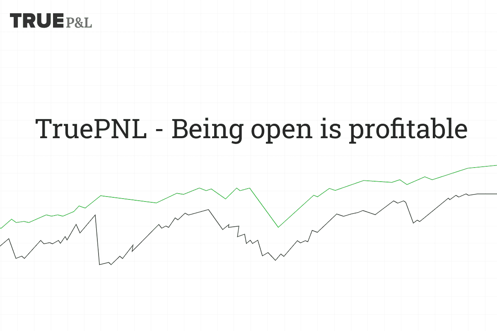

# 选择可靠的复制交易平台的有用提示

> 原文：<https://medium.com/coinmonks/useful-tips-to-choose-a-reliable-copy-trading-platform-coincodecap-d40cd3c3022f?source=collection_archive---------5----------------------->

复制交易是一种自动化交易，投资者可以复制其他交易者开立和管理的头寸。投资者选择有利可图的交易者，通过复制交易赚取利润。反过来，交易者会收到一笔成功费或复制他们的投资者数量的一部分。

迄今为止，已有数十种服务为加密投资者提供拷贝交易功能。这个领域的多样性让初学者感到有些害怕，因为有太多的函数，它们的有用性并不总是可以理解的。在这篇文章中，我们将看看陷阱，并给出有用的提示，以帮助新手投资者选择[复制交易平台](/coinmonks/top-10-crypto-copy-trading-platforms-for-beginners-d0c37c7d698c)。

## 提示#1:选择连接了 API 的平台

短语:“不是你的钥匙，不是你的硬币”比以往任何时候都更真实。创造安全是最重要的事情。但是同意，你会更愿意把资金转到一个经过验证的兑换账户，而不是一个未知的服务。为了让投资者获得对其资本的控制权，通过 API-key 建立了一种联系。这种机制允许我们连接个人交换帐户并管理资金，而无需将资金转移到第三方服务。

## 提示 2:注意交易者统计数据的可用性

当一个交易者赚到了利润，那是好的，但更重要的是要明白他是怎么做的。这将是一个加号，如果该平台显示数据的初始余额，平均收益率，以及下降的百分比。一个交易者在 3 个月内积极地赚取了+300%的存款，和一个交易者的账户已经存在了 5 年，并给出了稳定的结果，这两者之间有很大的区别。

## 提示#3:在付费订阅之前测试服务

平台免费的时候就很棒了。事情并不总是这样。[拷贝交易平台](/coinmonks/top-10-crypto-copy-trading-platforms-for-beginners-d0c37c7d698c)通过订阅模式提供服务。有专门的测试时段来检查功能，在此期间您可以使用其性能并评估其功能。测试期为 3 至 14 天。如果不提供此功能，请尝试向联系地址发送电子邮件，要求启用测试期。

## 秘诀 4:找到创始人和队友

交易空间的任何服务背后都有一个团队。尝试找到更多关于项目创建者的信息。了解他们的背景，以及他们创建这项服务的原因。通常，关于项目创建者的信息可以在社交网络中，如 [Linkedin](https://www.linkedin.com/) 或 [AngelList](https://angel.co/) 。有了这些信息，你就能理解开发者的动机和项目的前景。

## 秘诀 5:强大的社区是一面绿色的旗帜

大多数拷贝交易平台都是新成立的公司，他们还没有时间找到一个完整的用户群。有时也有例外。例如，电报或折扣信使中的社区，拥有 300 个用户，就已经被认为是形成了。超过 5000 名社区成员表明该服务拥有广泛的用户基础。一个强大的社区对新手来说是一个巨大的优势，因为在那里你可以了解交易者，学习更多关于 T2 交易的知识。另一方面，社区通过及时指出功能错误来帮助平台开发。

## 技巧 6:查看关于平台的互联网评论

使用你感兴趣的平台的用户的反馈将是最有价值的。你不应该完全相信网上的陌生人。有必要分析那些揭示服务性能并给出一些价值的评论。像 Trustpilot 或 Bitcointalk 这样的网站非常适合查找评论。

## 秘诀 7:跟进营销活动和影响者

营销有助于提高意识，所以你最终也可以了解这个项目。但是侵入性的广告和攻击性的方法并不是接触受众的最佳方式。如果一个项目开始主动向你推销它的服务，问问自己这个项目是需要用户还是需要推销服务，尽管服务质量很好。影响者的情况也是如此。你爱的人不会一直推销适合你的产品。

根据上面的建议，年轻的投资者将能够找到合适的服务，建立自己的复制交易策略。比如 [**真 PNL**](https://blog.coincodecap.com/go/truepnl) 可能就是一个配得上的平台。

True PNL 是一个公共复制交易平台，允许通过 API 连接投资者和交易者。平台免费接入，完全满足寻找盈利交易者的所有要求。

顺便说一句，你现在就可以通过在真实 PNL 平台上注册并获得高级访问来准备搜索交易者。报名了解 [**这里**](http://blog.coincodecap.com/go/truepnl) 。

## 另外，阅读

*   最好的[密码交易机器人](/coinmonks/crypto-trading-bot-c2ffce8acb2a)
*   [密码本交易平台](/coinmonks/top-10-crypto-copy-trading-platforms-for-beginners-d0c37c7d698c)
*   最好的[加密税务软件](/coinmonks/best-crypto-tax-tool-for-my-money-72d4b430816b)
*   [最佳加密交易平台](/coinmonks/the-best-crypto-trading-platforms-in-2020-the-definitive-guide-updated-c72f8b874555)
*   最佳[密码借贷平台](/coinmonks/top-5-crypto-lending-platforms-in-2020-that-you-need-to-know-a1b675cec3fa)
*   [最佳区块链分析工具](https://bitquery.io/blog/best-blockchain-analysis-tools-and-software)
*   [加密套利](/coinmonks/crypto-arbitrage-guide-how-to-make-money-as-a-beginner-62bfe5c868f6)指南:新手如何赚钱
*   最佳[加密制图工具](/coinmonks/what-are-the-best-charting-platforms-for-cryptocurrency-trading-85aade584d80)
*   [莱杰 vs 特雷佐](/coinmonks/ledger-vs-trezor-best-hardware-wallet-to-secure-cryptocurrency-22c7a3fd391e)
*   了解比特币的[最佳书籍有哪些？](/coinmonks/what-are-the-best-books-to-learn-bitcoin-409aeb9aff4b)
*   [3 商业评论](/coinmonks/3commas-review-an-excellent-crypto-trading-bot-2020-1313a58bec92)
*   [AAX 交易所评论](/coinmonks/aax-exchange-review-2021-67c5ea09330c) |推荐代码、交易费用、利弊
*   [Deribit 审查](/coinmonks/deribit-review-options-fees-apis-and-testnet-2ca16c4bbdb2) |选项、费用、API 和 Testnet
*   FTX 密码交易所评论
*   [n 零审核](/coinmonks/ngrave-zero-review-c465cf8307fc)
*   [Bybit 交换审查](/coinmonks/bybit-exchange-review-dbd570019b71)
*   [3Commas vs Cryptohopper](/coinmonks/cryptohopper-vs-3commas-vs-shrimpy-a2c16095b8fe)
*   最好的比特币[硬件钱包](/coinmonks/the-best-cryptocurrency-hardware-wallets-of-2020-e28b1c124069?source=friends_link&sk=324dd9ff8556ab578d71e7ad7658ad7c)
*   最佳 [monero 钱包](https://blog.coincodecap.com/best-monero-wallets)
*   [莱杰 nano s vs x](https://blog.coincodecap.com/ledger-nano-s-vs-x)
*   [bits gap vs 3 commas vs quad ency](https://blog.coincodecap.com/bitsgap-3commas-quadency)
*   [莱杰纳米 S vs 特雷佐 one vs 特雷佐 T vs 莱杰纳米 X](https://blog.coincodecap.com/ledger-nano-s-vs-trezor-one-ledger-nano-x-trezor-t)
*   [block fi vs Celsius](/coinmonks/blockfi-vs-celsius-vs-hodlnaut-8a1cc8c26630)vs Hodlnaut
*   [Bitsgap 评论](/coinmonks/bitsgap-review-a-crypto-trading-bot-that-makes-easy-money-a5d88a336df2)——一个轻松赚钱的加密交易机器人
*   [Quadency Review](/coinmonks/quadency-review-a-crypto-trading-automation-platform-3068eaa374e1) -专为专业人士打造的加密交易机器人
*   [PrimeXBT 审查](/coinmonks/primexbt-review-88e0815be858) |杠杆交易、费用和交易
*   [埃利帕尔泰坦评论](/coinmonks/ellipal-titan-review-85e9071dd029)
*   [SecuX Stone 评论](https://blog.coincodecap.com/secux-stone-hardware-wallet-review)
*   [BlockFi 评论](/coinmonks/blockfi-review-53096053c097) |赚取高达 8.6%的加密利息

*原载于 2020 年 11 月 5 日 https://blog.coincodecap.com***。**