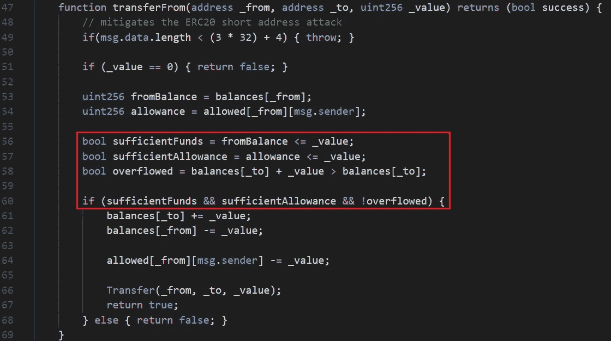
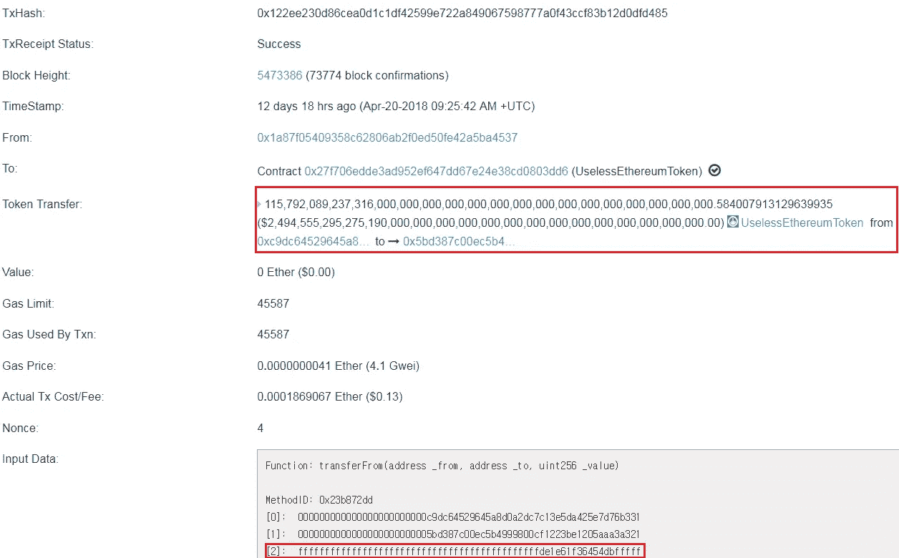
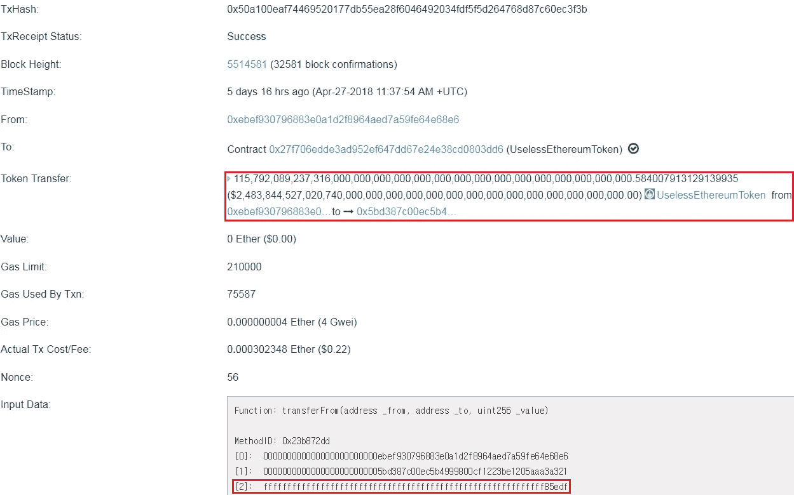

# UselessEthereumToken(UET)，ERC20 令牌，允许攻击者窃取所有受害者的余额(CVE-2018–10468)

> 原文：<https://medium.com/coinmonks/uselessethereumtoken-uet-erc20-token-allows-attackers-to-steal-all-victims-balances-543d42ac808e?source=collection_archive---------1----------------------->

# 摘要

我发现了一个 UselessEthereumToken(UET)的智能合约的漏洞，一个以太坊 ERC20 令牌([**CVE-2018–10468**](http://cve.mitre.org/cgi-bin/cvename.cgi?name=CVE-2018-10468))【1】。由于 *transferFrom* 函数中有一个错误的 if 语句，攻击者可以窃取受害者账户中的所有余额。

> [发现并回顾最佳区块链软件](https://coincodecap.com)

# 细节

在 ERC20 令牌标准中，对函数的*转移定义如下[【2】](https://github.com/ethereum/EIPs/blob/master/EIPS/eip-20.md#transferfrom):*

> 将`_value`数量的令牌从地址`_from`转移到地址`_to`，并且必须触发`Transfer`事件。

它最多将地址`_from`的余额转移到地址`_to`的`_allowed[_from][msg.sender]`。这是从功能转移而来的*的原始功能。*



Figure 1\. Code of transferFrom function in UET smart contract

但是，如图 1 所示，UET 智能合约中的*transfer 被加上了[【3】](https://etherscan.io/address/0x27f706edde3aD952EF647Dd67E24e38CD0803DD6#code)。通过上面的代码，如果`balances[to] + _value`溢出，用户可以传输比地址`_from`更多的余额。应按如下方式进行固定:*

```
bool sufficientFunds = fromBalance **>=** _value;
bool sufficientAllowance = allowance **>=** _value;
bool overflowed = balances[_to] + _value > balances[_to];if (sufficientFunds && sufficientAllowance && **overflowed**) {
```

两个不等式的方向应该改变和'！'if 条件中的'*前溢出的*变量应移除。

## 攻击者能做什么？

攻击者可以将目标地址的余额窃取到他的地址中。他们只需选择足够大的`_value`来设置`overflowed`变量为假，并选择`_to`作为他的地址。如果攻击者发送带有这些参数的事务，第 60 行的 If 语句的条件将被通过，然后余额将被操纵。

## 利用

好像已经被人剥削过几次了。我发现了两个试图转移大量令牌的漏洞利用交易[【4】](https://etherscan.io/tx/0x122ee230d86cea0d1c1df42599e722a849067598777a0f43ccf83b12d0dfd485)[【5】](https://etherscan.io/tx/0x50a100eaf74469520177db55ea28f6046492034fdf5f5d264768d87c60ec3f3b)。



Figure 2\. Exploit transaction at 04/20/2018



Figure 3\. Exploit transaction at 04/27/2018

# UET 代币是骗局？

发现这个漏洞后，我访问了无用以太币令牌[【6】](https://uetoken.com)的官方主页。在页面中，他们说“说真的，*不要买这些代币*”


Figure 4\. Offical page of UET token

如果你访问官方网页，并阅读该网页上的所有文字，你可以意识到这是骗局。但是，开发者老老实实的说，不要买，因为这个代币没有任何价值。然而，许多人购买了 UET 代币，在众筹期间，它收集了大约 310.445 以太币(这些天大约 226，274 美元)。而且在 HitBTC 交易所[【7】](https://hitbtc.com/UET-to-ETH)(目前不提供存取款)。

# 报告

我向 ethereum.org UET 代币的开发商报告了此事，并获得了 CVE 身份证。大约在同一时间，Peckshiled 团队报告了此事，并获得了与我相同的 CVE id。他们已经在我之前发表了一篇文章。CVE 团队确认我先报告，30 小时后 Peckshied 发出请求。所以 CVE 团队给了我和 Peckshiled 一个相同的 CVE id，但是 Peckshiled 在我之前发表了他们的文章。

# 结论

开发者总是应该注意不平等的方向。有时，它会在智能合同以及许多其他软件中造成严重的安全漏洞。然而，在这种情况下，我强烈怀疑这是一个故意的错误。因此，人们在购买加密令牌时应该小心。

# 参考

*   [1]http://cve.mitre.org/cgi-bin/cvename.cgi? CVE-2018–10468:[name=CVE-2018-10468](http://cve.mitre.org/cgi-bin/cvename.cgi?name=CVE-2018-10468)
*   [2]ERC 20 令牌标准中的 transfer from:[https://github . com/ether eum/EIPs/blob/master/EIPS/EIP-20 . MD # transfer from](https://github.com/ethereum/EIPs/blob/master/EIPS/eip-20.md#transferfrom)
*   [3]UET 智能合约代码:[https://ethers can . io/address/0x 27 f 706 edde 3 ad 952 ef 647 DD 67 e 24 e 38 CD 0803 DD 6 #代码](https://etherscan.io/address/0x27f706edde3aD952EF647Dd67E24e38CD0803DD6#code)
*   [4]2018 年 04 月 20 日的一次漏洞利用交易:[https://ethers can . io/tx/0x 122 ee 230d 86 ce A0 D1 C1 df 42599 e 722 a 849067598777 a 0 f 43 CCF 83 b 12d 0 DFD 485](https://etherscan.io/tx/0x122ee230d86cea0d1c1df42599e722a849067598777a0f43ccf83b12d0dfd485)
*   [5]2018 年 04 月 27 日的一次漏洞利用交易:[https://ethers can . io/tx/0x 50 a 100 EAF 74469520177 db 55 ea 28 f 6046492034 fdf 5d 264768d 87 c 60 EC 3 F3 b](https://etherscan.io/tx/0x50a100eaf74469520177db55ea28f6046492034fdf5f5d264768d87c60ec3f3b)
*   [6]无用以太坊令牌官方页面:【https://uetoken.com】T4
*   [7]hit BTC 中的 UET:[https://hitbtc.com/UET-to-ETH](https://hitbtc.com/UET-to-ETH)
*   [8] Peckshiled 的帖子:[https://medium . com/@ peck shield/your-tokens-is-mine-a-suspective-scam-token-in-a-top-exchange-5e 864075 f7e 9](/@peckshield/your-tokens-are-mine-a-suspicious-scam-token-in-a-top-exchange-5e864075f7e9)