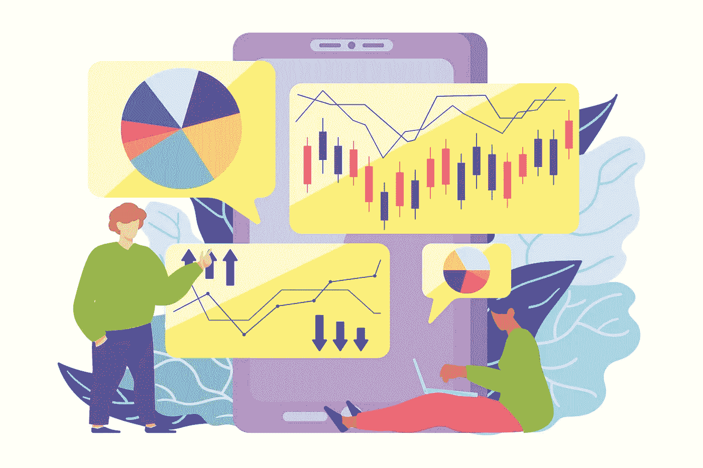

# 对交易加密使用支持和抵制

> 原文：<https://medium.com/coinmonks/uses-support-and-resistance-for-trading-crypto-391359e2ca7?source=collection_archive---------11----------------------->

Uses Support and Resistance for Trading Crypto

支持和阻力是技术评估的关键词，也是每个密码交易者工具箱中无价的装备。它们复制了资产的授予和需求以及基本的加密货币市场心理。我们今天的文章解释了支撑和阻力阶段，以及如何交换使用这些工具。

**支撑位和阻力位**

你可能已经听说过:“[初学者和高级加密货币交易的完美策略](https://cryptoworldfinace.blogspot.com/2021/11/perfect-strategy-cryptocurrency-trading.html)”、“[技术分析和阅读加密交易的蜡烛图](https://cryptoworldfinace.blogspot.com/2021/11/technical-analysis-and-read-candlestick.html)”支持和阻力显示为水平线或角线。支持度是一个收费程度，在这个程度上，加密费在一段时间的下跌后往往会跳得更低。在这种情况下，需求偏好通常会上升，并阻止费用下降，此外，由于购物者发现费用诱人，足以购买，零售商不太倾向于出售。如果帮助度没有保持，加密货币的费用继续下降，这表明看跌情绪已经增强。

阻力阶段是支持的对立面。当利率达到阻力时，购物者很少倾向于在这个收费阶段购买现金，而那些保持库存或先前提供库存的人会发现收费醒目，足以出售。你也可以说阻力阶段是一项资产的最大费用，通过这个时期的秘密市场个体来估计。在市场参与者的需求加速和看涨情绪的情况下，阻力位被打破，电荷发现新的更大的阻力，先前的阻力位可能会额外翻转到辅助线。相反，如果电荷下降超过所画的线一段距离，前面的辅助级也可能额外地翻转成电阻。

支撑和阻力痕迹另外挑选出加密货币的时尚。在上升趋势中，支撑位和阻力位是上升的因素，每一个过度都比前一个过度大，而在下降趋势中，正好相反，每一个低点都比前一个低。

> *阅读到:* [*技术分析和阅读蜡烛图进行加密交易*](https://cryptoworldfinace.blogspot.com/2021/11/technical-analysis-and-read-candlestick.html)

## **关于成功交替的支持和阻力，你还知道些什么？**

支撑位和阻力位不时地被分为最重要的和次要的。尽管可能会有一些反弹，但这些费用通常会小幅下降。根据加密货币的费用在小级别中的表现，我们应该决定一种稳健的时尚是否继续，或者费用变化是否正在发展。主要的助力和阻力阶段是标志着风格逆转的区域。奇怪的是，支撑位和阻力位通常位于 5、50、100 这样的圆形数字上，作为市场参与者的心理参考。

一项资产通常在辅助阶段之上和阻力之下交易，即使在技术评估中，勉强或低于费用选择是完美的。这对于高风险的加密市场尤其合适。为了这个目的，有时画辅助区和阻力区作为线的替代会带来额外的经验。支撑区域使用前期低点绘制，阻力区域主要基于前期高点绘制。区域在很长的时间内是令人满意的，而精确的层级适合于狭窄的买卖范围。

当供给和需求同等平衡时，通常波动性很小，加密资产的费用在买卖范围内波动。从买卖中得到的战利品表明多头或空头最终都获得了胜利。

完全基于引导和阻力阶段的秘密买卖方法如下:在上升趋势中，在引导线以上买入，在下降趋势中，在阻力附近卖出。请记住，没有保证援助和阻力将举行，采取更多的步骤，等到事态发展的确认。将引导和阻力阶段与验证趋势的不同指示结合起来。

## **在图表上画支撑和阻力**

这显然很方便，你只需要一个费率表和一个画线的装置。只需遵循以下步骤:

*   寻找随后的主要费用替代品以上和以下的尖端收费和提请援助和阻力水平。
*   看一下标准图表，看看加密的费用是如何事先绕过这些层的，以及它们是否有意义。不要忘记，援助和阻力可以把一个人变成另一个人。
*   重复上述步骤以建立后续主层的父层。最终结果是，你会得到一个有很多痕迹的图表，这些痕迹无疑也是随后最重要的援助或阻力水平。[阅读更多](https://cryptoworldfinace.blogspot.com/2021/12/uses-support-and-resistance-for-trading.html)。

> 加入 Coinmonks [电报频道](https://t.me/coincodecap)和 [Youtube 频道](https://www.youtube.com/c/coinmonks/videos)了解加密交易和投资

## 也阅读

 [## 杠杆代币[多头代币]终极指南

### 杠杆化令牌是具有杠杆化风险敞口的 ERC20 令牌，不考虑保证金、要求、管理…

medium.com](/coinmonks/leveraged-token-3f5257808b22)  [## 最佳加密交易所| 2021 年十大加密货币交易所

### 加密货币交易所的加密交易需要了解市场，这可以帮助你获得利润。之前…

blog.coincodecap.com](https://blog.coincodecap.com/crypto-exchange)  [## 2021 年最佳加密借贷平台| 6 大比特币借贷平台

### 获得比特币和其他加密货币的最佳贷款利率

medium.com](/coinmonks/top-5-crypto-lending-platforms-in-2020-that-you-need-to-know-a1b675cec3fa)  [## 2021 年最佳免费加密交易机器人

### 2021 年币安、比特币基地、库币和其他密码交易所的最佳密码交易机器人。四进制，位间隙…

medium.com](/coinmonks/crypto-trading-bot-c2ffce8acb2a)  [## 最佳 4 个加密交易信号电报通道

### 这是乏味的找到正确的加密交易信号提供商。因此，在本文中，我们将讨论最好的…

medium.com](/coinmonks/best-crypto-signals-telegram-5785cdbc4b2b)  [## 5 个最佳社交交易平台[2021] | CoinCodeCap

### 困惑于社交交易和副本交易哪个平台最好？本文将带您了解各种…

blog.coincodecap.com](https://blog.coincodecap.com/best-social-trading-platforms)  [## BlockFi 评论 2021:利弊和利率| CoinCodeCap

### 今天，我们提出了一个全面的 BlockFi 评论，这是一个成立于 2017 年的加密贷款平台，拥有其…

blog.coincodecap.com](https://blog.coincodecap.com/blockfi-review)  [## 如何在印度购买比特币？2021 年购买比特币的 7 款最佳应用[手机版]

### 如何使用移动应用程序购买比特币印度

medium.com](/coinmonks/buy-bitcoin-in-india-feb50ddfef94)  [## 加密税务软件——五大最佳比特币税务计算器[2021]

### 不管你是刚接触加密还是已经在这个领域呆了一段时间，你都需要交税。

medium.com](/coinmonks/best-crypto-tax-tool-for-my-money-72d4b430816b)  [## 存储比特币的最佳加密硬件钱包[2021] | CoinCodeCap

### 保管您的数字资产很容易，但找到正确的存储方式却是一项繁琐的任务。在线钱包有一个风险…

blog.coincodecap.com](https://blog.coincodecap.com/best-hardware-wallet-bitcoin)  [## Pionex 评论 2021 |免费加密交易机器人和交换

### Pionex 是为交易自动化提供工具的后起之秀。Pionex 上提供了 9 个加密交易机器人…

medium.com](/coinmonks/pionex-review-exchange-with-crypto-trading-bot-1e459d0191ea)