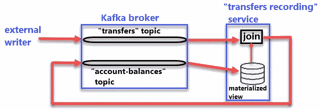

# 使用 Apache Kafka 实现事件驱动的微服务

> 原文：<https://medium.com/coinmonks/using-apache-kafka-to-implement-event-driven-microservices-810a26f1418f?source=collection_archive---------1----------------------->

Diagram of the example/PoC Kafka Streams application

当谈到微服务架构时，大多数人会想到一个通过 HTTP 进行通信的无状态服务网络(可以称之为 RESTful，也可以不称之为 RESTful，这取决于一个人的挑剔程度)。
但是有另一种方式，根据手头的用例可能更合适。

我说的是事件驱动的微服务，除了经典的请求-响应模式，服务还发布表示事件(事实)的消息，并订阅主题(或队列，取决于所用的术语)来接收事件/消息。

要完全理解并接受这种新的软件设计范例并不简单，但这是完全值得的(至少深入研究一下)。
有几个相互关联的概念需要探究，以便发现事件驱动设计的优势以及导致它的进化路径，例如:

*   日志(包括日志结构存储引擎和预写日志)
*   物化视图
*   活动采购
*   命令查询责任分离(CQRS)
*   流处理
*   “由内而外”的数据库(也称为“非捆绑”数据库)

我想向您推荐以下书籍来熟悉这些主题:

*   [**设计数据密集型应用**](https://amzn.to/31S2Trb) 作者:Martin Kleppmann 这是一本非常全面的书，它从单节点应用程序概念开始，然后是分布式系统，最后是批处理和流处理。
*   Ben Stopford 的 [**设计事件驱动系统**](https://www.confluent.io/designing-event-driven-systems)——它关注的是作为事件驱动系统支柱的 Apache Kafka。
*   《卡夫卡:权威指南》 作者:Neha Narkhede、Gwen Shapira 等人——比另外两本更实用的书。

我读了这三本书，然后我开始构建一个简单的概念验证，因为学习新的设计理念是很棒的，但是直到你将它们付诸实践，它才算完成。
此外，我对网上提供的事件驱动应用/服务的例子并不满意，我发现它们过于简单，也没有得到恰当的解释，所以我决定创建一个。

# 概念证明

源代码被分成两个 GitHub 库(按照[清洁架构](https://blog.cleancoder.com/uncle-bob/2012/08/13/the-clean-architecture.html)):

*   [transfers_api](https://github.com/VictorGil/transfers_api) →包含 Java 实体和 Avro 数据定义文件
*   [transfers _ recording _ service](https://github.com/VictorGil/transfers_recording_service)→包含业务逻辑和 Kafka 相关代码

概念验证服务跟踪银行账户中的可用余额(类似于分类账)。
它监听关于 Kafka 主题的[转账](https://github.com/VictorGil/transfers_api/blob/1e7e4519dce6a6d1bf7628738e3358490c706d6f/src/main/resources/avro/transfer.avsc)消息，当收到一条消息时，它通过发布关于另一个 Kafka 主题的新[账户余额](https://github.com/VictorGil/transfers_api/blob/1e7e4519dce6a6d1bf7628738e3358490c706d6f/src/main/resources/avro/accountBalance.avsc)消息来更新相关账户的余额。
请注意，每个实体类型由两个不同的类表示:

*   一个由 Apache Avro 生成，用于序列化和反序列化(因此它们可以从 Kafka 发送和接收)→参见 [avro](https://github.com/VictorGil/transfers_api/tree/1e7e4519dce6a6d1bf7628738e3358490c706d6f/src/main/resources/avro) 目录。
*   另一个是 POJO，可能包含一些方便的构造函数，不依赖于 Avro →见 [net.devaction.entity](https://github.com/VictorGil/transfers_api/blob/1e7e4519dce6a6d1bf7628738e3358490c706d6f/src/main/java/net/devaction/entity) 包。

[net . devaction . Kafka . avro . util](https://github.com/VictorGil/transfers_api/tree/1e7e4519dce6a6d1bf7628738e3358490c706d6f/src/main/java/net/devaction/kafka/avro/util)包包含了从一种数据表示到另一种数据表示来回移动的转换器。
一开始，Apache Kafka 可能看起来势不可挡，尽管它类似于 ActiveMQ 或 RabbitMQ 之类的经典消息传递代理，但它远不止于此，它的内部工作方式也非常不同。此外，还有几个 Kafka 客户端 API，这给学习者增加了更多的困惑。
我们将重点关注以下三点:

*   [生产者 API](https://kafka.apache.org/documentation/#producerapi) 和[消费者 API](https://kafka.apache.org/documentation/#consumerapi)
*   [流 API](https://kafka.apache.org/documentation/#streamsapi)

生产者和消费者 API 是较低的级别，而流 API 构建在它们之上。两套 API 各有利弊。
生产者/消费者 API 以更高的复杂性为代价，为应用开发者提供了更好的控制。
另一方面，Streams API 没有那么灵活，但是它允许更容易地实现一些标准操作，并且需要更少的代码。

“传输记录”示例/PoC 服务可以以下两种模式之一启动:

*   (显式)**轮询**模式，使用生产者 API、消费者 API 和流 API(创建一个由本地数据存储支持的可查询物化视图，稍后会详细介绍)→参见[TransfersRecordingServicePolling.java](https://github.com/VictorGil/transfers_recording_service/blob/eecd02b7f893afcb7d96a32907a968713b7534ca/src/main/java/net/devaction/kafka/transfersrecordingservice/main/TransfersRecordingServicePolling.java)
*   仅使用流 API 的“**加入流**”模式→参见[TransfersRecordingServiceJoinStreams.java](https://github.com/VictorGil/transfers_recording_service/blob/eecd02b7f893afcb7d96a32907a968713b7534ca/src/main/java/net/devaction/kafka/transfersrecordingservice/joinstreams/TransfersRecordingServiceJoinStreams.java)

这两种模式提供完全相同的功能，非常便于比较。

# (显式)轮询模式

它有四个主要组成部分:

*   收听“*转账*话题的[消费者](https://kafka.apache.org/23/javadoc/index.html?org/apache/kafka/clients/consumer/KafkaConsumer.html)→参见[TransferConsumer.java](https://github.com/VictorGil/transfers_recording_service/blob/eecd02b7f893afcb7d96a32907a968713b7534ca/src/main/java/net/devaction/kafka/transfersrecordingservice/transferconsumer/TransferConsumer.java#L103)
*   一个 [ReadOnlyKeyValueStore](https://kafka.apache.org/23/javadoc/org/apache/kafka/streams/state/ReadOnlyKeyValueStore.html) (它是 Streams API 的一部分)将“*账户余额*”主题数据具体化为一个可查询的视图，因此我们可以使用 accountId 值来检索特定账户的最新/当前余额→参见 AccountBalanceRetrieverImpl.java[。
    请注意， *accountId* 值是从消费者收到的“ *transfer* ”数据报文中提取的。](https://github.com/VictorGil/transfers_recording_service/blob/eecd02b7f893afcb7d96a32907a968713b7534ca/src/main/java/net/devaction/kafka/transfersrecordingservice/accountbalanceproducer/AccountBalanceRetrieverImpl.java#L93)
*   从接收到的 *TransferEntity* 对象和 Kafka 中存在的当前 *AccountBalanceEntity* 创建新的/更新的 *AccountBalanceEntity* 对象的业务逻辑→参见[NewAccountBalanceProvider.java](https://github.com/VictorGil/transfers_recording_service/blob/eecd02b7f893afcb7d96a32907a968713b7534ca/src/main/java/net/devaction/kafka/transfersrecordingservice/core/NewAccountBalanceProvider.java#L15)
*   一个[生成器](https://kafka.apache.org/23/javadoc/org/apache/kafka/clients/producer/KafkaProducer.html)，它通过向“*账户-余额*”主题发送消息来发布更新后的余额→本地数据存储将相应地得到更新。

# “加入流”模式

如前所述，第二种操作模式仅使用 Streams API/DSL，利用它，我们可以在更高的抽象级别进行编码:

*   我们使用的是一个 KStream，而不是一个消费者
*   代替 [ReadOnlyKeyValueStore](https://kafka.apache.org/23/javadoc/org/apache/kafka/streams/state/ReadOnlyKeyValueStore.html) ，我们使用一个 [KTable](https://kafka.apache.org/23/javadoc/org/apache/kafka/streams/kstream/KTable.html) →参见[TransfersRecordingServiceJoinStreams](https://github.com/VictorGil/transfers_recording_service/blob/271f1e7716b0298e18b90578eed6d978e0cd1d5f/src/main/java/net/devaction/kafka/transfersrecordingservice/joinstreams/TransfersRecordingServiceJoinStreams.java#L69)。又是 java。
*   业务逻辑保持不变，但现在我们称之为从[估价员](https://kafka.apache.org/23/javadoc/org/apache/kafka/streams/kstream/ValueJoiner.html) →见[TransferAndAccountBalanceJoiner.java](https://github.com/VictorGil/transfers_recording_service/blob/eecd02b7f893afcb7d96a32907a968713b7534ca/src/main/java/net/devaction/kafka/transfersrecordingservice/joinstreams/TransferAndAccountBalanceJoiner.java#L40)
*   代替[生产者](https://kafka.apache.org/23/javadoc/org/apache/kafka/clients/producer/KafkaProducer.html)，我们将 streams join 的输出重定向到期望的主题(即“*账户余额*”)→再次查看[TransfersRecordingServiceJoinStreams.java](https://github.com/VictorGil/transfers_recording_service/blob/271f1e7716b0298e18b90578eed6d978e0cd1d5f/src/main/java/net/devaction/kafka/transfersrecordingservice/joinstreams/TransfersRecordingServiceJoinStreams.java#L75)→KTable 将随着每条消息更新，从而结束循环。

我们可以看到代码比前一种模式要紧凑得多。
我们不需要显式地将 *KStream* 键映射到 *KTable* 键，这正是 *join* 所做的事情(参见下面代码片段中的第 11 行)。因此，我们需要相应地选择卡夫卡式的基调。在这种情况下，两个消息键都代表账户 id 。

# 图表

Diagram of the example/PoC Kafka Streams application

# 运行代码

要构建和运行 PoC 应用程序，除了 Maven 和 Java，我们还需要一个 Kafka 代理。
我决定安装[融合平台](https://www.confluent.io/product/confluent-platform)，它包括一个 Kafka 代理(或者一个集群，取决于所选的配置)，带有一些示例主题，并预先配置了与 ElasticSearch 和 Kibana 的集成。但更重要的是，它还包括一个名为“*控制中心*的管理 Web UI，非常方便。

我第一次在 Fedora 30 电脑上运行合流平台时遇到了一些困难。也就是说，我必须手动安装几个软件包(即“ *jot* ”和“ *jq* ”)。
和我不得不分别安装 [*汇合命令行界面*](https://docs.confluent.io/current/cli/index.html) 。
我还必须对一些属性文件和 bash 脚本进行一些更改，以便能够使用非根用户运行融合平台，[这里的](https://gist.github.com/VictorGil/5866f90dc626126897a76dbee53deeec)是更改，请根据您的环境修改配置值。

观看下面的 [YouTube 视频](https://youtu.be/w-Vy6_0buYo)了解所有细节，包括启动合流平台和运行示例流应用程序:

*原载于 2019 年 8 月 23 日*[*www.devaction.net*](https://www.devaction.net/2019/08/event-driven-microservices.html)*。*