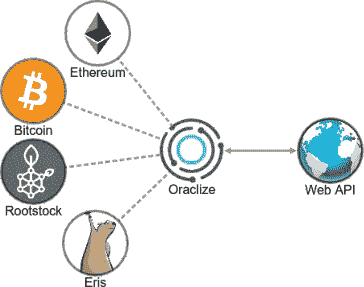
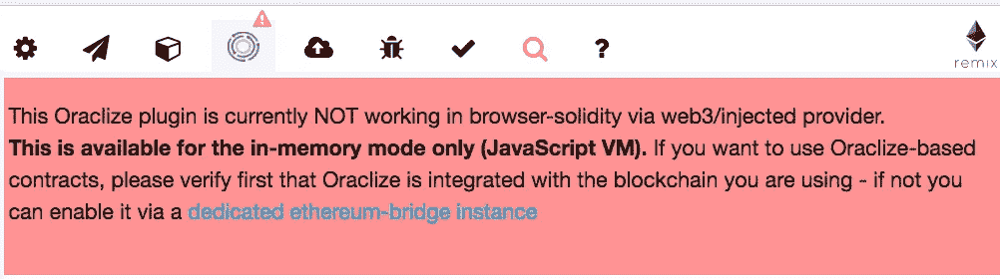
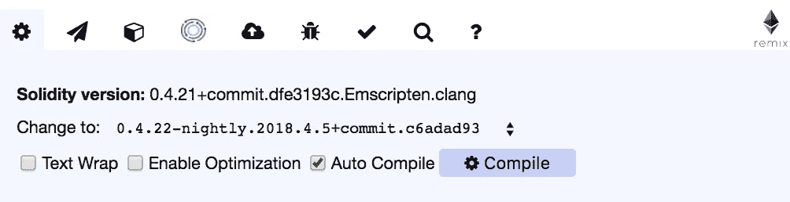
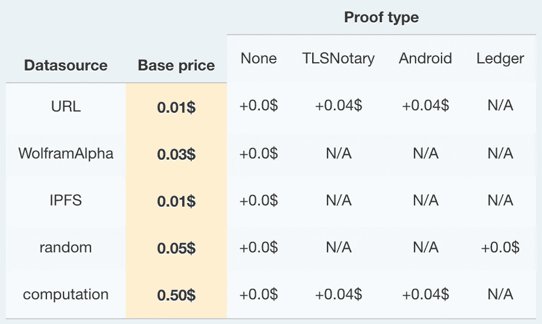
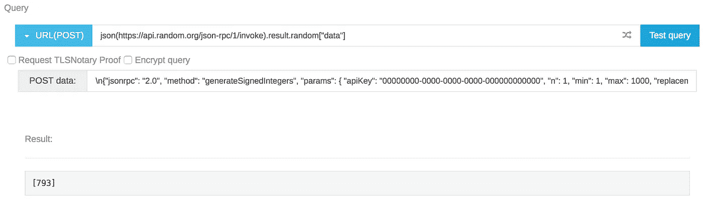
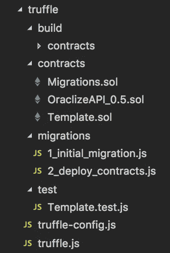

# 在带有 Oraclize 的以太坊智能合约中使用 API

> 原文：<https://medium.com/coinmonks/using-apis-in-your-ethereum-smart-contract-with-oraclize-95656434292e?source=collection_archive---------0----------------------->

从外部数据源获取数据到区块链是一个不小的问题，一个解决方案是使用[或](http://www.oraclize.it/)。关于神谕的利与弊及其背后的技术细节，已经有很多[的信息](https://www.reddit.com/r/ethereum/comments/6d7j7x/how_can_i_trust_smart_contracts_that_use_oraclize/)了，所以我们不会深入探讨。相反，我们将介绍如何使用 Oraclize 将任何 web API 连接到智能合约。

当我开始尝试学习如何使用 Oraclize 时，我遇到了一些障碍，并且在网上找不到太多可用的信息。我希望找到一个简单、全面的教程，涵盖基本查询、验证证据、加密 API 密钥和设置测试，但结果却是空的。因此，我决定写这个教程来帮助其他人寻找同样的东西。

在本文中，我们将首先设置 Remix 来使用 Oraclize，然后我们将讨论编写和加密查询。之后，将讨论在契约中实现和验证 Oraclize 查询。最后，我们将使用 Truffle 为这些 Oraclize 查询编写测试。希望这对您有所帮助！

*注:下面的大部分信息来自于* [*Oraclize 文档*](http://docs.oraclize.it/) *以及对他们的*[*Gitter*](https://gitter.im/oraclize/ethereum-api)*的挖掘。根据需要提供其他参考资料。本教程假设了 JavaScript、Solidity、Remix 和 Truffle 的基础知识。*

> [发现并回顾最佳区块链 api 和节点产品](https://coincodecap.com/category/blockchain-node-and-api)

# 第 0 步:等等，Oraclize 是什么？

我们不会在这里详细讨论 Oraclize 是如何工作的，因为在他们的网站上有详细介绍。对于这篇文章，您只需要知道:

*   Oraclize 提供了一种从任何 web API 获取外部数据到区块链的方法
*   要使用它，您将使用 Oraclize 的智能契约通过 API 调用向 Oraclize 发送查询。一旦它们从 API 获得结果，它们就调用智能契约中名为`__callback`的函数，并将结果作为输入传递给它。



Oraclize ([source](https://blog.oraclize.it/new-blockchain-integrations-and-beyond-e1a6d92bda85))

# 步骤 1:使用混音进行设置

首先，让我们建立我们的开发环境。设置使用 Oraclize 编写合同的环境有一些注意事项，因为 Oraclize 与 Remix 上的 JavaScript VM 不兼容。它与 mainnet、Rinkeby、Ropsten 和 Kovan 兼容，但是使用 testnet 进行开发当然会非常痛苦，所以不推荐使用。

幸运的是，Oraclize 拥有他们自己的[补丁版本的 Remix IDE](http://dapps.oraclize.it/browser-solidity/) ，它“增加了一个插件，可以直接从浏览器测试基于以太坊或 Oraclize 的合同”。让我们以此为起点。

## 配置混音

打开 Remix 的 Oraclize 版本后，您会看到多个示例文件。您还会注意到右边的列有许多导航图标，左边第四个(Oraclize 选项卡)可能有一个红色的感叹号。如果是的话，点击这个，你会看到下图。



If you see this, you must configure the environment to use Oraclize

这是一个简单的修复方法:只需单击左边第三个立方体图标(Environment 选项卡)并选择 JavaScript VM 选项。这与标准 Remix IDE 相反——要在标准 Remix IDE 中使用 Oraclize，您必须使用 injected Web3，而要在 Oraclize Remix IDE 中使用 Oraclize，您必须使用 JavaScript VM。

如果您现在尝试部署和使用这些示例契约中的一个，您可能会得到一个无用的错误，显示 *VM 异常:耗尽*。如果是这样，单击左边的齿轮图标(Settings 选项卡)并查看正在使用的编译器。从这个关于 GitHub 问题的[评论](https://github.com/oraclize/ethereum-api/issues/21#issuecomment-373746546)来看，似乎 Solidity 版本 0.4.21 可能有一些与 Oraclize 不兼容的突破性变化，所以将其更改为版本 0.4.20 或更低。版本 0.4.20+commit.3155dd80 一直在为我工作，也是我将在整篇文章中使用的。



Change the compiler to version 0.4.20 or lower

使用红色的“Create”按钮，您现在应该能够在 JavaScript VM 上部署任何示例契约了！这些示例契约都被配置为在部署后查询 Oraclize，因此，如果您在部署后等待几秒钟，您会看到在右侧记录了一个事件。此事件将显示从 API 调用返回的值。

## 使用 Oraclize 查询

现在是解释一些关于 Oraclize 如何处理气体的简单事情的好时机。您可能已经注意到，您不能再次调用`update`函数来进行额外的 API 调用，除非您在事务中发送 Ether。这是因为使用 Oraclize 支付汽油费用的方式。以下是你需要了解的关于天然气的一切，直接来自[的文档](http://docs.oraclize.it/#ethereum-quick-start-custom-gas-limit-and-gas-price):

*   对于任何合同，使用默认 gas 参数的第一个 Oraclize 查询都是免费的(gas 参数可以更改，如第 3 步末尾所述)
*   所有后续请求都要求合同支付(1)使用 Oraclize 的费用，以及(2)支付回调交易的汽油费用
*   付款将自动从合同余额中扣除
*   如果合同余额不足以支付天然气费用，请求将失败，Oraclize 将不会返回任何数据(请确保在您的合同中处理这种情况！)
*   除非另有规定，否则默认气价为 20 Gwei，回拨交易的默认气限为 200，000
*   未用完的汽油将退还给 Oraclize，不会退还给你的合同
*   价格适用于 mainnet 和所有 testnet，但由于价格是以以太网支付的，testnet 的使用实际上是免费的
*   使用 Oraclize 的费用如下表所示，但请查看文档的[定价部分](http://docs.oraclize.it/#pricing)了解最新价格



Oraclize pricing

为简单起见，在本文中，我们将始终使查询 Oraclize 的函数至少需要 0.004 ETH —这来自默认值 200，000 gas 和 20 Gwei ( `200,000 gas * 20 Gwei = 4,000,000 Gwei = 0.004 ETH`)。另一种方法是要求构造函数中有足够数量的 ETH。请记住，多余的汽油是不退款的，所以这些默认值应该根据您的具体查询进行定制，以最大限度地减少未使用的汽油。

可能对以后有帮助的快速补充说明:我发现自己经常犯的一个小错误是不小心将值发送给了一个没有指定为 payable 的函数，反之亦然。使用左起第二个图标(交易选项卡)指定交易气体限值和值。

# 步骤 2:让您的查询工作起来

您可以在样本契约中看到一些示例查询，但是这些查询对于许多现实情况来说太简单了。例如，看看这个由[Etheroll.com](https://etheroll.com/)使用的巨大查询(不要担心，当我们建立它时，你很快就会明白)。

Etheroll’s Oraclize query (in this article, code snippets with the .sol.js extension are Solidity, and the .js is just there so GitHub applies syntax highlighting)

在这一节中，我们将使用[random.org](https://www.random.org/)API 来逐步理解和使用我们自己版本的上述 Etheroll 查询。这里介绍的步骤应该适用于许多其他 API。本小节的其余部分只是关于随机数生成的注释。如果您打算将 Oraclize 与其他类型的 API 一起使用，请随意跳过这一步。

*注:Oraclize 说* [*随机数据源*](http://docs.oraclize.it/#data-sources-random) *使用 s a Ledger Nano S 比 random.org API 更好地生成随机数(完整白皮书* [*此处*](http://www.oraclize.it/papers/random_datasource-rev1.pdf) *)。另一方面，random.org API 在返回值的范围、数量和分布方面更加灵活。要知道，随机数据源* [*在 JavaScript VM*](https://github.com/oraclize/ethereum-examples/blob/master/solidity/random-datasource/README.md) *上是不可用的，只在 mainnet 和公共 testnets 上起作用。*

*以下是 Oraclize 在 Gitter 上关于随机数据源(random DS)的评论。出于某种原因，你无法链接到 Gitter 上的特定评论，除非你通过谷歌找到它们，所以我在下面粘贴了这条评论。*

> random DS 非常可靠，在出现故障的情况下，这些故障是建立在强有力的保证之上的，所以如果它不时出现故障，不要将其视为一件坏事。失败率目前取决于网络质量/孤立率。
> 
> 关于随机 DS vs Random.org web；他们有不同的保障。我们可以让我们的一位研究人员回答哪个更好(但最终这只是不同人的意见[原文])，或者您可以参考分类帐/随机 DS 证明白皮书，如果有兴趣，我们可以链接。
> 
> 总之，Random DS 给了你一个非常强大的能力，因为它给出了一个可以在链上验证的证明，这应该提供了更大的保证，没有欺骗发生。一个缺点是，它使用了 Ledger 的内部 PRNG，但如果它被破坏或被后门，就会有更大的风险，因为人们使用 Ledger 设备持有数百万美元，到目前为止，没有一个明显由于糟糕的 RNG 而受到损害。
> 
> Random.org 声称真正的 RNG，但你必须记住，他们仍然是一个中央权威，你信任他们只是基于他们的声誉。伴随而来的证据对于事后核实是有用的，但它不会阻止 ETH 在此刻被转让，即使与 Random.org 或任何其他参与者之间存在妥协(尽管随着新技术的引入，这可能成为可能[参见 [ProofShield](http://docs.oraclize.it/#ethereum-advanced-topics-proofshield) ])。随机 DS 证明已经可以做到这一点。
> 
> 使用随机 DS 可能也是一种让自己与众不同的好方法，但是最终，由你来决定什么最适合你的项目和客户。

## 初始查询设置

下面是 Etheroll 查询，所以你不需要滚动那么远。

Etheroll’s Oraclize query (again)

先从简单的开始:在上面的查询中，`bytes32 rngID = oraclize_query(…)`部分就是如何调用 Oraclize，其中`bytes32`是`rngID`的类型，`rngID`对应于[查询 ID](http://docs.oraclize.it/#ethereum-quick-start-the-query-id) 。查询 ID 是 Oraclize 提供的返回值，用于帮助验证回调结果，并确保回调函数只被调用一次。为了确保给定查询的回调不会被无意中调用两次，建议在发送查询时将该 ID 存储在映射中，并在收到回调时将其删除。这将显示在步骤 3 中的样本契约中。

好了，现在让我们为他们的 [JSON-RPC API](https://api.random.org/json-rpc/1/) 获取一个 random.org[API 键](https://api.random.org/api-keys/beta)。跟踪您的密钥，并记住您不希望共享此密钥或允许任何其他人使用它。或者，您应该能够使用 API 键`00000000–0000–0000–0000–000000000000`来跟进。

*注意:请注意，random.org API 的 JSON-RPC 版本仍处于公开测试阶段。*

现在，从链接的最后一个 URL 点击*简介*，您将看到 API 是使用 URL `[https://api.random.org/json-rpc/1/invoke](https://api.random.org/json-rpc/1/invoke)`调用的。然后回到上一页，点击*数字签名*，在这里你会发现已签名的 API 方法可供使用。在这种情况下，我们将假设随机数用于我们想要生成一个随机数的彩票或抽彩类型的合同，因此`generateSignedIntegers`是我们想要的方法。

方便的是，Oraclize 有一个[测试查询工具](http://app.oraclize.it/home/test_query)来帮助在开发过程中测试您的查询，所以我们将使用它来让我们的 random.org 查询工作。一旦进入该页面，您需要将查询类型更改为 URL(POST)，并在字段中输入`json(https://api.random.org/json-rpc/1/invoke).result`。从`generateSignedIntegers`文档中，我们知道 POST 数据的一组有效参数如下:

```
{
    "jsonrpc": "2.0",
    "method": "generateSignedIntegers",
    "params": {
        "apiKey": "00000000-0000-0000-0000-000000000000",
        "n": 1,
        "min": 1,
        "max": 1000,
        "replacement": true,
        "base": 10
    },
    "id": 14215
}
```

将此输入标记为“发布数据”的字段。现在，即使您尝试删除所有保留的空格，您的测试查询仍然不会返回任何内容。这是因为你需要把`\n`放在文章数据的左括号之前。这是"[让 Oraclize 知道您想要发送一个 JSON POST 主体请求，而不是一个 POST url 编码请求](https://github.com/oraclize/ethereum-examples/issues/2#issuecomment-234308953)"所必需的。之后，您的 POST 数据字段应该如下所示:

```
\n{"jsonrpc": "2.0", "method": "generateSignedIntegers", "params": { "apiKey": "00000000-0000-0000-0000-000000000000", "n": 1, "min": 1, "max": 1000, "replacement": true, "base": 10 }, "id": 14215 }
```

现在您的测试查询可以工作了！(即使您没有更新 API 密钥，它也应该可以工作)。

*注意:测试查询工具确实会在一段时间后超时，请注意，如果使用 c* [*计算数据源*](http://docs.oraclize.it/#data-sources-computation) *，可能需要几分钟才能完成。*

您会注意到查询返回的不仅仅是一个随机数。我们不需要返回的所有内容—我们只需要随机数—所以让我们更新查询以反映这一点。现在应该是:

```
json(https://api.random.org/json-rpc/1/invoke).result.random["data"]
```

不使用`.random["data”]`，我们可以使用`.random.data.0`，因为我们只返回一个数字。然而，`.random["data"]`格式也很容易适用于返回其他参数，比如后面解释的`serialNumber`字段。请随意使用查询来测试这一点，例如:

```
json(https://api.random.org/json-rpc/1/invoke).result.random["serialNumber","data"]
```

## 准备添加加密

Oraclize 允许您加密整个查询，或者只加密某些参数。加密完整的查询意味着用户必须相信您确实在使用您声称正在使用的 API，因此我们只加密 API 密钥。这就是所谓的部分加密。

为了加密你的密钥，Oraclize 提供了一个 [Python 脚本](https://github.com/oraclize/encrypted-queries/tree/master/tools)，你可以在文档的[加密查询](http://docs.oraclize.it/#ethereum-advanced-topics-encrypted-queries)部分找到它。点击该链接，下载脚本，并使用 [pip](https://pip.pypa.io/en/stable/) 安装任何您没有的所需 Python 包(可能是*密码术*和 *base58* 包)。脚本[是为 Python 2](https://github.com/oraclize/encrypted-queries/issues/2#issuecomment-333160340) 制作的，所以我建议用 Python 2 而不是 Python 3 来运行。要运行它，请在终端中输入以下命令:

```
python encrypted_queries_tools.py -e -p 044992e9473b7d90ca54d2886c7addd14a61109af202f1c95e218b0c99eb060c7134c4ae46345d0383ac996185762f04997d6fd6c393c86e4325c469741e64eca9 "PASTE YOUR QUERY HERE"
```

您粘贴的查询可以是完整的查询，或者只是 API 键，就像我们的例子一样。出于稍后将变得清楚的原因，我更喜欢粘贴不带引号的键，尽管这两种方法都可以。因此，您的查询应该如下所示:

```
python encrypted_queries_tools.py -e -p 044992e9473b7d90ca54d2886c7addd14a61109af202f1c95e218b0c99eb060c7134c4ae46345d0383ac996185762f04997d6fd6c393c86e4325c469741e64eca9 00000000-0000-0000-0000-000000000000
```

运行它将输出加密的密钥。不幸的是，测试查询站点似乎不支持部分加密的查询(或者如果支持，那是我做错了什么)，所以现在只需将加密的密钥放在手边。

需要注意的是，第一个使用加密查询或参数进行查询或查询的契约将成为该加密查询的“所有者”。如果另一个协定尝试使用相同的加密查询，它将收到一个空结果。这样做是为了防止“重放攻击”，即其他用户使用您的精确加密查询或密钥。因此，每当重新部署使用加密查询的协定时，都需要生成新的加密密钥。

# 步骤 3:将查询实现到契约中

还和我在一起吗？很好！因为我们的查询现在已经准备好实现到契约中了。

## 设置

从第 1 步回到 Oraclize 的 Remix IDE，确保它仍然配置正确，并创建一个如下所示的新契约。

Initial setup of our Template.sol contract

在第二行中，我们导入 Oraclize 契约。您可能会注意到这与文档不同，在文档中他们导入了`oraclizeAPI.sol`。这是可以的，因为两个版本非常相似，但是 v0.5 是针对新的编译器版本的，因此删除了许多警告。要知道在 Remix 之外，可能不支持从 GitHub 直接导入。相反，您需要使用本地导入，或者直接从 GitHub 上的 [oraclizeAPI_0.5.sol 契约](https://github.com/oraclize/ethereum-api/blob/master/oraclizeAPI_0.5.sol)中粘贴 Oraclize 代码。

如果你熟悉 Oraclize，合同应该很清楚，但是我们将为那些不熟悉的人简单回顾一下。在`getRandomNumber`中，我们确保发送了最少量的乙醚来支付汽油费用，然后我们将 API 查询发送给 Oraclize(其中`...`是查询的占位符)。

一旦 Oraclize 处理了我们的查询并从 API 中检索到所需的数据，它就会调用我们的契约的`__callback`函数。任何依赖于 API 调用结果的逻辑都应该在这个函数中完成。我们不希望除了 Oraclize 之外的任何人调用这个函数，所以我们首先必须检查调用者。之后，我们可以保存我们的随机数，并做任何其他需要的事情。我们目前没有使用`__callback`中的所有输入，但是我们将在下一节中使用。

## 添加事件和验证

在添加查询之前，让我们向契约添加一些[事件](http://solidity.readthedocs.io/en/v0.4.20/contracts.html#events)。使用事件有两个主要好处:

1.  我们可以在测试期间和部署之后监听事件，以确保一切正常运行
2.  我们使用的 random.org API 会返回一个序列号，每次调用该 API 都会增加 1。将此记录为事件有助于防止 this [Etheroll 审计报告](https://gist.github.com/pipermerriam/7c580b9f07eb7ae2d49038a795279ee5#heading-4.2.2)中描述的攻击，从而保持诚实。

如果在 mainnet 上使用这个，步骤 2 变得非常重要，您肯定会想要记录`serialNumber`字段。我们不会在这里这样做，但这样做不会太难。如上所述，只需将查询的适当部分修改为`....result.random["serialNumber","data"]`，然后使用 Nick Johnson 的 [stringutils](https://github.com/Arachnid/solidity-stringutils) 库等库来有效地解析返回的字符串。

如果你熟悉 Solidity，添加事件是非常简单的。我们将在发送查询后添加一个事件，在收到结果后添加另一个事件。

接下来我们将添加第一个验证检查，这是使用导入的`oraclizeAPI_0.5.sol`契约的`oraclize_setProof`函数向 Oraclize 请求一个[真实性证明](http://docs.oraclize.it/#ethereum-quick-start-authenticity-proofs)。默认配置不要求证明，因此 Oraclize 不会计算证明。我们不会在这里深入讨论证明的细节，我们将简单地使用 Oraclize 文档中的示例中显示的证明类型。(如果感兴趣，您可以在此阅读更多关于证明类型的信息[)。要使用回调请求证明，只需将下面一行添加到构造函数中:](http://docs.oraclize.it/#security-deepdive-authenticity-proofs-types)

```
oraclize_setProof(proofType_TLSNotary | proofStorage_IPFS);
```

这一行告诉 Oraclize 我们想要一个 TLSNotary 证明作为一个 base58 解码的 IPFS 多重散列返回给我们。字节必须编码为 base58 以获得 IPFS 多重散列。

如果我们要求不设置 IPFS 存储的 TLSNotary proof，成本会高得多，你需要提供更多的气体。目前没有理由不使用 IPFS，因为没有[proof shield](http://docs.oraclize.it/#ethereum-advanced-topics-proofshield)TLS notary 是无法在链上验证的。通过 IPFS，可以使用[证明验证工具](https://github.com/oraclize/proof-verification-tool)离线保存和验证 multihash。[网络监视器](http://app.oraclize.it/service/monitor)也可以用来确保 Oraclize 诚实行事。

如果 Oraclize 由于技术原因无法提供真实性证明，该函数仍将执行，但没有所请求的证明。如何处理这一点取决于您，尽管 Oraclize 建议丢弃结果并创建一个新的查询。如果您愿意，一种想法是获取我们的 API 返回的随机数，将其与证明结果散列，并使用它来生成最终的随机数。这是以太网合同采取的方法。

虽然除了请求生成此证明之外，我们目前不会对此证明做任何事情，但您很快就可以使用它和 [ProofShield](http://docs.oraclize.it/#ethereum-advanced-topics-proofshield) 来验证链上提供的真实性证明。这将允许您确保您收到的结果没有被篡改，并且可以安全地用于您的合同中。

*注意:在撰写本文时，testnets 上的证明由于一些滥用已经被禁用，所以现在你可能会看到一个空的证明。此外，请记住前面显示的价格图表，申请证明是有成本的。*

下一个验证步骤是利用查询 ID。回想一下，我们想要使用映射来跟踪每个请求的查询 ID，以确保每个查询只调用一次`__callback`函数。一个名为`validIds`的变量被添加到我们的契约中来跟踪这个。这个过程很简单，在下面更新的合同中可以很容易地看到。该契约还包括前面提到的事件，并将证据类型设置为刚才讨论的那样。

Updated contract with events and query verification

## 添加查询

现在，让我们根据之前生成的测试查询来填充查询。该查询将采用以下形式:

```
oraclize_query( "nested", 
                "[URL] ['POST URL', 'POST Data']",
                customGasLimit);
```

需要`nested` [数据源](http://docs.oraclize.it/#data-sources-nested)来允许部分加密(即仅加密 API 密钥，而非完整查询)。第二个参数由一个`[URL]`标志组成，表示我们的数据源是一个 HTTP API。然后，我们需要指定测试查询中使用的 POST URL，以及测试查询中使用的 JSON POST 数据对象。这里的最后一个参数允许我们使用不同于默认值的气体限制。它是可选的，所以我们现在忽略它。

现在我们正在使用 Solidity，您需要对 URL 中的所有引号和之前测试查询中使用的 JSON POST 数据进行转义。因此，从所示的测试查询开始，您应该以下面的代码片段结束。



Successful test query, with resulting function below

Function implementing our random.org API call, with corresponding test query above

更新上面的测试合同，并对其进行一些修改，以确保一切正常。您应该会在右边的列中看到记录的事件。如果没有，您可能在查询中遇到了问题。导航到左起第四个选项卡(Oraclize 选项卡)，然后单击一个查询。这将打开一个选项卡，显示该查询的详细信息，包括任何错误消息。

## 加密查询

接下来，挖掘我们之前制作的加密 API 密钥，因为我们现在将把它添加进去。我们将使用`decrypt` [数据源](http://docs.oraclize.it/#data-sources-decrypt)用它的加密副本替换 API 密钥。这采用了`${[decrypt] EncryptedAPIKey}`的形式，产生了下面的更新函数。注意我们的`${[decrypt] ...}`部分是如何被引号包围的。这是必要的，因为我们之前在没有引号的情况下加密了我们的 API 密钥。如果我们使用转义引号来加密密钥，这些就没有必要了。

Encrypted Oraclize query

除了添加了`decrypt`参数之外，您会注意到 POST 数据中还有一个新的字符串— `${[identity] \"}\"}`。这个[数据源](http://docs.oraclize.it/#general-concepts-data-source-types)在文档中没有很好的解释，但是 Oraclize 团队能够在 [Gitter](https://gitter.im/oraclize/ethereum-api) 上帮助我。我将在这里重复解释:注意对于`decrypt`数据源，我们必须使用`}`作为子查询的分隔符。但是我们也需要在 JSON POST 数据中使用相同类型的右括号。由于`}`是用于分隔子查询的特殊字符，我们需要对想要包含在 JSON 中的大括号进行转义。因此`${[identity] \"}\"}`段确保引号内的所有内容(即本例中只有`}`)都作为 JSON POST 数据本身的一部分包含在内，而不是限定子查询。希望我解释清楚了。

多试验一下，确保一切正常，一旦你启动并运行了，我们将通过修改气体参数来结束。

## 定制气体参数

随着更难的部分的方式，让我们结束这一节的一些简单的东西，简单地修改气体参数，以尽量减少浪费气体。20 Gwei 是一个合理的天然气价格，可以确保在网络拥塞时查询仍然能够快速完成，但也许我们并不关心这一点。在撰写本文时， [ETH Gas Station](https://ethgasstation.info/) 告诉我们，1 Gwei 的天然气价格仍能给我们合理快速的确认时间，所以让我们使用这个价格。

通过在 Remix 上玩一些测试查询，似乎我们应该可以将气体限制降低到 175，000。我们将定义一个名为`gasLimitForOraclize`的常数，并将这个值传递给`oraclize_query`函数来改变气体限制。为了更改天然气价格，我们使用 Oraclize 合同中的一个名为`oraclize_setCustomGasPrice`的函数，并在构造函数中调用它。我们模板的最终版本如下所示，添加了更新的气体参数。请注意，`getRandomNumber`功能中的`require`语句也被更新，以反映新的气体设置。

Final Oraclize template contract!

就是这样！如果您已经做到了这一步，那么您应该对 Oraclize 有一个非常扎实的了解，并且知道如何在任何 API 中正确而安全地使用它。最后一步是为自动化测试配置您的本地环境。

# 步骤 4:配置您的本地环境

随着我们的智能合约准备就绪，我们现在将把一切都转移到本地环境中进行测试。我将使用 [VSCode](https://code.visualstudio.com/) ，但是任何编辑器都足够了。

## 初始设置

下面是我们需要的包的简要描述，然后是安装它们的 npm 命令。将使用[松露](http://truffleframework.com/)、 [Ganache-CLI](https://github.com/trufflesuite/ganache-cli) 、[摩卡](https://mochajs.org/)和[柴](http://www.chaijs.com/)，以及 [web3 1.0.0](http://web3js.readthedocs.io/en/1.0/) 的测试版。我们还需要一个叫做[以太坊桥](https://github.com/oraclize/ethereum-bridge)的设施来连接我们当地的加纳切区块链和奥拉基泽。

*   `truffle`:以太坊开发框架，用于编译和部署智能合约
*   `ganache-cli`:运行个人的本地以太坊区块链进行测试
*   `mocha` : JavaScript 测试框架
*   `chai`:可与任何测试框架配对的断言库
*   `web3`:用于与测试和前端开发的区块链交互(我更喜欢使用 1.0.0 测试版，但是如果你愿意，也可以随意使用不同的版本)
*   `ethereum-bridge`:使我们的个人以太坊区块链能够与 Oraclize 进行交互

首先，用命令`npm install -g truffle ganache-cli`确保 Truffle 和 Ganache-CLI 被全局安装。

然后在您的项目根目录中，使用命令`npm install --save mocha chai web3@1.0.0-beta.33`安装 Mocha、Chai 和 web3。

现在唯一剩下的就是以太坊桥了。前往[以太坊桥](https://github.com/oraclize/ethereum-bridge)库，并`git clone`(或下载)到你电脑上的其他地方，完全独立于这个项目，并在新的以太坊桥文件夹中运行`npm install`。这个以太坊-bridge 文件夹现在可以用于您正在处理的任何项目，而不仅仅是这个项目。

现在，我们将合同添加到我们的文件夹结构中，并确保它们被正确配置，以便我们的`Template.sol`合同可以使用 Oraclize 合同。在您的项目中，您应该有如下所示的文件夹结构(但是如果您还没有编译合同，则没有`build`文件夹)。`Migrations.sol`将由 Truffle 创建，您应该为显示的其他两个合同创建空白文件，其中`Template.sol`是来自 Remix IDE 的我们的合同，`OraclizeAPI_0.5.sol`是直接从[源代码](https://github.com/oraclize/ethereum-api/blob/master/oraclizeAPI_0.5.sol)复制的。



Truffle folder structure for Oraclize testing

如果你不熟悉 truffle，我建议学习一些基础知识来理解这里显示的文件以及应该如何配置一切。为了确保我们在同一页上，下面显示了`2_deploy_contracts.js`和`truffle.js`的内容。

现在回到`Template.sol`合同，因为我们需要做一个快速的改变。与 Remix IDE 不同，我们不再能够直接从 GitHub 导入契约，这就是为什么我们需要将 Oraclize 契约的内容粘贴到它自己的`.sol`文件中。所以只需将 import 语句从:

```
import "github.com/oraclize/ethereum-api/oraclizeAPI_0.5.sol";
```

到

```
import "./oraclizeAPI_0.5.sol";
```

因为我使用的是 web3 1.0.0 测试版，而 Truffle 捆绑了一个具有不同 API 的早期 web3 版本，所以我的项目有一个`web3.js`文件，稍后您会看到它被导入到`Template.test.js`文件中。为了完整起见，下面还提供了`web3.js`的源代码，以备您使用。

Source code of web3.js

此时，您应该编译模板契约，以确保到目前为止一切都设置正确。如果使用松露，`cd`到`truffle`文件夹，在终端输入`truffle compile`。之后，你会有一个包含各种`.json`文件的`truffle/build/contracts`文件夹。

## 测试准备

接下来，我们将编写测试，这样在下一步中，我们可以简单地运行测试，以确保 Oraclize 设置和运行正常。我们不会深入测试设置文件的细节，所以如果你对测试不熟悉，你可能想查看一下 [Mocha 文档](https://mochajs.org/#installation)。

在`truffle/test`文件夹中创建一个名为`Template.test.js`的文件。下面，你会看到我们的测试文件是什么样子的。重要的是不要在任何地方使用`accounts[9]`进行这些测试，因为我们将告诉 Oraclize 使用这个帐户来部署和调用 Oraclize 事务。所以一定要只用`accounts[0]`、`accounts[1]`等。

在下面的文件中，你会看到我们使用两种不同的方法来测试 Oraclize。在第一种方法中，我们利用由 line `const result = await template.getRandomNumber(...)`函数输出的`result`变量。我们在这个变量的日志中搜索在发送查询时触发的日志事件。如果我们找到了这个事件，那么我们就知道我们的查询被成功地发送到了 Oraclize，因为这个事件只有在查询被发送之后才会发出。

我们必须以不同的方式测试`__callback`函数，这将我们带到第二种方法。因为 Oraclize——不是我们——调用了`__callback`函数，所以我们不能循环通过一个类似的`result`变量来检查事件是否被触发。相反，我们使用定义我们感兴趣的事件并使用`.watch`方法。然后我们将它包装在一个承诺中，这迫使 Mocha 在完成测试之前等待事件被触发。因为我们不想永远等待，以防出错，所以我们在`it`函数的开始使用`this.timeout`来限制这个测试的执行时间。一旦我们找到事件，我们就停止使用`.stopWatching()`方法来观看它。这些方法的 API 可以在[web 3 JavaScript API for 0.2x . x](https://github.com/ethereum/wiki/wiki/JavaScript-API#contract-events)中找到(注意这不是 1.0.0 版的 API，因为契约实例是用 Truffle 实例化的，它使用 0.2.x.x)。

Our Template.sol testing script

然后，从`truffle`文件夹运行`truffle test`——您的测试应该会运行，但是由于我们还没有设置以太坊桥，它们将会失败。

## 以太坊-桥接设置

现在我们需要在本地 Ganache-CLI 开发区块链和 Oraclize 之间建立一座桥梁。

首先，只需在终端输入`ganache-cli`，从项目根目录启动 Ganache-CLI。然后在单独的终端窗口中，导航到我们之前创建的`ethereum-bridge`文件夹，并运行以下命令:

```
node bridge -H localhost:8545 -a 9 --dev
```

要分解这个命令:`node bridge`是主命令，`-H localhost:8545`将网桥设置为使用端口 8545(这对应于 Ganache-CLI 使用的默认端口，因此如果您使用不同的端口，请更改该端口)。`-a 9`部分将网桥设置为在该端口上使用帐号 9，这就是为什么我们在测试中不能使用`accounts[9]`的原因。您可以更改这个数字，但是我建议使用 9，因为您的测试可能不需要使用 Ganache 生成的所有 10 个帐户(记住第一个帐户是 index 0)。如果需要，您可以配置 Ganache 来生成 50 个帐户，然后将这个数字增加到 49。最后，`--dev`标志跳过查询 ID 检查和未决查询，而[应该用于测试](https://github.com/oraclize/ethereum-bridge/issues/44#issuecomment-379316343)，或者每当 Ganache 可能恢复区块链状态时使用。

运行该命令后，终端中输出的一部分将类似于以下内容:

```
Please add this line to your contract constructor:OAR = OraclizeAddrResolverI(0x6f485C8BF6fc43eA212E93BBF8ce046C7f1cb475);
```

然而，你不需要那样做！正如在这个 [GitHub 问题](https://github.com/oraclize/ethereum-bridge/issues/27)中看到的，这已经过时了。默认情况下，“网桥自动生成 OAR 并将其部署在一个确定的地址。”

确保 Ganache-CLI 和 ethereum-bridge 都在运行。如果是这样的话，Ganche 终端现在应该会显示无数被称为`eth_getFilterChanges`的事件，这些事件正在不断地被生成。这是意料之中的，因为它表明以太坊桥正在工作并监视查询。

您现在可以再次运行`truffle test`命令，如果一切设置正确，测试应该会通过！呜哇！给自己一个鼓励。如果你遇到了问题或者遇到了困难，欢迎在评论中提问。

祝你好运！

> 加入 Coinmonks [电报频道](https://t.me/coincodecap)和 [Youtube 频道](https://www.youtube.com/c/coinmonks/videos)获取每日[加密新闻](http://coincodecap.com/)

## 另外，阅读

*   [复制交易](/coinmonks/top-10-crypto-copy-trading-platforms-for-beginners-d0c37c7d698c) | [加密税务软件](/coinmonks/crypto-tax-software-ed4b4810e338)
*   [电网交易](https://coincodecap.com/grid-trading) | [加密硬件钱包](/coinmonks/the-best-cryptocurrency-hardware-wallets-of-2020-e28b1c124069)
*   [密码电报信号](http://Top 4 Telegram Channels for Crypto Traders) | [密码交易机器人](/coinmonks/crypto-trading-bot-c2ffce8acb2a)
*   [Pionex 双重投资](https://coincodecap.com/pionex-dual-investment) | [AdvCash 审查](https://coincodecap.com/advcash-review) | [支持审查](https://coincodecap.com/uphold-review)
*   [面向开发者的 8 个最佳加密货币 API](https://coincodecap.com/best-cryptocurrency-apis)
*   [支持卡审核](https://coincodecap.com/uphold-card-review) | [信任钱包 vs 元掩码](https://coincodecap.com/trust-wallet-vs-metamask)
*   [赢取注册奖金——10 大最佳加密平台](https://coincodecap.com/earn-sign-up-bonus)
*   [最佳加密交易所](/coinmonks/crypto-exchange-dd2f9d6f3769) | [印度最佳加密交易所](/coinmonks/bitcoin-exchange-in-india-7f1fe79715c9)
*   开发人员的最佳加密 API
*   最佳[密码借贷平台](/coinmonks/top-5-crypto-lending-platforms-in-2020-that-you-need-to-know-a1b675cec3fa)
*   [杠杆代币](/coinmonks/leveraged-token-3f5257808b22)终极指南