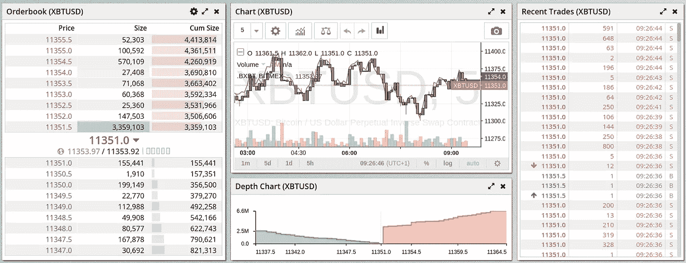
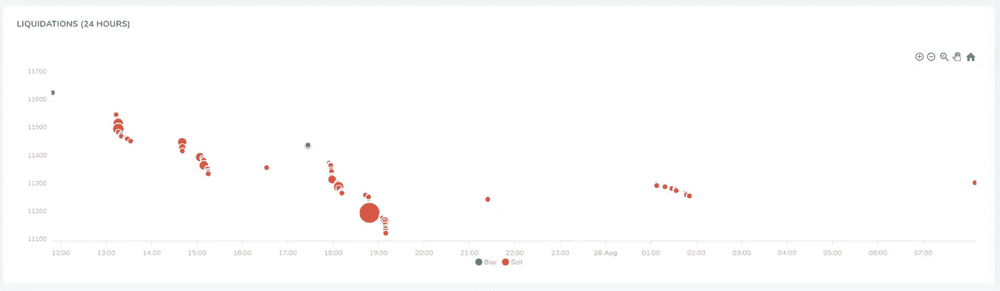
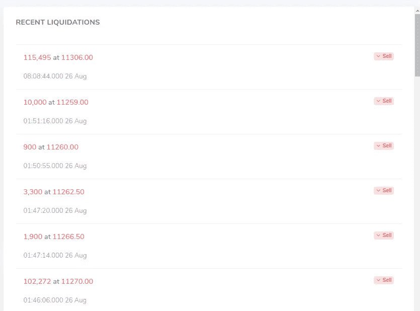

# 使用 BitMEX 清算数据预测比特币价格

> 原文：<https://medium.com/coinmonks/using-bitmex-liquidations-data-to-predict-bitcoin-prices-5d746bd01abb?source=collection_archive---------1----------------------->

## 价格级联、动量交易和实时数据

*更新:我们现在展示 3 家交易所(包括 BitMEX！)上我们联合订的书:*[*【coinlobster.com/combined】*](http://coinlobster.com/combined)*！*

BitMEX 是全球最大的加密货币交易所之一，每日名义交易额超过 20 亿美元。BitMEX 专注于期货合约，允许交易员建立加密货币的多头和空头敞口，即从价格上涨和下跌中获利。

你可能已经熟悉流行的 Twitter 账户的清算。在本帖中，我们将看看 BitMEX 的清算数据，它如何被用作预测未来价格的一个因素，以及获得这些数据的最佳地点。

The BitMEX Bitcoin/USD order book ([BitMEX.com](https://www.bitmex.com/app/trade/XBTUSD)/TradingView)

# 什么是清算，为什么会发生清算？

为了理解清算，我们首先需要看看杠杆。利用杠杆的能力是促使如此多的交易员使用 BitMEX 等期货交易所的特征之一。这是因为利用杠杆可以放大你的收益(或损失！)高达 100 倍，而无需增加您的风险金额。关于这是如何工作的更多信息，请看我们即将发布的关于比特币永久的帖子。

在一个正常的(“现货”)加密货币交易所，如果你在比特币上投资 100 美元，而[比特币](https://blog.coincodecap.com/a-candid-explanation-of-bitcoin)的价格上涨 10%，你就赚了 10 美元。在 BitMEX 这样的期货交易所，如果你用 100 美元做多 10 倍杠杆的比特币，价格上涨 10%，你就赚了 100 美元(10 x 10 美元)！以 50 倍的杠杆，你可以赚 500 美元。

这些交易的好处在于，你的损失一般不会超过你存入账户的金额(你的“保证金”)——上面例子中的 100 美元。

这就是清算的由来。

假设你用 100 美元做多 50 倍杠杆的比特币，价格下跌 10%。理论上，这意味着你会损失比你账户里更多的钱！交易所不会允许这种情况发生，而是会清算你的头寸——有效地创建一个平衡头寸的交易——你的余额将降至 0。

# 清算数据如何用于预测价格？

清算之所以如此有趣，是因为它们往往发生在波动性较高的时候，而且会引发连锁反应。想象一下，如果很多人在高杠杆的 BitMEX 上做多比特币，突然价格下跌。这将导致一些重大的理论损失，并可能导致一个人的头寸被清算，以阻止他们损失更多。这种清算实际上触发了订单簿上的卖单，导致价格进一步下跌。价格下跌会引发更多的清算，等等！

All BitMEX liquidation events over a 24 hour period ([coinlobster.com](https://coinlobster.com/liquidations.html))

这种平仓和价格波动的恶性循环意味着平仓在动量交易中是非常有价值的信号。看上面的图表，你可以看到清算事件经常以爆发的方式发生。红色表示卖出清算，绿色表示买入清算。x 轴是时间，y 轴是清算发生时的价格。有几次单独的抛售套现爆发，接着是更多的抛售套现，价格越来越低。

将这些数据纳入交易策略的一个简单方法是密切关注任何平仓，并在平仓事件发生时建立相同方向的头寸，利用随后的价格波动。

例如:一旦卖出清算发生，就建立一个空头头寸。等待价格下跌，然后平仓获利！当然，不能保证价格在平仓后会一直持续波动(正如你在上面的图表中看到的)，但当与其他信号结合时，这可能非常有力。

# 我在哪里可以得到清算数据？

虽然 BitMEX 通过他们的 API 发布清算信息，但交易者无法使用该网站。因此，我们 CoinLobster 正在消费这些数据，并在我们的 [BitMEX 清算页面](https://coinlobster.com/liquidations.html)上提供这些数据。除了上面显示的 24 小时视图和类似的 1 小时视图，还有一个实时反馈，显示清算发生时的情况:

Real-time BitMEX liquidations data ([coinlobster.com](https://coinlobster.com/liquidations.html))

这直接从 BitMEX 的 API 发布清算数据，对于任何寻找更多市场走向信息的交易者来说，都是一个有价值的工具！

我们希望这篇文章对你有用！请务必 [*订阅我们的邮件列表*](https://tinyletter.com/coinlobster) *以获取更多更新，并通过* [*电子邮件*](mailto:info@coinlobster.com) *或在*[*Twitter*](https://twitter.com/CoinLobster)*上让我们知道您想看的任何内容。*

关于 BitMEX Perpetuals 的清算数据和更多信息，请访问 coinlobster.com 的**。**

**【1】其实比这个稍微复杂一点……具体细节见* [*BitMEX 的 PNL 指南*](https://www.bitmex.com/app/pnlGuide) *。**

## *另外，阅读*

*   *最好的[密码交易机器人](/coinmonks/crypto-trading-bot-c2ffce8acb2a)*
*   *[密码本交易平台](/coinmonks/top-10-crypto-copy-trading-platforms-for-beginners-d0c37c7d698c)*
*   *最好的[加密税务软件](/coinmonks/best-crypto-tax-tool-for-my-money-72d4b430816b)*
*   *[最佳加密交易平台](/coinmonks/the-best-crypto-trading-platforms-in-2020-the-definitive-guide-updated-c72f8b874555)*
*   *最佳[密码借贷平台](/coinmonks/top-5-crypto-lending-platforms-in-2020-that-you-need-to-know-a1b675cec3fa)*
*   *[最佳区块链分析工具](https://bitquery.io/blog/best-blockchain-analysis-tools-and-software)*
*   *[加密套利](/coinmonks/crypto-arbitrage-guide-how-to-make-money-as-a-beginner-62bfe5c868f6)指南:新手如何赚钱*
*   *最佳[加密制图工具](/coinmonks/what-are-the-best-charting-platforms-for-cryptocurrency-trading-85aade584d80)*
*   *[莱杰 vs 特雷佐](/coinmonks/ledger-vs-trezor-best-hardware-wallet-to-secure-cryptocurrency-22c7a3fd391e)*
*   *了解比特币最好的[书籍有哪些？](/coinmonks/what-are-the-best-books-to-learn-bitcoin-409aeb9aff4b)*
*   *[3 商业评论](/coinmonks/3commas-review-an-excellent-crypto-trading-bot-2020-1313a58bec92)*
*   *[AAX 交易所评论](/coinmonks/aax-exchange-review-2021-67c5ea09330c) |推荐代码、交易费用、利弊*
*   *[Deribit 审查](/coinmonks/deribit-review-options-fees-apis-and-testnet-2ca16c4bbdb2) |选项、费用、API 和 Testnet*
*   *[FTX 密码交易所评论](/coinmonks/ftx-crypto-exchange-review-53664ac1198f)*
*   *[n 零审核](/coinmonks/ngrave-zero-review-c465cf8307fc)*
*   *[Bybit 交换审查](/coinmonks/bybit-exchange-review-dbd570019b71)*
*   *[3Commas vs Cryptohopper](/coinmonks/cryptohopper-vs-3commas-vs-shrimpy-a2c16095b8fe)*
*   *最好的比特币[硬件钱包](/coinmonks/the-best-cryptocurrency-hardware-wallets-of-2020-e28b1c124069?source=friends_link&sk=324dd9ff8556ab578d71e7ad7658ad7c)*
*   *最佳 [monero 钱包](https://blog.coincodecap.com/best-monero-wallets)*
*   *[莱杰 nano s vs x](https://blog.coincodecap.com/ledger-nano-s-vs-x)*
*   *[bits gap vs 3 commas vs quad ency](https://blog.coincodecap.com/bitsgap-3commas-quadency)*
*   *[莱杰纳米 S vs 特雷佐 one vs 特雷佐 T vs 莱杰纳米 X](https://blog.coincodecap.com/ledger-nano-s-vs-trezor-one-ledger-nano-x-trezor-t)*
*   *[block fi vs Celsius](/coinmonks/blockfi-vs-celsius-vs-hodlnaut-8a1cc8c26630)vs Hodlnaut*
*   *Bitsgap 评论——一个轻松赚钱的加密交易机器人*
*   *为专业人士设计的加密交易机器人*
*   *[PrimeXBT 审查](/coinmonks/primexbt-review-88e0815be858) |杠杆交易、费用和交易*
*   *[埃利帕尔泰坦评论](/coinmonks/ellipal-titan-review-85e9071dd029)*
*   *[SecuX Stone 评论](https://blog.coincodecap.com/secux-stone-hardware-wallet-review)*
*   *[BlockFi 评论](/coinmonks/blockfi-review-53096053c097) |赚取高达 8.6%的加密利息*