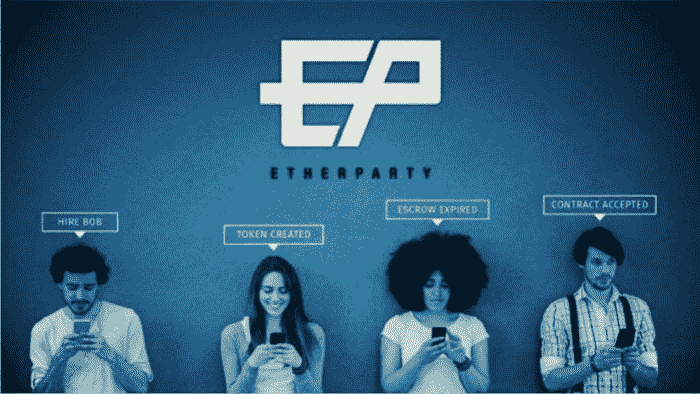

# 使用基于区块链的智能合同解决管理 IT 生态系统服务的问题

> 原文：<https://medium.com/coinmonks/using-blockchain-based-smart-contracts-to-solve-problems-in-administering-it-ecosystem-services-e50515d67b7c?source=collection_archive---------5----------------------->

正如我们今天所知，云计算是服务领域的一个巨大进步，从软件即服务(SaaS)到基础设施即服务(IaaS)和平台即服务(PaaS)，再到现在的一切即服务(XaaS)。

同样，企业正在通过基于使用的服务合同和 XaaS 提供商生态系统，进入软件定义的世界。

从 2016 年到 2020 年，全球 XaaS 市场将以近 40%的复合年增长率增长。一位高管称，XaaS 模式不仅是一种策略，也正在成为一种 T2 思维模式。

云为组织提供了一个产生新产品和服务的平台。牛津经济研究院的[研究显示](https://www.raconteur.net/technology/cloud-at-the-core-of-disruptive-business-models)，几乎 45%的公司已经按需购买信息技术(IT)来启动新的商业模式。

但是有一个问题。

## 合同管理不善的挑战

Everest Group 首席执行官 Peter Bendor-Samuel[分析了](https://www.cio.com/article/3199314/it-industry/blockchain-enabled-smart-contracts-solve-problems-in-administering-it-ecosystem-services.html)正在转向“即服务”生态系统的企业的合同问题。在他看来，这些合同是面向全有或全无的用法。

当一家公司希望根据使用情况和结果(即“即服务”模式)为服务付费时，它无法签订合适的合同。合同目前不够灵活，无法考虑不同的使用水平。他们不允许服务中断或服务暂停，因此，价格不能调整。因此，调整不会发生。

Bendor-Samuel 设想了一个解决方案:*智能合约*。

## 智能合约简史

早在区块链技术出现之前，美国密码学家和程序员尼克·萨伯就在 1996 年描述了智能合约的原理。但是由于缺乏合适的技术，这个概念仍然模糊不清。

然后，在 2008 年，比特币和区块链出现了，这是一种特殊类型的点对点数据库，提供安全、公开和可靠的交易记录。区块链允许输入新数据，并防止历史数据被修改。但区块链的潜力远不止确保同一枚比特币不会被花两次。它还允许用户“烹饪”信息，包括智能合同所需的精确指令。

事实证明，比特币区块链在执行商业规则方面并不理想。但是，22 岁的俄裔加拿大程序员 Vitalik Buterin 和他的程序员团队出现了。去年他们推出了以太坊，这是一种新型的区块链，为智能合约创造了一个平台。

今天，市场提供了许多允许使用智能合约的平台，但以太坊仍然是最广泛的平台之一。

## 解决方案:一个允许用户在任何兼容的区块链上创建智能合同的工具

对于 Bendor-Samuel 来说，区块链使生态系统能够作为一个生态系统对使用进行收费，而不是对单个提供商的服务进行收费。最令人兴奋的一个方面是总部位于区块链的智能合同。

例如，对于 IT 服务生态系统，智能合同将包括合同条款和条件以及绩效指标和处罚。然后，自动智能合同会持续监控、验证和实施这些性能条件。如果服务波动，合同将触发罚款(或其他特定条款)。它还可以自动支付。

***重要好处***

当公司开始使用智能合同时，他们将实现以下好处:

*   消除操纵或欺诈的风险
*   允许更快的工作流程
*   降低人为错误的可能性
*   放弃对第三方的依赖
*   降低服务成本
*   使交易对所有相关方透明
*   不再需要手动处理文档
*   进行手术时保证安全
*   减少纸张的使用
*   减少甚至消除对诉讼和法庭的需求
*   抑制中介的存在

***在开发基于区块链的智能合约的解决方案中需要寻找什么***

当寻求一种解决方案来帮助创建、使用和管理智能合同时，应考虑许多因素，包括:

**好用**。求一个不需要编程就能使用的解决方案。撰写智能合同应该像填写表格一样简单。

**启动您的合同**。正确的解决方案应该允许您创建一个针对各种行业的智能合同库。

**可定制的模板。**寻找一种解决方案，让您的合同草案始终可用并随时可以执行。

**持续安全测试**。理想的解决方案应该始终如一地成功阻止潜在的安全问题，这样用户才会信任平台。

**在云端工作**。尝试找到一个允许您从任何地方登录的解决方案。

**不需要其他工具**。确保解决方案不需要安装任何其他东西来运行智能合同。

**无需同步**。一个好的解决方案必须与网络协同工作，因此软件同步和执行合同不会有延迟。

**灵活性**。一个切实可行的解决方案必须允许合同各方能够在必要时为合同纠纷设立第三方调解人或仲裁人。

## 智能合同创建工具 Etherparty 允许用户在任何兼容的区块链上创建智能合同

[Etherparty](https://etherparty.com/) 是一个合同向导，它消除了在任何兼容的区块链上创建、管理和执行智能合同的复杂性。该平台允许对智能合同编程一无所知的用户为所有类型的交易创建可执行的数字协议。

该应用程序目前处于测试阶段，支持端到端的合同创建和部署到以太坊测试网络上。使用 Etherparty 应用程序，用户可以创建一些合同类型，包括 ERC20/ERC223 令牌创建、众筹和托管。

***以太党功能***

*   一个简单的合同建设者；不需要编码
*   跨许多区块链平台支持
*   访问我们的合同库和市场
*   全面响应的移动首个桌面应用

*以太党测试版目前上线。如果你想参加，请访问以太党* [*网站*](https://etherparty.com/) *报名。如果您需要更多信息，请致电 1–888–355–2976 或发送电子邮件至*[*media @ ether party . io*](mailto:media@etherparty.io)*。*

# 关于作者

*豪尔赫路易斯阿隆索克*。是作家兼记者。他为高科技行业撰写白皮书、文章和博客文章。他常驻阿根廷。