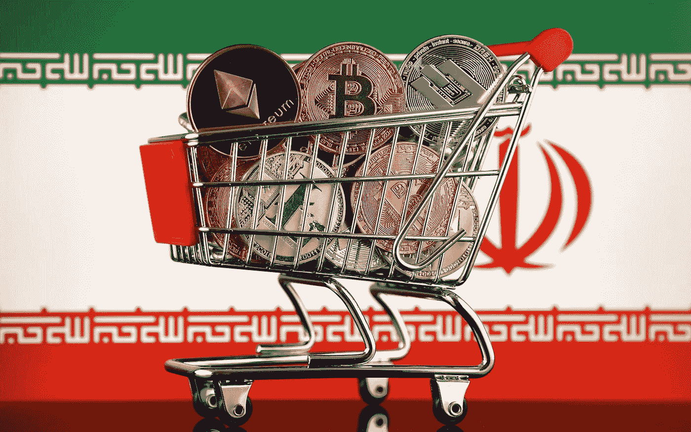
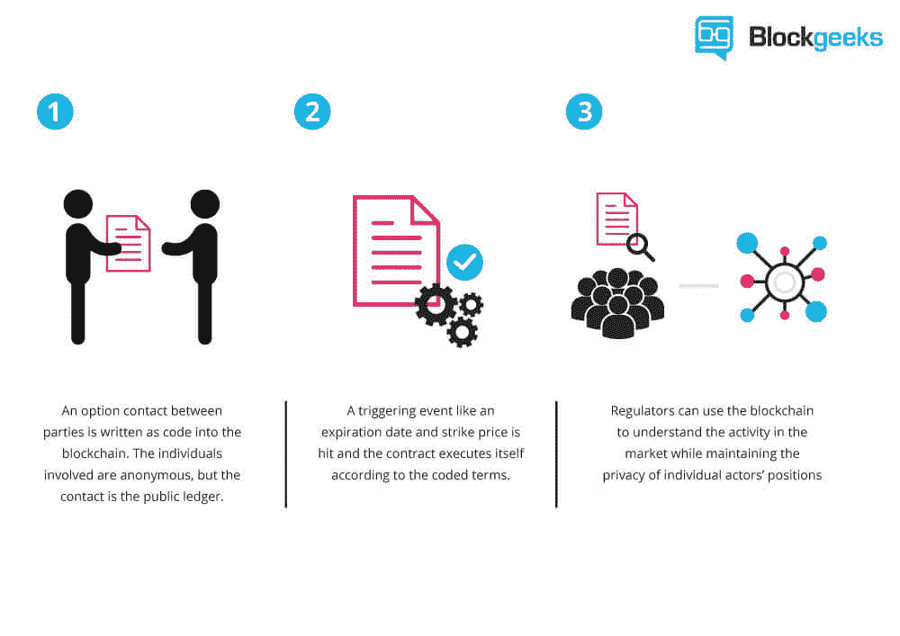
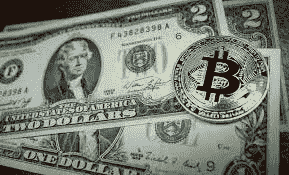

# 利用加密货币绕过制裁。

> 原文：<https://medium.com/coinmonks/using-cryptocurrency-to-bypass-sanctions-4a206b93c5f0?source=collection_archive---------5----------------------->

众所周知，制裁只会伤害穷人。对一个政府实施制裁以迫使其改变政策只不过是战争的前兆。它对执政的政府没有影响，它只影响那些需要被制裁的东西的人，药品，食物，生产中需要的原料，甚至是给小学生做铅笔的铅。制裁只不过是未能倾听、沟通和/或对弱势实体的欺凌行为。尽管如此，美国，这个邻居中最大的恶霸，将对伊朗实施迄今为止最严厉的制裁。

*“当我们结束时，这将是历史上最严厉的制裁，”*蓬佩奥说。*“伊朗政权多年来一直在整个中东地区作战。在我们的制裁完全生效后，它将努力保持经济活力。”*

谁在中东战斗了这么多年，蓬佩奥先生？你忘了美国已经在中东驻扎了 28 年了吗？当然，美国对伊朗政治的干预可以追溯到很久以前，但对于那些只从福克斯新闻频道或 CNN 获得信息的人来说，做一些研究，可以追溯到比 911 更早的时候。

因此，我们今天在这里，伊朗面临特朗普政府为迫使进一步变革、步调一致、屈从于美国政策而实施的新制裁。金融制裁，旅游制裁，原材料制裁，谁知道美国会实施什么。但是过去的制裁有一点已经改变了，那就是加密货币。

# 辞旧迎新。

匿名汇款的能力是加密货币的基础。你发送的任何加密货币的金额都是透明的，但对谁、为了什么、来自谁是匿名的，这是加密货币背后的一种力量。当然，如果你从网上交易所汇款，交易所有你的信息，它知道你是谁。像比特币基地、Gatehub 或北海巨妖这样的交易所有你的银行信息，有你的地址，有你的身份证和/或护照的扫描件，这使得匿名汇款变得更加困难，而且这只适用于个人。对于企业来说，他们需要更多。因此，即使交易所不知道你为什么发送密码，或者它是为了什么，他们也有基金转手的记录。然而，如果你有一个加密货币冷钱包，如 Jaxx 或其他众多的存在，那么，这改变了一些事情。你不再连接到一个记录你向谁发送了多少的交易所。因此，如果我是一家公司，位于一个被反对制裁的国家，我需要从外国公司购买一些原材料，我需要做的就是通过我的钱包给他们汇款，比特币，以太币，莱特币，CVcoin 等。由于钱包与我的个人信息无关，除了收款人，没有人知道我是谁，也不知道我为什么汇款。公司可以在没有政府监管的情况下互相做生意。

毫无疑问，我们会遇到一些问题，比如*“啊，我们从未收到你说你发送的比特币”，*当然，这可以通过区块链看到，但是没有法律追索权，当然，除非两家公司签订智能合同，我相信这将是未来的发展方向。不再有法定货币来做生意，只有加密货币和智能合约。将中间人、银行和政府完全排除在外，这是加密货币背后的真正原因。

一旦越来越多的公司开始接受加密货币作为支付形式，我们将看到美元作为全球储备货币的终结。我们还将看到公司保留更多利润，取消过高的银行交易费用，更快的资金转移，当然，你无法阻止一个人向另一个更自力更生的人发送加密货币。

**会发生这种情况吗？**如果美国对伊朗实施比以往更严厉的制裁，并惩罚那些继续与伊朗做生意的国家，我们会看到这种转变吗？会有更多的公司开始接受加密货币作为合法的支付形式吗？我们不必等待，它可以从你开始。下次你购物时，问*“你接受加密货币吗？”，*如果他们说不，接着问*“为什么不？”*。这都是关于教育的。自力更生。财务自由。会有转变，这不是如果的问题，只是什么时候的问题？