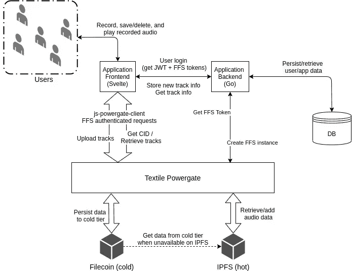

# 通过 Powergate 将 IPFS + FileCoin 用于分散式存储

> 原文：<https://medium.com/coinmonks/using-ipfs-filecoin-for-decentralised-storage-with-powergate-71ffe42f8c09?source=collection_archive---------2----------------------->

我正在使用 [FileCoin](https://filecoin.io/) 为一个我计划在 [HackFS](https://hackfs.com/) 期间开发的应用程序设计一个分散式存储模型。作为 Filecoin 的新手，我对如何有效地使用它来满足我的应用程序的存储需求有些疑问。

例如，我发现很难为我的应用程序设计一个基于存储交易的工作流。用户是否需要为每次新文件上传创建新的存储交易？我们需要订阅模式吗？如何续签即将到期的存储协议？

这是我偶然发现[纺织](https://textile.io/)的 [Powergate](https://docs.textile.io/powergate/) 。它似乎通过其 FFS (Filecoin 文件存储)模块回答了上述大部分问题，我立即想首先在一个支持以下功能的应用程序上测试它:

*   用户登录(为每个用户创建 FFS 实例)
*   允许用户录制音频
*   保存/删除录制的音频
*   从 IPFS 检索音频内容并播放。

为什么要采用这种基于特定音频内容的工作流程？稍后我会谈到这一点，以及如何使用 Powergate 实现这些功能；首先，我们需要对 Powergate 做一个简单的概述。

# Powergate 的(非常)简要概述

> Powergate 是一个 API 驱动的解决方案，用于跨 [Filecoin](https://filecoin.io/) 和 [IPFS](https://ipfs.io/) 部署多层存储。Filecoin 上的持久存储允许对数据进行丰富的存储配置，如复制因子、矿工选择、交易续订和维修

上述定义中的一个关键点是`multitiered`。基本上，Powergate 有热存储层和冷存储层，IPFS 节点充当热缓存层，Filecoin 充当冷持久层。

通过 Powergate 存储新数据包括将数据添加到热 IPFS 层，并将返回的 CID 的配置推送到 Filecoin。通过其 CID 识别的数据可以通过 Powergate 客户端从 IPFS 检索回来。如果 IPFS 上的 CID 不可用，可以在配置的超时后自动从 Filecoin 检索数据。

> 这是一个非常简短的概述。我鼓励你仔细阅读 Powergate 文档，寻找更好的想法。我在“进一步阅读”部分列出了一些帮助我开始阅读的资源。

# 那么如何在应用中使用 Powergate 呢？

当我浏览了 Powergate 文档后，为这个应用程序设计一个基本的设计就相对容易了。下图提供了设计和连接组件的概述。



High level design for an application using Powergate.

让我们从这个设计图中列出主要的交互组件。

*   一个苗条的前端
*   转到后端
*   PostgreSQL 数据库
*   Powergate devnet 实例(IPFS + Filecoin 支持的存储)

如图所示，前端和后端都需要直接与 Powergate devnet 实例进行交互。

那么为什么前端需要和 Powergate 交互呢？

*   保存录制的音轨(上传数据)
*   检索要播放的音轨数据(检索数据)

但是要向 FFS 发出这些上传和检索请求，我们需要包含一个 FFS 令牌进行身份验证。

我们从哪里得到这个 FFS 代币？

后端在接收到用户登录请求时，检查是否有任何 FFS 令牌与用户相关联。如果不存在这样的令牌，则向 Powergate 发送一个请求，请求**创建一个新的 FFS 实例**及其相应的 auth 令牌。用这个令牌更新 DB 上的用户模型，并用这个令牌响应登录请求。

## 创建新的 FFS 实例

*因为我使用 Go 作为这个应用程序的后端，所以我使用了* ***Powergate Go 客户端*** *来创建 FFS 实例。由于前端也向 Powergate 发出请求，我们也将在下一节看到我是如何使用 JS 客户机的。*

让我们看看登录处理程序中的一个代码块，它

*   发送创建 FFS 实例的请求，并且
*   用令牌更新用户模型

```
if len(u.FFSToken) == 0 {
    // create a new FFS instance for user
    _, ffsToken, err := u.FFSCreate() // ignore instanceID for now
    if err != nil {
        // handle error
    } u.FFSToken = ffsToken
    if err := h.userRepo.Update(u); err != nil {
        // handle error
    }
}
```

这是`FFSCreate()`的样子:

```
import (
    "github.com/multiformats/go-multiaddr"
    pow "github.com/textileio/powergate/api/client"
    "google.golang.org/grpc"
)func FFSCreate() (string, string, error) {
    ma, err := multiaddr.NewMultiaddr("/ip4/0.0.0.0/tcp/5002")
    if err != nil {
        // log error
        return "", "", err
    } client, err := pow.NewClient(ma, grpc.WithInsecure())
    if err != nil {
        // log error
        return "", "", err
    }

    ffsID, ffsToken, err := client.FFS.Create(context.Background())
    if err != nil {
        // log error
        return "", "", err
    } err = client.Close()
    if err != nil {
        // log error
    } return ffsID, ffsToken, err
}
```

好的，首先，powergate 客户端需要连接到服务 API(默认地址在`/ip4/0.0.0.0/tcp/5002`，并在上面的代码块中硬编码)。

一旦创建了客户端，`client.FFS.Create()`就会创建一个 FFS 实例并返回`ffsID`和`ffsToken.`

就是这样！

然后，我们可以更新用户模型，并用这个令牌响应登录请求。

## 持续音频轨道

一旦我们有了 FFS 令牌，我们就可以向 FFS API 发出经过身份验证的请求。

让我们首先创建 powergate 客户端并设置 FFS 令牌:

```
import { createPow } from "@textile/powergate-client";const pow = createPow({
    host: process.env.POW_HOST
});pow.setToken("some-ffs-token");
```

现在客户端已经设置好了，让我们继续将数据存储在 IPFS+Filecoin 上。这分两步进行—

**将数据添加到 IPFS 缓存并获取 CID(热上传)**

```
async function hotUpload(blob) {
    var audioBuffer = await blob.arrayBuffer();
    var input = new Uint8Array(audioBuffer);
    const { cid } = await pow.ffs.addToHot(input);
    return cid;
}
```

blob 已经包含了记录的音频数据，我将其转换为 Uint8Array 作为输入参数传递给`pow.ffs.addToHot().`

**推送对应于 CID 的配置，用于 Filecoin 上数据的持久性(冷上传)**

```
async function coldUpload(cid) {
    const { jobId } = await pow.ffs.pushConfig(cid);
    return jobId;
}
```

对应于这里的`cid`的默认配置决定了我们希望如何在 Filecoin 上保存内容。

例如，如果在热层中不可用，我们可以配置在特定的可配置超时后是否应该从冷层自动检索 CID 的内容。此外，我们可以配置复制系数、存储交易期限和自动续订。您可以在[默认配置](https://docs.textile.io/powergate/cidconfig/#cidconfig-details)中查看许多其他配置。

可以进一步观察`jobId`的工作状态更新。可以做类似下面的事情来观看一个`jobId.`(由于我在 JavaScript 方面的不足，我自己至今还不能正确地使用它)

```
// watch the FFS job status to see the storage process progressing
const cancel = pow.ffs.watchJobs((job) => {
  if (job.status === ffs.JobStatus.CANCELED) {
    console.log("job canceled")
  } else if (job.status === ffs.JobStatus.FAILED) {
    console.log("job failed")
  } else if (job.status === ffs.JobStatus.SUCCESS) {
    console.log("job success!")
  }
}, jobId)
```

## 从 IPFS 检索音轨

一旦音轨上传，我们还需要检索存储的数据，以便能够播放音频内容。下面的函数`getTrackContent()`以 Uint8Array 的形式检索对应于 CID 的数据，从中创建一个 blob 并返回本地 URL，该 URL 可以依次传递给一个音频元素以播放媒体。

```
async function getTrackContent(cid) {
    const audioBytes = await pow.ffs.get(cid);
    const audioBuffer = audioBytes.buffer;
    var blobOpts = { 'type' : 'audio/wav; codecs=0' };
    if (MediaRecorder.isTypeSupported("audio/wav;codecs=MS_PCM")) {
        blobOpts = { 'type' : 'audio/wav; codecs=MS_PCM' };
    }
    const blob = new Blob([audioBuffer], blobOpts);
    const url = URL.createObjectURL(blob);
    return url;
}
```

`pow.ffs.get()`尝试首先从 IPFS 缓存中检索对应于 CID 的内容，如果不可用，则在可配置的超时后从 Filecoin 获取内容。

总而言之，看起来 Powergate 确实让应用程序开发人员开始使用 Filecoin + IPFS 来满足他们分散的存储需求变得更加容易。期待在下个月的 HackFS 上探索更多，我将为寻找音乐的业余音乐家开发一个合作音乐平台！

# 进一步阅读/观看

*   [关于 Powergate FFS 的文档](https://docs.textile.io/powergate/ffs/)
*   C [为 cid 配置存储](https://docs.textile.io/powergate/cidconfig/)
*   Powergate [文档的 JS 客户端](https://textileio.github.io/js-powergate-client/)
*   转到 Powergate [文档的客户端](https://pkg.go.dev/github.com/textileio/powergate/api/client?tab=doc)
*   这篇[介绍性的博文](https://blog.textile.io/integrating-powergate/)由 Textile 在 JavaScript 客户端上发布
*   当然还有[这个由](https://www.youtube.com/watch?v=aiOTSkz_6aY)[安德鲁·希尔](https://medium.com/u/ff64f4a69e5a?source=post_page-----71ffe42f8c09--------------------------------)和[亚伦·苏图拉](https://medium.com/u/debfdff4580c?source=post_page-----71ffe42f8c09--------------------------------)为 Powergate 制作的介绍视频。

> [直接在您的收件箱中获得最佳软件交易](https://coincodecap.com/?utm_source=coinmonks)

[](https://coincodecap.com/?utm_source=coinmonks)