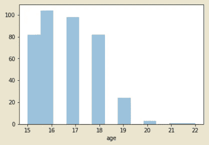
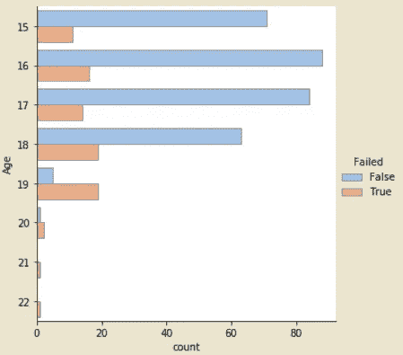
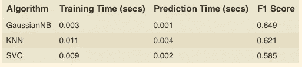

# 使用机器学习来决定哪些学生需要早期干预

> 原文：<https://medium.com/coinmonks/using-machine-learning-to-decide-which-students-need-early-intervention-8fedaf072f91?source=collection_archive---------5----------------------->

Schools are a place where we should build a safe environment for students to support their growth potential.

# 介绍

不同行业都有惊人的数据产品。一方面，过去通过工业革命或深度学习的最新进展，许多行业都被重塑了。另一方面，我们的教育部门在过去的几十年里使用相同的教学方法。这些年来变化不大，学生们通常得不到他们应得的帮助。至少，这就是我观察到的德国。

通常在学校，表现最差的学生得不到他们需要的帮助。我不知道这个问题的根本原因是什么，但我回到学校时也经历过同样的问题。这是另一篇博文的主题；).

在这篇博客文章中，我想通过使用机器学习来构建一个学生干预系统，数据集是由 udacity 在他们的一个纳米学位项目中提供的。

# 这是什么样的任务——分类还是回归？

在我们开始探索数据之前，我们首先需要定义项目的输出。让我们回忆一下这个任务:我们需要建立一个学生干预的模型。作为一名教师，我希望定期上传学生的数据，我想知道哪些学生需要干预。在这种情况下，如果他们需要干预或不需要干预，我希望收到一份学生名单(可能是他们的名字)和一面旗帜。基于这一观察，我们将构建一个分类模型。

# 数据是什么样子的？

这篇博文中使用的数据集包含关于学生的不同信息。具体而言，当前数据包括社会、人口和学校相关特征。此外，我们还有关于学生成绩的信息。数据集是通过使用学校报告和问卷从两所葡萄牙学校收集的。绩效评估的科目是物理和数学。还有一个“通过”标签，告诉学生考试是通过还是失败。总共有 395 个观察结果和 31 个属性。

# 让我们探索数据

让我们从数据探索开始。我们在这些步骤中的目标是以探索的方式更仔细地观察数据。我们将对数据进行分析和可视化。此外，在这一步，我们还应该了解数据的质量，即:

1.  是否缺少值？

2.数据类型？

3.我们需要清理数据吗？

我们将逐步回答这些问题。但首先让我们看看数据的一些属性。

我们首先仔细观察的是学生的年龄。较年轻的学生是 15 岁，而较大的学生是 22 岁。大多数学生年龄在 15 到 18 岁之间。19 岁及以上的学生在学校不太常见。他们在所有学生中占少数。我可以想象这些学生在一些课程中失败了，这可能是为什么我们在数据集中有一些样本的原因。

Age of the students

幸运的是，有一个名为 failures 的属性描述了失败类的数量。该属性的值可以是 0、1、2 和 3。这个数字指的是不及格班级的数量。正如我们在下图中看到的，在每个年龄组中，我们都有不及格的学生。非常有趣的是，大多数 19 岁以上的学生都有一门课不及格。这些群体中只有少数学生没有任何一门课不及格。

Failed/passed class by age

我给你看了两个可视化的例子。在这一点上，我不想深入探究，因为有很多可能性可以更详细地探究这个数据集。如果你对更多的观想感兴趣，就看一看笔记本。

通过探索性分析，我们对数据集有了更多的了解。现在，是时候回答本节的问题了:

1.  是否存在缺失值？在探索过程中，我没有注意到数据中有任何缺失值或 nan。我认为数据集之前被 udacity 清理过。
2.  数据类型？在数据集中，我们有二进制，名义和数字属性。二进制的一个例子是“性别”属性。该属性的值“F”表示女性，值“M”表示男性。名词的一个例子是属性“Mjob ”,它指的是学生母亲的工作。这一属性分为"教师"、"健康"、"公务员"、"在家"和"其他"等类别。数字属性的一个例子是学生的“年龄”。
3.  我们需要清理数据吗？我们不必清理数据，因为没有缺失值和异常值。但是，在训练一个算法之前，还有一些工作要做。这项工作是指特征处理。二进制数据和标称数据都必须编码成数值。我们将在下一节探讨这一点。

# 数据的准备

这一节讨论数据的准备。我们将讨论名义数据和二进制数据的特征处理。对于分类数据，我们通常需要进行某种编码。

我们有 30 个特征属性和 1 个目标属性。

*   **数字属性:**年龄、旅行时间、学习时间、故障、famrel、空闲时间、goout、Dalc、Walc、健康、缺勤
    因为这些属性有一个数字表示，所以我们不需要应用任何类型的转换。
*   **二进制属性:**，学校，性别，地址，famsize，schoolsup，famsup，已付，托儿所，高等，互联网，浪漫，通过
    二进制属性有值“是”或“否”。我们将把“否”转换为 0，把“是”转换为 1。
*   **名义属性:** Mjob，Fjob，reason，gurdian
    对于名义属性，我们有很大范围的可能值。pandas 框架提供了方法 [get_dummies()](http://pandas.pydata.org/pandas-docs/stable/generated/pandas.get_dummies.html?highlight=get_dummies) 。这个方法将把一个名义属性的每个值转换成一个新列。例如，属性 guardian 具有值“母亲”、“父亲”和“其他”。通过应用此方法，我们将添加新列“监护人 _ 母亲”、“监护人 _ 父亲”和“监护人 _ 其他”。新列的值是二进制的。

属性转换后，我们总共有 48 个属性。下一步是将数据分成训练和测试。数据集被分成 75%训练和 25%测试。我用的是 sklearn 框架的 [train_test_split](http://scikit-learn.org/stable/modules/generated/sklearn.model_selection.train_test_split.html) 方法。

# 型号选择—哪种型号的性能最好？

有三个机器学习算法，我们应该训练和相互比较。首先，我将描述算法，其次，我将开始训练和比较它们:

1.  **朴素贝叶斯**是一种分类算法，使用贝叶斯定理背后的概率将输入分类为某个输出。通过使用参数估计最大似然法来训练模型。
    朴素贝叶斯的一个优点是，与其他机器学习算法相比，它只需要少量的数据来估计分类参数。
    朴素贝叶斯的最大缺点是当某个类别标签没有出现时，因为这将导致计算出的概率为零。这是由给定的条件独立性假设推理出来的。当一个零概率乘以其他概率时，结果将是零。
2.  **K 近邻(KNN)** 用于分类和回归。将输入与 k 个最近的邻居进行比较，以定义输出。所有功能都被同等对待。因为存在某些标记数据的区域，所以它对有噪声的训练数据非常鲁棒。这也可以通过加权距离来改善。当我们有很多特征并且被提供了足够的数据(维数灾难)时，KNN 是非常有效的。在训练 KNN 之前，我们必须决定最近邻的数量。在运行时环境中，与其他算法相比，这是一种非常昂贵的算法，因为每个查询都必须计算。
3.  **支持向量机(SVM)** 是一种监督机器学习算法，用于分类和回归任务。底层技术是内核技巧，它将数据转换成可能输出的边界。边界取决于所使用的核是线性的还是非线性的。一方面，非线性边界有利于更复杂的数据关系。另一方面，训练集的计算确实具有较高的等待时间。该算法在高维空间中非常有效，因为它能够模拟复杂的关系。如果数据集中特征的数量远大于样本的数量，SVM 的性能将会很差。这种限制是由于内核的选择。如果我们有复杂的数据关系，SVM 做得非常好。它的行为有点像黑匣子，因为很难解释边界平面。

我使用 sklearn 来训练和测试模型。我们将使用高斯神经网络作为朴素贝叶斯的实现。对于 KNN，我们使用的邻居大小为 5。对于 SVM，我们使用 sklearn 提供的支持向量分类器(SVC)。

我们对不同的指标感兴趣，如训练时间、预测时间和 F1 分数。F1 分数是精确度和召回率的调和平均值。如果您从未听说过 F1 分数，那么知道 F1 分数越接近 1.00，模型就越好，这一点很重要。想了解更多信息，我建议看看这篇[维基百科文章](https://en.wikipedia.org/wiki/F1_score)。下表显示了算法的训练和测试结果。

Results

GaussianNB 训练的模型在测试数据上具有最好的 f1 分数。其次是 KNN 模式。SVC 在测试数据上表现最差。所有算法的训练和预测时间都非常短。根本原因是我们使用的数据样本数量少。如果我们改进数据大小，我们可能会提出关于训练和预测时间的相同顺序的算法。

# 吸取的教训和展望未来

在这篇博文中，我们了解了很多关于机器学习及其广泛应用的知识。我们探索了关于学生表现的简单数据集，包括社会、人口统计和学校相关特征。基于这个数据集，我们做了一些转换，并建立了一个模型，该模型被训练来预测对学生的帮助。

关于机器学习，我们也可以尝试其他算法来比较结果。例如，我们可以使用决策树或神经网络。此外，我们可以寻找其他数据集，并将它们与现有数据相结合。

现在，我们可以构建一个服务，教师可以使用它来预测哪些学生需要更多的帮助。在今天的课堂上，每个老师都很难与学生建立深厚的关系。通过使用数据和这样一个系统，老师可以花更多的时间和那些在学校表现不好的学生在一起。是时候给教育部门带来更多的创新了！

> 如果你对源代码感兴趣，不要犹豫，看看我在 github 的[库](https://github.com/naxty/student_intervention_blog)。

*我希望你喜欢阅读这篇文章。我感谢评论中的任何反馈。祝您愉快！尼科*

> [在您的收件箱中直接获得最佳软件交易](https://coincodecap.com/?utm_source=coinmonks)

