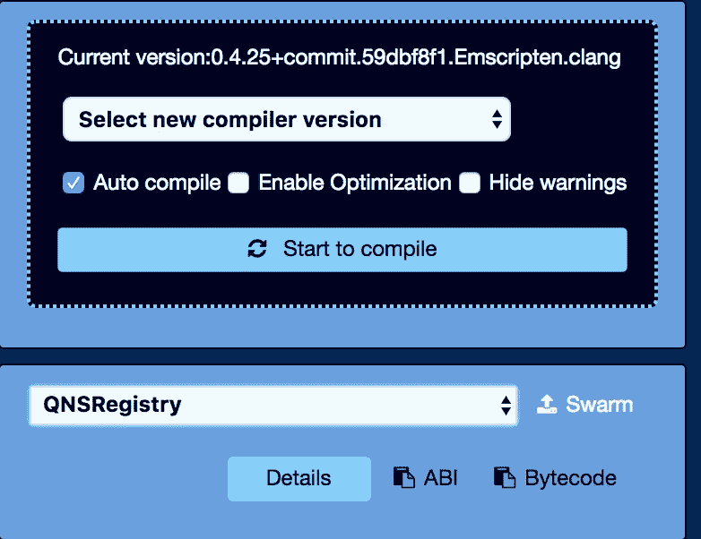

# 使用 Mallet 在 KEVM 上部署 Solidity 智能合约

> 原文：<https://medium.com/coinmonks/using-mallet-to-deploy-solidity-smart-contract-on-kevm-2ffc1113bbf7?source=collection_archive---------6----------------------->


在阅读这篇文章之前，你需要阅读[这篇](/@johnnyhsieh/cardano-install-mallet-to-deploy-and-interact-with-smart-contract-on-iele-testnet-fe7972e1caf8)才能继续。

# 用 KEVM 测试网连接

`$ ./mallet kevm`

在使用 mallet 在 KEVM 上部署您的智能契约之前，我们需要字节码。

获取字节码最简单的方法是使用 RemixIDE，将你的 solidity 代码粘贴到 Remix IDE 上。

点击左边的编译器，选择复制字节码。



将字节码粘贴到 mallet 上。

```
$ mallet > byteCode = {"object":"your byte code here"}
​
​
​
$ mallet> contract = byteCode.object
​
​
​
$ mallet> tx = {
​
gas: 5000000,
​
data: contract
​
}
​
​
​
$ mallet > tx_Hash = sendTransaction(tx)
​
​
​
$ mallet > getReceipt(tx_hash)
```

你可以走了: )