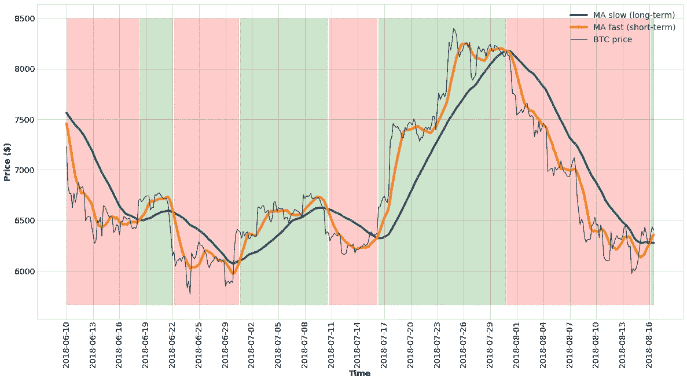
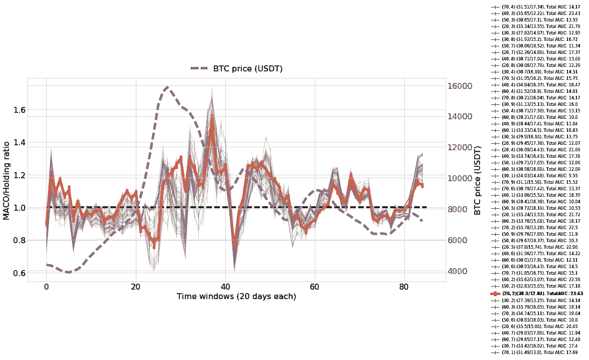
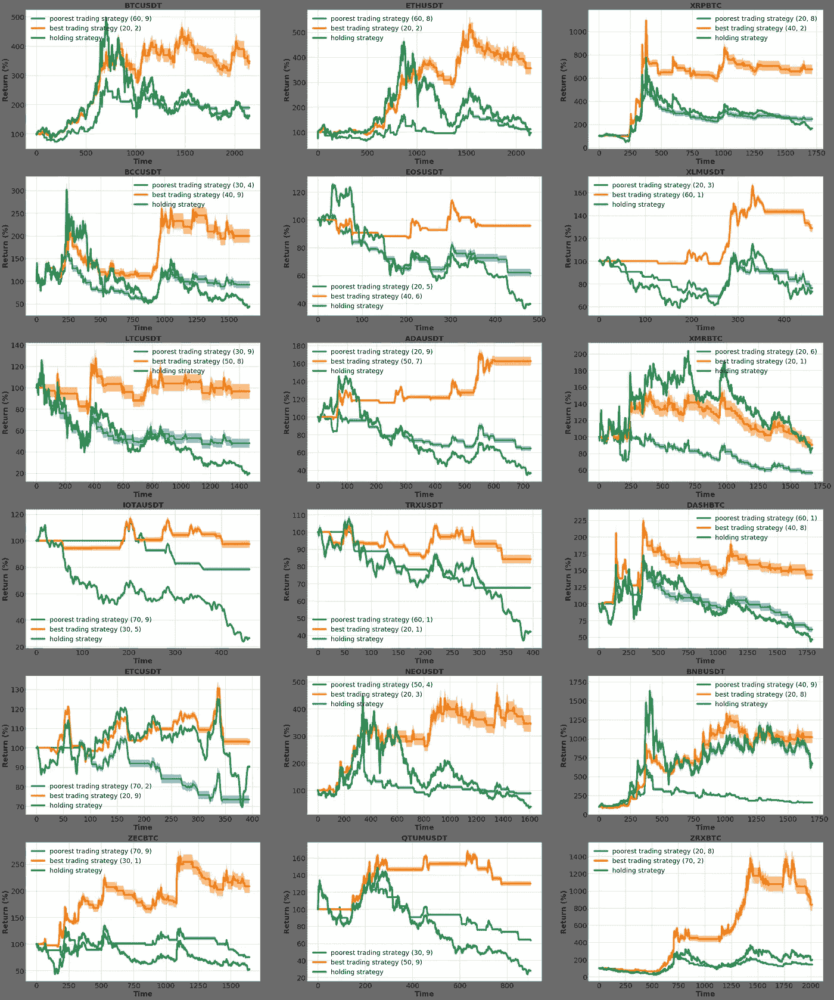

# 在加密货币交易中使用移动平均交叉策略

> 原文：<https://medium.com/coinmonks/using-moving-average-cross-over-as-strategy-in-cryptocurrency-trading-57061d4f1bdc?source=collection_archive---------2----------------------->

## 熊市趋势中的制胜方法[2019–2020]

## 摘要

在交易中，我们经常倾向于依赖过于复杂的策略，这种策略过度承诺收益并降低风险。然而，找到平衡交易策略的关键是简单。在这篇文章中，我们介绍了一个著名的，简单而有利可图的策略，称为移动平均交叉(MACO)的前 18 名加密货币交易的系统回测。在我们的研究中，我们筛选短期和长期移动平均线的最佳组合，并为潜在的自动策略奠定基础。具有最优参数的 MACO 报告(a)在 18 种加密货币中的 10 种中投资超过 50%的利润，(b)在 18 种加密货币中的 16 种中超过 100%的美元回报(无价值损失),以及(c)在 18 种情况中的 17 种中表现优于“持有”。

## MACO 战略

移动平均线交叉交易策略相当简单。我们计算两个不同的移动平均线(MA):一个长，一个短。多头代表市场的整体趋势:要么看涨(上涨时)，要么看跌(下跌时)。短期债券代表更直接的价格波动，当价格变化时反应更快。现在，当快速移动平均线穿过慢速移动平均线时，我们检测到趋势的潜在变化。作为交易者，我们可以利用趋势的变化，当趋势变得看涨时买入，当趋势变得看跌时卖出。这些概念在以下 BTC-USDT 贸易对的示例中有所体现。

> 另请阅读:[最佳加密交易机器人](/coinmonks/crypto-trading-bot-c2ffce8acb2a)

在前面的例子中，当快速移动平均线越过慢速移动平均线(绿色区域)时我们买入，当快速移动平均线低于慢速移动平均线(红色区域)时我们卖出。到目前为止一切顺利。

## 连续交易窗口的 MACO 表现

正如我们在前面的例子中看到的，MACO 在外观上非常简单。实际上有点复杂，因为我们必须找到长短均线的成功组合。我们可以在回顾中解决这个问题的一个方法是尝试所有或一组有代表性的组合，看看哪些组合在过去的数据中表现得更好(也称为回测)。

有不同的方法来评估每个短/马龙组合的性能。对于这种分析，我们已经决定采用 20 天的窗口(20*6 根 4h 蜡烛线)，并沿着时间轴以 4 天的跳跃移动它们(4*6 根 4h 蜡烛线)。对于每个窗口，我们计算了:

**(a)** 根据交叉盘和交叉盘分别买入和卖出的前述 **MACO** 策略的投资回报。

**(b)** 遵循**“持有”**策略的投资回报，即在窗口开始时买入，在窗口结束时卖出。

对于每个窗口以及长期均线(4h 的 20、30、40、50、60、70 蜡烛线)和短期均线(4h 的 1、2、3、4、5、6、7、8、9 蜡烛线)的每个组合，计算两者之间的比率(MACO/持仓)。BTC-USDT 组合的结果如下:

超过 1 的线/模拟意味着，例如，MACO 策略比在那个特定窗口持有多 1.2 (20%)的利润。右边的图例显示了所有长/短移动授权的组合(第一个括号)。BTC 的价格作为参考。

尽管所有的多头/空头均线组合似乎都遵循相似的模式，但显然有赢家和输家。为了辨别最佳策略，我们计算了高于 1(正 AUC)的曲线下面积(AUC)和低于 1(负 AUC)的曲线下面积。最后，特定 MAs 组合的盈利能力可以计算如下:

**Total _ AUC**= MA*_ 正* - MA_ *负*

正的总 AUC 意味着遵循 MACO 策略比平均持有要好。具有最大*总 AUC* 的空头/马龙组合以红色显示。个人*总 AUC*可在图例上找到。

最后说两句。首先，注意每个模拟或预测回报都有一个相关的误差线。这是因为，为了更现实，一旦策略告诉我们买入或卖出，我们使用一个随机价格，包含在下一根蜡烛线的开盘价和收盘价之间。此外，对于每笔买卖，我们会考虑 0.1%的佣金。

其次，请注意，在指数增长期间，没有任何组合是特别有利可图的，比如 BTC 在 2017 年底经历的那种情况。在这种情况下，持有显然是最好的策略。然而，请注意，当市场进入一个侧面或熊市趋势时，交易成为一个方便的工具，通过对冲下跌趋势来实现利润最大化。这在本文中显示的以下图表中变得更加明显。

## 在 18 种加密货币中筛选有利可图的 MACO 多头/空头组合

在最后的分析中，我们将前面章节中介绍的技术应用于币安加密货币交易所交易量最高的 18 种加密货币。特别是，我们运行了前面的分析来检测最佳和最差的多头/空头 MA 组合，并按照 MACO 策略运行了 1000 次不同的模拟，以在一年的时间内使用 4h 烛台买卖加密货币。这些是结果:

从图中我们可以得出结论，具有最佳参数的 MACO 产量:

**(a)** 投资 18 种加密货币中的 10 种，利润超过 50%，

**(b)**18 种密码中有 16 种的美元回报率(无价值损失)超过 100%(这意味着在下跌趋势中交易对对冲基金有利)，以及

**(c)**18 例中有 17 例表现优于“保持”。

最后，表现最好的加密货币对是 ZRXBTC 对，回报率超过 800%。有趣的是，排名前三的加密货币也特别有利可图。

**结论和个人意见**

*   移动平均线交叉是一个简单而有利可图的策略。
*   使用回溯测试来查看哪一个是有利可图的多头/空头 MA 组合，可以让我们很好地了解什么在过去有效，什么在未来有效，但没有什么保证。
*   MACO 策略可用于交易加密货币，但可能在与其他指标结合使用时效果最佳。我个人使用价格行为作为确认指标。
*   MACO 似乎对目前排名前三的加密货币(BTC、瑞士联邦理工学院、XRP)非常有效。
*   在任何情况下，有一个可靠的交易策略都是一个好的实践，除了在暴涨和抛物线增长的时候。

*这个项目是我们在*[*crypto datum . io*](https://cryptodatum.io)*研究的一部分，这是一个加密货币数据 API，旨在提供即插即用的数据集来训练机器学习算法。如果您喜欢我们在本文中展示的数据，您可以在*[*https://cryptodatum . io*](https://cryptodatum.io.)获得免费的 API 密钥并亲自使用它

## 另外，阅读

*   [最佳加密交易机器人](/coinmonks/crypto-trading-bot-c2ffce8acb2a)
*   [德里比特评论](/coinmonks/deribit-review-options-fees-apis-and-testnet-2ca16c4bbdb2) |选项、费用、API 和测试网
*   [FTX 密码交易所评论](/coinmonks/ftx-crypto-exchange-review-53664ac1198f)
*   最好的比特币[硬件钱包](/coinmonks/the-best-cryptocurrency-hardware-wallets-of-2020-e28b1c124069?source=friends_link&sk=324dd9ff8556ab578d71e7ad7658ad7c)
*   [密码本交易平台](/coinmonks/top-10-crypto-copy-trading-platforms-for-beginners-d0c37c7d698c)
*   最好的[加密税务软件](/coinmonks/best-crypto-tax-tool-for-my-money-72d4b430816b)
*   [最佳加密交易平台](/coinmonks/the-best-crypto-trading-platforms-in-2020-the-definitive-guide-updated-c72f8b874555)
*   最佳[加密贷款平台](/coinmonks/top-5-crypto-lending-platforms-in-2020-that-you-need-to-know-a1b675cec3fa)
*   [莱杰 vs 特雷佐](/coinmonks/ledger-vs-trezor-best-hardware-wallet-to-secure-cryptocurrency-22c7a3fd391e)
*   [Bitsgap 评论](/coinmonks/bitsgap-review-a-crypto-trading-bot-that-makes-easy-money-a5d88a336df2)——一个轻松赚钱的加密交易机器人
*   [Quadency Review](/coinmonks/quadency-review-a-crypto-trading-automation-platform-3068eaa374e1) -专为专业人士打造的加密交易机器人
*   [PrimeXBT 审查](/coinmonks/primexbt-review-88e0815be858) |杠杆交易、费用和交易
*   [HaasOnline 评论](/coinmonks/haasonline-review-d8d1a3400419)享受九折优惠
*   Bitmex 的[保证金交易指南](/coinmonks/the-idiots-guide-to-margin-trading-on-bitmex-dbbd7742c6fc?source=friends_link&sk=7bfa99d2a181142510c8442c8ddb0786)
*   [eToro 评论](/coinmonks/etoro-review-78807ddeb33c) |交易股票、密码、交易所交易基金、差价合约和商品
*   [Bitmex 高级保证金交易指南](/coinmonks/bitmex-advanced-margin-trading-guide-2270c195ce25?source=friends_link&sk=1d986cca731f5084b9a2db4a4bc4a7ad)
*   [开发人员的最佳加密 API](/coinmonks/best-crypto-apis-for-developers-5efe3a597a9f)
*   [加密套利](/coinmonks/crypto-arbitrage-guide-how-to-make-money-as-a-beginner-62bfe5c868f6)指南:新手如何赚钱
*   顶级[比特币节点](https://blog.coincodecap.com/bitcoin-node-solutions)提供商
*   最佳[加密制图工具](/coinmonks/what-are-the-best-charting-platforms-for-cryptocurrency-trading-85aade584d80)
*   了解比特币的[最佳书籍有哪些？](/coinmonks/what-are-the-best-books-to-learn-bitcoin-409aeb9aff4b)

> [直接在您的收件箱中获得最佳软件交易](https://coincodecap.com?utm_source=coinmonks)

