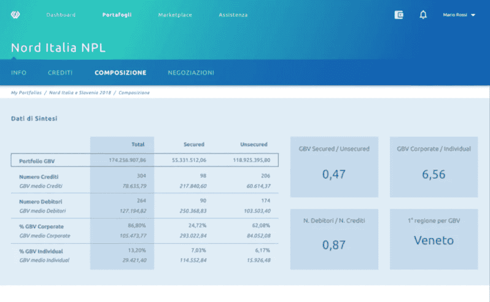
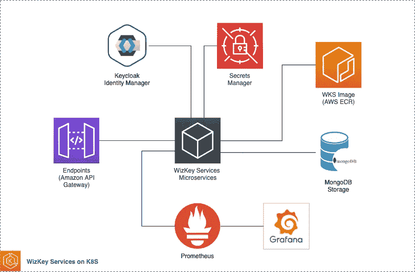
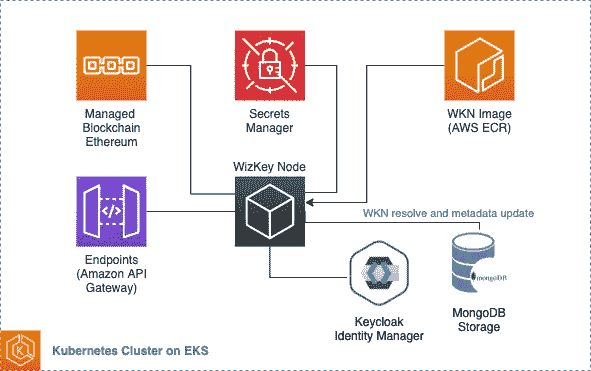
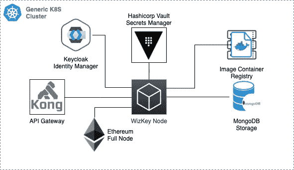
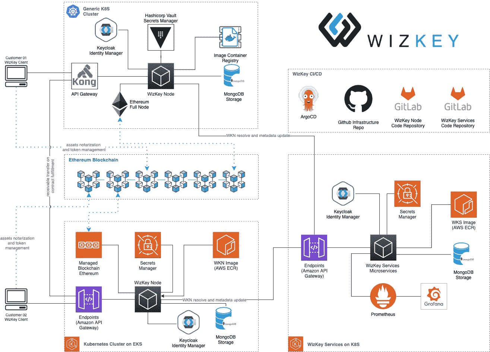

# 使用 NFTs、以太坊和 AWS 重新定义应收账款市场

> 原文：<https://medium.com/coinmonks/using-nfts-ethereum-and-aws-to-re-define-the-receivables-market-3c3a3d7e74f?source=collection_archive---------4----------------------->

## 云和区块链为混合的链上和链下应用程序提供了可伸缩性和可靠性

## 深入探究 WizKey 架构，利用 NFT 和分散式应用程序来确保可追溯性和可问责性

Photo by [Pierre Borthiry](https://unsplash.com/@peiobty?utm_source=unsplash&utm_medium=referral&utm_content=creditCopyText) on [Unsplash](https://unsplash.com/?utm_source=unsplash&utm_medium=referral&utm_content=creditCopyText)

在过去的十年中，区块链技术在很短的时间内从一个概念验证发展成为一个投机性的资产推动者，并成为一个成熟的解决方案。虽然加密货币代表了赌博的一种奇特替代方式，但底层技术不断发展，以克服内在限制并找到有意义的应用。在最初大肆宣传让一切都成为去中心化应用之后，许多项目未能进入市场，而其他采用更实用方法的项目随着时间的推移稳步增长。

**wiz key DeFiNe****【WK】**旨在让信贷市场恢复价值，利用区块链推动信任和可靠性。应收款是通常在双方之间私下交易的金融资产。当某人借钱购买货物(即房屋)时，限定该贷款的已签署合同是最常见的应收款类型。虽然没有法律和金融专业知识的人很难理解信贷市场的广阔前景，但我们可以考虑一个简单的贷款组合。

在各方之间交换应收款通常是一个不受监管的过程，需要卖方准备投资组合的描述(通常，信用从不单独交易)，将其发送给潜在的买方，签署一些法律文书，开放对信用基础合同和信息(如抵押贷款计划或信用票据)的访问，然后就投资组合的价格和组成进行谈判，并最终完成支付和应收款交易到最终目的地。

传统上，这一流程由许多法律团队管理，他们交换数字化程度很低的文件版本，然后准备具有法律约束力的合同，以确保在一定程度上防范不确定性和缺乏信任。通常，应收信息管理不当，并在交易过程中丢失，使机构无法信任他们收到的关于信用评级的足够信心的数据磁带。这种信息不对称极大地影响了整体金融业务，对建立在应收账款基础上的金融产品产生了多米诺骨牌效应:其系统性影响在 2008 年次级债券危机中变得非常明显。

接下来是 WizKey DeFiNe，这是一个软件即服务平台，旨在通过混合链上和链下方法为应收账款管理提供一个强大的基础。每笔应收款都以其合格文档开始:一套包含塑造信贷性质的信息的 pdf。在协商过程中，稍后会添加其他文件。

在 DeFiNe 中，所有的动作都是由 **WK 客户端**发起的。客户的职责是充当定义平台的入口点。

A screen representing WizKey client console

WizKey 客户端编排 WizKey Define 的三个主要组件:WizKey 服务、WizKey 节点和以太坊区块链。

## WizKey 客户端控制台(WKC)

WizKey Client Console(或简称“控制台”)是一个跨设备桌面应用程序，采用 Electron and React framework 构建，是一个面向客户的应用程序，致力于支持和协调 WizKey 内的所有应收款管理操作。新用户按照配置向导设置新的以太坊钱包和系统凭证。然后，一旦用户链接到特定的 eth 地址，控制台就可以创建新的可接收实体并将文档上传到 WizKey 节点。当一个新文档被上传到客户端时，它的哈希在以太坊区块链上被计算和公证，然后它的收据和 PDF 文件以及描述元数据被发送到 WizKeyNode。

一旦应收账款资格信息被提供给节点，用户就构建最终的实体，与以太坊智能合约交互，该合约将文档散列存储在 ERC-721 不可替换令牌内，并发送回客户的钱包，表示应收账款所有权的数字化版本。让这些操作直接通过控制台与以太坊的交互来执行，确保了它们的可靠性和时间认证。

所有谈判步骤都通过控制台进行管理，允许感兴趣的买家探索拟议的应收款，签署 NDA 协议(也在区块链上公证)，并通过区块链问答公证信息定义相关交易信息。

最后，当双方同意继续完成合同时，控制台将应收 NFT 转移到管理履行操作的托管智能合同，然后通知他们的相关 wkn 继续进行相关的文档转移。中央 WizKey 服务全局维护节点路由指针表。

## 威奇服务(WKS)

初始步骤指导用户配置客户端。用户被要求配置和设置一个新的身份，该身份由处理所有区块链的以太坊钱包和进入全球 WizKey 服务域的认证凭证组成。

WizKey Services architecture on AWS, leveraging AWS Secrets Manager and Prometheus/Grafana

WizKey 服务提供了一个 API 层，展示了管理特定域、添加、授权和撤销凭证的能力。该组件由一组 Kubernetes 微服务组成，通过 Neosperience Cloud Services(以前的 Mikamai)技术部署在 AWS EKS 上。每一个微服务都通过亚马逊 API 网关和 AWS Web 应用防火墙暴露出来，保证安全性和可扩展性。Keycloak 集群部署使用 OAuth2 标准实现为离线服务提供身份管理。MongoDB 利用 Mongo Atlas 中的云部署，是每个微服务用来存储用户身份元数据和 WizKey 节点实例指针的首选持久性模型。

## WizKey 节点(WKN)

这些组件特别注重便携性，为每个客户的应收账款提供专用存储，并完全控制敏感的文档数据。这是 WizKey 平台中的一个焦点，因为它确保原始数据(即 PDF 文档和安全数据磁带)永远不会移出客户域边界。即使是 WizKey 也不需要信任。我们从来没有任何与应收款相关的信息，只是它位于何处，在 WKS 内存储节点指针，但任何敏感数据。

每个 WKN 都直接连接到以太坊完整节点，以验证收据并检查客户端发送的在区块链上散列的相同数据。此外，在所有应收帐款协商中，该节点设法验证操作。

WizKey Node AWS deployment. Each node is dedicated to a single end-customer.

WizKey 的客户范围从银行到金融机构，并提供了一系列可能的不同基础设施。这意味着 WizKey 必须选择同类最佳的技术来确保部署的可移植性。节点有两种部署风格:内部部署和托管部署。相同的功能覆盖范围由等效的本地工具提供，例如用于 API 层的 Kong 和 Hashicorp Secrets Manager。

WizKey Node on-premise deployment. Services scalability and high availability are the customer’s duties when nodes are deployed on-premise.

在过去几年中，Neosperience Cloud Services(以前的 Mikamai)构建了一种技术，可以通过 GitOps 支持可互换的服务接口来支持 Kubernetes 的部署、管理和行政。这允许 WizKey 管理不同集群配置中的节点部署。此外，共享、托管的 Keycloak 身份管理器可确保用户在不同的域中获得授权。

## 完整的建筑景观

WizKey 实现了混合的多云和链上链下架构，以提供跨不同部署选择的功能。该架构的核心组件由以太坊区块链代表，通过亚马逊管理的区块链烘焙完整节点或内部节点管理来处理。以太坊是我们交易和分布式账本的支柱，确保可问责性和防篡改性。不过，它的参与更进一步，因为将应收账款作为非金融票据进行转移意味着每一项操作都可以被跟踪、审计，并且是不可撤销的，因此是确定的和真实的。选择像以太坊这样的全球性区块链代表了一种保证，即这个过程是不受审查的。

WizKey Nodes, Services, and Client architecture and their relation to the ethereum blockchain.

在过去的三年中，WizKey 面临着几个常见的分散应用问题，如区块链吞吐量、第二层网络上的监管约束部署、以太坊费用以及产品开发期间的多链采用。必须做出许多架构选择，以确保在考虑约束的同时获得最佳解决方案。我们将在下一篇文章中介绍其中的一些，展示 WizKey 如何设法让这个架构为其客户的生产做好准备。

我的名字是卢卡·比安奇。我是 **AWS 无服务器英雄**和**首席技术官**at[**Neosperience**](https://www.neosperience.com/)**和 [**WizKey**](http://www.wizkey.io) 。近十年来，我一直在 AWS 上为大规模生产工作负载构建软件架构。**

**[**wiz key****DeFiNe**](https://www.wizkey.io/en)是一个从根本上改善应收账款市场、降低运营成本并最大化任何投资组合价值的平台。**

**[**Neosperience 云服务**](https://www.neosperience.com/) **(原**[**mika mai**](https://www.mikamai.com/)**)**是 Neosperience 专业服务业务部门，通过云原生方法帮助客户采用机器学习和区块链 fast 等创新技术。自 2010 年以来，我们公司一直是您在下一个项目中取得最佳成果的首选合作伙伴。**