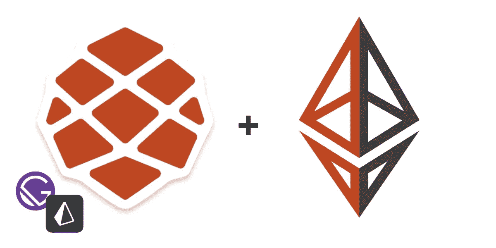
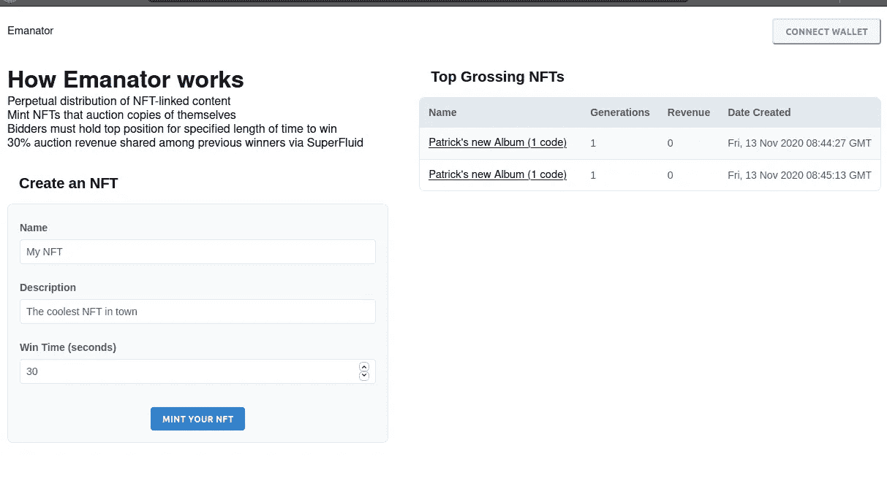
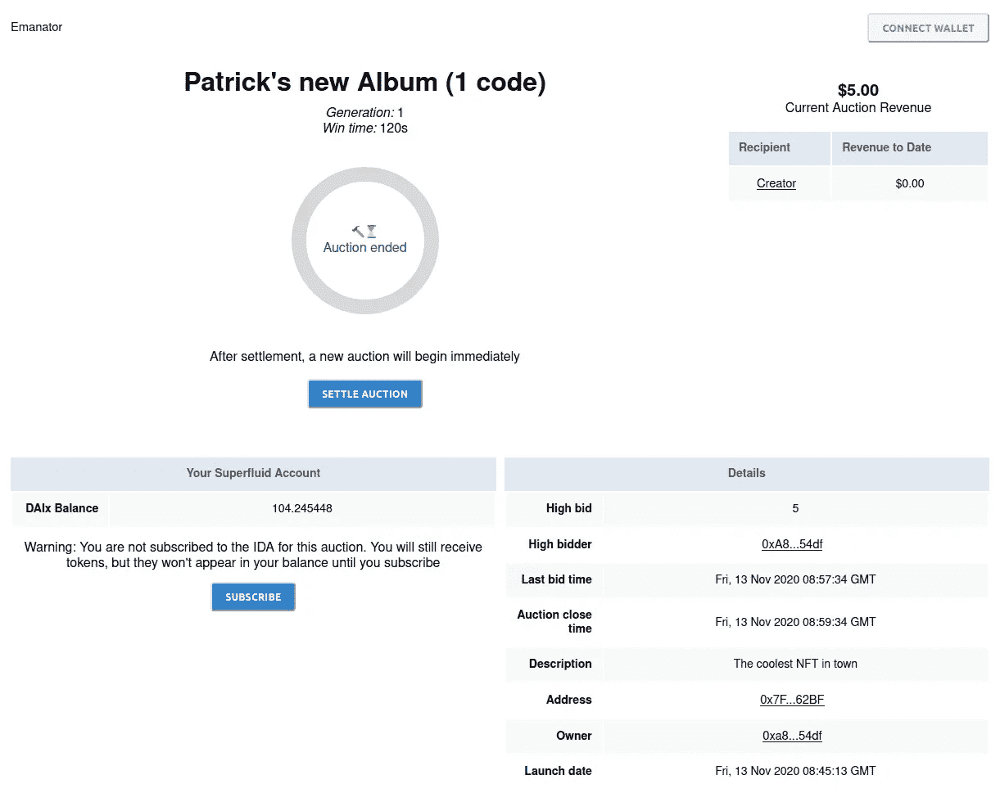

# 使用 RedwoodJS 创建以太坊应用程序

> 原文：<https://medium.com/coinmonks/using-redwoodjs-to-create-an-ethereum-app-8c385815b717?source=collection_archive---------0----------------------->

## RedwoodJS 非常适合 dapp 开发。在这个简短的教程中，你会知道为什么。



> 我的个人博客[https://patrickgallagher . dev](https://patrickgallagher.dev)Pssst .上也有这些精彩的内容。我有合适的代码块！

在这段代码中，我将带你了解我如何使用`RedwoodJS`创建一个以太坊应用程序。Redwood 与以太坊相关的关键优势是它是为 graphql 构建的。我指的不仅仅是盖茨比是如何建成的。Redwood 非常非常擅长 graphql。如果你熟悉使用图形来构建 dapps，那么就*打开创造性思维空间*而言，这将是独角兽和彩虹。

在某种程度上，你可以用 Redwood 创建你自己的“穷人的子图”(詹姆斯·杨称之为“穷人的子图”)，不费吹灰之力。这要特别感谢 Prisma 的了不起的人们，他们正埋头于他们的第二个版本，这就是 Redwood 使用的。使用最初的 Prisma v1 和 Gatsby，创建这个应用程序可能需要几周的时间，但我在这里只花了几天时间。红杉团队创造了一些神奇的东西。

我有没有提到 devops 流程非常简单？起初，这一切似乎令人望而生畏，但是相信我——你很快就会爱上 Redwood。

我知道，我知道，你有戒断症状，只是想离开他们。幸运的是，您仍然可以将这些可爱的子图直接插入 Redwood。在使用原生 Redwood 工具完成第一个应用程序后，您将能够充满信心地添加图形。

你还在等什么？试一试！

```
yarn create redwood-app ./redwoodblog
```

# 但是帕特里克，我们在建造什么？

以下是我创建 **Emanator** 的粗略步骤，这是为最近 Gitcoin 上举办的超流体黑客马拉松提交的黑客马拉松。

基本想法是这样的:

1.  允许用户创建一系列的 NFT 并拍卖它们。
2.  每份 NFT 合约都有自己的拍卖页面。
3.  我们希望跟踪每一个新的拍卖部署，并显示一些更多的信息，除了链上的数据(还记得我们使用数据库之前，我们有区块链？)

*   演示 redwood web3 应用:[https://emanator . Patrick Gallagher . dev](https://emanator.patrickgallagher.dev)
*   黑客马拉松投稿+撰写:[https://github . com/superfluid-finance/superfluid-protocol-preview/pull/8](https://github.com/superfluid-finance/superfluid-protocol-preview/pull/8)
*   资料来源:https://github.com/emaNaFTe/monorepo。

# 👩‍💻设置应用程序

下面的 redwood 命令执行一系列任务来节省时间，而不像您可能熟悉的一些代码生成器和模板那样碍事。

```
yarn rw generate layout default
yarn rw generate page home /
yarn rw generate page auction {auctionAddress}
```

最后一个命令设置了我们需要的所有路由，因此我们可以使用标识符导航到特定的拍卖。在这种情况下，我们称之为“auctionAddress”。

# 🤖数据库设置

更新`schema.prisma`添加拍卖对象。我只是编造了一些我认为有用的东西——因为合同还没有写。

```
model Auction {
  id Int @id @default(autoincrement())
  address String @unique
  name String
  winLength Int
  owner String
  description String?
  createdAt  DateTime  @default(now())
  status String @default("started")
  highBid Int @default(0)
  generation Int @default(0)
  revenue Int @default(0)
}
```

现在我们可以创建我们的本地开发数据库了

```
yarn rw db save
yarn rw db up
```

最后，我们将使用`schema.prisma`为我们生成一些组件。

```
yarn rw generate scaffold Auction
```

这个命令还提供了编辑/删除功能(区块链是不可变的？)所以我把这些组件和路线从`routes.js`去掉了

嘣！一个工作的前端和后端。我们现在应该能够通过输入虚拟数据来创建新的拍卖。

# ✍编辑表格

现在，我们需要添加功能，以便在提交拍卖表单时部署合同。一旦我们可以部署一个新的拍卖，我们可以使用合同地址和所有者地址来填充我们的数据库。



我为`web/src/web3/deploy.js`添加了 web3 部署功能，它获取表单数据并从用户的钱包中部署一个合同。然后将来自`deployAuction()`的返回值添加到现有的拍卖变异中，如下所示:

```
// web/src/components/NewAuction/NewAuction.js
const onSave = async (input) => {
  const { address, owner, error } = await deployAuction(input)
  if (error) return console.log(error.message)
  createAuction({ variables: { input: { ...input, address, owner } } })
}
```

# 🐕获取 web3 数据

既然我们可以部署合同，我们需要将 web3 数据放入我们的应用程序。我借鉴了 Redwood cookbook [中的一页，使用第三方 API](https://redwoodjs.com/cookbook/using-a-third-party-api#server-side-api-integration) 来做这件事。我选择使用服务器，而不是前端，来进行 Web3 调用。这样做会使事情简单得多。

为什么？因为 Redwood 非常擅长使用 graphql 数据。因此，如果我的服务器能够以 graphql 格式输出所有内容，那么应用程序甚至不会知道它在请求缓慢、异步的 web3 数据。这也意味着更好的安全性。还记得技术上你不应该把你的 Infura/provider 密匙放在 FE 里…但是每个人都这么做了？

首先，我制作了一个名为“Web3”的新 SDL。在`web3.sdl.js`中定义模式。

```
type Web3User {
     superTokenBalance: String!
     isSubscribed: Boolean!
   } type Query {
     web3User(address: String!, auctionAddress: String!): Web3User!
     // ...
   }
```

在这里，我没有遵循 Redwood 建立的通过 graphql 类型命名 SDL 和服务的模式(例如“Web3Auction”和“Web3User”)

> *注意:由于 web3 数据在我们的数据库之外，我们不需要更新我们的 graphql* `*schema.prisma*` *。另外，我们不能使用* `*yarn rw scaffold*` *命令，因为它依赖于* `*schema.prisma*` *。*

创建服务文件`services/web3/web3.js`。

```
yarn rw g service web3
```

使用 web3/ethers 添加 Web3 调用。然后我们可以在`[http://localhost:8911/graphql](http://localhost:8911/graphql)`开始在 graphql 操场上编写一些查询

```
query GET_WEB3_USER($address: String!, $auctionAddress: String!) {
      web3User(address:$address, auctionAddress: $auctionAddress) {
      superTokenBalance
      isSubscribed
   }
```

# 💅显示 web3 数据

现在我们有了一些新的 web3 查询，根据我们的数据源，有两种方法可以使用它们:web3 或 web3+web2

*仅 web 3*—制作一个新组件

对于用户，我只关心 web3 数据，所以我选择创建一个新的单元格和组件。请记住，由于没有为这些定义`prisma.schema`，您需要手动将您之前编写的漂亮的 graphql 查询添加到每个新的“单元格”中。

```
yarn rw g cell web3User
yarn rw g component web3User
```

*web3+web2* —与现有组件结合

对于拍卖，我想使用来自 Prisma 数据库和 web3 的数据，所以我选择将新的查询添加到`AuctionCell.js`中的现有查询中。我没有为此制作任何新组件。

```
query FIND_AUCTION_BY_ADDRESS($address: String!) {
  auction(address: $address) {
    id
    name
    address
    description
    createdAt
    revenue
    winLength
    owner
  }
  // NEW STUFF
  web3Auction(address: $address) {
    endTime
    lastBidTime
    auctionBalance
    highBid
    highBidder
    status
  }
}
```



# ⏳保持更新

作为保持应用程序更新 Web3 数据的一种快速而肮脏的方法，我给`AuctionCell.js`和`Web3UserCell.js`添加了以下函数(参见[生成单元格](https://redwoodjs.com/docs/cells#beforequery))。这导致 ApolloClient 每 5 秒轮询一次，并且不依赖于缓存的数据，因此服务器必须再次进行 web3 调用。这可以用更好的方式来完成，但目前来看还行。

```
export const beforeQuery = (props) => {
  return { variables: props, fetchPolicy: 'network-only', pollInterval: 5000 }
}
```

# 🏅挑战—保持数据库与 Web3 同步

现在，当部署一个新的拍卖时，数据库会立即更新，而不用等待查看部署是否成功。更好的解决方案是在创建数据库条目之前等待部署成功。如果我们在前端编写这个逻辑，用户可能会在页面完成之前关闭它，数据库将不会包括新部署的拍卖。

相反，我们应该将部署细节发送给服务器，服务器将在处理变异之前等待挂起的事务。我将把这留给你去想一个实现它的好方法。

# 🚢运输它

我用 Heroku 做数据库，因为它又快又简单，而且这是一个黑客马拉松。我只是跟着红杉教程[这里](https://redwoodjs.com/tutorial/deployment)。对于无服务器组件，事情变得有点棘手。

由于 Redwood 还没有投入生产，而且这是我第一次使用它，我在这里遇到了一些挑战。没有一个是不寻常的，在社区的帮助下，我克服了所有的困难。

我遇到的第一个问题是`yarn rw build`没有建立我的合同。我通过添加 build 命令解决了这个问题:

```
// Default
yarn rw build && yarn rw db up --no-db-client --auto-approve && yarn rw dataMigrate up// Now contracts are built first
cd contracts && yarn build && cd .. && yarn rw build //...
```

我放弃了这项工作(出于多种原因)，并将构建的契约签入版本控制，并相应地更新了`package.json`。它很粗糙，但是很简单。

接下来，Vercel 抱怨我的无服务器功能大了 5mb 左右。感谢 Redwood Discord 的一些有用的建议，以及一些 Github 问题搜索，我学会了一个工具来帮助[找到罪魁祸首](https://github.com/redwoodjs/redwood/issues/1196#issuecomment-723562940)。我发现`truffle`正在吞噬一吨的空间。我移动了一些东西，又试了一次。

```
yarn rw build api
yarn zip-it-and-ship-it api/dist/functions/ zipped
```

我现在从大约 72mb 降到了 62mb，仍然超过了 50mb 的限制…所以没戏了。我给你的建议是:

*   避免在无服务器函数中使用 web3.js，支持 ethers。
*   避免导入包含大量已编译合同文件和 web3 依赖项的合同包

最后只好用 pm2 + nginx 自托管 app。谢天谢地，Redwood 文档中提供了一个很酷的例子。我真的很期待我的下一个 redwood 应用程序，这样我就可以应用我在这里学到的东西了！

如果你想要些牛奶，请打电话给我，这样你就可以竞拍 NFT 了！

**快乐大厦！**

红杉有表情符号吗？会是吗🌲？

# 📔笔记+资源

*   `yarn rw generate scaffold`并不适用于所有 prisma 关系。参见[https://redwoodjs.com/docs/schema-relations](https://redwoodjs.com/docs/schema-relations)
*   雷德伍德 js CLI[https://redwoodjs.com/docs/cli-commands](https://redwoodjs.com/docs/cli-commands)
*   加入红杉不和！[https://discord.gg/jjSYEQd](https://discord.gg/jjSYEQd)

# 感谢阅读

❤️如果你喜欢这篇文章，请让我知道。

*   [https://twitter.com/pi0neerpat](https://twitter.com/pi0neerpat)
*   [https://github.com/pi0neerpat](https://github.com/pi0neerpat)

> 声明:这篇文章不是赞助的。

## 另外，阅读

*   最好的[密码交易机器人](/coinmonks/crypto-trading-bot-c2ffce8acb2a)
*   [德里比特评论](/coinmonks/deribit-review-options-fees-apis-and-testnet-2ca16c4bbdb2) |选项、费用、API 和 Testnet
*   [FTX 密码交易所评论](/coinmonks/ftx-crypto-exchange-review-53664ac1198f)
*   最好的比特币[硬件钱包](/coinmonks/the-best-cryptocurrency-hardware-wallets-of-2020-e28b1c124069?source=friends_link&sk=324dd9ff8556ab578d71e7ad7658ad7c)
*   [密码本交易平台](/coinmonks/top-10-crypto-copy-trading-platforms-for-beginners-d0c37c7d698c)
*   最好的[加密税务软件](/coinmonks/best-crypto-tax-tool-for-my-money-72d4b430816b)
*   [最佳加密交易平台](/coinmonks/the-best-crypto-trading-platforms-in-2020-the-definitive-guide-updated-c72f8b874555)
*   最佳[加密贷款平台](/coinmonks/top-5-crypto-lending-platforms-in-2020-that-you-need-to-know-a1b675cec3fa)
*   [莱杰 vs 特雷佐](/coinmonks/ledger-vs-trezor-best-hardware-wallet-to-secure-cryptocurrency-22c7a3fd391e)
*   [block fi vs Celsius](/coinmonks/blockfi-vs-celsius-vs-hodlnaut-8a1cc8c26630)vs Hodlnaut
*   [bits gap review](/coinmonks/bitsgap-review-a-crypto-trading-bot-that-makes-easy-money-a5d88a336df2)——一个轻松赚钱的加密交易机器人
*   为专业人士设计的加密交易机器人
*   [PrimeXBT 审查](/coinmonks/primexbt-review-88e0815be858) |杠杆交易、费用和交易
*   哈森在线评论享受九折优惠
*   Bitmex 的[保证金交易指南](/coinmonks/the-idiots-guide-to-margin-trading-on-bitmex-dbbd7742c6fc?source=friends_link&sk=7bfa99d2a181142510c8442c8ddb0786)
*   [eToro 评论](/coinmonks/etoro-review-78807ddeb33c) |交易股票、密码、交易所交易基金、差价合约和商品
*   [Bitmex 高级保证金交易指南](/coinmonks/bitmex-advanced-margin-trading-guide-2270c195ce25?source=friends_link&sk=1d986cca731f5084b9a2db4a4bc4a7ad)
*   开发人员的最佳加密 API
*   [加密套利](/coinmonks/crypto-arbitrage-guide-how-to-make-money-as-a-beginner-62bfe5c868f6)指南:新手如何赚钱
*   顶级[比特币节点](https://blog.coincodecap.com/bitcoin-node-solutions)提供商
*   最佳[加密制图工具](/coinmonks/what-are-the-best-charting-platforms-for-cryptocurrency-trading-85aade584d80)
*   了解比特币的[最佳书籍有哪些？](/coinmonks/what-are-the-best-books-to-learn-bitcoin-409aeb9aff4b)

> [在您的收件箱中直接获得最佳软件交易](https://coincodecap.com?utm_source=coinmonks)

[](https://coincodecap.com?utm_source=coinmonks)