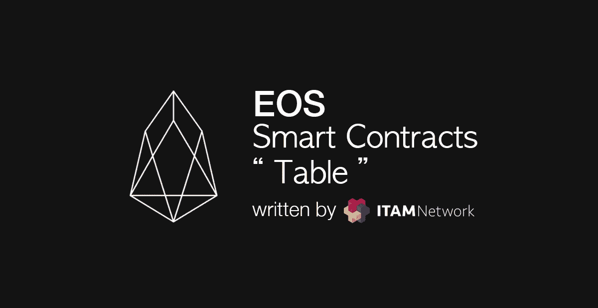
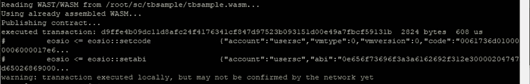
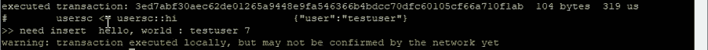
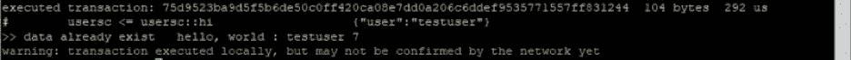
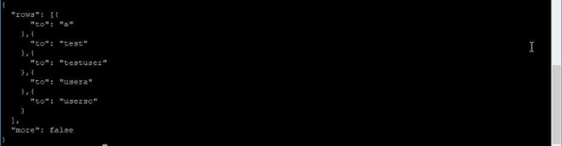

# 在 EOS 智能合同中使用“表格”

> 原文：<https://medium.com/coinmonks/using-table-on-eos-smart-contract-291f98312b80?source=collection_archive---------4----------------------->



[上一篇关于智能合约动作的帖子](/coinmonks/adding-action-to-eos-smart-contracts-85f6dcf2c841)提到，转移到动作的数据只存在于智能合约运行的瞬间。因此，为了保存和共享，另一种类型的保存方法是必要的。这在 EOS 术语中称为“表”。这些数据即使在智能合约结束时也需要存在，因此使用持久性 API 对其进行管理。

```
#include <eosiolib/eosio.hpp>
#include <eosiolib/print.hpp>
using namespace eosio;
class hello : public eosio::contract {
  public:
      using contract::contract;
/// [@abi](http://twitter.com/abi) action 
      void hi( account_name user ) {
         print( "Hello, World", name{user} );
      }
};
EOSIO_ABI( hello, (hi) )
```

首先，我们来写基本代码。这是作为数据接收 hi 动作的账户类型的基本结构。

要使用 table，首先需要声明要保存为类或结构的数据结构。在这个例子中，我们将使用 structure 来保存 hi 发送给了谁。

与前面的例子不同，您可能会觉得这很难，因为它包含了不直观的 C++语法和 DB 结构。把它想成“它有这种形式”是一种更简单的方法。

```
/// [@abi](http://twitter.com/abi) table ttab i64
struct ttab
{
account_name to;
uint64_t primary_key() const {return to;}EOSLIB_SERIALIZE(ttab,(to))
};
```

定义数据结构的结构。如果你一行一行地看这个

"/// @abi table ttab i64 "使用" eosiocpp -g "来创建注释所必需的 abi。/// @abi action 的基本代码是 action 的注解。

然后用 struct ttab {}声明并定义一个结构；。结构的内容是

" Account _ name to"帐户信息类型中值为 1 到的结构

。剩下的两行是管理 eos 表的函数和宏。

设置保存" uint 64 _ t primary _ Key()const { return to；}”表。表必须有主键。因为在这个例子中将要保存到表上的数据字段是一个“to”，所以这个 to 将被指定为主键。

这是用于从“EOSLIB_SERIALIZE(ttab，(to))智能协定中调用数据的宏。

```
typedef   multi_index<N(ttab),ttab> _ttab;
```

将上面声明的结构声明为 Multi_index 形式。Multi_index 是在 Boost 库中具有易于使用的数据结构的表单中提供的表单。你可以把它想成“上面声明的 ttab 结构的名字 ttab 是用来声明表单被用作 _ttab”在这个例子中。

```
/// [@abi](http://twitter.com/abi) action
        void hi(account_name user)
        {
             _ttab ttabs(_self,_self);

            auto iter=ttabs.find(user);
            if(iter==ttabs.end())
            {
                print("need insert\t"); 
                ttabs.emplace(_self,[&](auto& ttab)
                {
                    ttab.to = user;
                });
            }
            else
            {
                print("data already exist\t");
            }
            print("hello, world : ", name{user});
        }
```

在一个典型的例子中，为了从表中检索信息，

使用“_ttab ttabs(_self，_self)上的参数(_ self)；”_ttab 要重置的 ttabs 变量(实例构造函数)。参数中使用的“_self”是指执行智能合约的账户。

ttabs 构造函数的第一个参数表示将拥有生成的表的帐户。

第二个参数可以认为是使用 ttabs 的帐户。

查找作为“auto iter=ttabs.find(user)”传输的用户数据 ttab 中的活动数据。从 ttab 中找到的数据将被用作“迭代器”形式。详细描述迭代器超出了本文的范围，只是简单解释一下上面的例子，

如果将上面找到的“ **if(iter==ttabs.end())** ”信息与最后一个 ttab 进行比较，如果相同，这意味着转移到 action 的用户不在表中。在这种情况下，插入数据。如果没有，并且用户信息在表中，那么它是不做任何事情就打印消息的结构。

如果没有“TTA bs . launte(_ self，[&](auto& ttab)”用户表，使用 multi_index 提供的定位函数，插入数据。

第一个参数是关于谁将为存储数据付费的帐户信息。在此示例中，智能合约帐户支付费用，但是您必须考虑设计，以便在实际的服务器上使用此信息。

第二个是 ttab 的 Lambda 形式，应该也是指 C++，但是在这个例子中，把它想成是循环传递的数据结构应该没问题。

在这个例子中，许多详细的概念都被省略了，这样即使是初学者也能很容易地理解。同样，类比也有许多概念顺序。因此，这只适用于教程，不适用于代码。

本教程演示了如何在智能合约中轻松使用表格。

```
#include <eosiolib/eosio.hpp>
#include <eosiolib/print.hpp>using namespace eosio;class hello : public eosio::contract 
{
    public:
        using contract::contract;/// [@abi](http://twitter.com/abi) table ttab i64
        struct ttab
        {
            account_name to;
            uint64_t primary_key() const {return to;}EOSLIB_SERIALIZE(ttab,(to))
        };typedef multi_index<N(ttab),ttab> _ttab;/// [@abi](http://twitter.com/abi) action
        void hi(account_name user)
        {
             _ttab ttabs(_self,_self);

            auto iter=ttabs.find(user);
            if(iter==ttabs.end())
            {
                print("need insert\t"); 
                ttabs.emplace(_self,[&](auto& ttab)
                {
                    ttab.to = user;
                });
            }
            else
            {
                print("data already exist\t");
            }
            print("hello, world : ", name{user}, " 6");
        }
};EOSIO_ABI(hello,(hi))
```

如果整个代码和上面一样，编译并上传源代码。

```
#eosiocpp -o tbsample.wast tbsample.cpp#eosiocpp -g tbsample.abi tbsample.cpp
```

编译后，上传合同并执行。

```
# cleos set contract usersc /root/sc/tbsample
```



将“testuser”数据提供给 hi 动作并执行。

```
# cleos push action usersc hi ‘[“testuser”]’ -p usersc
```



因为这是第一个" testuser "插入，所以显示并插入" need insert "到表中。

如果您将“testuser”作为数据并再次执行契约，

```
# cleos push action usersc hi ‘[“testuser”]’ -p usersc
```



可以看到数据如上已经存在。

使用 cleos，您可以搜索用户的表。如果您插入以下内容并搜索 usersc 的 ttab 表，

```
#cleos get table usersc usersc ttab
```



您可以确认在上面的例子中输入的 testuser，包括为测试输入的其他数据，是否存在。

在本帖中，我们查看了智能合同的表格。

## ITAM 游戏是一个透明的游戏生态系统的区块链平台

订阅 ITAM 游戏并接收最新信息。

访问 ITAM 游戏电讯，就 ITAM 游戏和区块链进行交流。点击下面的链接加入！👫

网址:**[https://itam . games](https://itam.games)电报:[https://t.me/itamgames](https://t.me/itamgames)**