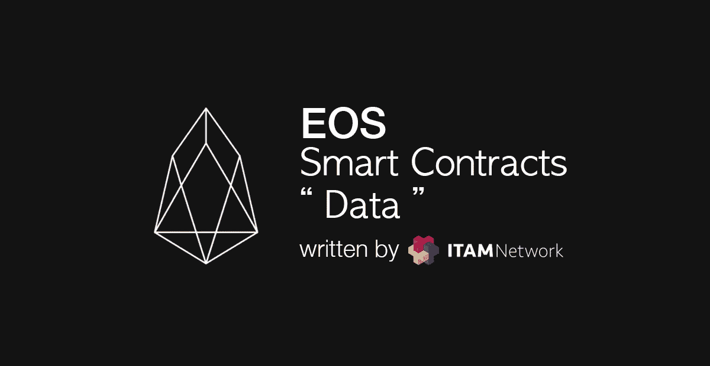
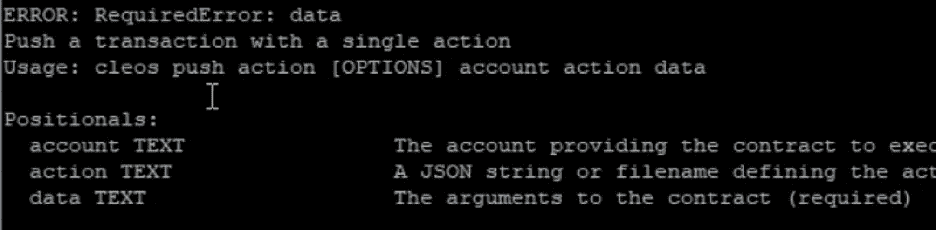
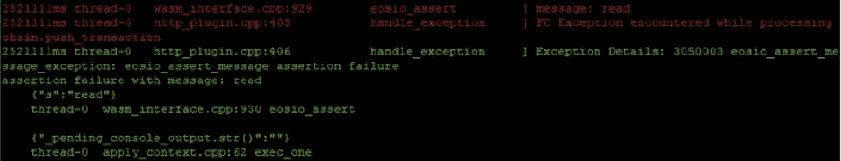
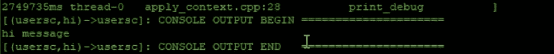
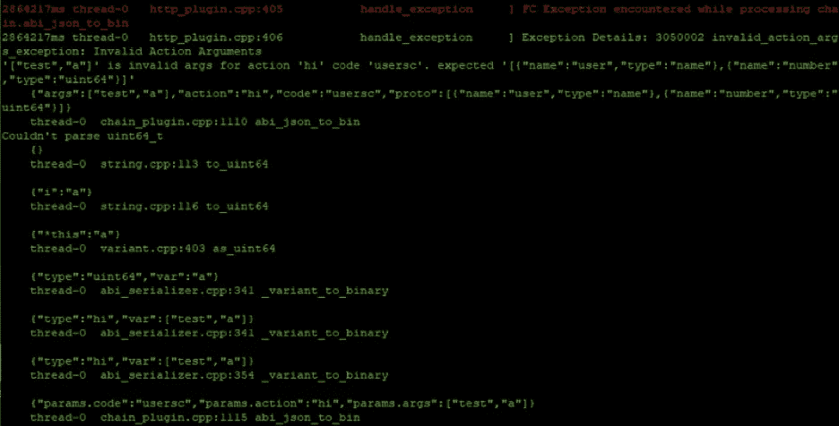

# 使用 EOS 智能合同“数据”

> 原文：<https://medium.com/coinmonks/using-the-eos-smart-contract-data-a3244b415410?source=collection_archive---------4----------------------->



在本帖中，我们将讨论如何在智能合约上传输数据。智能合同数据引用了 cleos 帮助中的术语。

```
Push a transaction with a single action
Usage: cleos push action [OPTIONS] account action data
```

# **基本结构**

```
#include <eosiolib/eosio.hpp>
#include <eosiolib/print.hpp>using namespace eosio;class hiworld : public eosio::contract {
  private:

  public:
    using contract::contract;void hi( account_name user) {
        print("hi message");
    }void bye( account_name user ) {
        print("bye message");
    }
};EOSIO_ABI( hiworld, (hi) (bye) )
```

只需编写示例代码。

```
eosiocpp -o hiworld.wast hiworld.cppeosiocpp -g hiworld.abi hiworld.cpp
```

编制

如果您看到 Action hi，您将能够看到“void hi ( account_name user ) {”。了解了这些，打开 hiworld.abi 文件。

```
{
  "____comment": "This file was generated by eosio-abigen. DO NOT EDIT - 2018-06-21T08:42:39",
  "version": "eosio::abi/1.0",
  "types": [],
  "structs": [{
      "name": "hi",
      "base": "",
      "fields": [{
          "name": "user",
          "type": "name"
        }
      ]
    },{
      "name": "bye",
      "base": "",
      "fields": [{
          "name": "user",
          "type": "name"
        }
      ]
    }
  ],
  "actions": [{
      "name": "hi",
      "type": "hi",
      "ricardian_contract": ""
    },{
      "name": "bye",
      "type": "bye",
      "ricardian_contract": ""
    }
  ],
  "tables": [],
  "ricardian_clauses": [],
  "error_messages": [],
  "abi_extensions": []
}
```

打开 hiworld.abi 文件后，您会看到类似上面的内容。

从上面的“__comment”你大概可以猜到，eosio 会自动创建一个 abi 文件。之前使用的 EOS iocpp–g 选项是自动创建这个 abi 的选项。

```
"structs": [{
      "name": "hi",
      "base": "",
      "fields": [{
          "name": "user",
          "type": "name"
        }
      ]
    },{
      "name": "bye",
      "base": "",
      "fields": [{
          "name": "user",
          "type": "name"
        }
      ]
    }
  ],
```

如果您查看 struct 部分，可以看到 function 参数在 Action 函数的形状中注册为 Action 的数据。

现在，像下面这样修改源代码，并检查 abi 文件是如何创建的。

```
void hi( account_name user, uint64_t number) {
        print("hi message");
}
```

向 hiworld.cpp 的 hi Action 函数添加参数。

```
eosiocpp -o hiworld.wast hiworld.cppeosiocpp -g hiworld.abi hiworld.cpp
```

编译并检查 abi 文件。

```
"structs": [{
      "name": "hi",
      "base": "",
      "fields": [{
          "name": "user",
          "type": "name"
        },{
          "name": "number",
          "type": "uint64"
        }
      ]
    },{
      "name": "bye",
      "base": "",
      "fields": [{
          "name": "user",
          "type": "name"
        }
      ]
    }
  ],
```

您将能够检查修改后的名称:编号，类型:uint64 是否已添加。

```
#cleos set contract usersc ~/sc/hiworld/
```

上传修订后的智能合同。

```
#cleos push action usersc hi -p usersc
```

如果您从如下所示的语法中删除数据部分，cleos 会将其过滤掉。数据是必须的。



```
# cleos push action usersc hi '' -p usersc
```

如果您将数据留空为''，如上所示，您将无法通过区块链审核。



```
# cleos push action usersc hi '["test"]' -p usersc
```

如果您声明了 2 个数据，但如上所示只发送了 1 个，



你应该会很容易成功。

[Trap]如果声明 2，实际上必须发送两个数据，否则会出错。但是，在上面的例子中，uint64_t 类型被直接从空值解释为 0。

```
# cleos push action usersc hi '["test","a"]' -p usersc
```

在这种情况下，如果数据类型是一个数字，但你作为一个字符执行。



区块链检测数据类型，如果类型不同，就会出错。

在这篇文章中，我们回顾了智能合约动作数据，以及哪些调用是允许的。

## ITAM 游戏是一个透明的游戏生态系统的区块链平台

订阅 ITAM 游戏并接收最新信息。

访问 ITAM 游戏电讯，就 ITAM 游戏和区块链进行交流。点击下面的链接加入！👫

网址:**[https://itam . games](https://itam.games)电报:[https://t.me/itamgames](https://t.me/itamgames)**