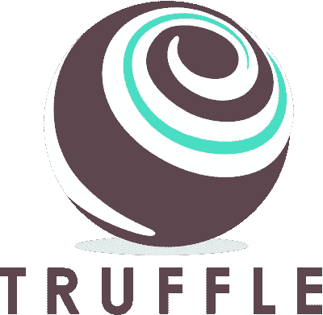

# 以先进的方式使用 Truffle 框架

> 原文：<https://medium.com/coinmonks/using-truffle-framework-in-an-advanced-way-7e32c11c97a9?source=collection_archive---------7----------------------->

如果你是一名区块链开发者或者正在成为一名开发者，那么你可能听说过以太坊-瑞士刀框架，叫做 [**松露**](https://truffleframework.com/) 。以太坊还处于早期阶段，不像常规的 web 开发那样有很多高级工具。然而，使用 Truffle，你可以更容易、更快地做事情，因为它提供了自动化的契约测试，这几乎是开发过程中的一个需求(更像是必需品)。此外，它是唯一具有某种调试功能的工具。

这里有一些我们在开发过程中需要的东西，它们非常方便。如果你是一个初学者，第一次使用松露，然后再回到这里，你可能会需要这个。

# **自动部署时链接并初始化合同**

首先，您应该熟悉 [truffle migrate](https://truffleframework.com/docs/getting_started/migrations) 命令，该命令不仅可以帮助您部署合同，还可以升级和重新部署已更改的合同。

但是那些依赖于您正在部署的其他契约的契约呢？应该使用新部署的地址更新依赖关系的合同。您可以在生产过程中手动完成这项工作，但是测试呢？让我们深入研究解决方案。

例如，我们有一个名为“应用程序”的智能合同，它与存储智能合同进行交互。目标是同时部署它们，并使用存储合同的地址更新应用程序合同。

这里是我们的 *Application.sol* 文件:

Example of Application smart contract

我们的迁移文件:

Deployment of Application and Storage smart contracts

上面的代码创建了 4 个事务:

1.  应用合同的部署
2.  存储合同的部署
3.  更新应用合同中的存储地址
4.  更新 Truffle 的迁移合同，跟踪链上的迁移

为了节省一些时间，您可以向应用程序契约添加构造函数，它将接受存储契约的地址作为函数参数。那么我们的例子应该是这样的:

Upgraded Application smart contract

*存储*合同的迁移:

Simple deployment of Storage smart contract

*应用*合同的迁移:

Simple deployment of Application smart contract

这样，我们将比以前少做一笔交易，从而节省一些汽油。

# **测试基于时间的功能**

你经常会发现自己在编写依赖于时间的代码，比如在取款/存款之前检查是否已经过了一段时间。如果你用的是 [*ganache-cli*](https://github.com/trufflesuite/ganache-cli) (例如。testrpc)用于本地网络和测试，那么你可以在你的测试中使用特殊的 rpc 函数 *evm_increasetime* 。

下面是它的使用方法:

Helper function to increase network timestamp

要在测试期间等待 24 小时，您可以调用它:

> await utils . increase time(24 * 60 * 60)；

# **摩卡多记者**

如果你像我们一样使用某种 CI(持续集成)，比如 [CircleCi](https://circleci.com/) ，你可能希望你的测试结果是某种通用的格式。大多数 CI 工具需要 JUnit XML 格式的测试结果。

默认情况下，Truffle 使用 *spec* reporter 将测试结果很好地格式化到控制台窗口上。您可以很容易地将其更改为 *mocha-junit-reporter* ，只需运行"*NPM install mocha-JUnit-reporter "*并在您的 *truffle.js* 文件中添加以下 mocha 配置条目:

Added parameter for mocha in truffle.js file

这种解决方案对于 CI 来说是不错的，但是对于在本地运行测试，然后检查 xml 文件以获得测试结果来说，这种解决方案不是很用户友好。幸好有个东西叫 [*摩卡——多记者*](https://github.com/stanleyhlng/mocha-multi-reporters) *。*

要配置多个报表程序，首先安装依赖关系:

*   *NPM install--save-dev mocha-multi-reporters mocha-JUnit-reporter*

将下面的摩卡配置添加到你的 *truffle.js:*

Upgraded parameter for mocha in truffle.js file

你可能已经注意到我们正在使用*mocha-reporter-config . JSON .*使用这个文件，我们可以配置 multi reporter 来使用 *spec* 和 *mocha-junit-reporter。*

Example of mocha-reporter-config.json file

正如您可能注意到的，您甚至可以决定您希望您的测试结果存储在哪里。

在以太坊上开发 dApps 需要复杂的设置，需要一大堆框架和工具。由于这些原因，我们创建了 [starter repository](https://github.com/NodeFactoryIo/solidity-node-docker-starter) ，它拥有为您配置的所有工具和框架，以便您使用 Node 开发智能合约。Js 作为后端服务器。所有的东西都使用 [Docker](https://www.docker.com) 放在容器中，因此只需一个命令，你就可以启动你的私有网络、部署合同、运行(数据库)迁移、运行 web 服务器、测试以及你喜欢的任何事情。

如果你想试试，你可以在这里看看:

 [## 节点工厂/实体-节点-停靠-启动

### 这个项目用于开发 solidity 智能合同，NodeJs 作为后端服务器

github.com](https://github.com/NodeFactoryIo/solidity-node-docker-starter) 

你可以让我们知道，如果你想在这个回购更多的功能，或随时贡献！