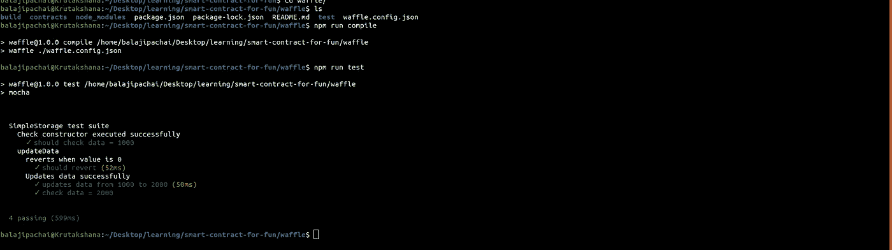

# 使用华夫——撰写和测试智能合同

> 原文：<https://medium.com/coinmonks/using-waffle-writing-testing-smart-contracts-b0f350e0f838?source=collection_archive---------0----------------------->


**Sweeter, Simpler & Faster**

# **什么是华夫饼？**

Waffle 是一个用于编写和测试智能合同的库。它更甜，更简单，更快。
**更甜**:极简主义，很少依赖。
**更简单**:语法好，易于扩展。
**更快**:关注测试执行的速度。

# **使用华夫饼**

## 按照以下步骤开始使用华夫饼:

1.创建项目结构

```
mkdir using-waffle
cd using-waffle
mkdir build
mkdir contracts
mkdir test**Note:** In case of truffle, *truffle init* creates all these directories plus migrations directory, however, there is no *waffle init* command as such, thus, creating the project structure is manual.
```

2.安装依赖项

```
Ensure you are in the *using-waffle* directory.npm i ethereum-waffle -D
npm i chai -D
npm i mocha -D
```

3.创建 waffle.config.json 文件，并在其中添加以下代码

using-waffle/waffle.confing.json

4.将以下脚本添加到 package.json

using-waffle/package.json

5.让我们创建一个简单的存储契约

```
cd contracts
vi SimpleStorage.sol
Paste the below code in it.
```

contracts/SimpleStorage.sol

6.现在，让我们为上面的契约创建测试文件

```
cd test
vi simpleStorage.test.js
Paste the below code in it
```

test/simpleStorage.test.js

注意:

*   您可能已经注意到，我们没有明确讨论任何区块链节点(甚至没有 ganache)，这是因为功能性 **createMockProvider()。**
*   契约发出的事件可以用一两行代码测试出来(更简单——华夫:语法很好，易于扩展😄)
*   回复测试也是一行程序(甜蜜华夫饼:极简主义😎)

7.编译并运行测试

```
npm run compile
npm run test
```



Output of npm run compile and npm run test

# 结论

华夫饼自带优势。与 Truffle 相比，waffle 中的抽象更高，例如，如果您使用 Truffle，所有的迁移脚本都保存在迁移目录下，如果是 waffle，则没有迁移目录，Waffle 会随时为您完成。捕获发出的事件和测试还原案例是一个或两个衬里。一定要试一试，“更甜、更简单、更快——华夫饼。”

参考资料:

 [## 华夫饼文件-华夫饼文件

### Waffle 是一个用于编写和测试智能合同的库。

以太坊-华夫饼. readthedocs.io](https://ethereum-waffle.readthedocs.io/en/latest/index.html) [](https://github.com/balajipachai/smart-contract-for-fun) [## balajipachai/有趣的智能合同

### 此时您不能执行该操作。您已使用另一个标签页或窗口登录。您已在另一个选项卡中注销，或者…

github.com](https://github.com/balajipachai/smart-contract-for-fun) [](https://coincodecap.com)

> [直接在您的收件箱中获得最佳软件交易](https://coincodecap.com/?utm_source=coinmonks)

[](https://coincodecap.com/?utm_source=coinmonks)