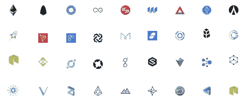

# 效用代币:一个通用的理解

> 原文：<https://medium.com/coinmonks/utility-tokens-a-general-understanding-f6a5f9699cc0?source=collection_archive---------5----------------------->

> “为资助开发加密货币而发行的加密货币数字代币，以后可用于购买加密货币发行人提供的商品或服务”

以上是效用令牌的韦氏词典定义。是的，它实际上在字典里。

让我们打开它。

效用代币是为众筹目的而创建的非物理代币(想想查克奶酪或[戴夫& Busters](https://www.daveandbusters.com/) 街机代币，你既不能触摸，也不能握在手中)(想想 [KickStarter](https://www.kickstarter.com/) 、[gofund me](https://www.gofundme.com/)——诸如此类的网站)。这意味着效用代币的购买者已经向代币的发行者 NOW 支付了货币，使得公司可以开发一种产品，代币的购买者稍后可以用该产品或服务来兑换。

> [发现并审核最佳区块链软件](https://coincodecap.com)

区块链创业公司通过首次代币发售(ico)筹集了 54 亿美元(来源:CoinDesk )。ICO 是以众筹方式发行和销售公用事业代币的过程。那么，为什么人们——从出租车司机到医生，再到华尔街的银行家(包括我在内)——会购买这些代币，而这些代币是他们无法触摸或兑换产品或服务的呢？

不管是好是坏，投机和对错过(FOMO)的恐惧是人们购买和交易公用事业代币的主要原因。虽然用户不能将实用型代币兑换成商品或服务，但代币持有者可以进入加密货币交易所(比如监管松散的纽交所或纳斯达克等)买卖实用型代币。如果一个人购买了一个实用型代币，他希望这个代币背后的项目能给这个人带来积极的影响，从而诱使其他人愿意为这个代币支付更高的价格。另一个人看到了公用事业代币的价格是如何增加的，并且担心如果他或她现在不购买，他或她将错过足够便宜地购买公用事业代币(即 FOMO)，并且因此以更高的价格购买公用事业代币。

给予公用事业权标的价格或价值大部分来自投机，只要有第三方愿意以更高的价格购买公用事业权标，价格增值的旋转木马就会继续。也就是说，实用令牌有可能创造并保留真正的价值，但如何实现这一点超出了本文的范围。

希望这篇文章能让你更好地理解什么是实用令牌，以及它在当前的加密世界中是如何工作的。在实用令牌上已经写了很多。如果有兴趣了解更多，请查看下面的进一步阅读链接:

[关于令牌的想法](https://news.earn.com/thoughts-on-tokens-436109aabcbe) ( [巴拉吉·s·斯里尼瓦桑](https://medium.com/u/f5a2e83d6d8f?source=post_page-----f6a5f9699cc0--------------------------------)

[了解硬币、公用代币和代币化证券的区别](/startup-grind/understanding-the-difference-between-coins-utility-tokens-and-tokenized-securities-a6522655fb91) ( [米莎·贝诺利尔](https://medium.com/u/29e3a84161a0?source=post_page-----f6a5f9699cc0--------------------------------))

[什么是加密货币。初学者指南](https://cointelegraph.com/bitcoin-for-beginners/what-are-cryptocurrencies#history) ( [投币电报](https://medium.com/u/cd0f3b7d621?source=post_page-----f6a5f9699cc0--------------------------------))

[为什么你应该将公用令牌视为 ICOs 的未来](/@aworker/why-you-should-consider-utility-tokens-as-the-future-for-icos-b61d6c6beee6) ( [首席执行官安东·契尔卡索夫](https://medium.com/u/b2430c624473?source=post_page-----f6a5f9699cc0--------------------------------))

**免责声明。**本文仅供参考。本帖表达的观点不是，也不应被理解为投资建议。本文件不是购买或出售此处提及的任何资产的要约，也不是要约邀请。这篇文章中的所有观点都是我个人的，不以任何方式代表 [CMX 资本](http://www.cmx-capital.com)或关联公司的观点。

> 加入 Coinmonks [电报频道](https://t.me/coincodecap)和 [Youtube 频道](https://www.youtube.com/c/coinmonks/videos)获取每日[加密新闻](http://coincodecap.com/)

## 另外，阅读

*   [复制交易](/coinmonks/top-10-crypto-copy-trading-platforms-for-beginners-d0c37c7d698c) | [加密税务软件](/coinmonks/crypto-tax-software-ed4b4810e338)
*   [网格交易](https://coincodecap.com/grid-trading) | [加密硬件钱包](/coinmonks/the-best-cryptocurrency-hardware-wallets-of-2020-e28b1c124069)
*   [密码电报信号](http://Top 4 Telegram Channels for Crypto Traders) | [密码交易机器人](/coinmonks/crypto-trading-bot-c2ffce8acb2a)
*   [最佳加密交易所](/coinmonks/crypto-exchange-dd2f9d6f3769) | [印度最佳加密交易所](/coinmonks/bitcoin-exchange-in-india-7f1fe79715c9)
*   开发人员的最佳加密 API
*   最佳[密码借贷平台](/coinmonks/top-5-crypto-lending-platforms-in-2020-that-you-need-to-know-a1b675cec3fa)
*   [免费加密信号](/coinmonks/free-crypto-signals-48b25e61a8da) | [加密交易机器人](/coinmonks/crypto-trading-bot-c2ffce8acb2a)
*   [杠杆代币](/coinmonks/leveraged-token-3f5257808b22)终极指南
*   [Bookmap 评论](https://coincodecap.com/bookmap-review-2021-best-trading-software) | [美国 5 大最佳加密交易所](https://coincodecap.com/crypto-exchange-usa)
*   最佳加密[硬件钱包](/coinmonks/hardware-wallets-dfa1211730c6) | [Bitbns 评论](/coinmonks/bitbns-review-38256a07e161)
*   [新加坡十大最佳加密交易所](https://coincodecap.com/crypto-exchange-in-singapore) | [购买 AXS](https://coincodecap.com/buy-axs-token)
*   [红狗赌场评论](https://coincodecap.com/red-dog-casino-review) | [Swyftx 评论](https://coincodecap.com/swyftx-review) | [造币厂评论](https://coincodecap.com/coingate-review)
*   [投资印度的最佳密码](https://coincodecap.com/best-crypto-to-invest-in-india-in-2021)|[WazirX P2P](https://coincodecap.com/wazirx-p2p)|[Hi Dollar Review](https://coincodecap.com/hi-dollar-review)