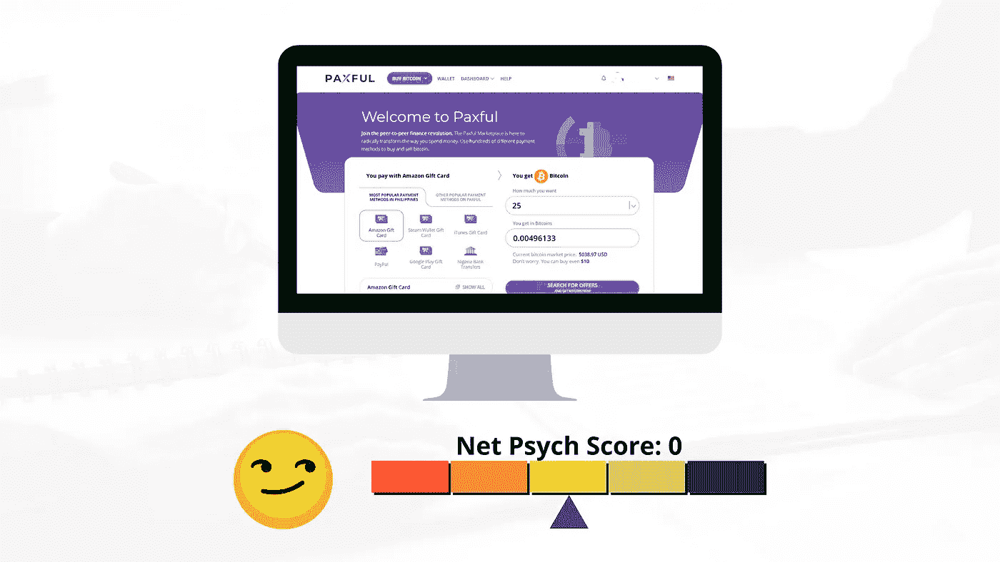

# 加密货币中的 UX:用户心理的图形化分析

> 原文：<https://medium.com/coinmonks/ux-in-cryptocurrency-measuring-user-psyche-in-customer-onboarding-e959ee9a4d3b?source=collection_archive---------5----------------------->

A 在基于加密货币和区块链构建的应用领域，如交易所、钱包和 DeFi 应用，我们已经看到了支持 UX 的原语和标准的稳步改进和采用。为了捕捉用户登上这些平台时的心理或精神状态，我准备了下面的分析来量化积极和消极的情绪…