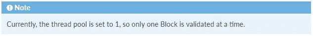
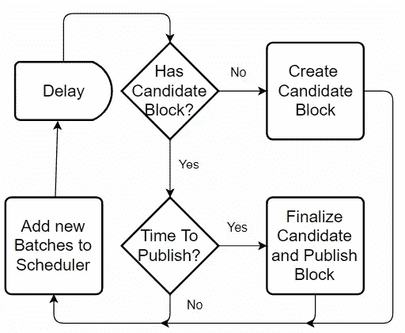
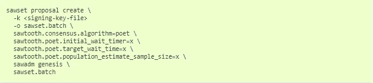

# Hyperledger 锯齿中的验证

> 原文：<https://medium.com/coinmonks/validation-in-hyperledger-sawtooth-f29b2d9a6b23?source=collection_archive---------1----------------------->

**from the homepage of sawtooth**

作为我对锯齿文档概述的一部分，在此向您展示本系列的第二部分。

我创建了重要术语的文章内链接，以防你想跳过或回到你不理解的术语。唯一的例外是在下面的第一段和明确提到的外部链接。

在[总账锯齿](https://www.hyperledger.org/projects/sawtooth)，[块和批次](/@BlockchainDeal/hyperledger-sawtooth-for-a-beginner-transactions-and-batches-7c9cf444ecb5)都是由授权节点以类似的方式进行验证。例如，这两个由日志处理——一个通过内部管道路由任务的接口。

在这里你可以找到日志中组件的完整分类。每个组件都可以看作是网络中的一个节点。

来自接收单位的日志通过**完成符**第一次接触。该组件确保“块和批次的所有相关性都已得到满足并向下游交付”。

然后，完成的块被发送到[链控制器](#5eb8)用于分支解析，而完成的批次被发送到块[发布器](#dd1d)用于包含在块中。

控制器和发布器协同工作，分别允许处理传入的块和新块的声明；这些都可以并行完成，并在高传入数据块率的时刻进行扩展。

## 商店

> 块存储包含当前区块链中的所有块

可以通过批次 ID、交易 ID 或块号来访问块。

店里不包括叉子。为了将链头从一个分支更改为另一个分支，提交和取消提交到公共根的块的列表都被提供给原子方法。

链头是标识当前分支的块，并且随着每个传入的块或合并而变化。

## 隐藏物

> BlockCache 保存验证器的工作块集，并跟踪处理状态

它是块存储的实时内存构造版本，在系统启动时重新构建。

缓存中的块可以是:

*   **有效**，由[链控制器](#5eb8)验证
*   **无效**，前任或自身验证失败
*   **未知**，一般只是来自[完成者](#f258)

流入和流出存储的数据块已经过验证，而缓存还会与潜在的新数据块或无效数据块进行交互。

在查找时，如果在缓存中找不到该块，则向存储进行查询，如果它仍然丢失，则该块被认为是系统未知的。

只要最近没有访问过的块没有被其他缓存的块作为前置块引用，它们就会被定期清除。

## 共识；一致

该杂志支持可插拔的共识算法，如工作证明、耗时证明和其他实用的拜占庭容错算法。对网络协议的改变是通过认证的提议来完成的，认证的提议是设置族的事务。网络的这一部分运行着三个进程。

***一致同意。BlockPublisher*** 用于创建候选区块来扩展链。它配备了对全局状态和[块存储](#d212)的只读访问，以及发布批处理的接口。这个过程的实例采取三个动作:初始化、检查和完成。

***意见一致。BlockVerifier*** 简单地向[块验证器](#cd64)提供块验证功能。这提供了一个机会来验证候选区块是否是按照适当的共识规则发布的。

***意见一致。ForkResolver*** 使一致性算法能够选择下一个块作为链头。在像 PBFT 这样的最终算法中，永远不会有分叉来解析，解析器将总是选择扩展当前头的新块。

这三个实现共同管理验证器的一致性活动。它们被编程为基于链宽参数执行，链宽参数在设置事务的帮助下被实例化，最初在[起源块](#7784)中。

## 控制器

> ChainController 负责确定验证器当前在哪个链上，并协调任何需要发生的链变化活动。

它被设计成一次处理多个块验证活动。这在出现多个分支时很有用，控制器可以同时处理来自所有竞争分支的块。这是在一组验证者失去连接并在稍后重新加入网络的情况下实现的。

this practical limitation is subject to change with the integration of Single Instruction Multiple Data (SIMD) and other parallel computation functions

当一个块从[完成器](#f258)到达时，*验证器*子组件被实例化，块被分派到一个线程池执行。

在处理过程中，验证器可以返回以下三种指示之一:

1.  链头不再与实例化时相同，创建了一个新的验证器来重新进行 fork 解析
2.  该块应该成为链头，新的块作为头被添加到链中
3.  该块不应成为链头，这可能是因为新块是无效链的一部分，或者是不需要的分支的成员

当向存储器提交列表时，由控制器启动链头更新过程，该列表具有来自新分叉的要提交的块和来自存储器的要取消提交的块。然后，[发布者](#dd1d)被通知新的链头。

## 验证器

> 当 BlockValidator 被实例化时，它被赋予要验证的候选块和当前链头。

该子部分有三个评估阶段。

首先，验证器确定 fork 的公共根，它可能是链头或公共前身。

然后，逐块验证从公共根到块的链。任何无效块都会导致候选链无效。

最后，选择一个合格的候选人，并将其发送回[控制器](#5eb8)，作为新的链头添加到商店中，除非共识实施另有决定。

实际的块验证过程最初检查链上事务权限，以验证谁被允许发出[事务和批次](/@BlockchainDeal/hyperledger-sawtooth-for-a-beginner-transactions-and-batches-7c9cf444ecb5) —中等发布。之后，通过设置建议添加的链上块验证规则将应用于该块。然后，所有批处理都按顺序发送到事务调度程序。如果任何批次不符合以下标准，则该块无效:

> 没有重复的批次
> 
> 无重复交易
> 
> 有效的事务相关性
> 
> 成功的批处理执行

完成后，共识验证会根据自己的规则进行。最后，通过验证块生成的状态根哈希必须与块头中的相关字段匹配。如果通过计算验证了该块，则将状态根哈希提交给存储。

## 出版者

image from [sawtooth documentation](https://sawtooth.hyperledger.org/docs/core/releases/1.0/architecture/journal.html) — start reading from bottom left

基本上，发布者只负责创建候选块并发布它们，同时响应一致性算法的命令。

## 起源

> 这是当块存储为空时创建链的根(起源块)的动作。

该操作使用所需的共识模型、特定于部署的配置设置和创建时事务来引导验证器网络，以包括在分类帐的初始状态中。

命令行界面工具用于生成批处理列表，当在空链上操作时，验证器在启动时加载这些列表。

建议在开发的所有阶段都遵循严格的批量订购结构；这在 genesis 的情况下是强制的，其中每一批都隐含依赖于前一批。

在 genesis 中实现事务系列的作者必须提供工具来生成 Genesis 数据，这些数据带有流程所需的批处理。

> 以下示例将验证程序配置为使用 PoET 共识并指定适当的设置:

一个 genesis.batch 文件被写到验证器的数据目录中。

在启动时，只要 batch.file 存在并且没有块被指定为链头，验证器就使用该文件来产生一个起源块。

然后正常处理该块，事务有效性的任何失败都将导致起源操作的失败。在批次被验证并且没有任何冲突的情况下，验证器使用 genesis consensus 生成一个具有空 consensus 字段的唯一块。

区块链 ID 或起源区块签名随后被添加到验证器的数据目录中。

创世区块的部分生产需要共识机制的配置，这是第二个区块使用的。第二个模块必须知道如何从一个空字段初始化一个共识字段。

> 在未来的情况下，共识模型之间的转换可能是可能的，只要它们知道如何读取前一个块的共识字段。

要完成这个过程，所有必需的事务处理器(如锯齿设置事务处理器)都必须运行

如果您对类似这样的锯齿文档的简单分解感兴趣，可以随时返回。现在，我每天都在阅读和撰写相关文章，我将能够为您提供关于如何使用该框架的稳定信息。

谢谢你的来访，希望能很快见到你。

**Click to learn more HyperLedger Stories**