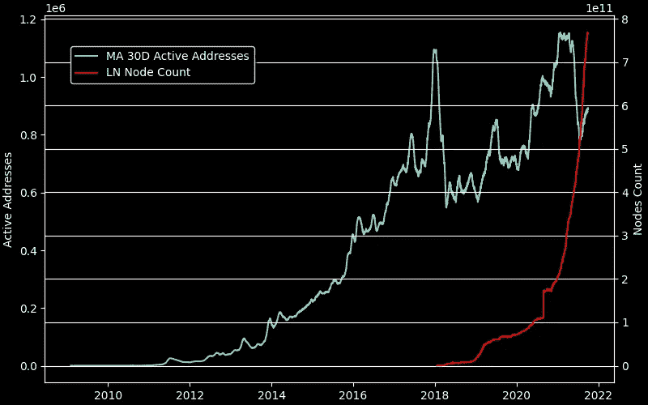

# 第 2 层的值

> 原文：<https://medium.com/coinmonks/value-of-layer-2-f00dc8e6fbfb?source=collection_archive---------6----------------------->

[The old telephone tower in Stockholm](https://memolands.com/2020/09/05/telefontornet-the-old-telephone-tower-in-stockholm/)

## 一法多网

允许测量网络效应的梅特卡夫定律背后有着悠久的历史。它于 20 世纪 80 年代被发现，最初应用于以太网。该定律从节点数量中推导出“网络价值”,因此网络价值与其大小的平方成正比。这条定律的潜在应用有很多。

例如，电话的采用证明了安装电话的平方数与贝尔和 ATT 公司的收入成正比。梅特卡夫定律证实，如果我们假设公司将利润最大化，而同行愿意支付与他们用钱换来的价值相等的成本。

中国研究人员张、刘和徐在“腾讯和数据验证梅特卡夫定律”[中使用相应的收入数据对](https://novel.ict.ac.cn/zxu/JournalPDF/Zhang_JCST_2015.pdf)萨诺夫定律(V/n)、奥德兹科定律(V/nlog(n))和里德定律(V/2n)与梅特卡夫定律进行了比较。他们得出结论，梅特卡夫定律比其他定律更好地描述了社会网络动力学。

From Zhang, Liu, and Xu “Tencent and Facebook Data Validate Metcalfe’s Law”

另一位作者 Timory Peterson [研究了 Metcalfe 的法律申请，以描述比特币的协议动态。在他的《比特币像病毒一样传播》中，他也考虑了脸书的数据并得出结论，](https://papers.ssrn.com/sol3/papers.cfm?abstract_id=3356098)

> “比特币和其他加密货币的增长和价格可能会按照一个相对简单的数学模型进行，类似于脸书和其他网络的增长曲线”。

惠特利等人在[他们的作品](https://arxiv.org/abs/1803.05663)“比特币泡沫可以预测吗？”提出了一种利用梅特卡夫定律指标检测价格泡沫的方法。在准备一篇关于 MMV 指标的俄文流行文章*和一个如何衡量比特币网络价值的演示示例时，我依赖了他们的研究。我发现比特币的价值最近开始偏离其市值。

## 比特币的价值

我开发的这个 MMV 脚本非常简单。这里可以找到[。第一步，我在一张图上重叠了两个图，一个是比特币市值，另一个是从每日活跃地址中得出的比特币 Metcalfe 价值(](https://gist.github.com/engenegr/431663655af9ad8648b45cf268a8f0d1)[硬币指标](https://medium.com/u/7b7f524fa033?source=post_page-----f00dc8e6fbfb--------------------------------) [数据集](https://coinmetrics.io/community-network-data/))。该图表明，大约在 2020 年，比特币的市值开始与网络价值相背离。为简单起见，我用常数来衡量网络价值，如下所示

> *MV =常数*共度量有效地址*

当然，常数可以是任意的。然而，我们可以根据 2020 年前的峰值或目前的 2020 年后的峰值进行调整。关键是，按照 Metcalfe 价值计算，要么 2020 年前的峰值将被“高估”，要么 2020 年后将被“低估”。我对这种分歧的最初假设是关于货币扩张，这导致了市场资本膨胀或未说明的网络效应，因为日期奇怪地与测试版推出闪电网络重合。

Coinmetrics Active Addresses and LN node count (different Y axis scales on left and right)

为了将 Lightning Network 纳入评估，我需要一个关于其历史增长的新数据源。为此，我使用了[bitcoinvisuals.com](https://bitcoinvisuals.com/lightning)，它可以方便地下载 CSV 文件中的数据集。活动地址指标不同于 Lightning 网络节点计数。这是任何进一步比较失败的主要原因。但我也试图调整闪电网络值的梅特卡夫定律中的常数，结果成功了。对于活动地址，常量值等于 exp(-1)，而对于闪电节点计数，常量值应该等于 exp(8)，以获得与下图相同的图。

Capitalization, Metcalfe Value computed via Active Addresses and Metcalfe Value with added LN node count network effect

## 结论

有一项重要的研究[“闪电网络推动了有意义的基链使用吗？”](https://typerbole.substack.com/p/does-lightning-network-drive-meaningful)。作者的结论是“公共渠道占区块空间使用量的~0.1%，加上一些区块链挖洞”。0.1%是一个相当小的块空间需求。然而，非常简单的数学和梅特卡夫定律表明，我们可能观察到第二层的采用增加对比特币价格的影响。

如果节点不属于某个交易所，LN 网络中的流动性就会被“锁定”。这使得线上比特币更加稀缺和昂贵。LN Metcalfe 值可以测量并添加到比特币网络值中。它正在快速增长，LN 节点数和通道容量的下一个峰值可能会暗示比特币市场的下一个熊市周期。

当然，我的方法很简单，也许很天真。正在比较非同质数据。如果试图将 LN 网络值添加到 onchain 比特币网络值，使用类似 Glassnode Onchain Entities 的指标可能是有益的，因为典型的 LN 节点应该看起来像单个 Onchain 实体。然而，我们必须考虑在 Glassnode 指标和其他提供 LN 节点计数的指标中避免重复计数。活动地址可能对重复计数不太敏感，因为理想情况下，与通道相关联地址在一个链上不应该是活动。

梅特卡夫定律系数有可能在未来被重新调整。如果使用了 LN 节点计数和 Coinmetrics 活动地址，它们只是说明了这些指标在整个网络效果中的相对权重。似乎即使在这种原始形式下，作为多用途通用协议的比特币的相对规模也可以与其真正的大规模应用闪电网络相提并论。

如果你喜欢这篇文章，请不要犹豫通过 [LNURL](https://lntxbot.bigsun.xyz/@notgeld) 或通过闪电地址 notgeld@lntxbot.com 捐赠一些 sat。

[[*]“сетевойэффектбиткоиаиаиегоцена”](https://teletype.in/@hypecoinnews/btc-network-value)

> 加入 Coinmonks [电报频道](https://t.me/coincodecap)和 [Youtube 频道](https://www.youtube.com/c/coinmonks/videos)了解加密交易和投资

## 另外，阅读

*   [德国最佳加密交易所](https://blog.coincodecap.com/crypto-exchanges-in-germany) | [Arbitrum:第二层解决方案](https://blog.coincodecap.com/arbitrum)
*   [币安交易机器人](/coinmonks/binance-trading-bots-d0d57bb62c4c) | [OKEx 评论](/coinmonks/okex-review-6b369304110f) | [Atani 评论](https://blog.coincodecap.com/atani-review)
*   [最佳加密交易信号电报](/coinmonks/best-crypto-signals-telegram-5785cdbc4b2b) | [MoonXBT 评论](/coinmonks/moonxbt-review-6e4ab26d037)
*   [Godex.io 审核](/coinmonks/godex-io-review-7366086519fb) | [邀请审核](/coinmonks/invity-review-70f3030c0502) | [BitForex 审核](https://blog.coincodecap.com/bitforex-review)
*   [MoonXBT vs Bybit vs 币安](https://blog.coincodecap.com/bybit-binance-moonxbt) | [硬件钱包](/coinmonks/hardware-wallets-dfa1211730c6)
*   [火币交易机器人](https://blog.coincodecap.com/huobi-trading-bot) | [如何购买 ADA](https://blog.coincodecap.com/buy-ada-cardano) | [Geco。一次审查](https://blog.coincodecap.com/geco-one-review)
*   [币安 vs 比特邮票](https://blog.coincodecap.com/binance-vs-bitstamp) | [比特熊猫 vs 比特币基地 vs Coinsbit](https://blog.coincodecap.com/bitpanda-coinbase-coinsbit)
*   [如何购买 Ripple (XRP)](https://blog.coincodecap.com/buy-ripple-india) | [非洲最好的加密交易所](https://blog.coincodecap.com/crypto-exchange-africa)
*   [非洲最佳加密交易所](https://blog.coincodecap.com/crypto-exchange-africa) | [晤交易所评论](https://blog.coincodecap.com/hoo-exchange-review)
*   [eToro vs robin hood](https://blog.coincodecap.com/etoro-robinhood)|[MoonXBT vs by bit vs Bityard](https://blog.coincodecap.com/bybit-bityard-moonxbt)
*   [有哪些交易信号？](https://blog.coincodecap.com/trading-signal) | [比特斯坦普 vs 比特币基地](https://blog.coincodecap.com/bitstamp-coinbase)
*   [ProfitFarmers 回顾](https://blog.coincodecap.com/profitfarmers-review) | [如何使用 Cornix Trading Bot](https://blog.coincodecap.com/cornix-trading-bot)
*   [如何在势不可挡的域名上购买域名？](https://blog.coincodecap.com/buy-domain-on-unstoppable-domains)
*   [印度的秘密税](https://blog.coincodecap.com/crypto-tax-india) | [altFINS 审查](https://blog.coincodecap.com/altfins-review) | [Prokey 审查](/coinmonks/prokey-review-26611173c13c)
*   [Blockfi vs 比特币基地](https://blog.coincodecap.com/blockfi-vs-coinbase) | [BitKan 点评](https://blog.coincodecap.com/bitkan-review) | [Bexplus 点评](https://blog.coincodecap.com/bexplus-review)
*   [南非的加密交易所](https://blog.coincodecap.com/crypto-exchanges-in-south-africa) | [BitMEX 加密信号](https://blog.coincodecap.com/bitmex-crypto-signals)
*   [MoonXBT 副本交易](https://blog.coincodecap.com/moonxbt-copy-trading) | [阿联酋的加密钱包](https://blog.coincodecap.com/crypto-wallets-in-uae)
*   [雷米塔诺评论](https://blog.coincodecap.com/remitano-review)|[1 英寸协议指南](https://blog.coincodecap.com/1inch)
*   [折叠 App 审核](https://blog.coincodecap.com/fold-app-review) | [StealthEX 审核](/coinmonks/stealthex-review-396c67309988) | [Stormgain 审核](https://blog.coincodecap.com/stormgain-review)
*   [购买 PancakeSwap(蛋糕)](https://blog.coincodecap.com/buy-pancakeswap) | [俱吠罗评论](/coinmonks/coinswitch-kuber-review-1a8dc5c7a739)