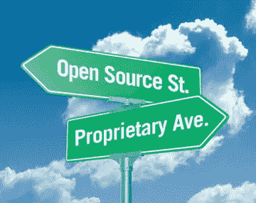
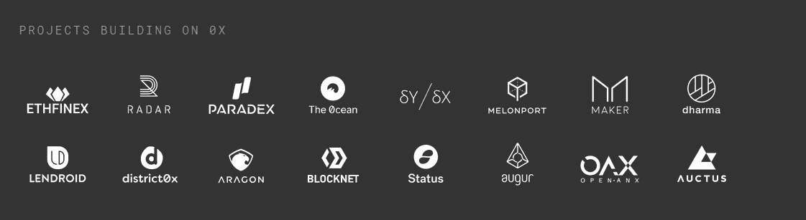

# 分散技术中的价值转移

> 原文：<https://medium.com/coinmonks/value-shift-in-decentralized-technologies-6c144bae696?source=collection_archive---------11----------------------->

## 分散技术中价值增长研究的第一部分

[Source](https://goo.gl/images/p3jZhm)

大约在过去的六个月里，我一直高度关注分散系统中的价值积累。最近，我一直试图将一系列支离破碎的想法联系起来，形成一个完整的论题。

幸运的是，在最近一集由[劳拉·申](https://medium.com/u/23cfbaf25c9a?source=post_page-----6c144bae696--------------------------------)主持的[未被束缚的播客](http://unchainedpodcast.co/placeholders-joel-monegro-on-the-fat-protocols-thesis-today-ep65)中，我遇到了一个围绕这个话题的很好的解释。她本期节目的嘉宾是占位风险投资公司的乔尔·莫内格罗。

在这一集的结尾，劳拉问乔尔关于他最近写的关于信息技术周期的[博客文章](https://monegro.org/work/2018/2/20/information-technology-market-cycles-a-brief-history)。他继续总结以计算机为中心的技术是如何慢慢商品化的，从晶体管一直到今天的数据巨头。

# **商品化现象**

为了简洁起见，我不会像 Joel 讨论的那样解释计算历史上的每一个商品化实例。然而，为了概述这一点，我将简要解释这一现象在互联网诞生前后的时代以及直到今天是如何发生的。

在互联网出现之前，微软垄断了计算和软件行业。

> “如果你想一想微软的业务，它是建立在专有计算机上运行的专有软件和专有分销的基础上的，因为微软有一个专有分销网络。他们可以在世界各地的更多货架上摆放比任何小型电脑供应商或独立软件供应商更多的 CD。”——乔尔·莫内格罗

这种优势在 80 年代的大部分时间里一直保持到 90 年代，直到我们引入了互联网和 Linux。突然间，这个世界有了一个结合了自由发行网络的自由操作系统。这从根本上放松了微软对行业的控制，并在循环中引入了一个新时代。

## **软件转数据**

随着开放软件和通过互联网进行分发的时代的到来，专注于数据层的公司开始获得价值。在这个周期中，数据是专有资产，就像软件对于微软一样。

在过去的 10-15 年中，市场围绕获得最多专有用户数据的公司进行整合。这些公司通过出售这些数据(脸书、谷歌)或利用这些数据胜过竞争对手(亚马逊)来赚钱。

## 新的周期

今天，我们刚刚进入这种商品化现象的下一个周期。区块链和其他去中心化技术通过引入开放数据层，将曾经专有的数据商品化。

默认情况下，公司不再能像在可预见的过去那样将数据货币化，因为**任何人和每个人**现在都可以访问这些数据。

# **现在什么是专利？**

[Source](https://goo.gl/images/2iacKF)

我仍然认为现在肯定地说价值将如何在分散的系统中增长还为时过早。然而，我发现了一些关键趋势，它们可能会帮助我们找到方向。

正如我上面所说的，开放数据层正在放松大型科技公司对当今市场的控制。如果数据不再是专有资产，那么价值焦点一定在转移。

考虑到我在过去 6-12 个月的观察，我认为一种新的专有资产是**实体或算法管理可用数据的方式**。然而，这个答案有一点欺骗，因为“数据管理”是一个多方面的答案。为了进一步阐述我的观点，我将深入探讨一些数据管理机制，我认为这些机制有可能从这种技术周期转变中获得重大价值。

## **协议层治理**

我想说的第一个方面是内置了治理功能的令牌模型。人们不可能第一次就搞清楚密码经济学。将自己锁定在产品版本 1 的项目几乎肯定会失败。那些拥有新颖的治理系统，并且能够发展他们的协议而没有有争议的分歧和社区分裂的项目，将会是成功的项目。

然而，这并不一定说具有良好治理的令牌会增加令牌*的价值*。澄清一下，10 年后，0x 协议很有可能成为业界交换数字资产的默认协议。**但是**，这并不能巩固 0x 代币会比现在更值钱的论点。协议的价值在于它对依赖它的项目的价值。

Longterm success of these projects depends on healthy growth of 0x

## 委派工作治理

数据管理的第二个方面是委派工作形式的治理。这场去中心化革命让人们如此兴奋的一个方面是作为个人更好地赚钱的能力。

我可以挖掘比特币，在 Augur 上报告事件结果，或者管理一个代币管理的注册表。

问题是，仅仅因为我们有能力给人民更多的“权力”并不意味着每个人都想要它。从理论上讲，以全职活动记者或登记处馆长为生是很棒的，但事实是，并不是每个人都想要或有能力付出必要的工作来获得这些回报。

然而，正如人性告诉我们的那样，如果有一种投入最少的方式，人们仍然会想要获得一些回报。这就是为什么我认为代理工作实体将成为整个商品化周期中最有价值的组织。

有些类似于授权的利益证明模型，组织将为令牌持有者提供 dapp 所需的工作。这些令牌持有者将他们的工作权限委托给这个可信方来代表他们执行工作。作为回报，代理实体将从执行工作功能中获取更大比例的利润。其余的奖励将根据代币持有者的授权权重按比例分配给代币持有者。

我们已经开始看到这些组织的雏形。例子包括在[August](https://medium.com/u/f4d568271227?source=post_page-----6c144bae696--------------------------------)或 GovernX 上的报告池和 [Nicholas Dodson](https://medium.com/u/6caa77bfb82d?source=post_page-----6c144bae696--------------------------------) 在广告链 TCR 上试验投票授权。

此外，如果你需要一些确凿的证据来证明合伙工作可能有多么有利可图，看看 2017 年比特大陆的利润率。

# 结束语

在我看来，毫无疑问，商品化现象正在再次发生。开放数据从根本上引入了一个全新的业务运营和价值累积系统。适当的治理机制对于确保协议及其依赖者的长期发展和成功至关重要。

此外，分散系统中个人自主的趋势为委托实体引入了一个有趣的商业案例。如果正确的系统可以被放置在适当的位置来促进工作委托，这些实体可以被证明是从这个技术周期中出现的一些最有价值的组织。

*这篇文章将作为一篇更长的思考文章的第一部分。* [*这个系列的第二部可以在这里看到*](/@bsparango/delegate-work-entities-bridging-the-gap-between-investors-and-active-users-65e857936a27) *。*

— — — — — — — — — — — — — — — — — — — — — — — — — — — — — — —

***为了跟上我的工作，拍我一张跟着上*** [***中***](/@bsparango) ***或*** [***碎碎念***](https://twitter.com/bennybitcoins)

感谢盖奇·瓦伦蒂诺和 T2·维维克·辛格的反馈

— — — — — — — — — — — — — — — — — — — — — — — — — — — — — — —