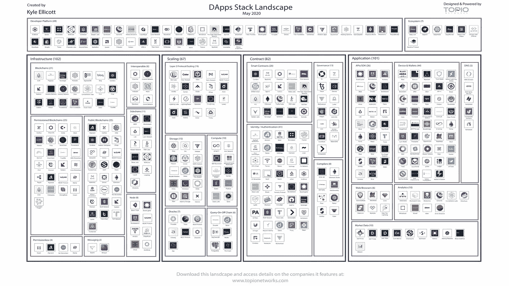
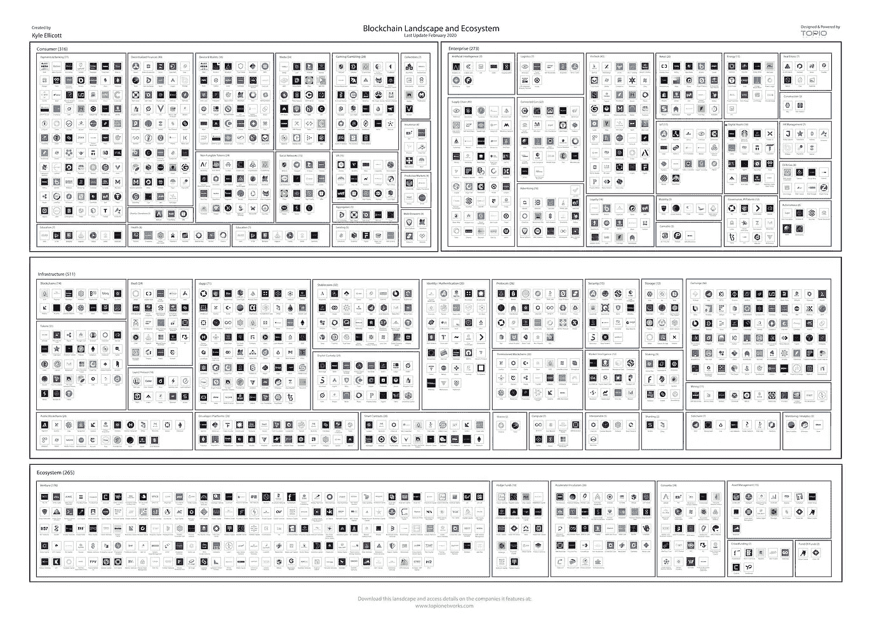

# 先锋的区块链平台上线/中国的全 DLT 战略 ERP 应用的区块链

> 原文：<https://medium.com/coinmonks/vanguards-blockchain-platform-goes-live-china-s-full-dlt-strategy-blockchain-for-erp-eb09132522c?source=collection_archive---------7----------------------->

Photo by [Nicolas Tissot](https://unsplash.com/@nft?utm_source=unsplash&utm_medium=referral&utm_content=creditCopyText) on [Unsplash](https://unsplash.com/s/photos/celebration?utm_source=unsplash&utm_medium=referral&utm_content=creditCopyText)

*2020 年 7 月 3 日*

*今天是这个系列一周年* 🥳 *的重要里程碑！感谢所有每周阅读本系列的人，感谢鼓励我努力的导师，感谢整个分散社区每天继续激励我。为未来的一年干杯。现在回到我们定期安排的节目…*

***本周在景观****…我们收到关于* ***中国*** *更广阔的 DLT 战略的更深入的概述，作为其* ***区块链服务网络(BSN)*** *的试点，全球 120+公共节点已准备部署。* ***先锋*** *旗下区块链外汇(FX)平台试运营* ***共生体*** *旗下组装区块链与* ***BNY 梅隆*** *、***道富** *以及* ***富兰克林邓普顿* ***签证*** *已经开始与* ***Zap 公司*** *合作。通过其快速通道计划，帮助用户通过直接银行存款接收比特币(BTC)作为美元。* ***挪威海鲜协会*** *已经与****IBM****和****Atea ASA****合作，追踪鱼类从海洋到餐盘的生活，因为到 2027 年，价值 3000 亿美元的食物将使用区块链和物联网进行追踪。投资人对风景或 DApps 不抱任何成见****The Graph*******Vendia****，****DFINITY****，* ***AVA 实验室*** *等更公布主要融资轮次。****DApp****2020 年 Q2 交易额上升 45 亿美元——其中大部分通过* ***以太坊*** *。加上趋势&投资者的见解、生产部署的企业使用案例、大量研究、顶级行业播客等等！尽情享受吧！****

## *🇨🇳 [作为基础设施的区块链:深入研究中国的 DLT 战略](https://cointelegraph.com/news/blockchain-as-an-infrastructure-a-deep-dive-into-chinas-dlt-strategy)*

*中国一直在积极探索务实的方式来部署数字基础设施，如区块链技术、5G、人工智能和云计算，作为新的信息基础设施。数字货币/电子支付(DC/电子支付)测试和基于区块链的服务网络的持续部署被认为是该战略获得动力的标志。仅在试点阶段，BSN 就有望在国内外部署超过 120 个公共节点……[阅读更多](https://cointelegraph.com/news/blockchain-as-an-infrastructure-a-deep-dive-into-chinas-dlt-strategy)*

**相关:*🇨🇳*[*chain link 和 Cosmos 如何融入中国的大区块链计划*](https://www.coindesk.com/how-chainlink-and-cosmos-fit-into-chinas-grand-blockchain-initiative)**

## **🏦 [Vanguard 的外汇区块链平台将于 2020 年第三季度上线](https://www.coindesk.com/vanguard-symbiont-blockchain-foreign-exchange-pilot-with-state-street-bny-mellon-franklin-templeton)**

**共同基金巨头 Vanguard 在 BNY 梅隆银行、道富银行和投资公司 Franklin Templeton 的参与下，在 Symbiont 's Assembly 区块链上进行了试点，旨在改变外汇交易的风险状况。外汇平台预计 2020 年第三季度投产。该平台能够保护用户免受与这些交易相关的潜在信用风险……[阅读更多信息](https://www.coindesk.com/vanguard-symbiont-blockchain-foreign-exchange-pilot-with-state-street-bny-mellon-franklin-templeton)**

***相关:📖* [*比特币初创公司 Zap 正与 Visa*T21 合作】](https://www.coindesk.com/bitcoin-startup-zap-is-working-with-visa)**

## **🐟[区块链让你追踪三文鱼从海里到餐盘](https://www.bloomberg.com/news/articles/2020-06-25/blockchain-will-let-you-track-salmon-from-sea-to-dinner-plate)**

**挪威海鲜协会与 IBM 和技术提供商 Atea ASA 合作，跟踪从海洋到餐桌的鱼类生活。通过区块链的一项新举措，消费者可以通过扫描二维码获得所有数据，如鲑鱼是如何繁殖、储存和运输的。这将有助于挪威的制造商克服由于更严格的三文鱼处理规则和抗生素的使用给鱼饲料的可持续性带来的挑战… [阅读更多信息](https://www.bloomberg.com/news/articles/2020-06-25/blockchain-will-let-you-track-salmon-from-sea-to-dinner-plate)**

***相关:📖*[*【2027 年*](https://cointelegraph.com/news/report-300b-worth-of-food-will-be-traced-using-blockchain-and-iot-by-2027) 价值 3000 亿美元的食品将使用区块链和物联网进行追踪**

## **⚙️ [扩展区块链的工作证明与利益证明](https://cointelegraph.com/news/proof-of-work-vs-proof-of-stake-for-scaling-blockchains)**

**利害关系证明(PoS)使共识机制完全虚拟化，而整体流程与工作证明(PoW)保持一致，达到最终目标的方法完全不同。此外，在 PoW 中，矿工通过使用他们的计算资源来解决密码难题，而在 PoS 中，验证者进入画面，押注他们认为将被添加到链旁边的块。现实情况可能是，不存在唯一正确的扩展解决方案；相反，它们是根据哪条或哪些路径最适合它来使用的……[阅读更多信息](https://cointelegraph.com/news/proof-of-work-vs-proof-of-stake-for-scaling-blockchains)**

## **⚙️ [区块链的 ERP 应用](https://bitsnblocks.co/blockchain-for-erp-applications/)**

**区块链的内在特性，如分散化、安全性和数据管理，使其成为与 ERP 系统应用程序集成的最佳选择。区块链系统和企业资源规划系统集成的好处可以定义为，该系统将有助于在分布式分类账中存储新数据，并保存以前存储在分类账中的数据。此外，区块链将为 ERP 系统中涉及的交易和流程提供透明度……[阅读更多信息](https://bitsnblocks.co/blockchain-for-erp-applications/)**

***相关:📖* [*为*](https://medium.com/u/7805b864557?source=post_page-----eb09132522c--------------------------------) [*合作伙伴提供高级密钥管理&企业支持*](https://provide.services/provide-partners-with-nethermind-to-offer-advanced-key-management-enterprise-support/)**

## **🏥[塞浦路斯医院准备在区块链上存储新冠肺炎测试结果](https://cointelegraph.com/news/cyprus-hospital-ready-to-store-covid-19-test-results-on-blockchain)**

**由区块链跟踪平台 VeChain 和数字医疗解决方案公司 I-Dante 开发的基于区块链的医疗数据管理平台已在市场上推出。该平台被命名为 E-NewHealthLife，已被部署在塞浦路斯共和国的地中海医院，允许人们证明、控制和存储新冠肺炎检测结果。该平台还符合当地的检疫和卫生法规，以返回工作，乘坐国外航班，并被授权进行其他活动……[阅读更多](https://cointelegraph.com/news/cyprus-hospital-ready-to-store-covid-19-test-results-on-blockchain)**

***相关:📖* [*区块链是一个极好的隐私解决方案，Part* 1](https://cointelegraph.com/news/blockchains-are-an-excellent-solution-for-privacy-part-1)**

# **本周的更多内容:**

**🇨🇳 [区块链创新为何重要:美国 vs 中国](https://www.pedrocmiranda.com/thoughts/why-blockchain-innovation-matters-us-vs-china)**

**🇨🇳 [北京设立专项基金，作为到 2022 年成为区块链中心计划的一部分](https://www.theblockcrypto.com/linked/69981/beijing-fund-blockchain-2022)**

**💸[图表](https://medium.com/u/c2f061b81210?source=post_page-----eb09132522c--------------------------------) [从战略投资者处筹集 500 万美元，以分散 DeFi 和 Web3 的查询层](/graphprotocol/the-graph-raises-5m-from-strategic-investors-to-decentralize-the-query-layer-of-defi-and-web3-9eec710e35c0) — [甘特·克莱恩](https://medium.com/u/25a3fa269390?source=post_page-----eb09132522c--------------------------------)**

**💸Vendia [为其多云无服务器平台](https://techcrunch.com/2020/07/01/vendia-raises-5-1m-for-its-multi-cloud-serverless-platform/)筹集 510 万美元**

**💸 [DFINITY](https://medium.com/u/f46cd59473d8?source=post_page-----eb09132522c--------------------------------) [向第三方开发者开放“互联网电脑”](https://cointelegraph.com/news/dfinity-opens-up-the-internet-computer-to-third-party-developers)**

**💸[AVA 实验室的雪崩区块链](https://www.coindesk.com/ava-labs-avalanche-blockchain-avax-private-token-sale-12m) — [AVA 实验室](https://medium.com/u/f7c9f4ea738f?source=post_page-----eb09132522c--------------------------------)再投入 1200 万美元，基础层战争升温**

**💸 [Cardano](https://medium.com/u/1ff55485eb1e?source=post_page-----eb09132522c--------------------------------) [开发商 IOHK 为生态系统初创公司推出 2000 万美元基金](https://www.coindesk.com/cardano-developer-iohk-launches-20m-fund-for-ecosystem-startups)**

**👩‍🏫[开放世界建设者:免费虚拟区块链训练营](/dapperlabs/open-world-builders-free-virtual-blockchain-bootcamp-cefe7f0ccb9f)——[流程](https://medium.com/u/22ac47d15ea7?source=post_page-----eb09132522c--------------------------------)**

**🎧[最好的比特币&加密播客:2020 年更新](https://blockworksgroup.io/blog/the-best-bitcoin-crypto-podcasts2020-update?1)**

# **分散式应用程序手表**

## **📖[以太坊 2.0 可能会通过 PoS 引入影响 DeFi 和 DApps】](https://cointelegraph.com/news/ethereum-20-likely-to-affect-defi-and-dapps-with-pos-introduction)**

**以太坊 2.0 正处于其第一阶段，尽管它被认为是至关重要的，因为它将带来网络中一些最重要的变化，包括利益证明和分片更新。ETH 2.0 还将在一个方面改变 DeFi 的动态，因为 DeFi 中的交易可能会减少拥塞，并降低交易成本。以太坊 2.0 全面完成后，分片链和 PoS 共识模型将解决 DApps 的一些最基本的问题… [阅读更多信息](https://cointelegraph.com/news/ethereum-20-likely-to-affect-defi-and-dapps-with-pos-introduction)**

***相关:📖* [*【以太坊】DeFi 打破了 6 月份的记录，但其他类别都遭遇了*](https://cointelegraph.com/news/ethereum-defi-broke-records-in-june-but-other-categories-are-suffering)**

## **📖[不可兑现的代币可能会改变我们拥有物品的方式](https://cointelegraph.com/news/nonfungible-tokens-could-change-the-way-we-own-things)**

**随着世界的不断数字化，不可替代代币(NFT)也获得了发展势头。他们已经开始吸引衍生项目，如耐克在以太坊申请了标记鞋的专利；一级方程式赛车举办了一级方程式赛车品牌 NFT 的拍卖会；和许多其他人。这些代币为所有权的未来提供了机会。它允许真实世界的资产被充分数字化和存储，同时保持它们的安全，最终彻底改变财产的补偿、存储、合法性和安全性… [阅读更多](https://cointelegraph.com/news/nonfungible-tokens-could-change-the-way-we-own-things)**

***相关:📖* [*不可替代的代币:技术的融合将开启下一个十亿美元的资产类别*](https://andrewsteinwold.substack.com/p/non-fungible-tokens-a-convergence)*——*[*安德鲁·斯坦沃尔德*](https://medium.com/u/4b901dfcf67?source=post_page-----eb09132522c--------------------------------)**

## **📖 [Quant 网络与 SIA 成功测试区块链互通](https://www.sia.eu/en/media-events/news-press-releases/quant-network-and-sia-successfully-tested-blockchain-interoperability)**

**Quant Network 和 SIA 通过将 Quant Network 的 Overledger 技术集成到 SIAchain 专用区块链基础设施中，成功测试了多个分布式账本技术(DLT)协议之间的跨区块链互操作性。这种集成将允许大多数银行和金融机构采用跨平台和可互操作的区块链解决方案，并采用新的业务模式，提高运营效率，为银行客户提供创新……[阅读更多信息](https://www.sia.eu/en/media-events/news-press-releases/quant-network-and-sia-successfully-tested-blockchain-interoperability)**

**📖[随着虚拟经济的繁荣，NFT 代币销售额达到 1 亿美元](https://decrypt.co/34364/nft-token-sales-hit-100-million-as-virtual-economy-booms)——[解密](https://medium.com/u/2de7a312127a?source=post_page-----eb09132522c--------------------------------)**

**📖 [Dapp 交易额达到 120 亿美元，以太坊占据主导地位](https://decrypt.co/34494/dapp-volume-hits-12-billion-as-ethereum-dominates) — [解密](https://medium.com/u/2de7a312127a?source=post_page-----eb09132522c--------------------------------)**

**📖[推出具有面部生物识别和健康证书的公民数字身份钱包](https://www.biometricupdate.com/202006/civic-digital-identity-wallet-with-facial-biometrics-and-health-credential-launched)**

**⏱️ [从 Web 0.1 到 Web 3.0:一家公司如何计划大规模采用 dApps](/hackernoon/from-web-0-1-to-web-3-0-how-chromia-plans-to-bring-mass-adoption-to-dapps-5de660a07853) — [韩韵](https://medium.com/u/1a6d40575506?source=post_page-----eb09132522c--------------------------------)**

# **📺VCTV 的知识点滴:**

**当我在另一集 [VCTV](https://exchange.latoken.com/events/Investments-and-Pivots-during-Pandemic:-Fintech-and-Blockchain-5edfd3bebe5a3a001ca76338) ( [拉托肯](https://medium.com/u/eb73c6f6ed28?source=post_page-----eb09132522c--------------------------------))中与行业领先的投资者坐在一起时，这里是全球金融科技和区块链发生的最新情况。**

**Source: [YouTube](https://youtu.be/smzjS_ExWg4) / [LA Token](https://exchange.latoken.com/events/Investments-and-Pivots-during-Pandemic:-Fintech-and-Blockchain-5edfd3bebe5a3a001ca76338)**

# **🎙️研究:2020 年区块链和 DApps 状况:**

****

**Source: [Topio Networks](https://www.topionetworks.com/markets/dapps-stack-landscape-5de8d07eb9abe453e04203f8)**

***现已提供，免费是我最新研究的去中心化应用或*[***【DApp】【栈】景观图***](https://s3.amazonaws.com/spoke-profiles-prod-assets/uploads/a069e1e1e798c975d4eca968c72f4ac1352d62a4/original/DApps_Stack_Landscape_Q2_2020.pdf?utm_source=Social%20Media&utm_medium=LinkedIn&utm_campaign=Topio%20-%20Dapps%20Landscape%20update&utm_content=S3%20Link)**—Q2 2020 版。这张地图提供了新兴 DApps 行业的全面概述和分类，突出显示了在构建下一代应用程序中发挥重要作用的 400 多家全球公司。作为奖励，我包括了一些生态系统玩家和团体，当你准备发布你的应用时，你需要熟悉它们。如果这是你看到的第一个版本，那就把它当作你进一步理解不仅仅是这个行业，而且是构建一个完全或部分去中心化的应用程序所需的所有核心技术的指导性路线图(DApp)。****

****

**Source: [Topio Networks](https://www.topionetworks.com/markets/blockchain-landscape-5bf43854b9abe4633c1f87da)**

***另外，可以找我的《Q1 2020 研究》整个* [***区块链格局***](https://www.linkedin.com/posts/kyleellicott_q12020-blockchain-landscapekyleellicotttopionetworks-activity-6638879840634310656-UNtB) *。这是《风景》的第五版。你会发现地图上包括 747 家公司(总共 900 多家独特的+更广泛的关键生态系统参与者)，它们从 2010 年到 2020 年筹集了 220 多亿美元的资金，仅 2017 年以来就投资了 180 多亿美元！***

**📣*想要了解区块链、DApps、DeFi 和 FinTech 行业的所有头条新闻、投资、深入研究和最新动态吗？* [***订阅***](https://www.topionetworks.com/newsletters) *并关注我的* [***推特***](https://twitter.com/kyleellicott) *获取每周更新及更多！***

> **[在您的收件箱中直接获得最佳软件交易](https://coincodecap.com/?utm_source=coinmonks)**

****