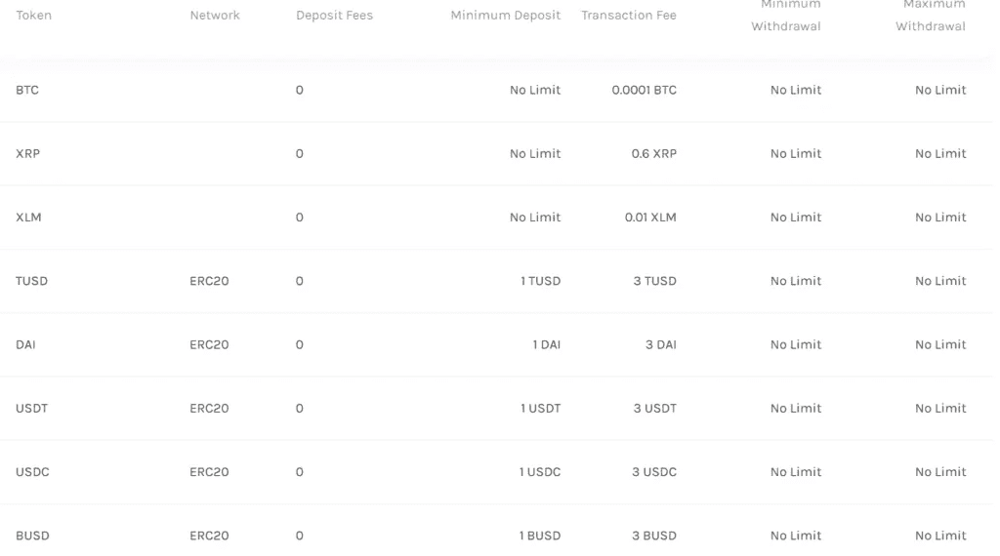

# vauld Review 2022——在印度借出、交易和购买比特币

> 原文：<https://medium.com/coinmonks/vauld-review-2021-lend-trade-and-buy-bitcoin-in-india-e37a96374961?source=collection_archive---------0----------------------->

## 使用印度卢比借出、借入、购买和兑换比特币和其他加密货币[允许使用合众国际社、网上银行和信用卡]

本文我们就来回顾一下 [Vauld](https://vauld.com/register/uzypljiykz) ，成立于 2018 年，总部在新加坡。它们帮助您管理您的加密货币，并允许您借出、借入和交易加密资产。您可以立即在受支持的加密货币和法定货币之间进行转换。此外，它们通过赚取利息来帮助你增加资本。他们以前也被称为霍德勒银行。

他们已经筹集了 200 万美元的种子饲料。他们已经成功与[潘迪拉、](https://www.panteracapital.com/) [比特币基地创投、](https://ventures.coinbase.com/) [CMT 数码](https://cmt.digital/)、 [LuneX、](https://lunex.vc/) Better、[机器人创投](https://robvc.com/)。比特戈和币安分别是他们的监管和交换伙伴。

# 赚取你的比特币和其他加密资产的利息

[Vauld](https://vauld.com/register/uzypljiykz) 让你一存入资金就能获得比特币和其他加密货币的利息。利息按日计算，支出按周转出。你可以随时退出。

最低存款额是价值 1 美元的代币。最高存款没有限制。代币会立即反映在你的账户上，除了比特币通常需要一到六个小时。

定期存款利率更高。锁定期可以是一个月、三个月或六个月，选择退出不会被罚款。如果您选择退出，您将在存款期间获得固定的基本利率。

为了赚取利息，资金必须存在于[金库](https://vauld.com/register/uzypljiykz)钱包中。可以使用 [Metamask](https://metamask.io/) 和 [Trust](https://trustwallet.com/) 等外部钱包。

利息每周或期末复利。每个代币的利率是不同的。有三种不同的利率——储蓄利率、定期存款利率和借款利率。

[Vauld](https://vauld.com/register/uzypljiykz) Interest Rates

# 加密贷款

你可以用你现有的加密资产作为抵押，借低息加密贷款。贷款将被立即批准，代币将被存入。你可以借高达 66.67%的 [LTV](https://en.wikipedia.org/wiki/Loan-to-value_ratio#:~:text=The%20loan%2Dto%2Dvalue%20(,appraised%20value%20of%20real%20property.) 。没有额外的费用或固定的分期付款次数。

最低贷款额是 100 美元。这些贷款的抵押率在 150 %以上，一旦抵押率达到 100%，就会被清算。

# 印度卢比交易

[Vauld](https://vauld.com/register/uzypljiykz) 允许你用 [INR](https://en.wikipedia.org/wiki/Indian_rupee) 买卖密码。他们的流动资金超过 5000 万美元，所有的存款和取款都可以即时处理。

对于在印度的交易，您需要完成[了解您的客户(KYC)](https://en.wikipedia.org/wiki/Know_your_customer) 。你必须提交以下信息-

1.  姓名、电话号码和电子邮件 id
2.  PAN 卡
3.  地址证明(身份证、选民证、护照或驾驶执照)
4.  一张照片

KYC 需要 30 分钟才能被批准。如果你不是印度人，想访问 INR 相关的依赖项，可以写信给[【电子邮件保护】](https://blog.coincodecap.com/cdn-cgi/l/email-protection#f69e939a9a99b68097839a92d895999b)，他们会帮助你。

它们只支持[柜台交易(OTC)](https://en.wikipedia.org/wiki/Know_your_customer) 加密和 INR 对交易。代币的限价单、买卖都是以市场价格进行的。因此，您现在无法查看加密/INR 订单簿。Vauld 团队目前正在进行这项工作。

Vauld OTC Desk

# 企业 API

企业 API 帮助你在不到十分钟的时间内创建一个[加密货币钱包](/coinmonks/hardware-wallets-dfa1211730c6)。它为您提供了一个 API 来创建和管理所有加密货币的钱包。您可以为整个组织创建一个中央钱包，也可以为每个用户创建无限个钱包。此外，他们还提供多签名钱包。

他们支持、瑞士联邦理工学院、、、、派克斯、戴、、英美烟草和 XLM。Vauld 不存储您的私钥。

即时兑换工具适用于所有受支持的加密货币。从可定制的仪表板上可以轻松跟踪您的所有资金详情。

你可以通过整合你的资金和 [Vauld](https://vauld.com/register/uzypljiykz) 的借贷 API 来赚取利息。利息每周复利。下表列出了 APY 的贷款利率。

通过与 [Vauld 的](https://vauld.com/register/uzypljiykz)借用 API 集成，你可以用你现有的加密资产借用法定货币和加密货币。你可以随时重放贷款。他们提供了 66.67% [的 LTV](https://en.wikipedia.org/wiki/Loan-to-value_ratio#:~:text=The%20loan%2Dto%2Dvalue%20(,appraised%20value%20of%20real%20property.) 比率。而且没有隐性收费。下表列出了 APY 借款利率。

# 用于 INR 平轨的 API

它们是一组通用的 API，用于企业集成印度的 FIAT Rails。它们允许您创建 INR 和[加密钱包](/coinmonks/hardware-wallets-dfa1211730c6)，可以向任何钱包或银行账户存款和取款。

您可以购买、出售和即时交换所有支持的加密货币。印度卢比存款或取款不收取任何费用。印度卢比可以通过卡[/UPI/](https://www.npci.org.in/what-we-do/upi/product-overview)[NEFT/](https://en.wikipedia.org/wiki/National_Electronic_Funds_Transfer)[RTGS/](https://www.investopedia.com/terms/r/rtgs.asp#:~:text=The%20term%20real%2Dtime%20gross,books%20of%20a%20central%20bank.)I[MPS 存入。](https://www.npci.org.in/what-we-do/imps/product-overview)从[金库账户](https://vauld.com/register/uzypljiykz)提取资金到任何银行账户需要一个工作日。

要获得更多关于如何开始使用 Vauld enterprise APIs 的信息，你可以点击这里查看[。](https://docs.vauld.com/#61)

# Vauld Review:用户体验

Vauld 提供了一个初学者友好的界面。该应用也可以在[安卓](https://play.google.com/store/apps/details?id=com.bankofhodlers.mobile)和 [iOS](https://apps.apple.com/us/app/bank-of-hodlers/id1509251174?ls=1) 平台上使用。您可以检查您的交易历史，并根据您的需要进行过滤。

它们为您提供了一个可定制的仪表板来管理和跟踪您的资金。

Vauld Dashboard

没有复杂的行话。它支持亮暗两种模式。

Trading Terminal

# 安全性

Vauld 使用多重身份验证来保护您的帐户。他们使用 Google Authenticator 接收一个动态变化的密码，每当你在平台上执行任何关键操作时，你都必须输入该密码。默认情况下不启用。

Vauld 的托管合作伙伴是 [BitGo，](https://www.bitgo.com/)加密行业最受信任的托管人之一。

劳埃德伦敦保险公司为他们投保 1 亿美元的威胁险。

# Vauld 评论:费用

每个代币都有最低存款额、交易费以及最低和最高取款额。没有押金。

所有提款都会立即处理。如果取款金额超过 100，000 美元，将由 Vauld Manager 进行人工验证，以提高安全性。验证在六小时内完成。

Vauld Deposit and Withdrawal Fee

Vauld 遵循一种创造者-接受者模式。每一对都有最低交易金额。

Vauld Trading Fee

使用 INR 时的存款和取款费用根据支付方式而有所不同。每种模式允许不同的最小和最大金额。

Vauld Review: INR Deposit and Withdrawal Fee

他们为 API 产品提供两种类型的计划。

1.  启动计划是负担得起的，是为预算紧张的公司寻找启动他们的用户群。
2.  企业计划—它具有顶级功能，包括可定制的选项和优先支持。

要详细了解这两个计划，你可以联系 Vauld 团队。

# 客户支持

你可以在推特上和他们联系。您也可以通过[【电子邮件保护】](https://blog.coincodecap.com/cdn-cgi/l/email-protection#abc3cec7c7c4ebddcadec7cf85c8c4c6)给他们写信

此外，他们还提供实时聊天功能，您将在不到五分钟的时间内收到回复。

Live Chat

# Vauld 评论:利弊

## 赞成的意见

1.  密码资产的借出、借入和交易
2.  您可以立即在受支持的加密货币和法定货币之间进行转换。
3.  他们提供了一个初学者友好的界面。
4.  企业应用编程接口帮助你创建和管理多个钱包。它们还与 INR FIAT rails 集成。
5.  密码行业的大人物支持他们。
6.  这个平台是完全安全的，而且上了保险。

## 骗局

1.  这是一个相对较新的平台。
2.  您现在无法查看 INR/加密订单簿。

# Vauld 审查:结论

总之， [Vauld](https://vauld.com/register/uzypljiykz) 帮助您无缝管理您的加密资产。它们提供价值储存、资本增长、轻松消费和加密货币交换。

用户友好的界面有助于初学者入门。他们为你的资产提供一个整体的银行系统。

# Vauld 常见问题(常见问题)

**在印度交易需要 KYC 吗？**

是的，您需要完成 KYC 才能开始使用 Vauld 进行交易。你的 KYC 不到 30 分钟就能获得批准。

**我如何用 Vauld 赚取利息？**

你必须把你的资金存入 Vauld 账户。一旦你的资金存入银行，你将开始赚取利息。你每周都会得到利息

**使用 Vauld 还款有哪些条件？**

你可以随时还贷。贷款抵押率超过 150%。抵押物达到 100%就会被清算。你可以贷款的最低金额是 100 美元。

*   *本文包含附属链接*

> 加入 Coinmonks [电报频道](https://t.me/coincodecap)和 [Youtube 频道](https://www.youtube.com/c/coinmonks/videos)了解加密交易和投资

## 另外，阅读

*   [3 商业评论](/coinmonks/3commas-review-an-excellent-crypto-trading-bot-2020-1313a58bec92) | [Pionex 评论](https://coincodecap.com/pionex-review-exchange-with-crypto-trading-bot) | [Coinrule 评论](/coinmonks/coinrule-review-2021-a-beginner-friendly-crypto-trading-bot-daf0504848ba)
*   [莱杰 vs n 格拉夫](/coinmonks/ledger-vs-ngrave-zero-7e40f0c1d694) | [莱杰纳诺 s vs x](/coinmonks/ledger-nano-s-vs-x-battery-hardware-price-storage-59a6663fe3b0) | [币安评论](/coinmonks/binance-review-ee10d3bf3b6e)
*   [Bybit 交易所评论](/coinmonks/bybit-exchange-review-dbd570019b71) | [Bityard 评论](https://coincodecap.com/bityard-reivew) | [Jet-Bot 评论](https://coincodecap.com/jet-bot-review)
*   [3 commas vs crypto hopper](/coinmonks/3commas-vs-pionex-vs-cryptohopper-best-crypto-bot-6a98d2baa203)|[赚取加密利息](/coinmonks/earn-crypto-interest-b10b810fdda3)
*   最好的比特币[硬件钱包](/coinmonks/hardware-wallets-dfa1211730c6) | [BitBox02 回顾](/coinmonks/bitbox02-review-your-swiss-bitcoin-hardware-wallet-c36c88fff29)
*   [block fi vs Celsius](/coinmonks/blockfi-vs-celsius-vs-hodlnaut-8a1cc8c26630)|[Hodlnaut 审核](/coinmonks/hodlnaut-review-best-way-to-hodl-is-to-earn-interest-on-your-bitcoin-6658a8c19edf) | [KuCoin 审核](https://coincodecap.com/kucoin-review)
*   [Bitsgap 审查](/coinmonks/bitsgap-review-a-crypto-trading-bot-that-makes-easy-money-a5d88a336df2) | [Quadency 审查](/coinmonks/quadency-review-a-crypto-trading-automation-platform-3068eaa374e1) | [Bitbns 审查](/coinmonks/bitbns-review-38256a07e161)
*   [加密复制交易平台](/coinmonks/top-10-crypto-copy-trading-platforms-for-beginners-d0c37c7d698c) | [Coinmama 评论](/coinmonks/coinmama-review-ace5641bde6e)
*   [印度加密交易所](/coinmonks/bitcoin-exchange-in-india-7f1fe79715c9) | [比特币储蓄账户](/coinmonks/bitcoin-savings-account-e65b13f92451)
*   [OKEx vs KuCoin](https://coincodecap.com/okex-kucoin) | [摄氏替代品](https://coincodecap.com/celsius-alternatives) | [如何购买 VeChain](https://coincodecap.com/buy-vechain)
*   [币安期货交易](https://coincodecap.com/binance-futures-trading)|[3 commas vs Mudrex vs eToro](https://coincodecap.com/mudrex-3commas-etoro)
*   [如何购买 Monero](https://coincodecap.com/buy-monero) | [IDEX 评论](https://coincodecap.com/idex-review) | [BitKan 交易机器人](https://coincodecap.com/bitkan-trading-bot)

Vauld review