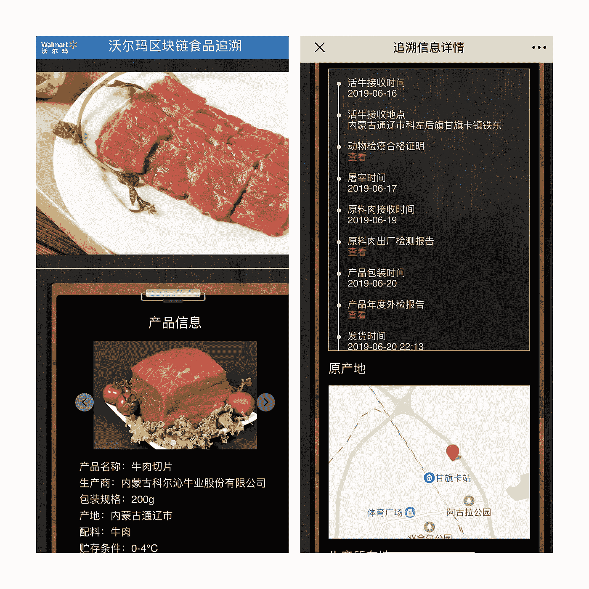
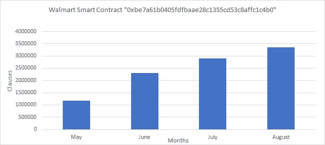
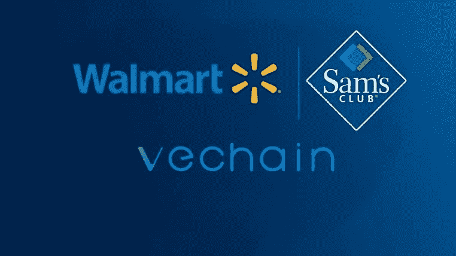

# 威奇恩&沃尔玛中国

> 原文：<https://medium.com/coinmonks/vechain-walmart-china-7f6acf138cb3?source=collection_archive---------2----------------------->

追溯到[2019 年 6 月 25 日](https://www.prnewswire.com/news-releases/walmart-china-takes-on-food-safety-with-vechainthor-blockchain-technology-300874047.html)，Vechain 和沃尔玛中国与普华永道达成战略协议。这导致了沃尔玛区块链可追溯系统的创建，让我们看看与该系统相关的智能合同。

“[0 xbe 7a 61 b 0405 fdfbaae 28 c 1355 CD 53 c8 affc 1 C4 b 0](https://vechainstats.com/account/0xbe7a61b0405fdfbaae28c1355cd53c8affc1c4b0/)”是与沃尔玛在区块链 Vechains 上建立的区块链可追溯系统相关的主要智能合同。在编写本报告时，它自成立以来已处理了 10 389 066 条条款。

沃尔玛中国和山姆会员商店的许多不同产品都与这份合同有关，这份合同已经在超市中出现，并在社交媒体上发布。Vechain 和沃尔玛中国都没有在 mainnet 上明确标注这些合同，但根据提供的证据，它们的用途非常明显。

这是这个系统的一个例子，你可以在这里了解更多。

根据来自 Vechain 的[新闻稿](https://www.prnewswire.com/news-releases/walmart-china-takes-on-food-safety-with-vechainthor-blockchain-technology-300874047.html):

“预计到 2020 年底，沃尔玛中国的可追溯系统将使可追溯鲜肉占包装鲜肉总销售额的 50%，可追溯蔬菜占包装蔬菜总销售额的 40%，可追溯海鲜占海鲜总销售额的 12.5%。”

这是在 2019 年 6 月底做出的一项重大声明。让我们来看看智能合约在过去几个月的使用情况，看看它们已经走了多远。

Increasing data clauses run by Walmart Smart Contract in the past 4 months.

该智能合同处理的条款数量在过去 4 个月中持续增长。

*   5 月:1 167 195 人
*   六月:2295898 人
*   7 月:2 902 502 人
*   8 月份:3355616 人

从 5 月到 8 月底，他们的智能合约使用量增加了近 200%！！

令人印象深刻的是，在今年发生的所有事情中，他们能够尽可能多地增加智能合同的使用。距离年底还有几个月的时间，我预计这份合同处理的条款数量将缓慢但肯定会继续增加，因为沃尔玛中国希望覆盖 50%的包装鲜肉、40%的包装蔬菜和 12.5%的海鲜，这些都可以在区块链的 Vechains 上追溯。

基于智能合同的使用，我认为沃尔玛中国将无法在年底前覆盖他们设定的所有产品和产品线，但这个目标是在我们知道今年会是什么样的曲线球之前实现的。

该系统将允许所有相关方在供应链的特定点上传数据，以带来更大的可见性和信任。

例如，从原材料形式的产品的开始阶段到最终客户，都可以进行跟踪，并在供应链的特定点上传相关时间戳，温度、物流、认证和安全数据等信息都可以散列到区块链 Vechains，以显示产品旅程的完整历史。

为沃尔玛这样的大型跨国公司管理供应链绝非易事，而 Vechain 已经在沃尔玛中国及其供应商的供应链数字化方面取得了长足的进步。

就收入而言，沃尔玛是《财富》杂志排名第一的公司，它通过[利用区块链 Vechains](https://www.pwccn.com/en/press-room/press-releases/pr-250619.html)技术和在[物联网传感器和冷链物流基础设施](https://chainstoreage.com/operations/walmart-dramatically-increases-supply-chain-commitment-in-china)方面的深度投资，极大地提高了其供应链及其供应商的效率和可见性，以充分利用复杂的分布式供应链。

该系统的基础和基础设施已经奠定，现在是扩展的时候了。

这份智能合同将是一个很好的标尺，可以看出这个新的食品追溯系统在沃尔玛中国未来的运营中发挥了多大的作用。

## 另外，阅读

*   最好的[密码交易机器人](/coinmonks/crypto-trading-bot-c2ffce8acb2a)
*   [密码本交易平台](/coinmonks/top-10-crypto-copy-trading-platforms-for-beginners-d0c37c7d698c)
*   最好的[加密税务软件](/coinmonks/best-crypto-tax-tool-for-my-money-72d4b430816b)
*   [最佳加密交易平台](/coinmonks/the-best-crypto-trading-platforms-in-2020-the-definitive-guide-updated-c72f8b874555)
*   最佳[加密贷款平台](/coinmonks/top-5-crypto-lending-platforms-in-2020-that-you-need-to-know-a1b675cec3fa)
*   [最佳区块链分析工具](https://bitquery.io/blog/best-blockchain-analysis-tools-and-software)
*   [加密套利](/coinmonks/crypto-arbitrage-guide-how-to-make-money-as-a-beginner-62bfe5c868f6)指南:新手如何赚钱
*   最佳[加密制图工具](/coinmonks/what-are-the-best-charting-platforms-for-cryptocurrency-trading-85aade584d80)
*   [莱杰 vs 特雷佐](/coinmonks/ledger-vs-trezor-best-hardware-wallet-to-secure-cryptocurrency-22c7a3fd391e)
*   了解比特币的[最佳书籍有哪些？](/coinmonks/what-are-the-best-books-to-learn-bitcoin-409aeb9aff4b)
*   [3 商业评论](/coinmonks/3commas-review-an-excellent-crypto-trading-bot-2020-1313a58bec92)
*   [AAX 交易所评论](/coinmonks/aax-exchange-review-2021-67c5ea09330c) |推荐代码、交易费用、利弊
*   [Deribit 审查](/coinmonks/deribit-review-options-fees-apis-and-testnet-2ca16c4bbdb2) |选项、费用、API 和 Testnet
*   [FTX 密码交易所评论](/coinmonks/ftx-crypto-exchange-review-53664ac1198f)
*   [n 零审核](/coinmonks/ngrave-zero-review-c465cf8307fc)
*   [Bybit 交换审查](/coinmonks/bybit-exchange-review-dbd570019b71)
*   [3Commas vs Cryptohopper](/coinmonks/cryptohopper-vs-3commas-vs-shrimpy-a2c16095b8fe)
*   最好的比特币[硬件钱包](/coinmonks/the-best-cryptocurrency-hardware-wallets-of-2020-e28b1c124069?source=friends_link&sk=324dd9ff8556ab578d71e7ad7658ad7c)
*   最佳 [monero 钱包](https://blog.coincodecap.com/best-monero-wallets)
*   [莱杰纳米 s vs x](https://blog.coincodecap.com/ledger-nano-s-vs-x)
*   [bits gap vs 3 commas vs quad ency](https://blog.coincodecap.com/bitsgap-3commas-quadency)
*   [莱杰纳米 S vs 特雷佐 one vs 特雷佐 T vs 莱杰纳米 X](https://blog.coincodecap.com/ledger-nano-s-vs-trezor-one-ledger-nano-x-trezor-t)
*   [block fi vs Celsius](/coinmonks/blockfi-vs-celsius-vs-hodlnaut-8a1cc8c26630)vs Hodlnaut
*   Bitsgap 评论——一个轻松赚钱的加密交易机器人
*   为专业人士设计的加密交易机器人
*   [PrimeXBT 审查](/coinmonks/primexbt-review-88e0815be858) |杠杆交易、费用和交易
*   [埃利帕尔泰坦评论](/coinmonks/ellipal-titan-review-85e9071dd029)
*   [赛克斯·斯通评论](https://blog.coincodecap.com/secux-stone-hardware-wallet-review)
*   [区块链评论](/coinmonks/blockfi-review-53096053c097) |从您的密码中赚取高达 8.6%的利息