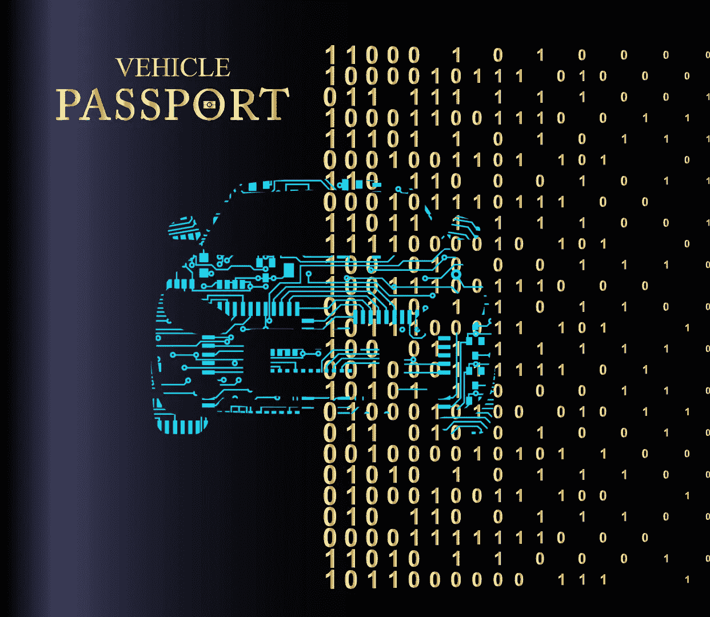
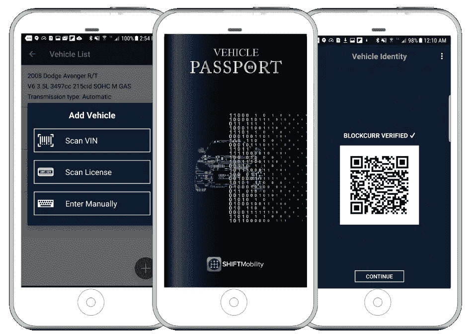

# 车辆护照——业内首个用于汽车所有权和记录转移的区块链应用

> 原文：<https://medium.com/coinmonks/vehicle-passport-industrys-first-blockchain-application-for-car-ownership-and-transfer-of-3c748dbf090a?source=collection_archive---------3----------------------->

SHIFTMobility Inc. 2018

在汽车行业，数百万辆汽车[1][2]、OEM 和售后零件正在被数字化，以确保顺利的维护和服务、公平市场价值的评估、保险范围、买卖时的车辆转让，以及防止欺诈。

每辆车都有一个独特的指纹来证明它的出处，以及当它们磨损和失效时它的部件的出处。唯一标识符跟踪车辆的制造来源，确保经销商和服务中心可以立即获得年份制造模型、故障代码、维护要求和服务历史，以便当车辆到达最近的位置进行换油、维修和维护工作时，他们可以获得正确的产品-所有这一切都通过 SHIFTMobility 汽车区块链技术实现。

> *Vehicle Passport 是由 SHIFTMobility 开发的一款基于多维分布式账本技术的新型去中心化 App，名为“聚 DLT”*

专为汽车供应链设计的 Poly-DLT 是一种创新技术，用于存储和记录数字文档和交易，如销售契约、所有权、保险、所有权证明声明和收据。每个数据块在区块链上以加密方式链接在一起，以防止篡改，并通过算法和数字签名进一步增强，以便在主网络上的对等节点上传输。随着新数据的添加，数据块会自动交付到消费者账户，并在交易发生时提供完整的审计跟踪。消费者还可以使用智能手机向自动区块链添加收据。

如果您要转让所有权或出售您的车辆，车辆护照应用程序可以很容易地将完整的历史记录交换给新车主。SHIFTMobility 还将支持加密货币支付选项，通过数字交换提供更快、更便宜的方式与在我们网络上注册的组织开展业务。

> SHIFTMobility Poly-DLT 可以通过在区块链合同上登记他们的消耗库存，帮助经销商在您附近储存正确的零件。由于订单是自动化的，零件制造商的上游交易也可以即时执行，保证现在和将来每英里都有持续的零件供应

Vehicle Passport*还为车主提供 AUTON 加密令牌[3][4] [5]，用于服务和维修、购买零件，或者保存在他们的数字钱包中以备后用。

**更多* [*车辆护照*](https://play.google.com/store/apps/details?id=com.shiftmobility.vehiclepassport) *信息请查看谷歌应用商店。*

> *截至 2018 年 7 月 23 日，区块链新增了两千万个零件。如果您是零件制造商或经销商，请联系我们要求演示。*

__________________________________________________________________________

[1] [估计有 2.63 亿辆汽车在美国注册，其中大部分是乘用车](https://en.wikipedia.org/wiki/Passenger_vehicles_in_the_United_States)

[2][2017 年美国汽车销量总计 1725 万辆](https://www.automobilemag.com/news/u-s-auto-sales-totaled-17-25-million-calendar-2017/)

[3] [标志化汽车工业](https://www.linkedin.com/feed/update/urn:li:activity:6426771090625953792)

[4] [SHIFTMobility 利用全球首个安全的汽车区块链平台解放车辆数据，新闻稿，2018 年 5 月 10 日](http://shiftmobility.com/press-releases/shiftmobility-liberates-vehicle-data-worlds-first-secure-automotive-blockchain-platform/)

[5] [为您的爱车配备 AUTON 如何获得？](https://www.linkedin.com/pulse/auton-your-car-how-get-arvind-jain/)

__________________________________________________________________________

*SHIFTMobility AUTON 是 SHIFTMobility Inc .的注册商标*

*2018 SHIFTMobility Inc.*