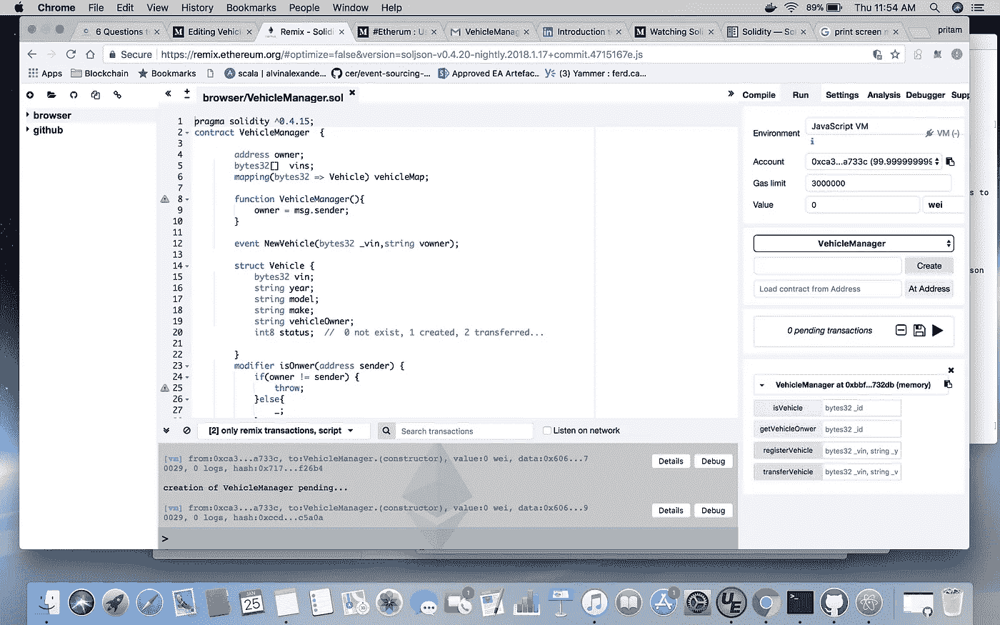

# 使用以太坊、Solidity & Truffle 在区块链上进行车辆记录和服务维护..(第一部分)

> 原文：<https://medium.com/coinmonks/vehicle-record-and-service-maintenance-on-blockchain-using-ethereum-solidity-truffle-part-1-2aa1d2e86a44?source=collection_archive---------0----------------------->

2015 年，我卖掉汽车后从班加罗尔搬到了迪拜。顺便提一下，每当新主人拜访服务中心时，我都会收到来自服务中心的“感谢”电子邮件。

问题在于 CRM 记录没有更新，他们不知道新的所有者，车辆登记记录在政府和道路运输管理局(RTA)处。此外，服务请求是在笔和纸，不更新他们的客户关系管理记录。在上面的例子中，很少有实体独立地为同一辆车工作。

1)区块链适用于我的场景吗？

区块链对场景有吸引力，它增加了效率、透明度和转型。在上述场景**中，多方**参与并持有同一资产的**记录系统**版本，他们的业务流程不一致或**共享信息**。

2)我可以在该场景中使用什么技术？

有多个区块链平台可用，我在测试/开发节点上使用以太坊。

3)如何将现有流程转化为智能合同？

智能合约本质上代表了存储在区块链上的“状态”,包含资产转移规则。

在以下存储并在以太坊上执行的智能合同中，区块链将向车主注册一辆新车，并记录车辆向新车主的任何转让。可以检索车辆维修历史记录，这将在第 2 部分中探讨。契约是使用 Solidity 实现的。Solidity 是一种面向契约的高级语言，用于实现智能契约。

a.车辆对象是用车辆信息创建的，并保持一种状态。

```
struct **Vehicle** {
 bytes32 vin;
 string year;
 string model;
 string make;
 string vehicleOwner;
 int8 status; // 0 not exist, 1 created, 2 transferred…
}
```

b.使用车辆管理器合同注册车辆时，将 VIN 与 YMM 和车主一起作为关键标识符。

```
function **registerVehicle**(bytes32 _vin,string _year,string _model,string _make,string _vonwer) isOnwer(msg.sender) public{

 require(!isVehicle(_vin));
 vins.push(_vin);
 vehicleMap[_vin] = Vehicle(_vin,_year,_model, _make,_vonwer, 1); 
 }
```

c.将车辆转让给新车主时，使用 VIN 作为标识符，并将车辆登记在新车主名下。车辆状态代表车辆的不同状态。

```
function **transferVehicle**(bytes32 _vin,string _voner) public isOnwer(msg.sender) returns(string) {
 require(isVehicle(_vin));
 vehicleMap[_vin].vehicleOwner = _voner;
 vehicleMap[_vin].status = 2;
}
```

我们将使用 Remix online Solidity 编辑器来编译和测试合同。使用 Remix editor 的优势在于，您可以在 Javascript VM 上快速部署契约，它将创建一个简单的测试 GUI 来运行这些功能。它还包括一个调试器。



如您所见，契约已经在 Javascript VM 上编译和部署(点击 create 按钮)。可以测试一下契约的功能，点击灰色的 ***按钮*** 返回不需要花费“气”的***getter***和 ***桃按钮*** 是***setter***在网络中的每个节点上为共识 而执行 ***因此需要 ***花费气******

*完整的合同代码可以在*[*github*](https://github.com/pritamdewan/vehicle-service)*找到。*

> [直接在您的收件箱中获得最佳软件交易](https://coincodecap.com/?utm_source=coinmonks)

[](https://coincodecap.com/?utm_source=coinmonks)