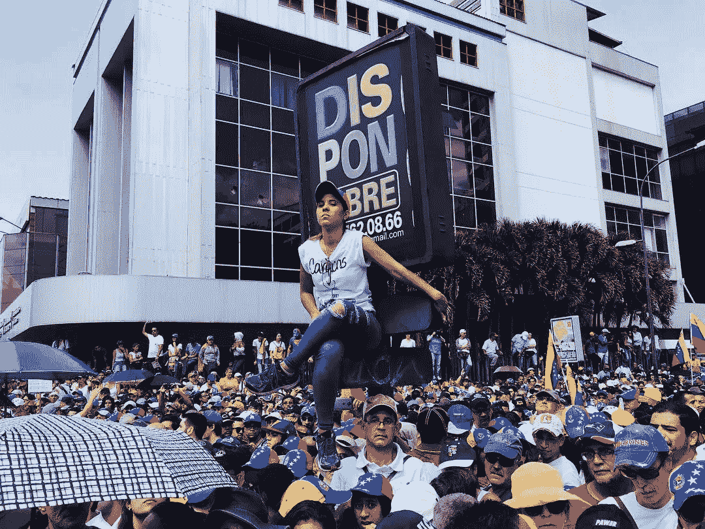
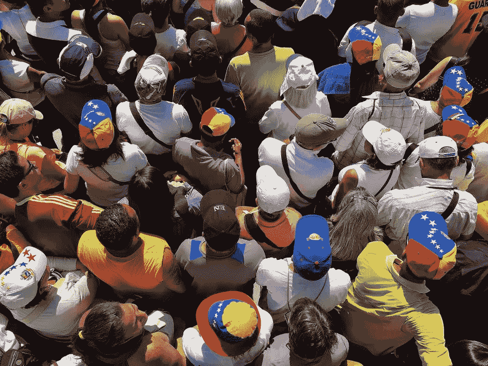

# 委内瑞拉人和区块链

> 原文：<https://medium.com/coinmonks/venezuelans-and-blockchain-d82a710b8b9?source=collection_archive---------2----------------------->

如果你相信区块链技术，相信它改变社会的力量和潜力，看看来自委内瑞拉的最新照片。在加拉加斯街头的抗议者人群中，你会发现像你一样的人。我们要去那里，记录这一历史时刻，把它放进我们的 [*像样的纪录片*](http://decentdocumentary.com) *里，把那些伟人的故事传下去。你可以* [*帮助*](https://www.indiegogo.com/projects/decent-documentary-for-latin-america#/) *我们！*

Santiago Siri for Decent Documentary: “*Every Venezuelan is aware of the relevance of these technologies”* ***PHOTO: Courtesy of Patryk Michalski, RMF FM***

想想区块链，委内瑞拉人不只是展望未来。他们中的许多人现在就在使用它，它已经在这些非常困难的时期帮助了他们的生活。[在持续的危机中，比特币交易量创下历史新高](https://cointelegraph.com/news/bitcoin-trading-reaches-all-time-high-in-venezuela-amidst-ongoing-economic-collapse)。圣地亚哥·西里，阿根廷人，掌管着[民主。地球](https://www.democracy.earth)，一个位于区块链的致力于改善民主的项目，告诉我们委内瑞拉和委内瑞拉人民是最重要的使用案例之一。"**每个委内瑞拉人都知道这些技术的相关性，当你与他们交谈时，你会发现一群人非常精通加密，他们使用 protonmail 而不是 gmail，甚至使用 Zcash 而不是比特币。他们非常清楚自己的隐私，知道如何保持在线安全。对我们来说，这是一个完美的背景——这项技术可以真正服务于改变人们生活的目的，帮助他们在一个失败的政府领导的充满敌意和腐败的环境中找到生存的手段。**

## 感兴趣，开放，愿意

每当你与来自那个国家的人交谈时，你确实会有一种感觉，你正在与一个感兴趣的、开放的、愿意越来越多地了解潜伏在区块链的各种可能性的人交谈。在我们电影制作的过程中，我们采访了完全符合 Siri 描述的委内瑞拉人。其中一次对话发生在[block chain On Tour——Latin America 或 BoT LatAm](https://twitter.com/botlatam) 期间，这是推广这项技术的第一次旅行，由已经有现有产品的项目组织。在厄瓜多尔，我们观看了 Swarm City、Giveth、Status、Dether、Appics 和 Etherisc 如何谈论他们的 dApps 以及他们如何在日常生活中帮助人们。在瓜亚基尔圣埃斯皮里图大学拥挤的大厅里，我见到了塞尔吉奥·苏亚雷斯，他是一名学生，几个月前和他的直系亲属逃离了委内瑞拉。**那边的情况变得越来越糟。两三年前有稳定工作的人发现自己在翻垃圾以求生存。人们死于饥饿，死于糟糕的卫生条件。20%到 30%的经济是靠人们从海外汇给家人的钱来维持的，所以这根本不是一个可持续的模式。这是一个世纪以来最严重的社会和经济危机。另一个问题是安全。你不可能真的走在夜路上有安全感。你必须在下午 6 点或 7 点前回家，否则你会有遭遇罪犯的危险。我爸爸两年前在街上被抢劫时差点丢了性命。政府不关心人民，他们只关心充实自己。还有权力——没有制衡，他们控制着司法系统**”——他描述了他的国家的情况。他以前听说过区块链，他对加密货币也有自己的看法。“我相信，对于许多像委内瑞拉这样处境危险的人来说，这是一种解脱。这是你可以用来把自己从这个偏执狂政府中释放出来的东西，来缓解这个问题的经济部分。如果这项技术被大众接受和使用，没有人需要再依赖腐败的中央政府了。感谢 BoT LatAm 在这里的会面，我已经知道我可以很容易地用 Dether 给我的家人寄钱。有了 Swarm City，那里的学生可以为自己提供一些小服务，并获得密码作为回报。虽然这段关于技术的简短对话唤起了他的兴奋，并且在他的眼中汲取了一种希望，但他很难乐观。“对经济来说，还能有多糟糕？政府还能偷多少？我们已经到达底部了吗？如果他们用光了所有的石油，如果他们彻底搞垮了经济，人民会怎么样？”

Sergio Suarez on the situation in his native Venezuela (as of the end of November 2018).

正是这种戏剧性的情况促使许多委内瑞拉人寻找可以帮助他们生存的替代活动形式。

## “听起来很疯狂，但这是现实”

我们的另一位对话者爱德华多·戈麦斯就是这种情况，他是一名程序员，尽管年纪很小，但在逃离委内瑞拉之前，就已经了解了那里监狱的味道。戈麦斯讲述了他在布拉格最后一版《敌无双》中的经历。我们在那里相遇，有机会倾听他的故事，并试图理解是什么让委内瑞拉人更接近区块链。“人们玩游戏来赚取虚拟货币。它不需要是一种密码货币。只是虚拟课程。人们在玩魔兽世界，他们经营账户，出售账户中的黄金，这比去委内瑞拉工作更有意义。在网上做事比在委内瑞拉做一份真正的工作赚的钱多得多。听起来很疯狂，但这是事实。”

Blockchain seems perfectly tailored for Venezeulens. ***PHOTO: Courtesy of Patryk Michalski, RMF FM***

委内瑞拉人非常清楚如何利用区块链为自己谋利，并摆脱桑提亚哥·西里在我们的采访中描述的陷阱。“我们正处于“土地”和“云”之间的大冲突中。在这片土地上，政府垄断了武力，法律控制了我们的身体，控制了领土；在云上，有少数公司拥有存储我们的数据、信息、隐私的基础设施，而且——因为有广告公司，他们垄断了我们的思维。他们不停地告诉我们该想什么，该渴望什么。**所以我们的思想被困在云中，我们的身体被困在陆地上**——他说。中间的内容应该有助于增强人们的能力，他们到目前为止在这个问题上没有什么可说的，区块链在这方面可以做得很好。诚然，委内瑞拉人需要比不断发展的技术更多的基本东西，但我们已经知道，他们可以很好地利用它，成为全世界的榜样。

## 支持我们！

在“体面”。Blockchain 如何改变世界”纪录片，我们开始众筹活动，以筹集资金到达委内瑞拉。这场运动是你支持我们的机会。为了解释区块链，我们已经进入了孟加拉国的贫民窟和难民营，调查了遭受自然灾害的波多黎各人民的需求。我们倾听了欧洲、加拿大和美国最鼓舞人心的项目和想法。现在我们想去委内瑞拉——对于那些相信这项技术能够带来真正改变的人来说，这个地方应该是一个伟大而重要的象征。[我们需要你的支持。](https://www.indiegogo.com/projects/decent-documentary-for-latin-america#/)

Marek Osiecimski*

*   *Marek Osiecimski 是* [*Refugium 基金会*](http://refugium.pl) *的首席执行官和创始人，该基金会是一家非营利性组织，旨在通过电影、视觉艺术、会议和研讨会促进分散技术的使用。它的第一个项目是一部名为* [*《体面》的长篇纪录片。区块链能改变世界吗？”*](http://decentdocumentary.com) *。多亏了一群热衷于权力下放的人——项目和个人捐助者，基金会才得以完成这部电影的拍摄。仍然是* [*筹集资金*](https://www.indiegogo.com/projects/decent-documentary-for-latin-america#/) *才能回到拉丁美洲完成金融排外的拍摄，特别是在委内瑞拉，并开始后期制作。要了解如何成为这部纪录片的一部分，请访问他们的登陆页面*[【decentdocumentary.com】](http://decentdocumentary.com)*和/或支持* [*众筹活动*](https://www.indiegogo.com/projects/decent-documentary-for-latin-america#/) *。*

> [直接在您的收件箱中获得最佳软件交易](https://coincodecap.com/?utm_source=coinmonks)

