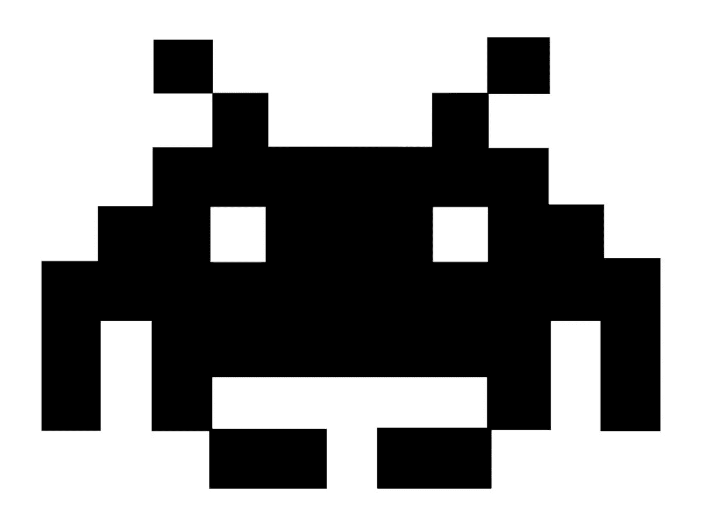

# 冒险进入老挝:比较 MolochDAO 和 vmLAO 的坚固性设计

> 原文：<https://medium.com/coinmonks/venturing-into-the-lao-comparing-molochdao-and-vmlao-solidity-designs-81da2361dba5?source=collection_archive---------2----------------------->



👹 + 👾 = ❤️

[*最近宣布的由*](/openlawofficial/the-lao-a-for-profit-limited-liability-autonomous-organization-9eae89c9669c) *[OpenLaw](https://www.openlaw.io/) 支持的项目 LAO* 旨在为新以太坊风险企业提供法律形式和结构模型，该项目大量借鉴了[Moloch DAO smart contract framework](https://github.com/MolochVentures/moloch)以实现以下资金管理的关键目标:

*   ***简单坚固安全*；**
*   ***托管提案*；**
*   ***优雅退场*；**

通过这种方式，Moloch 设计有助于限制成员竞争的区域，并且同样支持围绕数字基金赠款的私人订购的简单模板。将这种形式扩展到 venture 并不是一个沉重的技术提升，而且 [Moloch v2 合同升级](https://twitter.com/MolochDAO/status/1166693888008081410?s=20)也为在线融资的自动化方面提供了一个有前途的补充设计。

**我们的**[***vmLAO***](https://github.com/openlawteam/TheLAO/blob/master/contracts/TheLAO.sol)**设计通过原始的 Moloch DAO 投票轨道合并链上成员和资金提案，并进行一些定制的经济更改，以适应 ERC20 令牌互换和会计逻辑*LAO*成员红利和投资记录。**

随着我们的迭代，我们期待着与其他项目合作，围绕 Moloch 和类似的在线公会框架建立风险设计。

下面重点介绍了我们从 Moloch 派生出的简化的 vmLAO 设计的初步方法: [*请提出意见、问题和建议！*](https://thelao.slack.com/join/shared_invite/enQtNzMyNjc0OTUwMzM4LTBmOGMxZmMzYzcyOWQ5MTlkYWJmYWYyNmYyNjkzM2Y1Mzg2NzZhOGM5MDQ1ZTVkOTNkZTk2MjM5NWE1ZDFmOWI)

## ***多令牌支持***

```
IERC20 public contributionToken; 
IERC20 private tributeToken; 
```

*vmLAO* 跟踪两种令牌类型:

(I)“**出资权标，”**成员出资的基本权标，以获得公会银行的有表决权的股份和经济利益(以及，哪些风险企业在*中请求资助)，如 DAI 或 wETH，以及

(ii) " **贡品代币**， *vmLAO* 智能合同在会员资格和/或资金提案期间托管的代币(*如果请求有投票权的股份，这将很可能匹配贡献代币类型*)。

与最初的 Moloch 设计类似，如果 *vmLAO* 提案失败，存放的贡品令牌金额将自动返还给 *vmLAO* 申请人。

*与 Moloch* 不同，LAO 成员不需要作为提案保证金。确定参与者和会员协议后，*LAO*将初步探索法律责任如何帮助优化参与并减少提案流程中的垃圾邮件(*尽管存款机制不会影响未来的实施！*)。

## **核算经济权重**

```
uint256 public totalContributed = 0; 
uint256 public totalDividends = 0; 
uint256 public totalWithdrawals = 0;
```

*vmLAO* 设计跟踪三个值，以在内部说明任何成员都可以通过*ragequitying*exit 申请红利或完全提取的公会银行总额的*公平份额*:(I)“**贡献总额**、( ii)“**红利总额**”、(iii)“**提取总额**。”

当一个提议被处理时，基本令牌中的贡献被跟踪为一个总和(*匹配 vmLAO 向公会银行*存入的任何金额):

```
if (proposal.tributeToken == contributionToken) { 
totalContributed = totalContributed.add(proposal.tributeAmount); 
}
```

对 Moloch 成员结构的少量添加也考虑了个人代币贡献和从公会银行总额中提取的红利，允许 *vmLAO* 在运行的基础上计算个人经济份额:

```
struct Member {     
address delegateKey; 
uint256 shares;   
bool exists;     
**uint256 tributeAmount;**
uint256 highestIndexYesVote; 
**uint256 lastTotalDividends;** 
}
```

## **添加风险管理**

```
modifier onlySummoner {
require(msg.sender == summoner);     
_; 
}
```

*vmLAO* 还有一个额外的修饰符‘only 召唤师’，它允许智能契约构造者设置的召唤师地址对公会银行拥有某些有限的管理特权:(i) *撤回*投资资产，以及(ii) *宣布*贡献成员应得的红利:

***管理员收回资产* :**

```
function adminWithdrawAsset(IERC20 assetToken, address receiver, uint256 amount) onlySummoner public returns (bool) {     **require(assetToken != contributionToken);** 
return guildBank.adminWithdrawAsset(assetToken, receiver, amount); 
}
```

***管理员宣布分红* :**

```
updateTotalDividends(uint256 newDividendAmount) onlySummoner public { totalDividends = totalDividends.add(newDividendAmount); 
}
```

**注**:召唤师管理员不允许单方面提取公会银行中的基础贡献令牌金额；相反，他们必须通过常规的 vmLAO 提案流程申请此类资金(如*的*DeFi 储蓄策略)。除了在 Moloch v2 venture design 中删除不合规成员的“公会踢”机制之外，我们还在研究添加类似的成员投票机制的好处，以删除/分配对 LAO 功能的管理权限，这些功能出于法律或其他预防原因可能需要管理关注。

## **新增资金拨付**

虽然最初的 Moloch 代码要求贡品申请人退出/退出公会并烧毁投票份额，以便根据他们的投票权重申请资金，但 *vmLAO* 消除了这种纯粹资金请求的跟进机制，并在投票和经济之间进行了划分。为此，提案功能包含一个附加字段“请求的**资金**”，该字段在处理批准后将基本缴款令牌中的此类金额支付给申请人(*此类金额也计入从公会银行提取的总金额*):

```
require(
guildBank.withdrawFunds(proposal.applicant, proposal.fundsRequested), "Moloch::processProposal - withdrawal of tokens from guildBank failed"
);
```

最后，让我们来看看这个关于 Moloch 的附加经济脚本是如何为每个 LAO 成员的*VM LAO*raq 退出和分红功能发挥重要作用的:

***成员退出:***

```
function ragequit() public onlyMember {     
Member storage member = members[msg.sender]; require(canRagequit(member.highestIndexYesVote), "Moloch::ragequit - cant ragequit until highest index proposal member voted YES on is processed"); **uint256 withdrawalAmount = (member.tributeAmount / totalContributed) * (totalContributed + totalDividends - totalWithdrawals);** // burn shares and other pertinent membership records     totalShares = totalShares.sub(member.shares);     
member.shares = 0;     
**member.tributeAmount = 0;**      

**totalWithdrawals = totalWithdrawals.add(withdrawalAmount);** // update total guild bank withdrawal tally to reflect raqequit amount // instruct guild bank to transfer withdrawal amount to ragequitter     
require(         
guildBank.withdraw(msg.sender, **withdrawalAmount**),         "Moloch::ragequit - withdrawal of tokens from guildBank failed"     ); 

emit Ragequit(msg.sender); 
}
```

正如上面的计算可能表明的那样，这种设计旨在允许 *vmLAO* 衡量成员对其基础令牌金额的贡献，该令牌金额用于资助*LAO*的风险投资和管理，将他们的公平经济“份额”归因于他们退出时可以提取的公会银行资金。

**注** : *与 Moloch* 不同，这一初始退出延期不允许成员退出少于其总出资额的金额(*根据通过投票*的分配进行调整)，尽管我们正在考虑更零碎的设计的好处。

***会员索取红利:***

```
function claimDividend() public onlyMember { 
Member storage member = members[msg.sender]; // claim fair share of declared member dividend amount uint256 dividendAmount = (member.tributeAmount / totalContributed) * (totalDividends — member.lastTotalDividends); // instruct guild bank to transfer fair share to member 
require( 
guildBank.withdrawDividend(msg.sender, dividendAmount), “Moloch::claimDividend — withdrawal of tokens from guildBank failed” ); member.lastTotalDividends = member.lastTotalDividends.add(dividendAmount); totalWithdrawals = totalWithdrawals.add(dividendAmount); 
}
```

如上所述，*LAO*成员可以调用 *vmLAO* 智能合约来提取其通过公会银行基金的批准投资而获得的已宣布股息份额。

## 结论

*LAO*和 *vmLAO* Solidity 设计将以太坊领域中用于赠款的原始 Moloch 设计扩展到利润驱动的风险投资，其经济扩展保留了投票和成员管理简单性的核心 Moloch 优势，同时适度地适应了受监管环境中的盈利性业务问题。

> [在您的收件箱中直接获得最佳软件交易](https://coincodecap.com/?utm_source=coinmonks)

[](https://coincodecap.com/?utm_source=coinmonks)