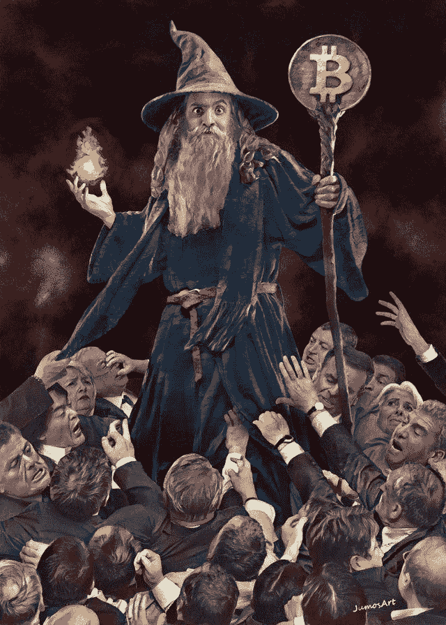
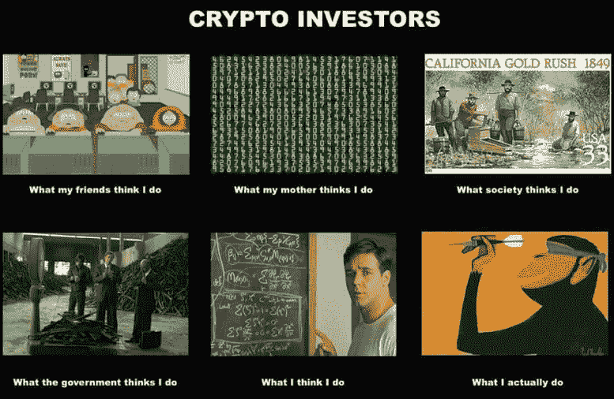
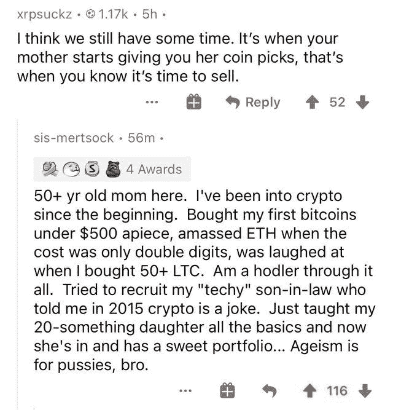

# 边缘双重消费攻击|万事达卡将启用加密支付

> 原文：<https://medium.com/coinmonks/verge-double-spend-attack-mastercard-will-enable-crypto-payments-d860635b2e77?source=collection_archive---------5----------------------->

[Institutional FOMO for magic internet money](https://www.reddit.com/r/Bitcoin/comments/ljr87k/i_made_a_painting_institutional_fomo_for_magic/)

## BNY·梅隆宣布加密托管|埃隆·马斯克提供资金帮助 Dogecoin

*   Verge 受到了区块链一项大规模重组的打击，导致超过 6 个月的交易和余额消失。然而，开发者声称它可以被修复。
*   万事达卡(Mastercard)正计划在今年晚些时候为商户提供接受加密货币支付的选项。
*   分散金融协议(DeFi) Cream Finance 和 Alpha Finance 是周六上午有史以来最大的一次闪贷攻击的受害者，导致资金损失总计 3750 万美元。

## [Bitsgap](https://blog.coincodecap.com/go/bitsgap) 交易报价:

> *“如果你不能承受一个小损失，你迟早会承受所有损失之母。”——艾德·塞科塔*

## [Pionex](http://blog.coincodecap.com/go/pionex)

试试专业的加密交易所 Pionex，它有免费的加密交易机器人来自动完成你的交易。阅读我们的 [Pionex 评论](/coinmonks/pionex-review-exchange-with-crypto-trading-bot-1e459d0191ea)并查看我们的 [**加密交易机器人**](/coinmonks/crypto-trading-bot-c2ffce8acb2a) 列表。

## 最新消息📰

*   [濒临灾难](https://cointelegraph.com/news/verge-of-disaster-200-days-transactions-wiped-from-blockchain) : 200 天交易从区块链抹去
*   Defi [协议](https://www.coindesk.com/defi-protocols-cream-finance-alpha-lose-37-5m-in-exploit-prime-suspect-idd)奶油金融，Alpha 在闪贷攻击中被利用；损失 3750 万美元
*   [Microstrategy 宣布](https://www.microstrategy.com/en/investor-relations/press/microstrategy-announces-proposed-private-offering-of-600m-of-convertible-senior-notes)拟私募 6 亿美元的可转换优先票据
*   今年，万事达卡将允许商户接受加密支付(T21)
*   埃隆·马斯克提供资金帮助狗币成为“互联网货币”
*   以太坊上的秘密艺术品销售额达到创纪录的 8000 万美元
*   SEC 专员皮尔斯称市场已经为比特币 ETP 做好了准备
*   BNY 梅隆[宣布加密保管](https://www.coindesk.com/bny-mellon-announces-crypto-custody-and-spies-integrated-services)和间谍综合服务
*   Bitwise [推出新的 DeFi 基金](https://www.theblockcrypto.com/post/95129/bitwise-defi-fund-accredited-investors)，为合格投资者提供风险敞口
*   比特币支付初创公司 [BitPay 增加了对其预付万事达卡的 Apple Pay](https://www.theblockcrypto.com/linked/94766/bitcoin-payments-bitpay-apple-pay) 支持
*   Tezos NFT 即将登陆 OpenSea

> *报税季即将到来，使用最好的* [***加密报税软件***](/coinmonks/best-crypto-tax-tool-for-my-money-72d4b430816b) *来申报你的加密报税吧。*

[source](https://www.reddit.com/r/CryptoCurrency/comments/liz2ct/now_that_the_bull_season_is_back_a_reminder_of/)

> BlockFi 首次推出加密奖励信用卡。在日常购物中获得 1.5%的比特币奖励。现在加入等候名单。

## 好的读物📑

*   波尔卡多特 [vs 宇宙 vs](/coinmonks/polkadot-vs-cosmos-vs-ethereum-2-0-for-real-idiots-3b6f0e0cfb2f) 以太坊 2.0
*   [杠杆 101](https://insights.deribit.com/market-research/leverage-101-a-short-primer/) —短引物
*   比特币的终结
*   理解 [CBDCs](/coinmonks/understanding-cbdcs-bc5f27e1ada6)
*   [数字](https://avc.com/2021/02/digital-art/)艺术
*   比特币的[不舒服的](/coinmonks/bitcoins-uncomfortable-price-33d4bc28ade9)价格
*   拒绝 Nocoiner [正统](https://elaineou.com/2018/10/10/reject-nocoiner-orthodoxy/)
*   当心懒惰的研究
*   比特币和其他 [PoW 币](https://www.ofnumbers.com/2021/02/14/bitcoin-and-other-pow-coins-are-an-esg-nightmare/)是 ESG 的噩梦
*   [清算人的经济理论](/gauntlet-networks/the-economic-theory-of-liquidators-476c78679fe6)
*   霍德勒夫妇的胜利
*   前 [50 种加密货币用两句话解释](/coinmonks/top-50-cryptocurrencies-explained-in-2-sentences-4f607abf871e)
*   [我们的网络](https://ournetwork.substack.com/p/our-network-issue-58):镜像、Aave、复合、Instadapp。
*   为什么[特斯拉的比特币赌注](/coinmonks/why-teslas-bitcoin-bet-is-actually-more-significant-than-you-think-fb72c5120a39)实际上比你想象的更有意义
*   [2020 年的尾注](https://vitalik.ca/general/2020/12/28/endnotes.html):加密与超越
*   为什么我们需要一场放弃比特币的运动
*   [探索作者的 NFT 收藏品](https://blog.simondlr.com/posts/exploring-nft-collectibles-for-authors)

> *买一个* [***硬件钱包***](/coinmonks/the-best-cryptocurrency-hardware-wallets-of-2020-e28b1c124069)*[*保护你的加密货币*](/coinmonks/how-to-prevent-cryptocurrency-hacking-and-theft-from-your-wallet-65c8ff767766) *。**

**

*[Source](https://www.reddit.com/r/Bitcoin/comments/kmof53/the_8_laws_of_bitcoin_updated/)*

> *Eth2 核心团队在线[研讨会](https://hackmd.io/@hww/workshop_feb_2021)，2021 年 2 月*

## *开发商*

*   *[UTXO](/coinmonks/the-utxo-model-f5eb1fc9a853) 型号*
*   *为什么无国籍如此重要*
*   *[以太坊理论](https://hackmd.io/@HWeNw8hNRimMm2m2GH56Cw/state_size_management)国家规模管理*
*   *[Infura](https://blog.infura.io/itx-now-live-on-mainnet-ethdenver-bounties/) 交易*
*   *[依赖困惑](/@alex.birsan/dependency-confusion-4a5d60fec610):我是如何侵入苹果、微软和其他几十家公司的*
*   *如何[扫描添加到 Sushiswap 的最新对](/coinmonks/how-to-scan-the-latest-pairs-added-to-sushiswap-4e5fee7880e2)？*
*   *对 Coldcard 硬件钱包的远程[多重盗窃攻击](https://shiftcrypto.ch/blog/remote-multisig-theft-attack-on-the-coldcard-hardware-wallet/)*
*   *一个[介绍](https://blog.soliditylang.org/2021/02/10/an-introduction-to-soliditys-fuzz-testing-approach/)Solidity 的模糊测试方法*
*   *智能合同如何能被[自动验证](/shard-labs/how-smart-contracts-can-be-automatically-verified-28ee1c5cf941)*
*   *以太坊上的高赌注[轮盘](https://soliditydeveloper.com/high-stakes-roulette)*
*   *使用 Chainlink 价格馈送转换[自动售货机以接受](https://blog.chain.link/cryptocurrency-vending-machine/)加密货币支付*

> *想成为一名以太网和 Web3 开发者吗？[从这里开始](http://blog.coincodecap.com/go/learn)。*

## *多方面的*

*   *[每个人的比特币](https://learn.saylor.org/course/PRDV151)*
*   *[LavaMoat](https://github.com/lavamoat/lavamoat) —一套保护 JavaScript 项目的工具*

## *事件*

*   *[zkSessions](https://hopin.com/events/zksessions-defi-and-privacy) : DeFi +隐私*

## *播客和视频💽*

*   *以太坊是一个好的投资吗？*
*   *关于加密和其他技术的思考*

**

*[source](https://www.reddit.com/r/CryptoCurrency/comments/lissp9/doge/)*

## *加密交易和折扣🔖*

*   *注册参加[**by bit**](/coinmonks/bybit-exchange-review-dbd570019b71)exchange，赢取高达 625 美元的奖金。*
*   *在 [**Bityard**](https://blog.coincodecap.com/go/bityard) 获得 258 美元的交易费折扣*

## *产品评论和其他加密软件📙*

*   *[Phemex 评论](https://blog.coincodecap.com/phemex-review) |零费用，无 KYC*
*   *[免费赚取比特币](https://blog.coincodecap.com/earn-bitcoin)*
*   *2021 年最佳平台[赢得加密利益](/coinmonks/earn-crypto-interest-b10b810fdda3)*
*   *杠杆代币的终极指南*
*   *[最佳密码交易所](https://blog.coincodecap.com/crypto-exchange)*
*   *[CoinSpot 点评](https://blog.coincodecap.com/coinspot-review)*

*想让我们展示你的产品吗？请通过 Twitter @coinmonks 联系我们*

**

*[Source](https://www.reddit.com/r/CryptoCurrency/comments/liodvr/ageism_is_for_pussies_bro/)*

## *乔布斯👷*

*   *附近正在找一个 [EVM 互通工程师](https://boards.greenhouse.io/near/jobs/4844647002)*
*   *MetaMask 正在招聘工程师。在这里应用。*
*   *[DevOps 工程师](https://remoteok.io/remote-jobs/100451-remote-devops-engineer-district0x)，0x 区，远程*
*   *NFT 社交网络 Showtime 正在招聘一名创始工程师*
*   *小道消息是找一位[技术编辑/撰稿人](https://jobs.lever.co/trailofbits/8bf936ff-b86c-462e-80b2-4d58004bc68d) & [安全工程师](https://jobs.lever.co/trailofbits/4f459855-3299-462f-9e73-299a840d5baf)*
*   *Reddit: [高级后端/以太坊工程师](https://boards.greenhouse.io/reddit/jobs/2419120)*
*   *[动作设计师](https://cryptocurrencyjobs.co/design/kraken-digital-asset-exchange-motion-designer/) —北海巨妖*
*   *全栈工程师 —扎珀*
*   *高级前端工程师 —乌玛*
*   *SigmaPrime，[区块链安全工程师](https://blog.sigmaprime.io/blockchain-security-engineer.html)*
*   *小道消息位正在寻找[技术编辑/撰稿人](https://jobs.lever.co/trailofbits/8bf936ff-b86c-462e-80b2-4d58004bc68d) & [安全工程师](https://jobs.lever.co/trailofbits/4f459855-3299-462f-9e73-299a840d5baf)*
*   *Nexus Mutual: [在欧洲时区经历了稳健发展](https://angel.co/company/nexus-mutual-1/jobs/967538-smart-contract-engineer)*

## *在 Coinmonks 上发布*

*如果你喜欢在 crypto/区块链空间上写教育文章，并且想在 Coinmonks 出版物上发表。只需在**邮件我或者 DM 我**[***推特***](https://twitter.com/coinmonks)***