# 使用原型验证智能合同

> 原文：<https://medium.com/coinmonks/verify-a-smart-contract-with-archetype-6e0ea548e2da?source=collection_archive---------1----------------------->

[原型](http://archetype-lang.org/)是一种简单的高级语言，用于在 [Tezos 区块链](https://tezos.com/)上开发智能合约。它使得*能够通过将*合同转码为 [Why3](http://why3.lri.fr/) 来正式验证合同。有关原型语言的更多信息，请访问下面的链接:

[](/coinmonks/archetype-a-dsl-for-tezos-6f55c92d1035) [## Tezos 的 DSL 原型

### Archetype 是一种特定于领域的语言(DSL ),用于在 Tezos 区块链上开发智能合同，具有特定的焦点…

medium.com](/coinmonks/archetype-a-dsl-for-tezos-6f55c92d1035) 

在本文中，我们开发、指定并正式验证一个智能契约；通过正式验证，我们发现并修复错误，并确保它符合其规范。

下面的视频是演示的放映(25 分钟):

下面是演示的文本版本。

# 合同

本演示的目标是为连锁[忠诚度计划](https://en.wikipedia.org/wiki/Loyalty_program)开发一份智能合同。这个契约记录了*里程*和里程*所有者*，有两个入口点:*添加*和*消费。*

## 合同资产

英里*所有者*由地址值标识，拥有几英里(可能为零)。一英里由一个唯一的*字符串* id 和一个截止日期来标识，因此一英里在其截止日期之后不能被消费。

下面的模式说明了数据的基本建模:


对上述模型进行了优化。一英里增加一个*数量*值，以收集具有相同到期日期的几英里。例如，具有相同到期日期的 3 英里合并为一英里，其中*数量*值设置为 3:


3 miles with the same expiration date …


… merged into one asset.

# 密码

下面的代码片段是协定数据的原型实现:

请注意，里程收集的类型(第 11 行)是*分区:*这是为了指定一个*里程*归一个且仅一个*所有者*所有。例如，这可以防止直接在英里集合中添加或删除英里。它必须通过车主的*英里*收集。

当向所有者的里程集合添加里程时，测试该里程是否已经存在；如果是，则*添加*指令失败。

这是通过单个英里集合实现的，并且*英里*字段被实现为英里标识符列表，而不是英里列表。

## 行动

*add* 动作有两个参数:一个所有者地址和一个要添加到该所有者的新英里:

*业主*上面(第 4 行)是所有业主的*集合*。 *get* 方法允许从地址中检索一个所有者(这是所有者标识符)。

*add* 方法(第 5 行)用于将资产添加到集合中(这里是 *o.miles* )。

*消费*动作有两个参数:一个所有者的地址 *ow* 和这个所有者要消费的里程数 *qty* :

因为每英里携带的*数量*字段，所以*消耗*动作的实现不是那么简单:

*   车主有效里程的收集是用*选择*方法创建的(第 4 行)
*   里程被删除，直到删除的里程数等于*数量；为此，迭代每个有效英里:如果当前英里的数量小于要删除的剩余英里数(第 9 行)，则删除该英里(第 11 行)，剩余值减少其数量；否则，当前英里数减少(第 14 行),剩余数量设置为 0(第 13 行)*

这个实现有两个错误:你能发现它们吗？下一节介绍的验证将有助于检测和修复它们。

# 具体说明

注意，英里资产的*数量*字段的类型是 *int* (即。*整数*上面*资产*部分的第 6 行)，可以是负数。但是，数量等于或小于零没有意义。我们希望对数量字段指定一些约束，特别是它应该保持*严格为正。*

可以用*资产不变量*指定这样的约束(下面的第 5 到 7 行):

这将为所有动作生成相应的证明义务(*添加*和*消耗*)。

我们希望从一个地址操作契约，也就是说，每个动作只能由这个地址调用。原型提供了一个专用的“修改器”*，由*(第 4 行)调用:

安全谓词 *only_by_role* (下面的第 2 行)可以在*安全*部分中使用，以指定任何操作都应该使用由 admin:

*no_storage_fail* 谓词(上面的第 3 行)用于声明一个动作(这里是 *add* 动作)不应该失败，无论是“找不到键”还是“存在键”异常。通常最好的做法是不要用*逻辑*异常编程，无论是显式的(用 *try … catch* 机制)还是隐式的，就像智能合约中的那样，在失败的情况下会有回滚机制。最好用*显式打开执行分支，然后再用*控制。异常应该只用于硬件、网络…故障，也就是说，程序本身无法控制的任何事情。

显然，*添加*操作不会出现这种情况，例如，如果 ow 与任何已记录的所有者都不对应，添加操作就会失败。

这些安全谓词产生证明义务，如下面的验证部分所示。可用安全谓词的列表可以在这里找到[。](https://docs.archetype-lang.org/archetype-language/contract-specification#security-predicates)

最后，我们要确保*消费*动作的实现符合删除数量英里的基本要求。制定这种要求的方式是在执行动作之前的存储状态与执行动作之后的存储状态之间建立算术关系:

后置条件 *p1* (上面第 5 行)字面意思是“在*消耗*的执行之后的数量字段*的总和等于*执行之前的*的总和减去*数量*的值”。*

简要回顾一下，以下是验证前的完整合同代码:

# 核实

在本节中，我们将验证前一节中定义的 4 个谓词:

*   s0:任何动作只能由*管理员*角色调用
*   s1:当访问存储器时，*添加*动作不会失败
*   P0:*消耗*动作正好消耗*数量*英里
*   i0:任何一英里的量值都是严格正的

VS 代码原型扩展提供了一个左侧面板，其中列出了谓词，并允许在每个要验证的谓词上调用 [why3](http://why3.lri.fr/) ide:

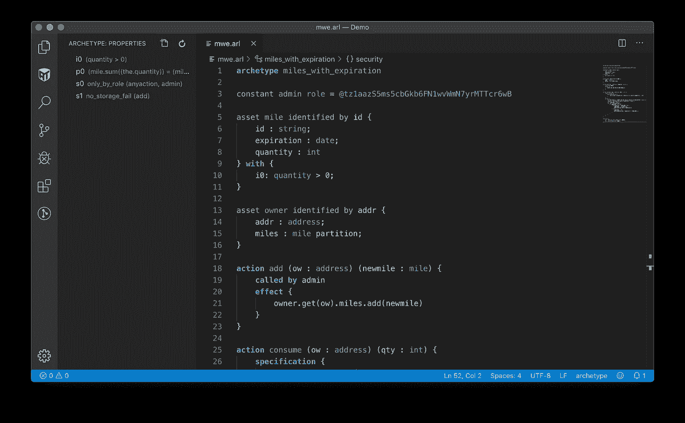

Archetype contract in VS Code

契约和谓词被转换成 why3 格式(whyml)。为了调用 why3 ide，单击原型扩展面板中谓词右侧的检查图标。

为了验证 why3 的属性，只需右键单击名为“Miles_with_expiration”的模块，并选择“Auto level 2”，如下所示(此处为安全谓词 *s0* ):

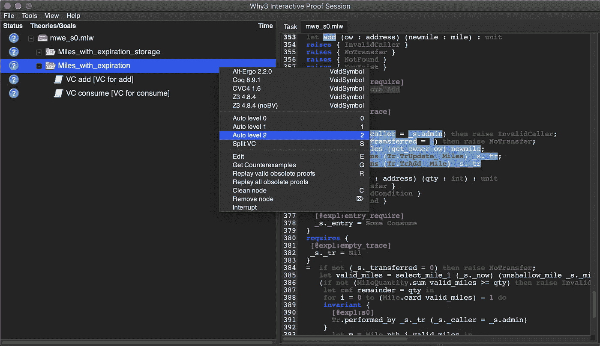

Why3 ide for security predicate s0

Why3 翻译 [SMT 语言](http://smtlib.cs.uiowa.edu/)中的谓词，并调用 SMT 解算器(这里是 Alter-Ergo、Z3 和 CVC4)。我们在上面的截图中看到，Why3 已经为两个动作(添加和消费)生成了证明义务。

## 安全谓词 s0

当谓词被验证时，问号变成绿色。*消耗*动作*不*变绿如下图:

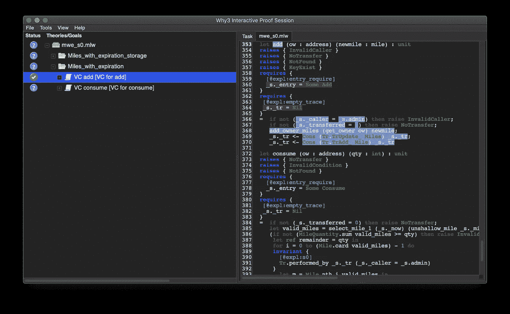

这是因为修饰符**调用的*在*消耗*动作中缺少***。添加后，将验证 s0 属性:

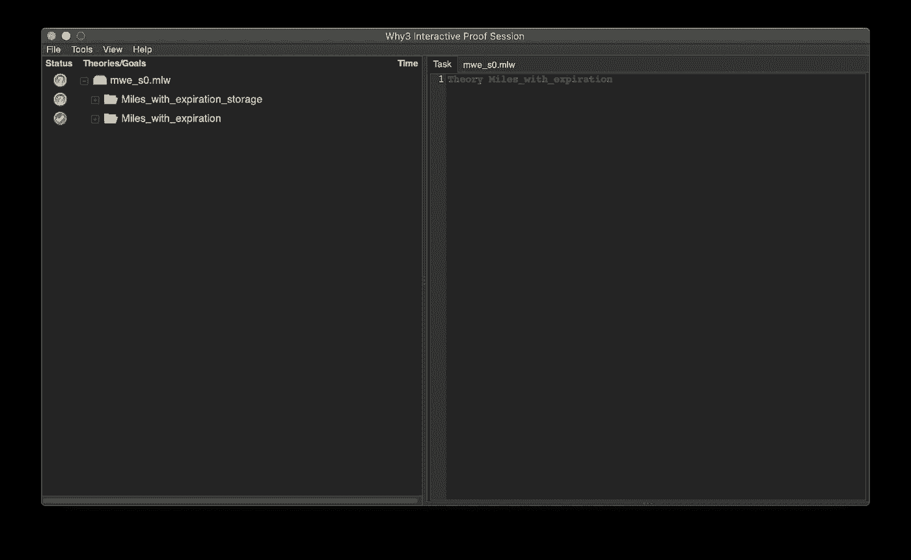

## 安全谓词 s1

上面的契约也没有验证 *no_storage_fail* 谓词 *s1* 。当详细查看失败的证明义务时，我们看到可能会出现“找不到密钥”和“密钥存在”例外情况:

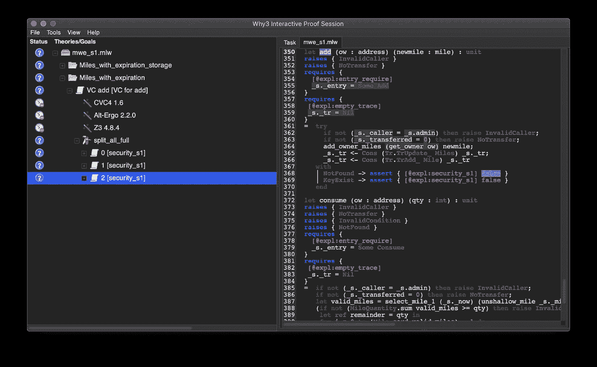

A failing proof obligation for s1: the “get” method may generate a NotFound exception

我们看到 get 方法可能会生成一个 *NotFound* 异常(见上面的截图),而 *add* 方法可能会生成一个 *KeyExist* 异常。

解决方案是首先测试 id 为 *ow* 的所有者是否存在。如果不存在，应创建一个新的所有者**。在任何情况下，如果 *newmile* 的 id 已经存在，则 *add* 应该会失败:**

**我们看到了不允许代码失败的影响:它迫使我们处理所有情况，并使行为明确。在这里，我们只是忘记了在必要时创建一个所有者！s1 现已通过验证:**

**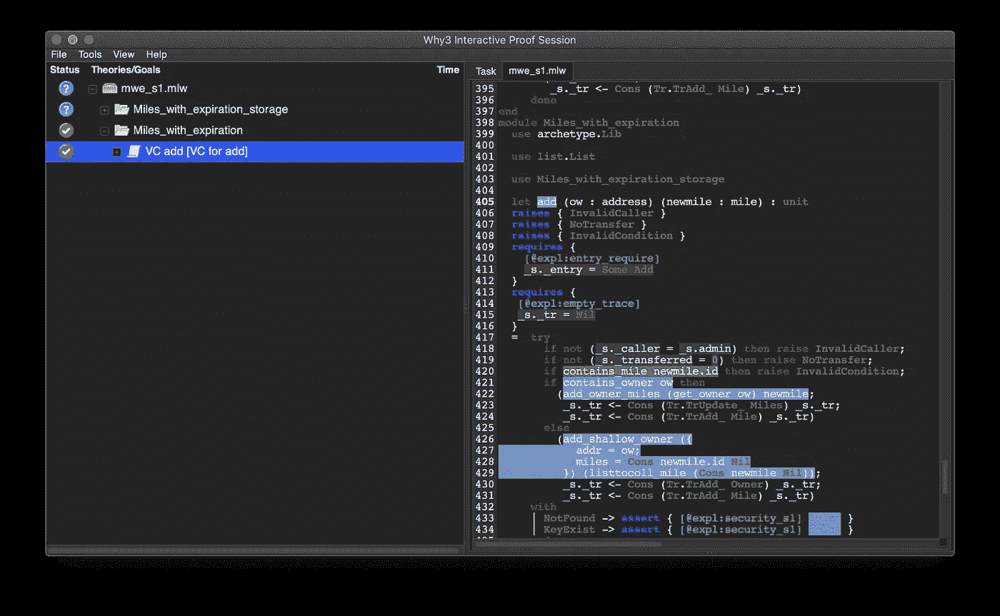**

## **后置条件 p0**

***消耗*动作的效果使用所有者 *ow* 的有效里程的迭代。然后需要为 why3 提供 p0 的**循环不变量**(why 3 依赖于 [*最弱的前提条件*](https://en.wikipedia.org/wiki/Predicate_transformer_semantics) 演算)。**

**这是验证过程中最棘手的部分，因为它需要一些计算不变量的经验。**

**在 *p0* 的情况下，不变量应该使用*余数*变量，该变量在迭代期间从*数量*减少到 *0* 。在任何迭代中，我们都有这样的关系:**

```
mile.sum(the.quantity) = 
mile.before.sum(the.quantity) - qty + remainder
```

**迭代结束时，*余数*变量等于 0，重写为 *p0* 。**

**然而，why3 仍然无法证明 *p0* ，因为要证明*余数*变量在迭代结束时等于 0 并不容易。为此，可以提供另一个不变量:**

```
0 <= remainder <= toiterate.sum(the.quantity)
```

***toiterate* 关键字指的是尚未迭代且仍将迭代的里程集合。在迭代结束时， *toiterate* 集合为空，其总和等于 *0* 。**

**下面的原型片段说明了如何提供这些不变量(下面的第 5–8 行):**

**注意，我们必须命名迭代(上面的*循环*第 7 行)。**

**上面的代码验证了 p0。然而，两个证明义务仍然失败。**

**第一个对应于第二个循环不变量的初始化(上面的第 15 行):**

**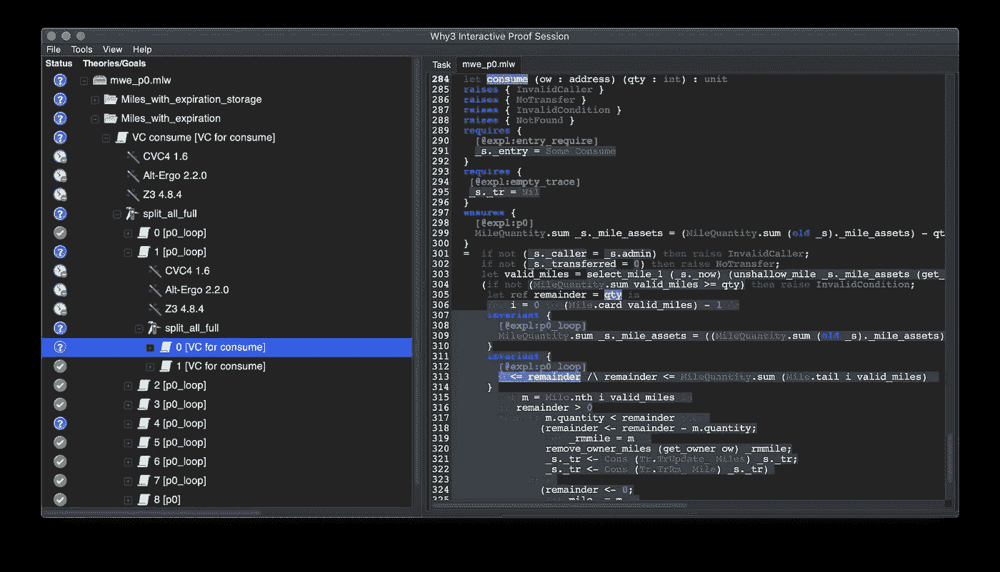**

**它无法证明余数变量在迭代开始时大于或等于 0。由于在此阶段等于*数量*，解决方案包括添加一个*保护条件*，该条件要求*数量*大于或等于 0。**

**当当前英里*数量*大于*余数*变量时，第二失败证明义务对应于第二执行分支(上面的第 23、24 行)中主循环不变量*遗传性*的证明:**

**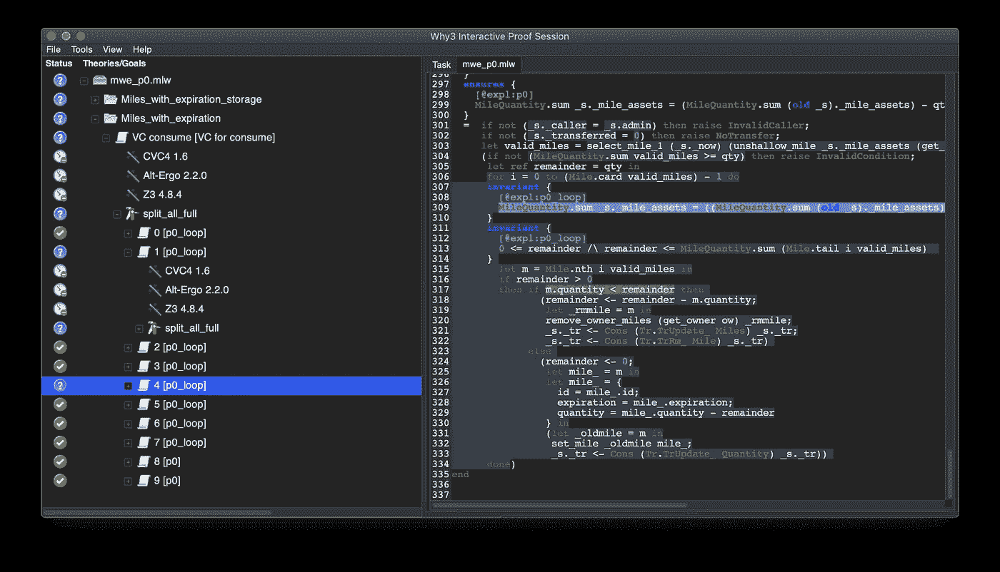**

**Why3 突出显示了当前证明义务中不为真的分支条件(在上面截图中的紫色行 317 中)，这精确地指出了哪个执行分支有问题。**

**问题是在更新当前英里数量字段之前，余数变量被设置为 0 *。解决方案是交换指令行 23 和 24。***

***消耗*动作的固定版本如下:**

## **不变量 i0**

**每次修改英里集合时，都必须验证不变量 i0。这里不变量没有被验证，无论是在动作*中添加*还是*消耗*。**

**在*添加*动作中，*添加*方法(上面的第 8 行)要求添加的英里(*新英里*)有一个*数量*字段严格为正:**

**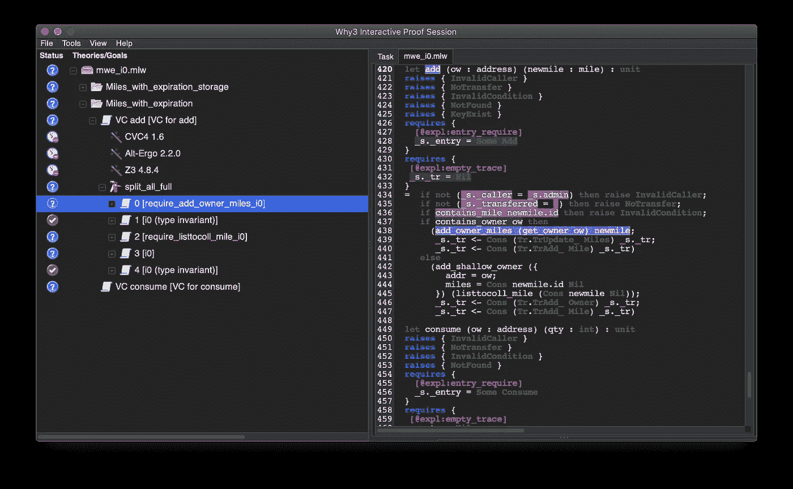**

**add method of owner’s mile collection requires a quantity field > 0**

**解决方案是添加一个保护条件(下面的第 3–5 行):**

**在*消耗*动作中，*更新*方法要求里程数量为正，如资产不变量所指定的，但是求解器无法证明这一点:**

**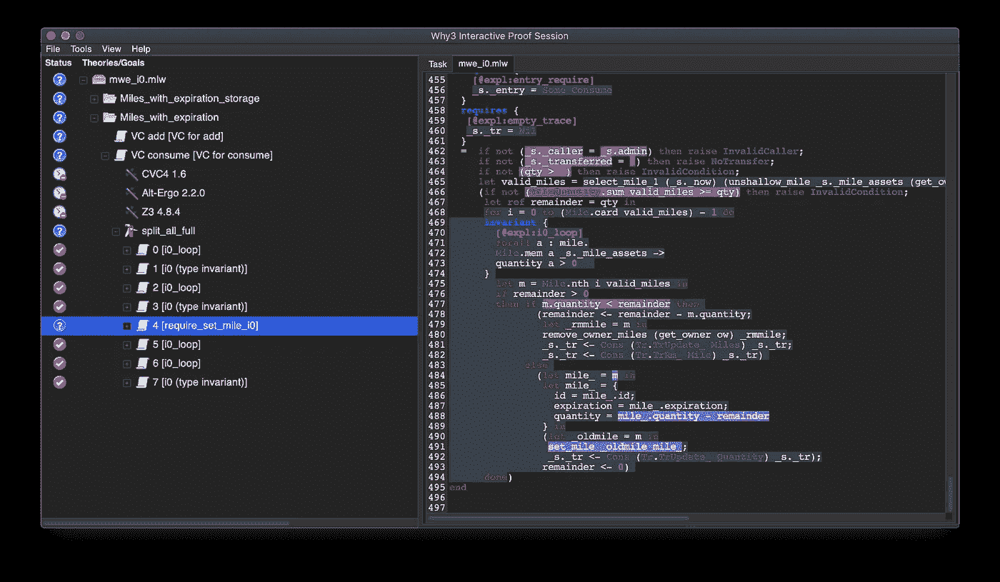**

**该分支是测试的 *else* 分支**

```
m.quantity < remainder
```

**哪个是**

```
m.quantity >= remainder
```

**事实上，当*数量*等于*余数*变量时，它记录一英里，其中*数量*值等于 0，这与 *i0* 不符。**

**解决方案是将分支测试改为**

```
m.quantity <= remainder
```

# **结论**

**由于原型的正式验证功能，我们已经能够开发一个*正确的*智能合同，实现链上忠诚度计划:**

**现在可以安全地将原型契约代码转换为 Ligo 之类的低级语言，这样就可以生成迈克尔逊版本:**

**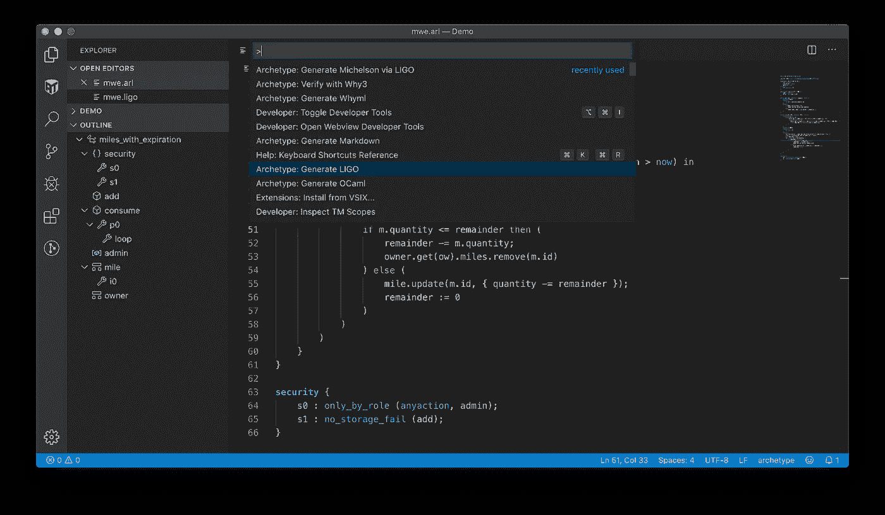**

**Archetype generation commands**

**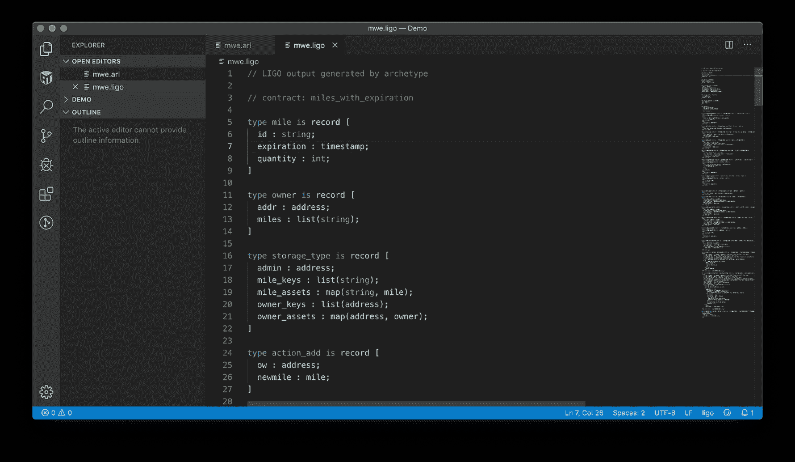**

**Ligo version of the contract**

**程序验证是发现和修复问题的一种非常强大的技术。这也是提高用户对合同的信任的一个非常好的方法，特别是当经过验证的属性易于阅读和理解的时候。**

**然而，我们注意到，安全性不是一个绝对的质量，而是相对于我们能够识别和制定的属性。**

**以下是演示中使用的软件列表，供您重现:**

*   **原型 0.1.10**
*   **VS 代码 1.39.2**
*   **为什么 3 1.2.0**
*   **替代疗法 2.2.0**
*   **CVC4 1.6**
*   **Z3 4.8.4**

**请注意，原型仍然在 *alpha* 版本中。我们计划在年底发布版本 1。**

**在 Twitter 上关注我们，了解项目的最新进展:**

**[](https://twitter.com/archetype_lang) [## 原型

### 来自基模(@ archetype _ lang)的最新推文。原型是一种特定于领域的语言，用于开发智能契约…

twitter.com](https://twitter.com/archetype_lang) [](https://coincodecap.com)

> [在您的收件箱中直接获得最佳软件交易](https://coincodecap.com/?utm_source=coinmonks)

[](https://coincodecap.com/?utm_source=coinmonks)**