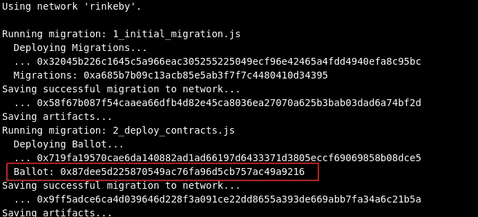
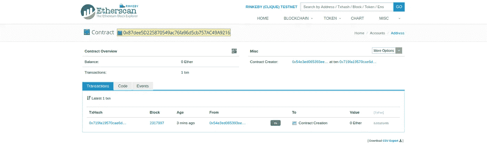
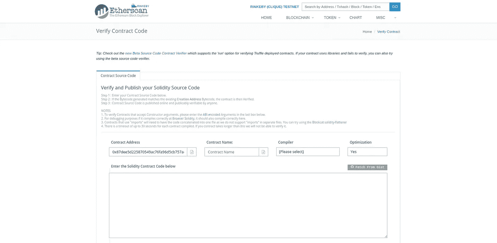
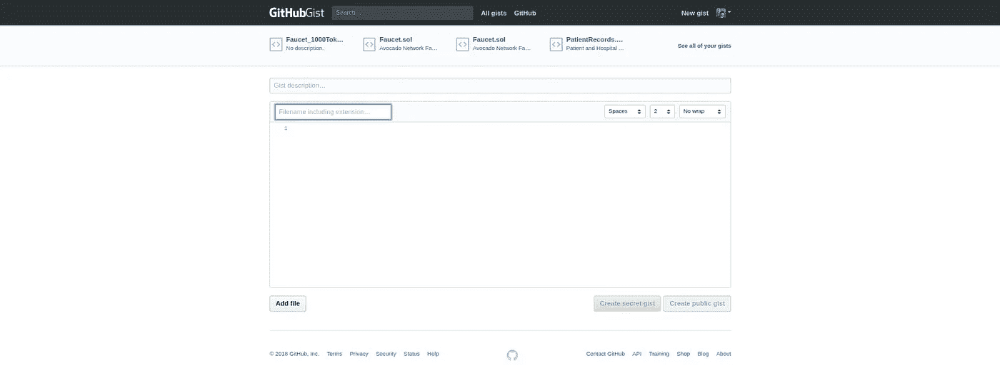
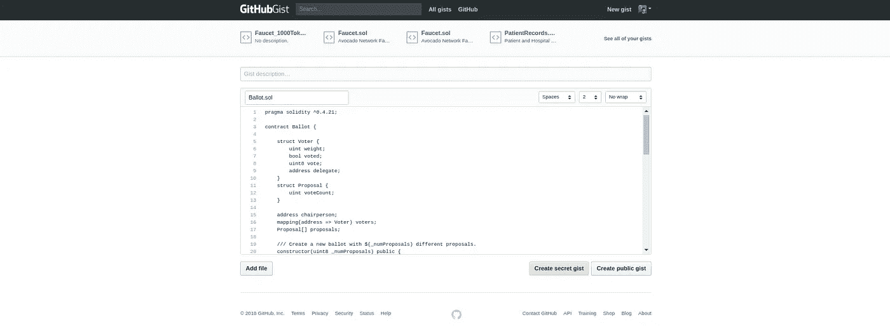
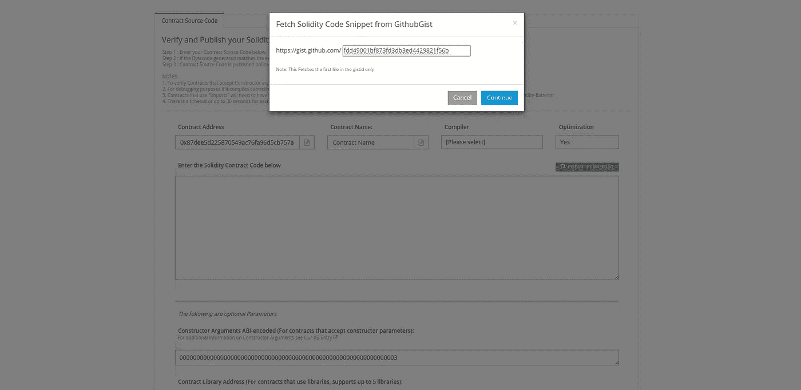
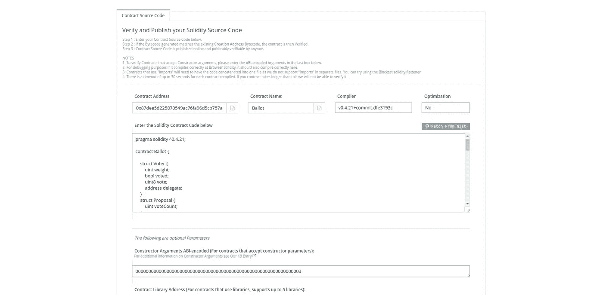
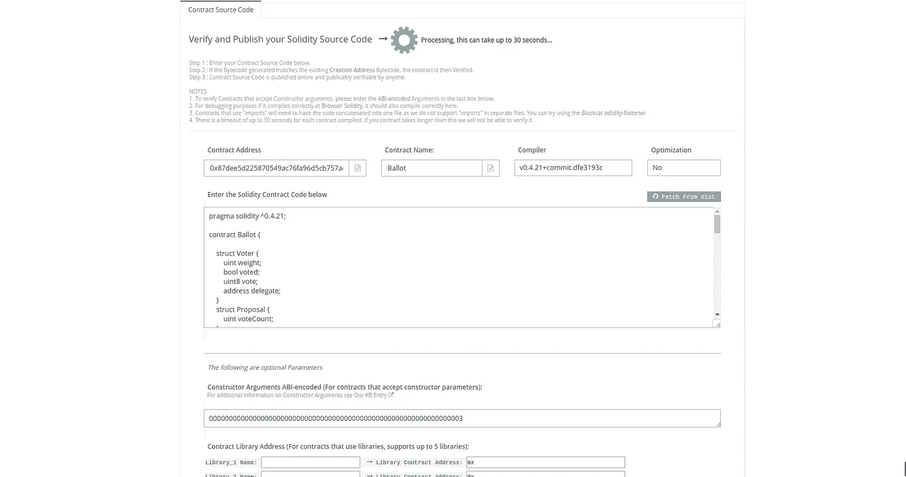
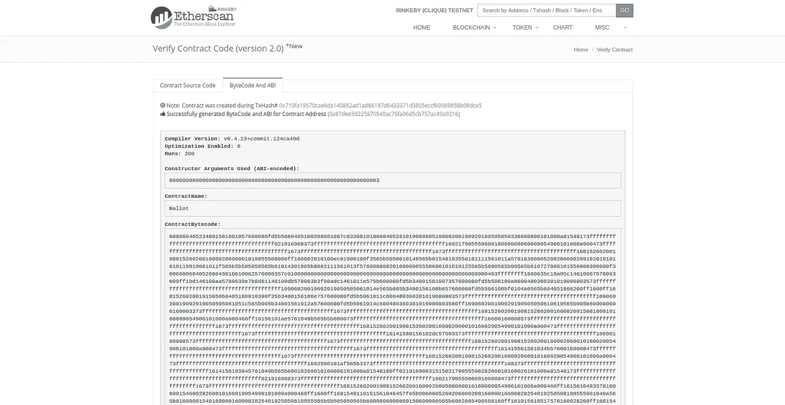
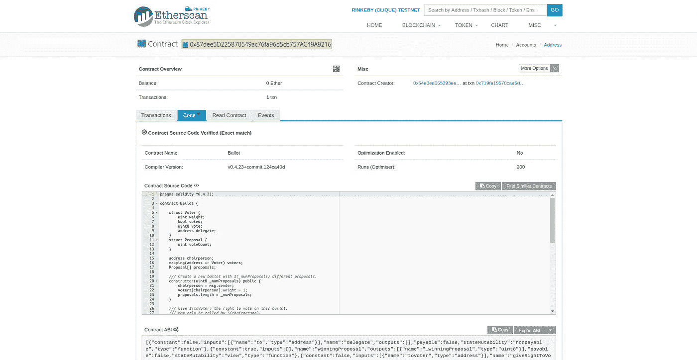

# 使用 Gist 验证您的智能合同

> 原文：<https://medium.com/coinmonks/verify-your-smart-contract-using-gist-a3152537a7a7?source=collection_archive---------5----------------------->

让我们看看如何使用项目要点来验证智能合同。这个过程非常简单，但是你需要一些东西:

*   有效的智能合同。用你自己的或者克隆这个[回购](https://github.com/NFhbar/verify-contract-example)。
*   某[林克比 ETH](https://faucet.rinkeby.io/) 。
*   一个 [GitHub](https://gist.github.com/) 账户。

对于这个例子，我部署了一个简单的智能投票合同；你可以对你的任何项目使用这种方法，因为重要的部分实际上是在合同部署之后，然而，如果你更愿意跟随，你可以克隆这个[回购](https://github.com/NFhbar/verify-contract-example)。

# 设置

我使用 Truffle 来编写、测试和部署我的合同，所以请确保您在全球范围内安装了 [Truffle](http://truffleframework.com/) 。酷，我们正在部署的合同是一个简单的投票合同[在这里](https://github.com/NFhbar/verify-contract-example/blob/master/contracts/Ballot.sol)。

如果您遵循示例回购，只需运行:

```
$ npm install
```

否则，让我们准备好部署 truffle，我们将需要以下软件包:

```
$ npm install --save-dev dotenv
$ npm install --save-dev ethereumjs-wallet
$ npm install --save-dev truffle-wallet-provider
```

很好，让我们准备好 truffle.js 文件以部署到 Rinkeby:

```
require('dotenv').config()
const Web3 = require(‘web3’)
const web3 = new Web3()
const WalletProvider = require(‘truffle-wallet-provider’)
const Wallet = require(‘ethereumjs-wallet’)const rinkebyPrivateKey = new Buffer(process.env[‘RINKEBY_PRIVATE_KEY’], ‘hex’)
const rinkebyWallet = Wallet.fromPrivateKey(rinkebyPrivateKey)
const rinkebyProvider = new WalletProvider(rinkebyWallet, ‘[https://rinkeby.infura.io/'](https://rinkeby.infura.io/'))module.exports = {
 migrations_directory: ‘./migrations’,
 networks: {
   development: {
   host: ‘localhost’,
   port: 9545,
   network_id: ‘*’ // Match any network id
 },
 rinkeby: {
   provider: rinkebyProvider,
   // You can get the current gasLimit by running
   // truffle deploy — network rinkeby
   // truffle(rinkeby)> web3.eth.getBlock(“pending”, (error, result)    
   // console.log(result.gasLimit))
   gas: 6721975,
   gasPrice: web3.toWei(‘50’, ‘gwei’),
   network_id: ‘4’,
   }
  }
}
```

我们正在通过 Infura 使用 truffle wallet provider 和 ethereumjs wallet 进行部署。现在，让我们在根目录中创建一个. env 文件，使用您的私钥进行部署，将您的私钥放在该文件中:

```
RINKEBY_PRIVATE_KEY=”MY_PRIVATE_KEY_GOES_HERE..."
```

请确保将此文件添加到您的。gitignore 文件以确保您不会意外地发布您的私钥。

# 将合同部署到 Rinkeby

该去林克比了。首先让我们从水龙头[里拿一些测试液。现在，让我们进入块菌培养环境:](https://faucet.rinkeby.io/)

```
$ truffle develop
```

编译、迁移和本地测试的时间为了确保一切就绪，请运行以下命令:

```
truffle(develop)> compile
...
..
.truffle(develop)> migrate
...
..
.truffle(develop)> test
...
..
.
```

如果他们都成功了，没有错误，我们准备部署。退出 truffle 开发环境，并在终端中运行以下命令:

```
$ truffle deploy --network rinkeby
```

您应该得到如下所示的输出:



Contract deployed to Rinkeby.

# 验证我们的合同

前往 [Rinkeby Etherscan](https://rinkeby.etherscan.io/) 并从您的控制台使用合同地址搜索您新部署的合同。您应该在网络上看到您的合同:



Rinkeby deployed contract.

酷毙了。现在单击代码选项卡，然后单击验证和发布:



Verify Contract.

我们将使用从 Gist 中提取选项。首先，我们需要创建一个新的要点。在您的 GitHub 帐户中，点击您的个人资料并选择您的 gists。你应该看到你的要点简介:



Gists.

在文件名文本框中输入合同名称，包括扩展名，并在要点框中从项目中复制/粘贴合同代码。确保合同与您的合同文件完全相同。如果你把任何文件导入到你的源代码中，直接把代码放在你的要点中。我的看起来像这样:



Gist Contract.

现在单击创建公共要点。太棒了。是时候验证了。返回以太网扫描单击从 gist 获取按钮，复制/粘贴您的 Gist id:



Fetch from gist.

点击继续，Etherscan 将加载您的代码:



Etherscan code.

很好，现在在合同名称框中输入您的合同名称，选择您的编译器版本，如果您使用了优化，请选择它。如果您的构造函数是使用参数部署的，那么 Etherscan 应该会自动获取编码的参数。是时候验证了！

单击“验证并发布”,给它一点时间:



Etherscan verifying.

几秒钟后，您的合同将得到验证:



Etherscan verified.

搞定了。现在，您的合同已经过正式验证，任何人都可以通过合同地址访问您的合同:



Verified contract code.

就是这样！这里是这个例子的[回购](https://github.com/NFhbar/verify-contract-example)和[要点](https://gist.github.com/NFhbar/fdd49001bf873fd3db3ed4429821f56b)以防你想试一试！

非常感谢你阅读这篇文章！如果你觉得这篇文章很有用**，请点击这篇文章，并确保关注我的更多常规内容**，也请查看我的 [Github](https://github.com/NFhbar) ，因为我定期发布示例代码和项目。如果你有任何问题，欢迎在下面回复或者给我发邮件。

编码快乐！