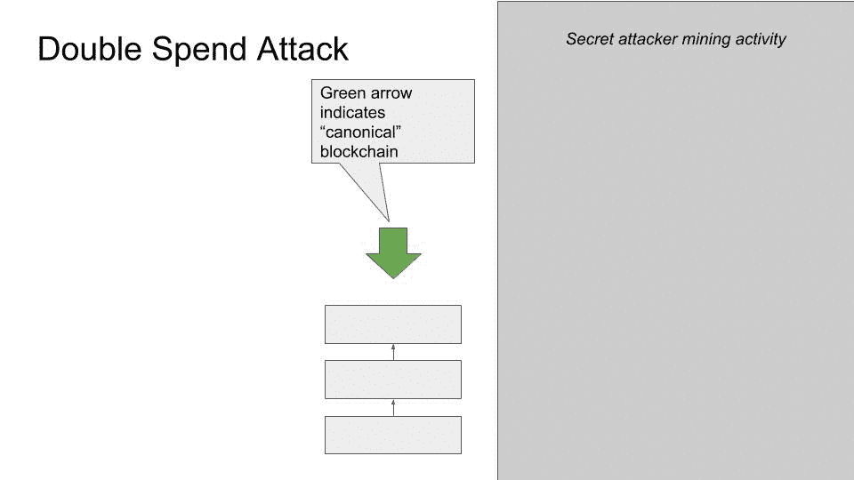
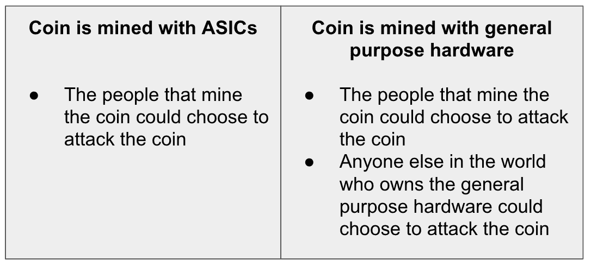

# Vertcoin (VTC)被成功攻击了 51%

> 原文：<https://medium.com/coinmonks/vertcoin-vtc-is-currently-being-51-attacked-53ab633c08a4?source=collection_archive---------2----------------------->

## *TL；DR:在 4 次不同的事件中，最近一次发生在 12 月 2 日，Vertcoin (VTC)经历了 22 次深度链重组，其中 15 次包括 VTC 的双重支出。我们估计这些攻击可能导致超过 100，000 美元的盗窃。最大的重组深度超过 300 个街区。*

*编辑:自 12 月 2 日这篇文章发表以来，没有观察到任何攻击。因此，我们得出结论，第四起也是最近的一起事件已经结束。如果有新的进展，我们会及时更新。*

# 背景信息

中本聪[白皮书](https://bitcoin.org/bitcoin.pdf)的第 3 页，比特币:一个点对点的电子现金系统，陈述如下:

> 如果大部分 CPU 能力由诚实节点控制，诚实链将增长最快，超过任何竞争链。

超过一半矿工的“诚实”是比特币和任何基于比特币的工作加密货币的安全性的核心要求。在这种情况下，诚实行动意味着遵循比特币白皮书中描述的行为。这有时被称为“安全风险”或“攻击媒介”，但更准确地说是对工作证明模型的已知限制。

不满足这一要求会破坏比特币协议的几个核心保证，包括交易的不可逆性。

挖掘的功能是将事务添加到通用的、共享的事务历史中，称为区块链。这是通过生成块来实现的，块是事务的捆绑包，并将事务的规范历史定义为最长的块链*。如果单个挖掘器比整个网络的其余部分拥有更多的资源，则该挖掘器可以选择任意的先前块，从该先前块扩展备选块历史，最终超过网络的其余部分产生的块历史，并定义新的规范事务历史。

这被称为“连锁重组”，简称“重组”。所有重组都有一个“深度”，即被替换的块的数量，还有一个“长度”，即进行替换的新块的数量。

就其本身而言，这可能只是一个小小的不便。毕竟，所有的事务仍然存在，但是它们可能会以不同的顺序排列，可能会延迟一些事务。

然而，想象一个矿工也拥有大量的硬币。矿工可以在交易 T 中将这些硬币发送给商家，同时还秘密地扩展替代块历史。矿工的秘密块不包括 T，而是包括一个将 T 中使用的相同硬币发送到不同地址的交易。称该事务为 T’。当矿工揭示这个秘密历史时，它将包含 T '，而不是 T。因为 T 和 T '试图发送相同的硬币，而 T '现在在规范历史中，这意味着 T 永远无效，在交易 T 中发送的硬币的接收者运气不好。更多信息可以在[这里](https://en.bitcoin.it/wiki/Weaknesses#Attacker_has_a_lot_of_computing_power)找到。

如果这种情况发生在野外的硬币上，对任何使用硬币的人来说都是一个严重的问题。

# 我们观察到的

我们观察到 Vertcoin 区块链的重复深度重组，最大的重组深度为 307 个区块，长度为 310 个区块。双重花费的总价值超过 10 万美元。

根据攻击的时间和特征，这些重组可以分为 4 个不同的事件。

*注意:为了限制本文的范围，没有对攻击中使用的实际硬币进行区块链分析。我邀请机构群体检查双重花费交易的输入，跟踪相关硬币的历史，仔细检查时间戳等块字段，查看攻击块的 coinbase 奖励的后续移动，或执行任何其他相关的区块链分析，以揭示这些攻击背后的威胁因素。*

## 事件 1:2018 年 10 月 12 日–2018 年 10 月 18 日

在这一事件中有 8 次重组。前 5 次重组不包括任何重复消费，而最后 3 次重组都包括总计 71，243 VTC 的重复消费交易。

*   共同祖先: [1015237](http://explorer.vertcoin.info/block/25c30df82b63c7f9926b9ae4d4646c82fbbf8db72cdeaf121afd10066fb247f9) 。[深度 15](http://explorer.vertcoin.info/block/2a6dedc9d0d0d860a07645acc9222bf2718080ce03b9c0b5f39f772d1816cc4b) / [长度 32](http://explorer.vertcoin.info/block/cc0166109a37add34b467bd9f46915dc7e122f1a2cd3aaa408c89a91b44cb7a8)
*   共同祖先: [1015844](http://explorer.vertcoin.info/block/8fcd2cf1470c34a45666c4d6c0e3b80d54b833503d04335d432f82bcecb1cf56) 。[深度 4](http://explorer.vertcoin.info/block/e199178240a81dfb96a913292959524d6fd1d84c49531bf30d24c8d70e6958a1) /长度 10
*   共同祖先: [1015906](http://explorer.vertcoin.info/block/814f9f685ba7b2b00c600501cc12ffd7cb5d02516e5f5380f15a76368d8f05a0) 。[深度 3](http://explorer.vertcoin.info/block/8ee52394d3b2450d45a9f6f7eadbb01ee2dd26980b07763c8b56f68df0ea488c) /长度 5
*   共同祖先: [1016733](http://explorer.vertcoin.info/block/427e44144c21b16fcc082352694c7910598b974562594b1124766106c75d649b) 。[深度 1](http://explorer.vertcoin.info/block/b0f9070c9f167cb9b6c99da56914aa4b3ba8ac3840a1036afa502a7a751dc2ad) /长度 4
*   共同祖先: [1016756](http://explorer.vertcoin.info/block/667a0b55a2981851c75fe9a1ca4f739a1fa8d9dedec54e77ad13a968273846ba) 。[深度 17](http://explorer.vertcoin.info/block/c1c51da73f3d551f09bba01398abec51462e38fbcede40ded74d08e3679a4dc5) /长度 20
*   共同祖先: [1017927](http://explorer.vertcoin.info/block/2c56d18733157b917ba75d20a3eed92d05bb1a166a4c8a267b9c53272261536c) 。[深度 16](http://explorer.vertcoin.info/block/0fc5938177d7c46d5e8fabdef20836f36e35aace3cf4e71d1744bfac45ae7fe5) / [长度 25](http://explorer.vertcoin.info/block/937de1e712cc9d6e1c8f18eec70b4ce765ded0debdfa74267410e59e2fe507d2) 。孤立块 [1017928](http://explorer.vertcoin.info/block/41f44a6b7b5d9942f6f84f981095f87debf112487c74ff03fbf3324a987fd684) 中的[事务](http://explorer.vertcoin.info/tx/d5fb481f8a73e138aad5dd5114949b36e3ef36e670ca07c5d3a2a3a0b62fa641)被攻击者块 [1017930](http://explorer.vertcoin.info/block/b0a2b2c10382a7e81fa933f5ac4590ed20c573963d3db02c1115508240534965) **中的[事务](http://explorer.vertcoin.info/tx/25694518fd564559fbc82450885275d79441c8d546b77b693dc238d35434a309)重复消耗
*   共同祖先: [1017990](http://explorer.vertcoin.info/block/e45f6df4f0c4ece89cb28d5409f092b7b69dcd1a6ad6985c4490d94dd9a2bbeb) 。[深度 16](http://explorer.vertcoin.info/block/9ed08781acc9e8569db662147b516458f6d20381b16e935a697f58db4b2f270a) /长度 22。孤立块 [1017991](http://explorer.vertcoin.info/block/549d2161b2aaedc211a9cfc029cd7f9423773c3b6b1eda1caa6c560b7fc1feb9) 中的[事务](http://explorer.vertcoin.info/tx/bb90594b7524720dc089a2e664d60c6670273bf5fd6d9e9164d5e9158e1c4e49)被攻击者块 [1017993](http://9946384bde53ae3230bbb27d77d748c1760a79f9f7f97102507447028b151c61) **中的[事务](http://explorer.vertcoin.info/tx/97f30c7cad413b0766677b9a7973e9d6b8d53a201f4a668a871db0519e4b64ae)重复消耗
*   共同祖先: [1018503](http://explorer.vertcoin.info/block/27f8c02becbe55acbc5aae147d8ee6655b1a5be4a669981ce59893f370f88507) 。[深度 18](http://explorer.vertcoin.info/block/f7d25497adfb025b22a9df2ce78a56dcea801ae802a22ad26ba701b8ace8ea83) /长度 20。孤立块 [1018504](http://124f2859b689181b7a00f4be3db1a0204a704b869cf7d647ee4b04d0b68edca1) 中的[事务](http://explorer.vertcoin.info/tx/599a6fa24841a73c03a67d3d85627089f57ccdb42e783edd460577308c9e303f)被攻击者块 [1018504](http://explorer.vertcoin.info/block/ffc8b66277152918e9960c61db09ac94c356b3561c2175b38a10e69a1e3ccfb8) **中的[事务](http://explorer.vertcoin.info/tx/b7db4bb7da682dfe2913eba8bc11313b99b648a1d10f33a92de6bbc07c32b384)重复消耗

## 事件 2:2018 年 10 月 27 日–2018 年 10 月 28 日

在这一事件中有 8 次重组，所有重组都包括总共 53，847 VTC 的重复支出。这些重组不如前一次事件或后两次事件那样深入。

*   共同祖先: [1024178](http://explorer.vertcoin.info/block/9521e8a1168a8cda4f371e02e2446ed28b5bedc30f35f245dbd0a5b5aa3dd2a8) 。[深度 5](http://explorer.vertcoin.info/block/817744a208d8cb5884d7f190a4973ebf36e56c006e8513651b5ed94e58d59321) / [长度 10](http://explorer.vertcoin.info/block/9077072913ce97cb92c0212afb6c4eed41d4f3566939b4c6357064d6cce6687c) 。孤立块 [102418](http://explorer.vertcoin.info/block/27b19604b3a914b430ce2b9e382ed93a1041a364d91d980283a2b0785205ba50) 2 中的[事务](http://explorer.vertcoin.info/tx/69c3736d2f31bdb034ee52a6451c7c9263a94db3cacc1a1fc4c99757e0fce341)被攻击者块 [102418](http://explorer.vertcoin.info/block/35c658bb441b7015659b1da31d249f42c602084e784311da6df01020f09b849a) 2**中的[事务](http://explorer.vertcoin.info/tx/c65415e9ea6e61acbb2cccc209a5fd1e3869bc2f552bdfa931cc50d3fe29b580)重复消耗
*   [D 2](http://explorer.vertcoin.info/block/95114ebd1ddc19cb347047521a716b61739360bb9cd282c3e7d89d40a5ef456a) L 9 [TX_1](http://explorer.vertcoin.info/tx/aca0e90e8acc57c187be4735e4f0f309de0c5de77017886140c5c5c5ffcf712b) ， [TX_2](http://explorer.vertcoin.info/tx/0a072a40b72c9db64bb9658d24e5e7840d0102521b09e412a37992d561d3a83a)
*   [D 5](http://explorer.vertcoin.info/block/57b744771f7bd447f43d166a0fcbd11fb261d06dee3a5d0bf345d96baf4acb09) L 8 [TX_1](http://explorer.vertcoin.info/tx/7ed7dda743ea80051d3c384912a3a99d73d5c62a06f28dc55113b55b05d0d111) ， [TX_2](http://explorer.vertcoin.info/tx/d83cc619a9995735ca200a9d70e4e318f08b900d12656cde5fd631f68a83c793)
*   [D 2](http://explorer.vertcoin.info/block/a879aee34ce391455d7a1845a307487523a3efe6636a7ef2ba0aa8e18bc24dac) L 10 [TX_1](http://explorer.vertcoin.info/tx/ce8c5267003d01d7c9d72d0b1a9bdae17d21f0dfc46b5a4b0b3836a4244d8be4) ， [TX_2](http://explorer.vertcoin.info/tx/950aa934192eac8c1bc07b9707a41b855932508dda8dce25922086a92142ed4c)
*   [D 4](http://explorer.vertcoin.info/block/3dac0348b6b264fcf30726c42807da734c5962719976259843d030857c7d66f7) L 6 [TX_1](http://explorer.vertcoin.info/tx/64b28df84f8476295d75f15ec2ee3b3e1f3794d7045e11d8584121abb21fb611) ， [TX_2](http://explorer.vertcoin.info/tx/b21cae2067ef53e07ddd1c2055f8d73647859776a3ce711cd946827255c51600)
*   [D 2](http://explorer.vertcoin.info/block/980c68fef33d5477bbad9d9feac7277701a18b44d9b8a7930a94ab89b3de7b76) L 7 [TX_1](http://explorer.vertcoin.info/tx/7b721ac0a4d18a2e9100e7286892da75bee2e036fb3651d09cf892d49a640198) ， [TX_2](http://explorer.vertcoin.info/tx/eb74ac53f4e106fd6992aac2a68c6c1e79e9beb1f51562072c26c44f057d8975)
*   [D 5](http://explorer.vertcoin.info/block/390cd09ddd6e783792823469db0dafce21b119ae15c8e52ae6f7d8fc9f3e3466) L 7 [TX_1](http://explorer.vertcoin.info/tx/9a25cba922532c606efd2bc3d2a9e62787993fbf8b70ecb79f9c2432f201fa2b) ， [TX_2](http://explorer.vertcoin.info/tx/5404979c5b18f7c6e6c18990429625cf0a0e5138506ae383afb559e39b9fe0c5)
*   [D 1](http://explorer.vertcoin.info/block/8942a00e2340eb66ba89a5d4e179ca1e3d250f2092c13819f09492800d9aede1) L 4 [TX_1](http://explorer.vertcoin.info/tx/51e2346bedb20289adbd117288f05b9fbca33be738b846387a3745875562c768) ， [TX_2](http://explorer.vertcoin.info/tx/c0af6fabd6a82d861b6895fb3232f1b4f5683910ac42b3b366503388d3663df8)

## 事件 3:2018 年 3 月 11 日

在这一事件中有两次重组，我们在两次重组中都没有观察到重复消费交易。

*   共同祖先: [1027840](http://explorer.vertcoin.info/block/8ba4263526ada1ec17b03aac1f2c478dd0103ef09fb205f4ef871edc7e1d6f61) 。[深度 11](http://explorer.vertcoin.info/block/d4073f8e1407c4d480f2c5ea6fc6cb722de968de71d77961a40b7c74c4bc2758) / [长度 14](http://explorer.vertcoin.info/block/209b6a64e93311ef1730b505b459509e0dea774e76137dc0ac849409846fbcf5)
*   共同祖先: [1027896](http://explorer.vertcoin.info/block/66d9958495aa9a09c26c66d1055d02456871e7eeb39ca58041cc294c16069d51) 。[深度 47](http://explorer.vertcoin.info/block/bacd3bc7c6664922a9784c1132371fa34a24a76a997ef5d437160d06f9af2080) / [长度 49](http://explorer.vertcoin.info/block/dfab4aac0665add2bc6e96c387b807291cf1012860ceea766bbab5e170edf783)

## 事件 4:2018 年 11 月 29 日–2012 年 12 月

在这一事件中有 4 次重组，都包括重复消费交易。这些是观察到的最深层次的重组，其中也包括双重花费，这表明双重花费的受害者可能提出了确认要求，迫使攻击者为每次攻击花费更多的 hashpower。

*   共同祖先: [1043103](http://explorer.vertcoin.info/block/84e752a5c3624161bf20bdca6c57a77d3efa976e5cf28dc13d80341571f71558) 。[深度 34](http://explorer.vertcoin.info/block/f76f914d1b87e8cd97c46d48d1a8e0d7a5081529da45e2513e5a6298168e1109) /长度 56。孤立块 [1043111](http://explorer.vertcoin.info/block/845586ab9f43d89ddb855390174ea773e95e399f2dc02c5fa9b09c567751b029) 中的[事务](http://explorer.vertcoin.info/tx/bf133c3b6ff8dc6701af7187e4c3f273cbf67f72bad7415d5af79c0a4bf6089d)被攻击者块 [1043110](http://explorer.vertcoin.info/block/0dac45feb630907d771ee65d1a5dab9691db53780ab350192bbaa4e1ef558036) **中的[事务](http://explorer.vertcoin.info/tx/c5382c081233b64ec8a0ecf4d4898ec1e69e1b69db0063313bf32942cd08ff4d)重复消耗
*   共同祖先: [1043400](http://explorer.vertcoin.info/block/36eae54a998f9e56a0773a568d2d33ba8bb9606cd5026dfc1c8bb17f96ce1b5b) 。[深度 24](http://explorer.vertcoin.info/block/f2c6aced37616db0161ea051bff91479fa4c613e415fc05199d14b84810c595d) /长度 49。孤立块 [1043403](http://explorer.vertcoin.info/block/7272d5b19719b38c673c9a6236adb0466520d6ff94fc0e53b8935ce49fbfd9dd) 中的[事务](http://explorer.vertcoin.info/tx/7941d9e2dc044bb3055b320cf3561e5bdc93e098a620ca0acf16aca8e755d045)被攻击者块 [1043405](http://explorer.vertcoin.info/block/e16a9a8f23211fef863b8de704058e40afed413e9ec667ffb3db05cef57390f0) **中的[事务](http://explorer.vertcoin.info/tx/0bc3c46014d9b1b7bdff26a7998531674cf3929278c1b27df759c54512991ed8)重复消耗
*   共同祖先: [1043616](http://explorer.vertcoin.info/block/c4104a3b827bf12ddac60ea260af58a793d9635eebabc3d32efe26f928b4f54f) 。[深度 32](http://explorer.vertcoin.info/block/98cb63c59253c124b4cb871ea1304ea8c426f1885db1c4d1f7533723e3db97c4) /长度 37。孤立块 [1043617](http://explorer.vertcoin.info/block/f2e7ff6d290e8f85fc94ffca08aa0792669d60f6268164649b65ebdb9505432d) 中的[事务](http://explorer.vertcoin.info/tx/fc094626e5a084eeaef25ffba47a41ebc05afa17258506e25bb1555392f2dcb5)被攻击者块 [1043619](http://explorer.vertcoin.info/block/b9935ef10411393b43e43371f69f9ec2a6f4302ff57ab8e38e3d8ba697f1c122) **中的[事务](http://explorer.vertcoin.info/tx/447f1ab70645154737a2734aa38f3489a603c49ccb3f84af879bc663a26c6bce)重复消耗
*   共同祖先: [1044331](http://explorer.vertcoin.info/block/5313791a34a89e55c41b1522f6b5b607dad88b839e05432cbe9620e2f5e46bf1) 。[深度 307](http://explorer.vertcoin.info/block/ad73aeb93f059b7867db4d53f432ec8278ed9e217160b78786a4940faf312478) /长度 310。此次重组中发生了 2 起双重花费事件。[孤立区块](http://explorer.vertcoin.info/tx/e818cc93408d2f5cb88f72b3976a064c2090df9b9e71e51b9ed8b47ec10838e1)[中的 TX _ 1](http://explorer.vertcoin.info/block/37800582f9de562d0c6fb9b836ee67a20772c22b7932ba8189266b080f1f724b)1044336 被攻击者区块[中的](http://explorer.vertcoin.info/block/f256af87093396f1afb8e0b0eacd80941ce956f398451c73c95582f62077ca06) [TX_2](http://explorer.vertcoin.info/tx/e77b7d29ab99bad06e2291ca19695612cd4bc1a91741143bc462c5dc7c830106) 加倍消耗 1044432 。[孤立阻滞](http://explorer.vertcoin.info/tx/054d278ef86d8a4e8f72c786011820d1c37c504583862d14d9db2325274fcb40)[中的 TX_A](http://explorer.vertcoin.info/block/2e893ee2ac11d3f125e587b1c6d4d9ae785cd6df53460cf570648198f1de3f41) 被进攻阻滞[中的](http://explorer.vertcoin.info/block/f256af87093396f1afb8e0b0eacd80941ce956f398451c73c95582f62077ca06) [TX_B](http://explorer.vertcoin.info/tx/e77b7d29ab99bad06e2291ca19695612cd4bc1a91741143bc462c5dc7c830106) 加倍消耗 1044332* * *

# 我们能学到什么

对 VTC 的这些攻击并不是成功实现 51%双倍支出攻击的唯一例子。今年早些时候，51%的袭击发生在 BTG、XVG 和 MONA 这仅仅是另一个事件，表明威胁行为者的存在，他们有足够的资源和足够的手段来实施这种攻击。

最近一连串成功的 51%攻击对通常被称为密码货币资产的“长尾”有重大影响。有大量的密码货币，包括许多基于比特币的，在区块链实现了自己的工作证明。业内观察人士称这些资产与比特币具有相同的属性。不可否认，这一说法现在已经被经验证明是错误的。

交易所是这种攻击的理想目标。这是因为交易所允许存款快速交易成不同的资产，然后提取。攻击者可以进行很快将被撤销的存款，用另一项资产进行交易，将新资产移出平台，然后撤销原始存款。

交易所发现自己很少有对付这种攻击的有效对策。当攻击者拥有超过 51%的哈希能力时，没有任何数量的确认可以确保接收资产中的存款安全。受到攻击的交易所除了停止与该资产的区块链互动之外，没有其他长期解决方案。最近一次攻击的深度为 307 个区块，这一事实表明增加确认作为对抗此类攻击的对策是无效的。

执行这些攻击的难易程度使人们对这些资产提供稳定的所有权系统的可行性产生了很大的怀疑。除非用于挖掘密码货币的底层硬件的主要应用实际上是挖掘密码货币，否则*总是会有 51%的双重花费攻击的巨大风险。让我重复一遍:资产能够显著降低 51%攻击风险的唯一方法是成为用于挖掘资产的硬件的主要应用程序。*

虽然对 ASIC 电阻的全面探讨不在本文范围内，但上述观察结果强烈表明，追求硬币的 ASIC 电阻会对硬币的安全性产生反作用。如果你有兴趣探索这个话题，我建议你从观看安德烈亚斯·安托诺普洛斯的视频[开始，在这里](https://www.youtube.com/watch?v=AcaktuPdQrc)阅读西亚肯团队关于这个主题的杰出的[博客帖子](https://blog.sia.tech/the-state-of-cryptocurrency-mining-538004a37f9b)。

*The second option is strictly worse*

# 最后

如上所述，交易所是这类攻击的理想目标。只要交易所愿意向客户提供资产，作为对可逆货币存款的回应，攻击者就没有理由阻止这种行为。预计将会看到更多此类攻击。

支持这些资产的交易所将继续遭受损失，最终结果是交易所将被迫将这些资产退市。在这种环境下，很难找到令人信服的理由来解释为什么这些资产应该有价值。

我鼓励您光顾那些将客户资金安全作为最高优先事项的交易所。

**实际上是工作积累最多的链条，而不是块最多的链条，定义了规范历史。在大多数情况下，这些链是相同的*

*   **块资源管理器无法正确处理重新排序，并且将事务标记为已确认。单击该块以查看该块是否为孤立块。*

