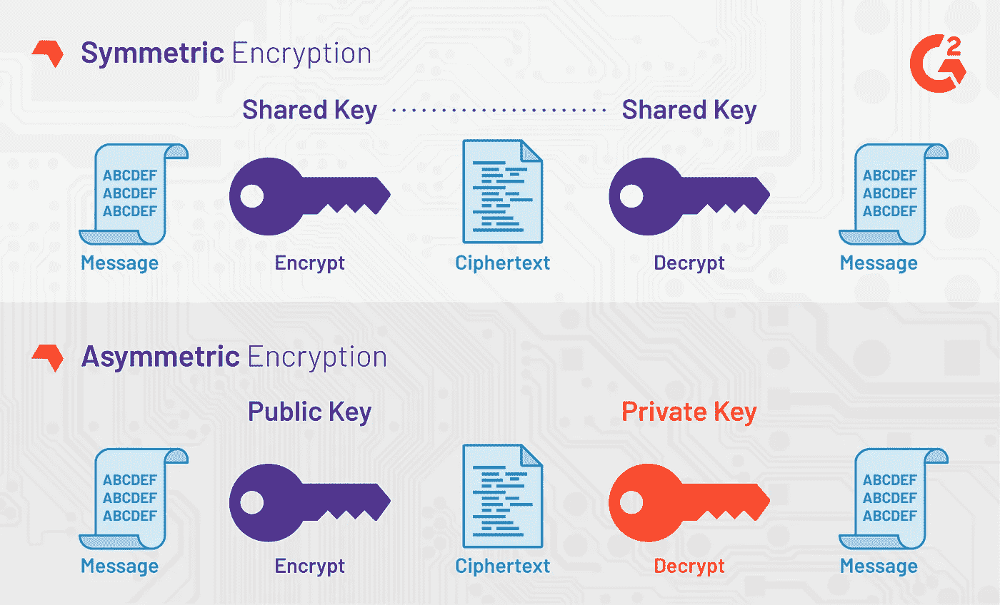
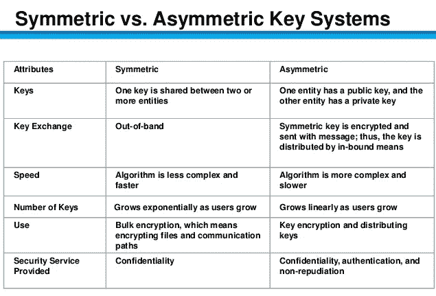
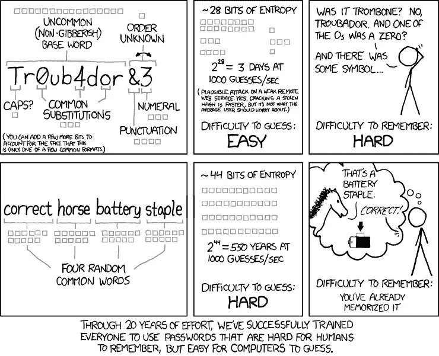
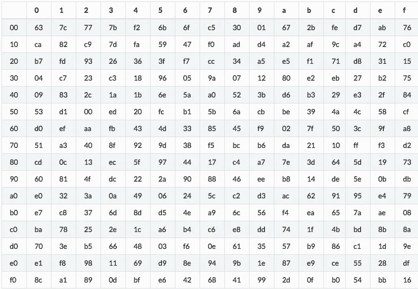
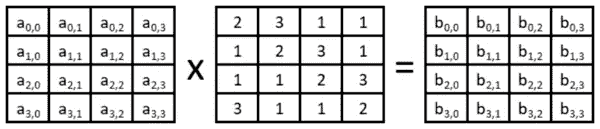

# AES-256 密码的(非常)基础介绍

> 原文：<https://medium.com/coinmonks/very-basic-intro-to-aes-256-cipher-a60104847776?source=collection_archive---------0----------------------->

AES 代表“高级加密标准”，是一种选择 Rijndael 密码作为其对称密钥加密算法的规范。使用 AES，消息可以用密钥(像密码一样)加密，除了密钥持有者没有人可以解密消息。这在很多方面都很有用，但一个很好的例子是使用一个主密码加密所有用户密码的密码管理器。这就是免费开源密码管理器 Qvault T1 的运作方式。

# 对称加密与非对称加密

[https://learn.g2.com/what-is-encryption](https://learn.g2.com/what-is-encryption)

如上图所示，**对称加密使用相同的密钥**进行加密和解密，**非对称加密使用不同的密钥。**

**非对称**当你希望某人能够给你发送加密数据，但**你又不想给他们你的私钥**时，加密是首选。

**当您只为自己**加密**时，最好使用对称**加密。

[Kullabs](https://www.google.com/url?sa=i&source=images&cd=&ved=2ahUKEwicx_jLitbiAhUNEHwKHeZtCPMQjRx6BAgBEAU&url=https%3A%2F%2Fkullabs.com%2Fclasses%2Fsubjects%2Funits%2Flessons%2Fnotes%2Fnote-detail%2F7346&psig=AOvVaw0z771qbnVkU95xmpfNxnyH&ust=1559952561231880)

# AES-256 密钥

AES-256 中使用的密钥长度必须为 256 位。为了使用密码或口令作为密钥，可以使用[散列算法](https://blog.goodaudience.com/very-basic-intro-to-hash-functions-sha-256-md-5-etc-ed721622ff8)来扩展长度。

密码或密码短语越短，攻击者就越容易通过猜测密码、对密码进行哈希运算并尝试解密消息来解密数据。为了减轻这种威胁，一些应用程序实施了安全措施。

在 [Qvault](https://qvault.io) 的情况下，使用 [scrypt](https://en.wikipedia.org/wiki/Scrypt) 算法对主密码进行哈希运算，以生成私钥。Scrypt 是一个非常慢的基于密码的密钥派生函数(类似于哈希算法的属性)，可以减缓攻击。Qvault 还要求密码长度至少为 12 个字符，或者鼓励用户使用密码短语。

[https://xkcd.com/936/](https://xkcd.com/936/)

# Rijndael 加密流程(简化)

1.  选择一个密码，然后从该密码中导出一个短密钥(使用类似于 [Scrypt](https://en.wikipedia.org/wiki/Scrypt) 或 [SHA-256](https://en.bitcoinwiki.org/wiki/SHA-256) 的函数)。然后，将使用[密钥表](https://en.wikipedia.org/wiki/Rijndael_key_schedule)扩展该短密钥，以获得 AES-256 每轮的单独“轮密钥”。

> 密码:password12345678 →
> 
> 快捷键:aafeeba 6959 ebeeb 96519 D5 DCF 0 bcc 069 f 81 e 4 bb 56 c 246d 04872 db 92666 E6 d 4 b→
> 
> 第一轮密钥:a567fb105ffd90cb

从短密钥派生圆密钥超出了本文的范围。我们需要理解的重要一点是，密码被转换成在 AES 加密过程中使用的轮密钥。

2.选择一条秘密消息:

> 这里有一个秘密

3.将第一轮密钥和消息编码为十六进制字节，并将其格式化为 4x4 表格(从上到下，从左到右):

第一轮密钥:

> 61 66 35 39
> 
> 35 62 66 30
> 
> 36 31 66 63
> 
> 37 30 64 62

消息:

> 48 20 61 63
> 
> 65 69 20 72
> 
> 72 73 73 65
> 
> 65 20 65 74

4.将轮密钥添加到消息中(XOR)。消息和键表中的相应单元格相加在一起。输出矩阵将用于下一步。

> 61 ⊕ 48 = 29
> 
> 35 ⊕ 65 = 50
> 
> …等等

> 29 46 54 5a
> 
> 50 0b 46 42
> 
> 44 42 15 06
> 
> 52 10 01 16

5.在结果表中，使用[替换框](https://www.researchgate.net/figure/Rijndael-S-box-S-RD_fig7_325428613)将每个 2 字符字节改变为其对应的字节:

[https://www.researchgate.net/figure/Rijndael-S-box-S-RD_fig7_325428613](https://www.researchgate.net/figure/Rijndael-S-box-S-RD_fig7_325428613)

> a5 5a 20 be
> 
> 53 2b 5a 2c
> 
> 1b 2c 59 6f
> 
> 00 7c 7c 47

6.移动行。第一排不移位，第二排移位一次，第三排移位两次，最后一排移位 3 次。

> a5 5a 20 be
> 
> 53 2b 5a 2c → 2b 5a 2c 53
> 
> 1b 2c 59 6f → 2c 59 6f 1b → 59 6f 1b 2c
> 
> 00 7c 7c 47→7c 7c 47 00→7c 47 00 7c→47 00 7c→47 00 7c 7c

> a5 5a 20 be
> 
> 2b 5a 2c 53
> 
> 59 6f 1b 2c
> 
> 47 00 7c 7c

7.混合列。每一列模乘上 [Rijndael 的伽罗瓦域](https://www.samiam.org/galois.html)。所涉及的数学问题超出了本文的范围，所以我不包括示例输出矩阵。

[https://www.commonlounge.com/discussion/e32fdd267aaa4240a4464723bc74d0a5](https://www.commonlounge.com/discussion/e32fdd267aaa4240a4464723bc74d0a5)

8.乘法的输出被用作下一轮 AES 的输入“消息”。每一步总共重复 10 次或更多次，最后还有一个额外的“添加密钥”步骤。每一轮“添加密钥”将使用一个新的轮密钥，但每个新的轮密钥仍然是从相同的密码和短密钥中导出的。

*   添加密钥
*   替代字节
*   移动行
*   多列

# 就是这样！/s

显然，AES 中使用的 Rijndael 密码相当复杂，但我希望我能够从更高的层次上了解其内部的情况！感谢阅读。

一定要检查一下 [Qvault](https://qvault.io) ，它是一个使用 AES-256 作为密码的开源密码管理器。

# 来源

 [## q 金库-私人和安全。加密、密码和秘密管理。

### 除了我们业界领先的加密技术之外，请购买 Qvault 卡进行双重加密。Qvault 卡不需要…

qvault.io](https://qvault.io)  [## Q-Vault/qvault

### 在 GitHub 上创建一个帐户，为 Q-Vault/qvault 的开发做出贡献。

github.com](https://github.com/q-vault/qvault)  [## 高级加密标准

### 高级加密标准-以简单易行的步骤学习密码学。密码学的起源，现代…

www.tutorialspoint.com](https://www.tutorialspoint.com/cryptography/advanced_encryption_standard.htm)  [## AES 用的密钥一定要质数吗？

### 我在这个网站和网上看了很多，但是找不到一个明确的答案，关于这个秘密是否…

crypto.stackexchange.com](https://crypto.stackexchange.com/questions/16125/does-the-secret-key-used-in-aes-have-to-prime)  [## scrypt -维基百科

### 在密码学中，scrypt(读作“ess crypt”)是由 Colin Percival 创建的基于密码的密钥派生函数…

en.wikipedia.org](https://en.wikipedia.org/wiki/Scrypt) 

[https://www.youtube.com/watch?v=gP4PqVGudtg](https://www.youtube.com/watch?v=gP4PqVGudtg)

 [## 萨姆·特伦霍尔姆的网页

### 更详细地说，Rijndael 的伽罗瓦域只允许一个 8 位数(从 0 到 255 的数)适合它。所有…

www.samiam.org](https://www.samiam.org/galois.html)