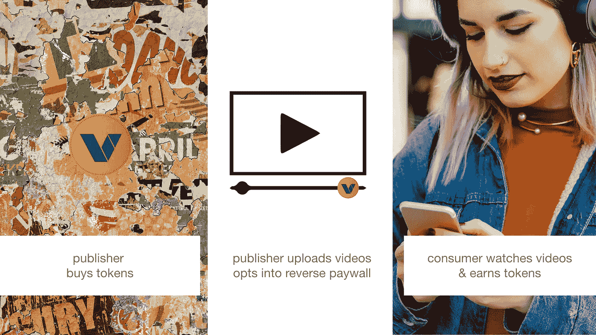

# Vevue:反向付费墙

> 原文：<https://medium.com/coinmonks/vevue-reverse-paywalls-87ab2b223660?source=collection_archive---------3----------------------->

在我的介绍性文章 [Vevue: Paywalls](/@ekkis/vevue-paywalls-59bc67a73d69) 中，我描述了一种现在有点普遍用于内容货币化的机制

Vevue 使用的版本非常简单，但也有很多像 Medium 使用的版本，读者每月可以获得 3 篇免费文章，除非读者付费，否则后续阅读将被阻止(并非所有内容都以这种方式货币化；作者可以选择将个别文章放在付费墙后面)

