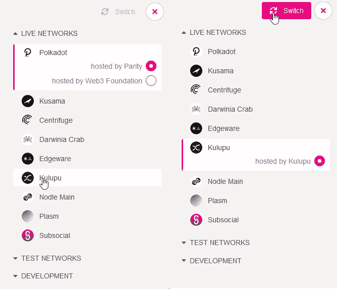

# VG 初学者基础教程—创建 Kulupu 钱包[更新]

> 原文：<https://medium.com/coinmonks/vg-basic-tutorial-for-beginners-creating-a-kulupu-wallet-updated-58f39ffaabba?source=collection_archive---------2----------------------->

那么，您是否对 Kulupu 加密货币感兴趣，并希望创建一个钱包？按照以下步骤创建您的钱包。

在本教程中，我们将使用 polkadot-js 网络钱包。但是，如果你空降到这里，并且不知道 Kulupu、Polkadot 和 Substrate 是什么，查看这篇文章了解更多信息。但是这里有一个总结:

Kulupu 是一种基于奇偶校验技术底层框架的 PoW(工作证明)加密货币。它寻求成为一种民主的加密货币，具有链上治理系统，社区可以对决定项目方向的决策进行投票。[更多信息请点击这里](http://kulupu.network/)。事不宜迟，让我们进入教程:

# 创建钱包

1 —通过浏览器访问 https://polkadot.js.org/apps/#/explorer[网站](https://polkadot.js.org/apps/#/explorer)。

2-单击 Polkadot 图标所在的区域。

3-选择 Kulupu 网络，然后单击切换。

4 —选择“帐户”部分，然后单击“添加帐户”

5 —给你的钱包起个名字。保存助记符种子，并选择一个您可以记住的强密码。因此，下一步和保存。进行交易时，您需要确认密码。

作为一种预防措施，保存 JSON 文件，该文件将在您按 Save 时生成以供下载，因为这也是一种备份方式，以防您丢失助记符种子。

# 发送和接收 KLP

## 接受

单击您为钱包选择的昵称旁边的图标，将您的地址复制到剪贴板。好吧，只要分享你的地址，这样人们就可以把 KLP 寄给你。

## 发送

点击“发送”,在“发送地址”部分输入您要发送的地址。然后单击进行转移。输入您在钱包创建教程中输入的密码以确认交易。

# 水龙头

你可以在 Discord 上找到一个水龙头机器人，在文字频道:#机器人为你的钱包执行“测试”交易。[点击这里进入 Discord](https://discord.gg/jny8Cc6) 。在写这篇文章的时候，水龙头正在工作，向钱包发送 0.01 KLP。你可以每天用一次水龙头。

嗯，就是这样。希望你喜欢教程，对你有帮助。

VirtuGrana 捐赠地址:
**KLP**:2 fsugpiapk 1 RPC 7 scrgzfhgnmmebh 8 aqzhkfxkibmpsclc
**DOT**:15 jyjr 5 wqlhzyn 2 nwwyqelbz 9 iinzhtoba 77 jp 5 adpd 1 ydxl

# 官方链接

地点:[http://kulu pu . network/](http://kulupu.network/)
coin gecko:[https://www.coingecko.com/en/coins/kulupu](https://www.coingecko.com/en/coins/kulupu)
不和:[https://discord.gg/jny8Cc6](https://discord.gg/jny8Cc6)
电报:[https://t.me/KulupuOfficial](https://t.me/KulupuOfficial)
探索者:
[https://polkascan.io/kulupu](https://polkascan.io/kulupu)
[https://kulu pu . subscan . io](https://kulupu.subscan.io)

网络钱包:[https://polkadot.js.org/apps/](https://polkadot.js.org/apps/)

社区备选网站:
【https://kulupu.cc/】T21
https://community.kulupu.cc/

## 另外，阅读

*   最好的[密码交易机器人](/coinmonks/crypto-trading-bot-c2ffce8acb2a)
*   [密码本交易平台](/coinmonks/top-10-crypto-copy-trading-platforms-for-beginners-d0c37c7d698c)
*   最好的[加密税务软件](/coinmonks/best-crypto-tax-tool-for-my-money-72d4b430816b)
*   [最佳加密交易平台](/coinmonks/the-best-crypto-trading-platforms-in-2020-the-definitive-guide-updated-c72f8b874555)
*   最佳[加密贷款平台](/coinmonks/top-5-crypto-lending-platforms-in-2020-that-you-need-to-know-a1b675cec3fa)
*   [最佳区块链分析工具](https://bitquery.io/blog/best-blockchain-analysis-tools-and-software)
*   [加密套利](/coinmonks/crypto-arbitrage-guide-how-to-make-money-as-a-beginner-62bfe5c868f6)指南:新手如何赚钱
*   最佳[加密制图工具](/coinmonks/what-are-the-best-charting-platforms-for-cryptocurrency-trading-85aade584d80)
*   [莱杰 vs 特雷佐](/coinmonks/ledger-vs-trezor-best-hardware-wallet-to-secure-cryptocurrency-22c7a3fd391e)
*   了解比特币最好的[书籍有哪些？](/coinmonks/what-are-the-best-books-to-learn-bitcoin-409aeb9aff4b)
*   [3 商业评论](/coinmonks/3commas-review-an-excellent-crypto-trading-bot-2020-1313a58bec92)
*   [AAX 交易所评论](/coinmonks/aax-exchange-review-2021-67c5ea09330c) |推荐代码、交易费用、利弊
*   [德里比特评论](/coinmonks/deribit-review-options-fees-apis-and-testnet-2ca16c4bbdb2) |选项、费用、API 和 Testnet
*   [FTX 密码交易所评论](/coinmonks/ftx-crypto-exchange-review-53664ac1198f)
*   [n 零审核](/coinmonks/ngrave-zero-review-c465cf8307fc)
*   [Bybit 交换审查](/coinmonks/bybit-exchange-review-dbd570019b71)
*   [3Commas vs Cryptohopper](/coinmonks/cryptohopper-vs-3commas-vs-shrimpy-a2c16095b8fe)
*   最好的比特币[硬件钱包](/coinmonks/the-best-cryptocurrency-hardware-wallets-of-2020-e28b1c124069?source=friends_link&sk=324dd9ff8556ab578d71e7ad7658ad7c)
*   最佳 [monero 钱包](https://blog.coincodecap.com/best-monero-wallets)
*   [莱杰 nano s vs x](https://blog.coincodecap.com/ledger-nano-s-vs-x)
*   [bits gap vs 3 commas vs quad ency](https://blog.coincodecap.com/bitsgap-3commas-quadency)
*   [莱杰纳米 S vs 特雷佐 one vs 特雷佐 T vs 莱杰纳米 X](https://blog.coincodecap.com/ledger-nano-s-vs-trezor-one-ledger-nano-x-trezor-t)
*   [block fi vs Celsius](/coinmonks/blockfi-vs-celsius-vs-hodlnaut-8a1cc8c26630)vs Hodlnaut
*   Bitsgap 评论——一个轻松赚钱的加密交易机器人
*   为专业人士设计的加密交易机器人
*   [PrimeXBT 审查](/coinmonks/primexbt-review-88e0815be858) |杠杆交易、费用和交易
*   [埃利帕尔泰坦评论](/coinmonks/ellipal-titan-review-85e9071dd029)
*   [SecuX Stone 评论](https://blog.coincodecap.com/secux-stone-hardware-wallet-review)
*   [BlockFi 评论](/coinmonks/blockfi-review-53096053c097) |从您的密码中赚取高达 8.6%的利息