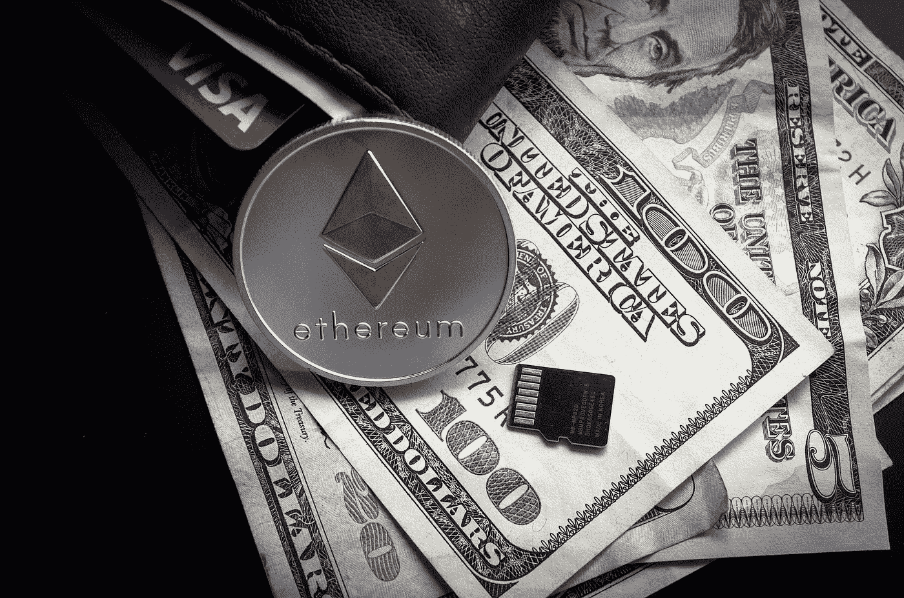

# 签证加密:另一个长期变化的迹象

> 原文：<https://medium.com/coinmonks/visa-goes-crypto-another-sign-of-a-long-lasting-change-e2673c1052fa?source=collection_archive---------5----------------------->

Visa 宣布将允许在以太坊上直接使用[美元硬币(USDC)](https://coinmarketcap.com/de/currencies/usd-coin/) stablecoin 来处理其支付网络上的交易。该公司推出了支付和加密平台 Crypto.com 的试点计划。

ETH backed stable coin in the VISA network — [pixabay.com](https://pixabay.com/de/photos/gesch%C3%A4ft-finanzen-reichtum-w%C3%A4hrung-3085138/)

根据公告， **Visa 去年在其现有基础设施内启用了数字货币处理能力** …