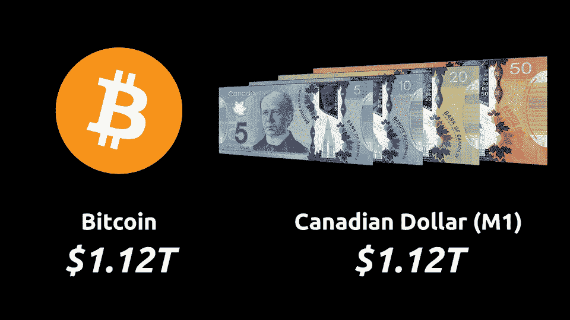
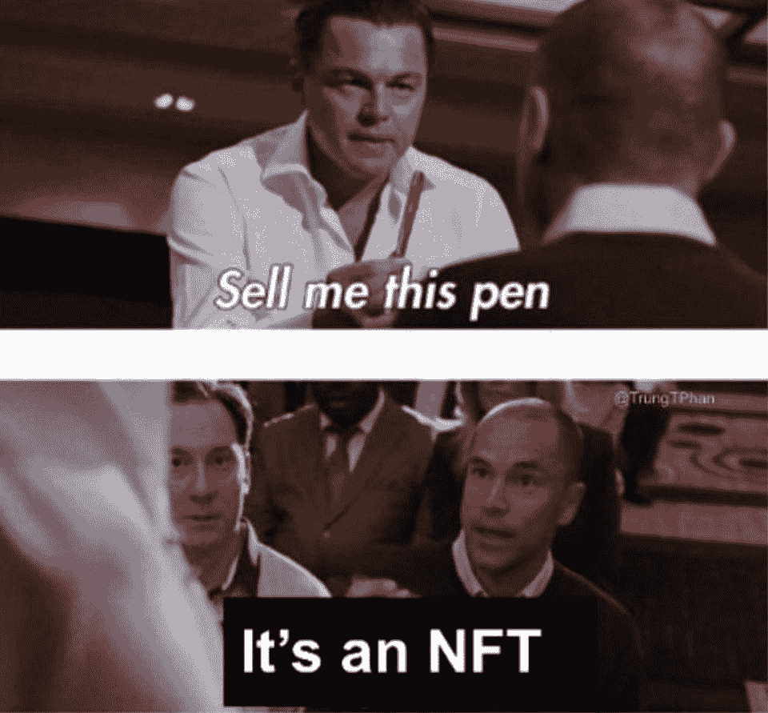
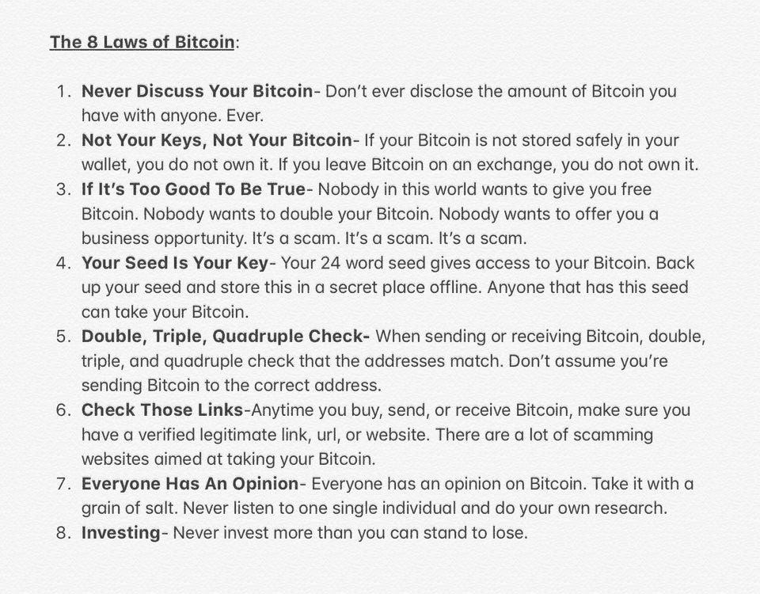
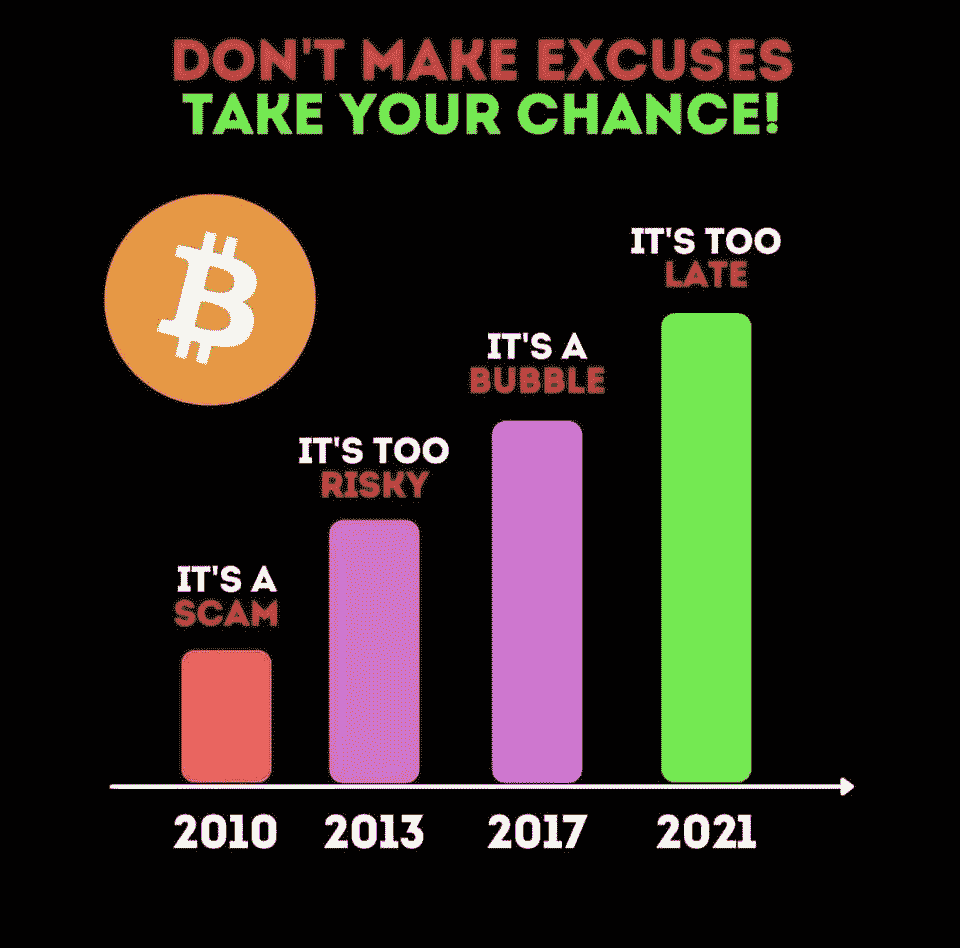
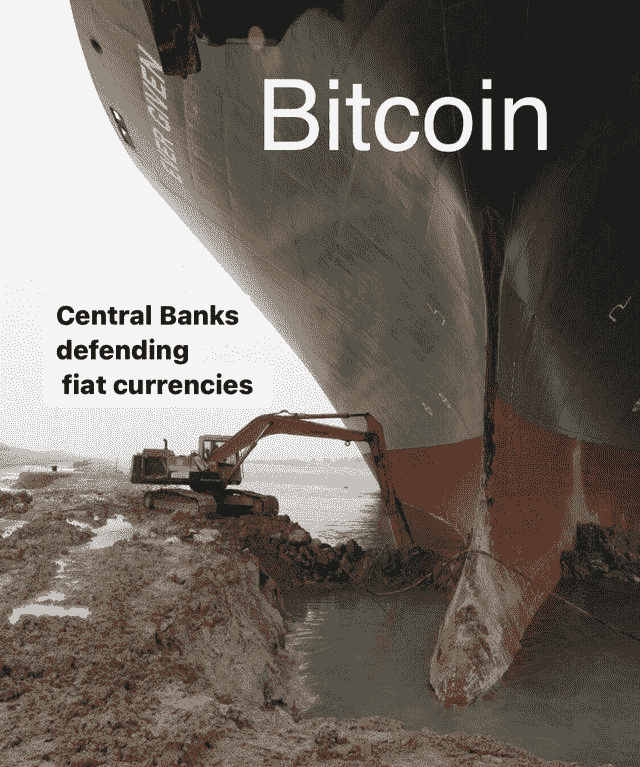

# Visa 将在以太坊结算交易| Paypal 推出加密结账

> 原文：<https://medium.com/coinmonks/visa-will-settle-transactions-on-ethereum-paypal-launches-crypto-checkout-346b3c70a391?source=collection_archive---------4----------------------->

[source](https://www.reddit.com/r/Bitcoin/comments/mgf51d/bitcoin_is_now_larger_than_the_canadian_dollar_m1/)

## 富达寻求创建比特币 ETF |贝莱德已开始交易比特币期货

*   PayPal 宣布，它已开始允许美国消费者使用他们持有的加密货币在全球数百万在线商家支付，此举可能会大大促进数字资产在日常商务中的使用。
*   Visa 今天宣布了一项重要的行业首创，在数字和传统法定货币的世界之间架起了桥梁:使用美元硬币(USDC ),一种由美元支持的稳定硬币，通过以太坊与 Visa 结算交易。
*   美国证券交易委员会的一份新文件表明，资产管理巨头富达正在寻求创建一只比特币交易所交易基金(ETF)。

> 我尝试了不同的专业交易者，但最终还是和一个交易者达成了协议。

## [皮奥克斯](http://blog.coincodecap.com/go/pionex)

试试 [Pionex](http://blog.coincodecap.com/go/pionex) ，一个专业的加密交易所，有免费的加密交易机器人让你的交易自动化。阅读我们的 [Pionex 评论](/coinmonks/pionex-review-exchange-with-crypto-trading-bot-1e459d0191ea)并查看我们的 [**加密交易机器人**](/coinmonks/crypto-trading-bot-c2ffce8acb2a) 列表。

> [Bitgaps](https://blog.coincodecap.com/go/bitsgap) lacuched **期货交易机器人**。

## 最新消息📰

*   PayPal [推出加密结账](https://www.reuters.com/article/us-crypto-currency-paypal-exclusive-idUSKBN2BM10N)服务
*   Visa 成为[首个以美元硬币结算交易的主要支付网络](https://www.businesswire.com/news/home/20210329005171/en/Visa-Becomes-First-Major-Payments-Network-to-Settle-Transactions-in-USD-Coin-USDC)(USDC)
*   系绳完全支持，保证意见显示
*   资产管理巨头[一个比特币 ETF 的富达文件](https://www.theblockcrypto.com/linked/99279/fidelity-bitcoin-etf-filing)
*   德克萨斯州追赶怀俄明州，提出加密法提案，但挑战依然存在
*   高盛即将向其财富管理客户提供比特币和其他数字资产
*   [LBRY，SEC](https://helplbrysavecrypto.com/faq) ，&密码的未来
*   [CME 5 月推出微型比特币](https://www.theblockcrypto.com/linked/99812/cme-launching-micro-bitcoin-futures-may)期货
*   中国将区块链和数字货币写入国家的未来
*   贝莱德已经开始交易比特币期货
*   与 BMN 一起扩大对比特币开采的参与
*   [体育交易卡](https://www.axios.com/sports-trading-card-value-boom-stock-market-e0295003-6265-4947-b250-d87f4e94d211.html)热潮
*   加州引入法案使区块链记录永久化
*   Blockchain.com[在 C 轮融资中融资 3 亿美元](/blockchain/blockchain-com-raises-300m-series-c-led-by-dst-vy-capital-lightspeed-79d3259937f2)
*   迈阿密戴德郡宣布与 FTX 达成新的冠名权协议
*   区块链和欧元之间的桥梁
*   Uniswap V3 启动

> *报税季即将到来，使用最好的* [***加密报税软件***](/coinmonks/best-crypto-tax-tool-for-my-money-72d4b430816b) *来申报你的加密报税吧。*

[source](https://www.reddit.com/r/ethtrader/comments/mgp594/2030_be_like/)

> BlockFi 首次推出加密奖励信用卡。在日常购物中获得 1.5%的比特币奖励。[现在加入等候名单](http://blog.coincodecap.com/go/blockfi)。

## 好的读物📑

*   [对比特币挖矿不客观](/@nic__carter/noahbjectivity-on-bitcoin-mining-2052226310cb)
*   建立[对魔法创始人](https://www.delphidigital.io/reports/building-conviction-in-magical-founders-and-projects/)和项目的信念
*   18 万亿美元的负收益率债务对 T4 来说是多么有意义
*   揭穿一个隐秘的爱情骗局
*   [库存](https://blog.gnosis.pm/inventories-not-identities-7da9a4ec5a3e)，不是身份
*   “货币的功能”如何让我们看不到货币的结构
*   [在 Bitfinex](https://bennettftomlin.com/2021/03/27/before-bitfinex-and-tether/) 和系绳之前
*   [通胀拐点](https://www.aier.org/article/inflationary-inflection-point-or-temporary-blip/)还是暂时现象？
*   [数字资产套利](/coinmonks/arbitrage-on-digital-assets-90b9c52892ca)
*   理解比特币的市场周期
*   比特币、税收和新的秘密游牧阶级的崛起
*   [密码学及其含义](/coinmonks/cryptography-and-its-implication-in-the-past-in-the-present-and-in-the-future-6838ae3a3727)过去、现在和未来
*   [波尔卡多特 vs 草间弥生](/coinmonks/polkadot-vs-kusama-auction-analysis-ce9f491f831d)拍卖分析
*   卡斯帕灾难:赞菲尔诉卡斯帕拉布
*   基础设施乐高积木:中间件论文
*   [揭穿](https://jimmysong.medium.com/debunking-the-empty-block-attack-10513858b3f8)空格挡攻击
*   比特币减半周期:[最后倒计时](/coinmonks/bitcoin-halving-cycle-the-final-countdown-43d75c4f1857)？
*   [NFT 值捕捉](https://coopahtroopa.mirror.xyz/A16NP2XXi9RdHptfdF9WHR0Xq_E1XDmUgMwPmJYOG7w)方程
*   [最后的老板](https://danheld.substack.com/p/the-final-boss-bitcoin-vs-central):比特币 vs 央行数字货币
*   [在最高点卖出比特币](/coinmonks/selling-bitcoin-at-the-top-based-on-successful-indicators-120af60f7a7)——基于成功的指标
*   分散存储大战 : Filecoin vs. Arweave
*   而[区块链](https://balajis.com/and-what-has-the-blockchain-ever-done-for-us/)曾经为我们做过什么？
*   [以太坊区块空间](https://www.aniccaresearch.tech/blog/ethereum-blockspace-who-gets-what-and-why):谁得到什么，为什么
*   人民如何摧毁艺术世界
*   [IPFS 在 2 分钟内解释了](/aleph-im/ipfs-explained-in-2min-24e10afdb191)
*   IPFS 能够对抗内容审查吗？

> *买个* [***硬件钱包***](/coinmonks/the-best-cryptocurrency-hardware-wallets-of-2020-e28b1c124069) *和* [*保护你的加密货币*](/coinmonks/how-to-prevent-cryptocurrency-hacking-and-theft-from-your-wallet-65c8ff767766) *。*

[Source](https://www.reddit.com/r/Bitcoin/comments/kmof53/the_8_laws_of_bitcoin_updated/)

> Eth2 核心团队在线[研讨会](https://hackmd.io/@hww/workshop_feb_2021)，2021 年 2 月

## 开发商

*   [eth 2 的新特性](https://hackmd.io/@benjaminion/eth2_news/https%3A%2F%2Fhackmd.io%2F%40benjaminion%2Fwnie2_210328)
*   [密实度 0.8.3](https://blog.soliditylang.org/2021/03/23/solidity-0.8.3-release-announcement/) 释放
*   OpenZeppelin [合同 4.0](https://blog.openzeppelin.com/openzeppelin-contracts-4-0/)
*   [混音版本](/remix-ide/remix-release-0-11-1-cdb3063327d) 0.11.1
*   [NFT 闪贷](/nft20/introducing-nft-flash-loans-97ff8c9298d4)
*   DApp 快速发展框架
*   [5 分钟内将你的 Dapp 变成 Gnosis Safe](/@gnosisPM/turn-your-dapp-into-a-gnosis-safe-app-in-5-minutes-5cdb33a1cd46) App！
*   如何使用 Slate 在 IPFS 上上传和[玩 Unity WebGL 游戏](https://dev.to/akuokojnr/how-to-upload-and-play-unity-webgl-games-on-ipfs-using-slate-oac)
*   [提出以太状态的 Verkle 树](https://www.reddit.com/r/ethereum/comments/mdbkp2/proposed_verkle_tree_scheme_for_ethereum_state/)方案
*   [坚实度优化器 Keccak](https://blog.soliditylang.org/2021/03/23/keccak-optimizer-bug/) 缓存错误
*   [编译器模糊化运动](https://blog.trailofbits.com/2021/03/23/a-year-in-the-life-of-a-compiler-fuzzing-campaign/)的一年
*   [快速合并](https://notes.ethereum.org/m9IX3OkkTveXCCOSzGkUiw)通过叉选择改变
*   [Mesa DEX 漏洞利用](/coinmonks/the-mesa-dex-exploit-56f393518de0)
*   [Shutter Network](https://shutter.ghost.io/introducing-shutter-network-combating-frontrunning-and-malicious-mev-using-threshold-cryptography/) —使用门限加密技术对抗抢先运行和恶意 MEV
*   [defi chain](https://defichain.ghost.io/defichain-natively-vaccinated-against-exploits/)——天生接种疫苗抵御攻击
*   [优先事项](https://jameso.be/2021/03/24/back-to-oss.html)为荒野
*   [可聚合分布式](https://www.benthamsgaze.org/2021/03/24/aggregatable-distributed-key-generation/)密钥生成
*   如何[避免 Uniswap 上的费用](/coinmonks/how-to-avoid-fees-on-uniswap-others-50d916486c9c) &其他

> 想成为一名以太网和 Web3 开发者吗？[从这里开始](http://blog.coincodecap.com/go/learn)。

## 多方面的

*   [微型 eth-signer](https://github.com/paulmillr/micro-eth-signer)
*   [无间道-简单-dapp](https://github.com/admazzola/infernal-simple-dapp)
*   Conkas —以太坊虚拟机的模块化静态分析工具

## 🎙播客和视频

*   [Balaji Srinivasan](https://tim.blog/2021/03/24/balaji-srinivasan/) 谈比特币和以太坊的未来
*   [EIP-1559 |哈苏](https://shows.banklesshq.com/p/-eip-1559-hasu)
*   a16z 播客:关于 NFTs 的一切

[source](https://www.reddit.com/r/CryptoMarsShots/comments/mgfits/its_not_too_late/)

## 加密交易和折扣🔖

*   注册参加 [**Bybit**](/coinmonks/bybit-exchange-review-dbd570019b71) exchange，赢取高达 625 美元的奖金。
*   在 [**Bityard**](https://blog.coincodecap.com/go/bityard) 获得 258 美元的交易费折扣

## 产品评论和其他加密软件📙

*   [最佳加密交易所](https://blog.coincodecap.com/crypto-exchange)
*   [最佳密码借贷平台](/coinmonks/top-5-crypto-lending-platforms-in-2020-that-you-need-to-know-a1b675cec3fa)
*   [Gate.io 交易所评论](https://blog.coincodecap.com/gate-io-review)
*   [僵尸密码审查](https://blog.coincodecap.com/botcrypto-review)
*   [如何在印度购买比特币](https://blog.coincodecap.com/buy-bitcoin-india)
*   [霍比保证金交易](/coinmonks/huobi-margin-trading-b3b06cdc1519)
*   [CoinJar 澳大利亚评论](https://blog.coincodecap.com/coinjar-australia-review?v=1)
*   最佳[密码借贷](/coinmonks/top-5-crypto-lending-platforms-in-2020-that-you-need-to-know-a1b675cec3fa)平台

想让我们展示你的产品吗？请通过 [Twitter @coinmonks](https://twitter.com/coinmonks) 联系我们

[source](https://www.reddit.com/r/Bitcoin/comments/md1fk8/its_too_late_there_is_nothing_they_can_do/)

## 乔布斯👷

*   Tokemak 寻求[可靠性](https://opolist.opolis.co/opps/8/)和[前端](https://opolist.opolis.co/opps/9/)开发。有吸引力的公司
*   初级开发:尼瑟明正在寻找[初级可靠性、数据分析师、nodeJs 开发](https://twitter.com/nethermindeth/status/1371830788329779210)
*   现金正在寻找一个技术内容作家，邮件:你好
*   附近正在找一个 [EVM 互通工程师](https://boards.greenhouse.io/near/jobs/4844647002)
*   灵知在招人！[以太坊核心开发者](http://bit.ly/3cZMzeS)、[前端工程师](http://bit.ly/3vM126R)、 [Rust 工程师](http://bit.ly/3f1Jkq7)
*   Chainsafe 正在寻找一个[类型脚本开发](https://chainsafe.io/careers/openpositions/ethereum-typescript-developer)工作在 Lodestar eth2 客户端
*   Nomic Labs (Hardhat/Buidler)正在招聘一名高级开发人员和一名工程经理
*   [Powerloom Protocol](https://powerloom.io/) 正在班加罗尔寻找[分布式系统工程师](https://angel.co/company/powerloom/jobs)
*   [Switchain](https://www.switchain.com/) 正在寻找一名[业务发展副总裁](https://cryptocurrencyjobs.co/sales/switchain-vp-of-business-development/)。远程，全职
*   小道消息是想找一个[区块链的安全工程师](https://jobs.lever.co/trailofbits/4f459855-3299-462f-9e73-299a840d5baf)

## 在 Coinmonks 上发布

如果你喜欢在 crypto/区块链空间上写教育文章，并且想在 Coinmonks 出版物上发表。只需在**发邮件给我或者 DM 我**[***推特***](https://twitter.com/coinmonks)**