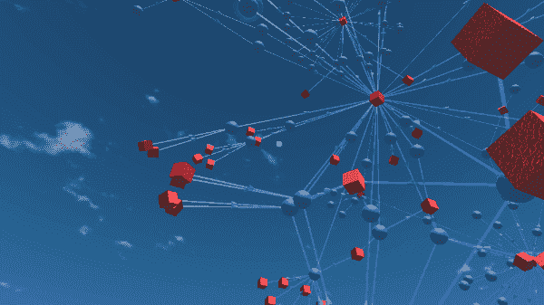

# 在 3D 和虚拟现实中可视化比特币交易

> 原文：<https://medium.com/coinmonks/visualizing-bitcoin-transactions-in-3d-and-virtual-reality-e3e28b3055df?source=collection_archive---------2----------------------->

# 摘要

比特币交易形成一个图形，可以在 3D 和虚拟现实(VR)中可视化。本文探讨了如何看到这些可视化效果。

下图显示了与[比特币披萨交易](https://www.telegraph.co.uk/technology/2018/05/22/inside-story-behind-famous-2010-bitcoin-pizza-purchase-today/)相关的一些交易网络。红色立方体是比特币地址，蓝色球体是比特币交易，连接它们的箭头是价值的移动:

The Bitcoin Pizza Transaction and some of its Predecessors

学术研究表明，在虚拟现实中查看信息有助于人们发现模式。有一个开源的多平台项目叫做 [blockchain3d.info](https://blockchain3d.info/) ，旨在进一步开发这些可视化。

# 介绍

区块链技术非常受欢迎。拥有教育和分析工具来帮助人们理解区块链将有助于技术的进一步发展，消除由于缺乏理解而造成的障碍。

在过去的几年里，虚拟现实也越来越受欢迎。2017 年底，脸书设定了令人钦佩的目标，让[10 亿人进入虚拟现实](https://www.theverge.com/2017/10/11/16459636/mark-zuckerberg-oculus-rift-connect)。虚拟现实及其兄弟产品(包括增强、混合和缩小现实)提供了很多前景。[学术研究表明](https://arxiv.org/ftp/arxiv/papers/1410/1410.7670.pdf)沉浸式虚拟现实(VR)可以“最大限度地提高人类固有的模式识别和发现技能”。这是一个有用的功能！

[blockchain3d.info](https://blockchain3d.info) 项目旨在利用虚拟现实的优势满足区块链教育的需求。该项目使用 VR 和 3D 数据可视化为区块链教育和分析提供了一个免费、开源、多平台的应用程序。

虚拟现实教育和协作场景是主要目标，但也可用于台式机、平板电脑和网络浏览器的全 3D。这允许更传统的分析、取证、制作 3D“飞越”视频和其他尚未想到的使用案例的额外使用案例。交易所或钱包可能希望通过提供交易或钱包的 3D 或 VR 视图来区分自己。

# 比特币交易的图表

下面是一个非常简单的比特币教育用例的例子。应该强调的是，这仅仅是应用程序当前版本所能做的事情的皮毛。尽管如此，这是一个合理和具体的第一个例子。

当处理法定货币时，我们习惯于与单个发送者和单个接收者进行银行交易。使用比特币，交易可以在一次交易中将价值从许多发送者转移到许多接收者。此外，钱包中持有的比特币不是作为单个“堆”持有，而是作为以前交易的多个“剩余部分”(想想“未用完的零钱”)的列表持有。这些剩余部分就是所谓的未用事务输出 [UTXO](https://www.investopedia.com/terms/u/utxo.asp) 。

想象一下，然后向学生解释比特币价值如何作为输入和输出流动。在下图中，红色立方体是地址，蓝色球体是交易，蓝色箭头显示单个交易的价值流:

记住以上内容，我们可以检查如下所示的事务。这个事务(蓝色球体)只有一个输入，但是有很多很多输出。这些形成了独特的“花”形:

# 比特币披萨交易

2018 年初，谷歌云平台团队将比特币数据提供给他们的 BigQuery web 服务。[他们关于这个主题的文章](https://cloud.google.com/blog/products/gcp/bitcoin-in-bigquery-blockchain-analytics-on-public-data)概述了一些有趣的 2D 可视化是如何成为可能的。他们关注了[著名的比特币披萨交易](https://www.telegraph.co.uk/technology/2018/05/22/inside-story-behind-famous-2010-bitcoin-pizza-purchase-today/):

Google BigQuery Analysis of the Bitcoin Pizza Transaction (in red) with 4 layers of Predecessors (Credit: the Google Cloud Platform team)

我们可以通过 3D 方式进一步探究相同的披萨交易:

Still View of the Bitcoin Pizza Transaction

该应用程序是交互式的。我们可以通过点击地址或交易来“向下钻取”，以显示*他们的*链接地址和交易。我们也可以在三维空间飞行:

Flying around the network of transactions around the Bitcoin Pizza Transaction

使用 [Google Cardboard](https://vr.google.com/cardboard/get-cardboard/) ，在 VR 中也可以体验到同样的视角。如何使用带注释的应用程序的更长的例子在这里:

# 让我试试！

该应用程序适用于 Windows、Mac、Linux、iOS 和 Android。iOS 和 Android 支持 Google Cardboard。要下载最新版本，请在您喜欢的应用程序商店中搜索“区块链 3D 浏览器”或访问官方网站:

 [## 区块链 3D 浏览器

### 一个免费的，多平台的，区块链的浏览器，可以在辉煌的 3D 和虚拟现实中可视化区块链。比特币和…

blockchain3d.info](https://blockchain3d.info) 

# 让我帮忙！

该应用程序和所有资产都是开源的，可供您下载。另外，非常欢迎投稿！要获得您自己的副本或提供帮助，请访问项目 GitHub 库。

…

**脚注:**

[1]参见“使用虚拟现实平台的沉浸式和协作式数据可视化”[https://arxiv.org/ftp/arxiv/papers/1410/1410.7670.pdf](https://arxiv.org/ftp/arxiv/papers/1410/1410.7670.pdf)

> [在您的收件箱中直接获得最佳软件交易](https://coincodecap.com/?utm_source=coinmonks)

