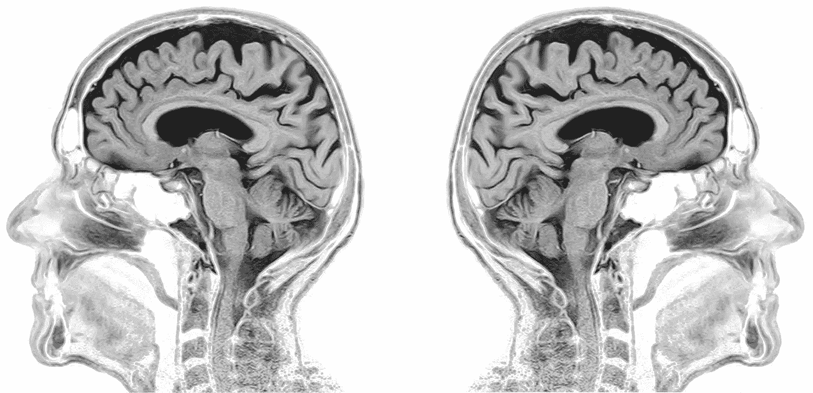

# 脑成像数据分析导论——第三部分:一般线性模型(GLM)

> 原文：<https://medium.com/coinmonks/visualizing-brain-imaging-data-fmri-with-python-3e1899d1e212?source=collection_archive---------1----------------------->

Structural MRI scan of the human brain (modified from [toubibe](https://pixabay.com/users/toubibe-647761/))

在本系列的[第一篇文章](/@CarstenKlein/visualizing-brain-imaging-data-fmri-with-python-e1d0358d9dba)中，我们看了 MRI 和 f MRI 数据集的一般组织。在[的第二篇文章](/coinmonks/visualizing-brain-imaging-data-fmri-with-python-c68fcd595d5f)中，我们继续前进，通过对数据和理想化的反应曲线进行相关性分析，研究了在 fMRI 扫描过程中大脑的哪些部分是活跃的。这个方法非常有效。我们看到活动在…